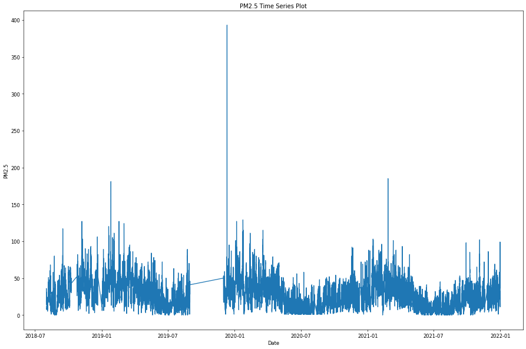
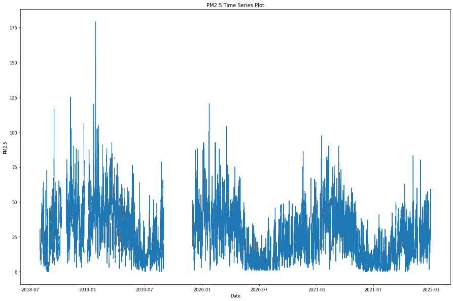
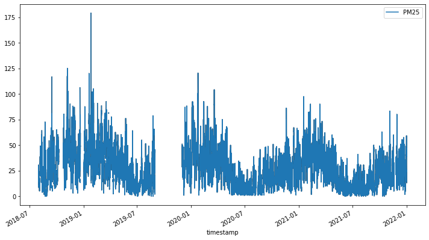
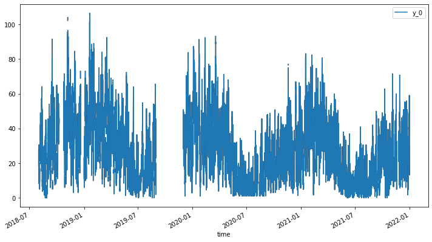
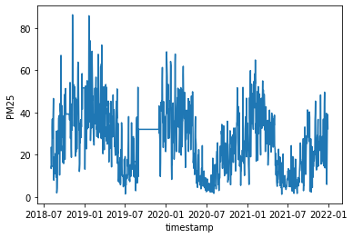
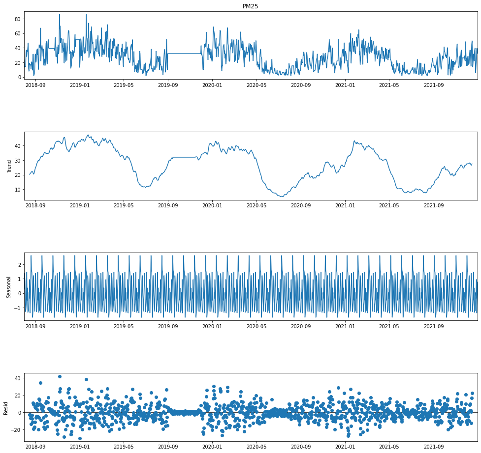
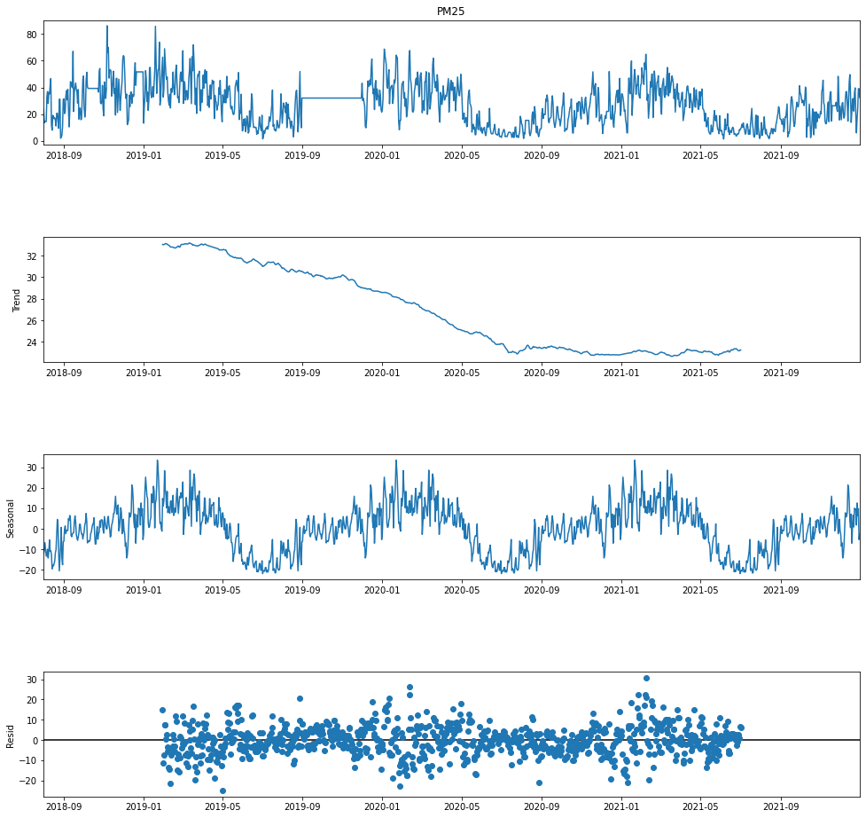

[](https://colab.research.google.com/drive/1MUHXiRiI7o56oZLCU2JrxI-aJEiM6RkJ?usp=sharing)



Time series data is data formed in the order of appearance in time. Usually, the time interval in the data will be the same (for example, one data every five minutes, or one data per hour), and the application fields are quite wide, such as financial information, space engineering, signal processing, etc. There are also many statistical related tools that can used in analysis. In addition, time series data is very close to everyday life. For example, with the intensification of global climate change, the global average temperature has become higher and higher in recent years, and the summer is unbearably hot. Also, certain seasons of the year tend to have particularly poor air quality, or certain times of the year tend to have worse air quality than others. If you want to know more about these changes in living environment, and how the corresponding sensor values change, you will need to use time series data analysis, which is to observe the relationship between data and time, and then get the results. This chapter will demonstrate using three types of data (air quality, water resources, weather) in the Civil IoT Taiwan Data Service Platform.

## Goal

- observe time series data using visualization tools
- check and process time series data
- decompose time series data to investigate its trend and seasonality

## Package Installation and Importing

In this article, we will use the pandas, matplotlib, numpy, seaborn, statsmodels, and warnings packages, which are pre-installed on our development platform, Google Colab, and do not need to be installed manually. However, we will also use two additional packages that Colab does not have pre-installed: kats and calplot, which need to be installed by :

```python
!pip install --upgrade pip

# Kats
!pip install kats==0.1 ax-platform==0.2.3 statsmodels==0.12.2

# calplot
!pip install calplot
```

After the installation is complete, we can use the following syntax to import the relevant packages to complete the preparations in this article.

```python
import warnings
import calplot
import pandas as pd
import numpy as np
import matplotlib as mpl
import matplotlib.pyplot as plt
import statsmodels.api as sm
import os, zipfile

from datetime import datetime, timedelta
from dateutil import parser as datetime_parser
from statsmodels.tsa.stattools import adfuller, kpss
from statsmodels.tsa.seasonal import seasonal_decompose
from kats.detectors.outlier import OutlierDetector
from kats.detectors.cusum_detection import CUSUMDetector
from kats.consts import TimeSeriesData, TimeSeriesIterator
from IPython.core.pylabtools import figsize
```

## Data Access

We use pandas for data processing. Pandas is a data science suite commonly used in Python language. It can also be thought of as a spreadsheet similar to Microsoft Excel in a programming language, and its Dataframe object provided by pandas can be thought of as a two-dimensional data structure. The dimensional data structure can store data in rows and columns, which is convenient for various data processing and operations.

The topic of this paper is the analysis and processing of time series data. We will use the air quality, water level and meteorological data on the Civil IoT Taiwan Data Service Platform for data access demonstration, and then use the air quality data for further data analysis. Among them, each type of data is the data observed by a collection of stations for a long time, and the time field name in the dataframe is set to `timestamp`. Because the value of the time field is unique, we also use this field as the index of the dataframe.

### Air Quality Data

Since we want to use long-term historical data in this article, we do not directly use the data access methods of the pyCIOT package, but directly download the data archive of "Academia Sinica - Micro Air Quality Sensors" from the historical database of the Civil IoT Taiwan Data Service Platform and store in the `Air` folder.

At the same time, since the downloaded data is in the format of a zip compressed file, we need to decompress it to generate a number of compressed daily file, and then decompress the compressed daily file and store it in the `CSV_Air` folder.

```python
!mkdir Air CSV_Air
!wget -O Air/2018.zip -q "https://history.colife.org.tw/?r=/download&path=L%2Bepuuawo%2BWTgeizqi%2FkuK3noJTpmaJf5qCh5ZyS56m65ZOB5b6u5Z6L5oSf5ris5ZmoLzIwMTguemlw"
!wget -O Air/2019.zip -q "https://history.colife.org.tw/?r=/download&path=L%2Bepuuawo%2BWTgeizqi%2FkuK3noJTpmaJf5qCh5ZyS56m65ZOB5b6u5Z6L5oSf5ris5ZmoLzIwMTkuemlw"
!wget -O Air/2020.zip -q "https://history.colife.org.tw/?r=/download&path=L%2Bepuuawo%2BWTgeizqi%2FkuK3noJTpmaJf5qCh5ZyS56m65ZOB5b6u5Z6L5oSf5ris5ZmoLzIwMjAuemlw"
!wget -O Air/2021.zip -q "https://history.colife.org.tw/?r=/download&path=L%2Bepuuawo%2BWTgeizqi%2FkuK3noJTpmaJf5qCh5ZyS56m65ZOB5b6u5Z6L5oSf5ris5ZmoLzIwMjEuemlw"

#開始進行解壓縮
folder = 'Air'
extension_zip = '.zip'
extension_csv = '.csv'

for subfolder in os.listdir(folder):
    path = f'{folder}/{subfolder}'
    if path.endswith(extension_zip):
      print(path)
      zip_ref = zipfile.ZipFile(path)
      zip_ref.extractall(folder)
      zip_ref.close()

for subfolder in os.listdir(folder):
    path = f'{folder}/{subfolder}'
    if os.path.isdir(path):
        for item in os.listdir(path):
            if item.endswith(extension_zip):
                file_name = f'{path}/{item}'
                print(file_name)
                zip_ref = zipfile.ZipFile(file_name)
                zip_ref.extractall(path)
                zip_ref.close()

        for item in os.listdir(path):
          path2 = f'{path}/{item}'
          if os.path.isdir(path2):
            for it in os.listdir(path2):
              if it.endswith(extension_zip):
                file_name = f'{path2}/{it}'
                print(file_name)
                zip_ref = zipfile.ZipFile(file_name)
                zip_ref.extractall('CSV_Air') # decide path
                zip_ref.close()
          elif item.endswith(extension_csv):
            os.rename(path2, f'CSV_Air/{item}')
```

The CSV_Air folder now contains all daily sensor data in CSV format. To filter out data for a single station (such as the station with code `74DA38C7D2AC`), we need to read each CSV file and put the data for that station into a dataframe called `air`. Finally, we delete all downloaded data and data generated after decompression to save storage space in the cloud.

```python
folder = 'CSV_Air'
extension_csv = '.csv'
id = '74DA38C7D2AC'

air = pd.DataFrame()
for item in os.listdir(folder):
  file_name = f'{folder}/{item}'
  df = pd.read_csv(file_name)
  if 'pm25' in list(df.columns):
    df.rename({'pm25':'PM25'}, axis=1, inplace=True)
  filtered = df.query(f'device_id==@id')
  air = pd.concat([air, filtered], ignore_index=True)
air.dropna(subset=['timestamp'], inplace=True)

for i, row in air.iterrows():
  aware = datetime_parser.parse(str(row['timestamp']))
  naive = aware.replace(tzinfo=None)
  air.at[i, 'timestamp'] = naive
air.set_index('timestamp', inplace=True)

!rm -rf Air CSV_Air
```

Finally, we rearrange the data in the site, delete unnecessary field information, and sort them by time as follows:

```python
air.drop(columns=['device_id', 'SiteName'], inplace=True)
air.sort_values(by='timestamp', inplace=True)
air.info()
print(air.head())
```

```
<class 'pandas.core.frame.DataFrame'>
DatetimeIndex: 195305 entries, 2018-08-01 00:00:05 to 2021-12-31 23:54:46
Data columns (total 1 columns):
 \#   Column  Non-Null Count   Dtype 
---  ------  --------------   ----- 
 0   PM25    195305 non-null  object
dtypes: object(1)
memory usage: 3.0+ MB
                     PM25
timestamp                
2018-08-01 00:00:05  20.0
2018-08-01 00:30:18  17.0
2018-08-01 01:12:34  18.0
2018-08-01 01:18:36  21.0
2018-08-01 01:30:44  22.0
```

### Water Level Data

Like the example of air quality data, since we are going to use long-term historical data this time, we do not directly use the data access methods of the pyCIOT suite, but directly download the data archive of "Water Resources Agency - Groundwater Level Station" from the historical database of the Civil IoT Taiwan Data Service Platform and store in the `Water` folder.

At the same time, since the downloaded data is in the format of a zip compressed file, we need to decompress it to generate a number of compressed daily file, and then decompress the compressed daily file and store it in the `CSV_Water` folder.

```python
!mkdir Water CSV_Water
!wget -O Water/2018.zip "https://history.colife.org.tw/?r=/download&path=L%2BawtOizh%2Ba6kC%2FmsLTliKnnvbJf5rKz5bed5rC05L2N56uZLzIwMTguemlw"
!wget -O Water/2019.zip "https://history.colife.org.tw/?r=/download&path=L%2BawtOizh%2Ba6kC%2FmsLTliKnnvbJf5rKz5bed5rC05L2N56uZLzIwMTkuemlw"
!wget -O Water/2020.zip "https://history.colife.org.tw/?r=/download&path=L%2BawtOizh%2Ba6kC%2FmsLTliKnnvbJf5rKz5bed5rC05L2N56uZLzIwMjAuemlw"
!wget -O Water/2021.zip "https://history.colife.org.tw/?r=/download&path=L%2BawtOizh%2Ba6kC%2FmsLTliKnnvbJf5rKz5bed5rC05L2N56uZLzIwMjEuemlw"

#開始進行解壓縮
folder = 'Water'
extension_zip = '.zip'
extension_csv = '.csv'

for subfolder in os.listdir(folder):
    path = f'{folder}/{subfolder}'
    if path.endswith(extension_zip):
      print(path)
      zip_ref = zipfile.ZipFile(path)
      zip_ref.extractall(folder)
      zip_ref.close()
for subfolder in os.listdir(folder):
    path = f'{folder}/{subfolder}'
    if os.path.isdir(path):
        for item in os.listdir(path):
            if item.endswith(extension_zip):
                file_name = f'{path}/{item}'
                print(file_name)
                zip_ref = zipfile.ZipFile(file_name)
                zip_ref.extractall(path)
                zip_ref.close()

        for item in os.listdir(path):
          path2 = f'{path}/{item}'
          if os.path.isdir(path2):
            for it in os.listdir(path2):
              if it.endswith(extension_zip) and not it.endswith('QC.zip'):
                file_name = f'{path2}/{it}'
                print(file_name)
                zip_ref = zipfile.ZipFile(file_name)
                zip_ref.extractall('CSV_Water') # decide path
                zip_ref.close()
          elif item.endswith(extension_csv):
            os.rename(path2, f'CSV_Water/{item}')
```

The CSV_Water folder now contains all daily sensor data in CSV format. To filter out data for a single station (such as the station with code `338c9c1c-57d8-41d7-9af2-731fb86e632c`), we need to read each CSV file and put the data for that station into a dataframe called `water`. Finally, we delete all downloaded data and data generated after decompression to save storage space in the cloud.

```python
folder = 'CSV_Water'
extension_csv = '.csv'
id = '338c9c1c-57d8-41d7-9af2-731fb86e632c'

water = pd.DataFrame()
for item in os.listdir(folder):
  file_name = f'{folder}/{item}'
  df = pd.read_csv(file_name)
  if 'pm25' in list(df.columns):
    df.rename({'pm25':'PM25'}, axis=1, inplace=True)
  filtered = df.query(f'station_id==@id')
  water = pd.concat([water, filtered], ignore_index=True)
water.dropna(subset=['timestamp'], inplace=True)

for i, row in water.iterrows():
  aware = datetime_parser.parse(str(row['timestamp']))
  naive = aware.replace(tzinfo=None)
  water.at[i, 'timestamp'] = naive
water.set_index('timestamp', inplace=True)

!rm -rf Water CSV_Water
```

Finally, we rearrange the data in the site, delete unnecessary field information, and sort them by time as follows:

```python
water.drop(columns=['station_id', 'ciOrgname', 'ciCategory', 'Organize_Name', 'CategoryInfos_Name', 'PQ_name', 'PQ_fullname', 'PQ_description', 'PQ_unit', 'PQ_id'], inplace=True)
water.sort_values(by='timestamp', inplace=True)
water.info()
print(water.head())
```

```
<class 'pandas.core.frame.DataFrame'>
DatetimeIndex: 213466 entries, 2018-01-01 00:20:00 to 2021-12-07 11:00:00
Data columns (total 1 columns):
 #   Column  Non-Null Count   Dtype  
---  ------  --------------   -----  
 0   value   213465 non-null  float64
dtypes: float64(1)
memory usage: 3.3 MB
                         value
timestamp                     
2018-01-01 00:20:00  49.130000
2018-01-01 00:25:00  49.139999
2018-01-01 00:30:00  49.130001
2018-01-01 00:35:00  49.130001
2018-01-01 00:40:00  49.130001
```

### Meteorological Data

We download the data archive of "Central Weather Bureau - Automatic Weather Station" from the historical database of the Civil IoT Taiwan Data Service Platform and store in the `Weather` folder.

At the same time, since the downloaded data is in the format of a zip compressed file, we need to decompress it to generate a number of compressed daily file, and then decompress the compressed daily file and store it in the `CSV_Weather` folder.

```python
!mkdir Weather CSV_Weather
!wget -O Weather/2019.zip "https://history.colife.org.tw/?r=/download&path=L%2Bawo%2BixoS%2FkuK3lpK7msKPosaHlsYBf6Ieq5YuV5rCj6LGh56uZLzIwMTkuemlw"
!wget -O Weather/2020.zip "https://history.colife.org.tw/?r=/download&path=L%2Bawo%2BixoS%2FkuK3lpK7msKPosaHlsYBf6Ieq5YuV5rCj6LGh56uZLzIwMjAuemlw"
!wget -O Weather/2021.zip "https://history.colife.org.tw/?r=/download&path=L%2Bawo%2BixoS%2FkuK3lpK7msKPosaHlsYBf6Ieq5YuV5rCj6LGh56uZLzIwMjEuemlw"

#開始進行解壓縮
folder = 'Weather'
extension_zip = '.zip'
extension_csv = '.csv'

for subfolder in os.listdir(folder):
    path = f'{folder}/{subfolder}'
    if path.endswith(extension_zip):
      print(path)
      zip_ref = zipfile.ZipFile(path)
      zip_ref.extractall(folder)
      zip_ref.close()

for subfolder in os.listdir(folder):
    path = f'{folder}/{subfolder}'
    if os.path.isdir(path):
        for item in os.listdir(path):
            if item.endswith(extension_zip):
                file_name = f'{path}/{item}'
                print(file_name)
                zip_ref = zipfile.ZipFile(file_name)
                zip_ref.extractall(path)
                zip_ref.close()

        for item in os.listdir(path):
          path2 = f'{path}/{item}'
          if os.path.isdir(path2):
            for it in os.listdir(path2):
              if it.endswith(extension_zip):
                file_name = f'{path2}/{it}'
                print(file_name)
                zip_ref = zipfile.ZipFile(file_name)
                zip_ref.extractall('CSV_Weather') # decide path
                zip_ref.close()
          elif item.endswith(extension_csv):
            os.rename(path2, f'CSV_Weather/{item}')
```

The CSV_Weather folder now contains all daily sensor data in CSV format. To filter out data for a single station (such as the station with code `C0U750`), we need to read each CSV file and put the data for that station into a dataframe called `weather`. Finally, we delete all downloaded data and data generated after decompression to save storage space in the cloud.

```python
folder = 'CSV_Weather'
extension_csv = '.csv'
id = 'C0U750'

weather = pd.DataFrame()
for item in os.listdir(folder):
  file_name = f'{folder}/{item}'
  df = pd.read_csv(file_name)
  if 'pm25' in list(df.columns):
    df.rename({'pm25':'PM25'}, axis=1, inplace=True)
  filtered = df.query(f'station_id==@id')
  weather = pd.concat([weather, filtered], ignore_index=True)
weather.rename({'obsTime':'timestamp'}, axis=1, inplace=True)
weather.dropna(subset=['timestamp'], inplace=True)

for i, row in weather.iterrows():
  aware = datetime_parser.parse(str(row['timestamp']))
  naive = aware.replace(tzinfo=None)
  weather.at[i, 'timestamp'] = naive
weather.set_index('timestamp', inplace=True)

!rm -rf Weather CSV_Weather
```

Finally, we rearrange the data in the site, delete unnecessary field information, and sort them by time as follows:

```python
weather.drop(columns=['station_id'], inplace=True)
weather.sort_values(by='timestamp', inplace=True)
weather.info()
print(weather.head())
```

```
<class 'pandas.core.frame.DataFrame'>
DatetimeIndex: 27093 entries, 2019-01-01 00:00:00 to 2021-12-31 23:00:00
Data columns (total 15 columns):
 #   Column  Non-Null Count  Dtype  
---  ------  --------------  -----  
 0   ELEV    27093 non-null  float64
 1   WDIR    27089 non-null  float64
 2   WDSD    27089 non-null  float64
 3   TEMP    27093 non-null  float64
 4   HUMD    27089 non-null  float64
 5   PRES    27093 non-null  float64
 6   SUN     13714 non-null  float64
 7   H_24R   27089 non-null  float64
 8   H_FX    27089 non-null  float64
 9   H_XD    27089 non-null  object 
 10  H_FXT   23364 non-null  object 
 11  D_TX    27074 non-null  object 
 12  D_TXT   7574 non-null   object 
 13  D_TN    27074 non-null  object 
 14  D_TNT   17 non-null     object 
dtypes: float64(9), object(6)
memory usage: 3.3+ MB
                      ELEV  WDIR  WDSD  TEMP  HUMD   PRES   SUN  H_24R  H_FX  \
timestamp                                                                      
2019-01-01 00:00:00  398.0  35.0   5.8  13.4  0.99  981.1 -99.0   18.5 -99.0   
2019-01-01 01:00:00  398.0  31.0   5.7  14.1  0.99  981.0 -99.0    0.5  10.8   
2019-01-01 02:00:00  398.0  35.0   5.3  13.9  0.99  980.7 -99.0    1.0 -99.0   
2019-01-01 03:00:00  398.0  32.0   5.7  13.8  0.99  980.2 -99.0    1.5 -99.0   
2019-01-01 04:00:00  398.0  37.0   6.9  13.8  0.99  980.0 -99.0    2.0  12.0   

                     H_XD H_FXT  D_TX D_TXT  D_TN D_TNT  
timestamp                                                
2019-01-01 00:00:00 -99.0 -99.0  14.5   NaN  13.4   NaN  
2019-01-01 01:00:00  35.0   NaN  14.1   NaN  13.5   NaN  
2019-01-01 02:00:00 -99.0 -99.0  14.1   NaN  13.5   NaN  
2019-01-01 03:00:00 -99.0 -99.0  14.1   NaN  13.5   NaN  
2019-01-01 04:00:00  39.0   NaN  14.1   NaN  13.5   NaN
```

Above, we have successfully demonstrated the reading example of air quality data (air), water level data (water) and meteorological data (weather). In the following discussion, we will use air quality data to demonstrate basic time series data processing. The same methods can also be easily applied to water level data or meteorological data and obtain similar results. You are encouraged to try it yourself.

## Data Visualization

The first step in the processing of time series data is nothing more than to present the information one by one in chronological order so that users can see the changes in the overall data and derive more ideas and concepts for data analysis. Among them, using line charts to display data is the most commonly used data visualization method. For example, take the air quality data as an example:

```python
plt.figure(figsize=(15, 10), dpi=60)
plt.plot(air[:]["PM25"])

plt.xlabel("Date")
plt.ylabel("PM2.5")
plt.title("PM2.5 Time Series Plot")

plt.tight_layout()

plt.show()
```



### Data Resample

As can be seen from the air quality data sequence diagram in the above figure, the distribution of data is actually very dense, and the changes in data values are sometimes small and violent. This is because the current sampling frequency of air quality data is about once every five minutes, and the collected environment is the surrounding environment information in life, so data density and fluctuation are inevitable. Because sampling every 5 minutes is too frequent, it is difficult to show general trends in ambient air pollution. Therefore, we adopt the method of resampling to calculate the average value of the data in a fixed time interval, so as to present the data of different time scales. For example, we use the following syntax to resample at a larger scale (hour, day, month) sampling rate according to the characteristics of the existing air quality data:

```python
air_hour = air.resample('H').mean() # hourly average
air_day = air.resample('D').mean()  # daily average
air_month = air.resample('M').mean()  # monthly average

print(air_hour.head())
print(air_day.head())
print(air_month.head())
```

```
                         PM25
timestamp                     
2018-08-01 00:00:00  18.500000
2018-08-01 01:00:00  20.750000
2018-08-01 02:00:00  24.000000
2018-08-01 03:00:00  27.800000
2018-08-01 04:00:00  22.833333
                 PM25
timestamp            
2018-08-01  23.384615
2018-08-02  13.444444
2018-08-03  14.677419
2018-08-04  14.408451
2018-08-05        NaN
                 PM25
timestamp            
2018-08-31  21.704456
2018-09-30  31.797806
2018-10-31  37.217788
2018-11-30  43.228939
```

Then we plot again with the hourly averaged resampling data, and we can see that the curve becomes clearer, but the fluctuation of the curve is still very large.

```python
plt.figure(figsize=(15, 10), dpi=60)
plt.plot(air_hour[:]["PM25"])

plt.xlabel("Date")
plt.ylabel("PM2.5")
plt.title("PM2.5 Time Series Plot")

plt.tight_layout()

plt.show()
```




### Moving Average

For the chart of the original data, if you want to see a smoother change trend of the curve, you can apply the moving average method. The idea is to set a sampling window on the time axis of the original data, move the position of the sampling window smoothly, and calculate the average value of all values in the sampling window. 

For example, if the size of the sampling window is 10, it means that the current data and the previous 9 data are averaged each time. After such processing, the meaning of each data is not only a certain time point, but the average value of the original time point and the previous time point. This removes abrupt changes and makes the overall curve smoother, thereby making it easier to observe overall trends.

```python
# plt.figure(figsize=(15, 10), dpi=60)
MA = air_hour
MA10 = MA.rolling(window=500, min_periods=1).mean()

MA.join(MA10.add_suffix('_mean_500')).plot(figsize=(20, 15))
# MA10.plot(figsize(15, 10))
```


The blue line in the above figure is the original data, and the orange line is the curve after moving average. It can be clearly found that the orange line can better represent the change trend of the overall value, and there is also a certain degree of regular fluctuation, which is worthy of further analysis.

### Multi-line Charts

In addition to presenting the original data in the form of a simple line chart, another common data visualization method is to cut the data into several continuous segments periodically in the time dimension, draw line charts separately, and superimpose them on the same multi-line chart. For example, we can cut the above air quality data into four sub-data sets of 2019, 2020, 2021, and 2022 according to different years, and draw their respective line charts on the same multi-line chart, as shown in the figure below.

```python
air_month.reset_index(inplace=True)
air_month['year'] = [d.year for d in air_month.timestamp]
air_month['month'] = [d.strftime('%b') for d in air_month.timestamp]
years = air_month['year'].unique()
print(air)

np.random.seed(100)
mycolors = np.random.choice(list(mpl.colors.XKCD_COLORS.keys()), len(years), replace=False)

plt.figure(figsize=(15, 10), dpi=60)
for i, y in enumerate(years):
  if i > 0:
    plt.plot('month', 'PM25', data=air_month.loc[air_month.year==y, :], color=mycolors[i], label=y)
    plt.text(air_month.loc[air_month.year==y, :].shape[0]-.9, air_month.loc[air_month.year==y, 'PM25'][-1:].values[0], y, fontsize=12, color=mycolors[i])

# plt.gca().set(xlim=(-0.3, 11), ylim=(2, 30), ylabel='PM25', xlabel='Month')
# plt.yticks(fontsize=12, alpha=.7)
# plt.title('Seasonal Plot of PM25 Time Series', fontsize=20)
plt.show()
```


In this multi-line chart, we can see that the 2019 data has a significant portion of missing values, while the 2022 data was only recorded till July at the time of writing. At the same time, it can be found that in the four-year line chart, the curves of different years all reached the lowest point in summer, began to rise in autumn, and reached the highest point in winter, showing roughly the same trend of change.

### Calendar Heatmap

The calendar heat map is a data visualization method that combines the calendar map and the heat map, which can more intuitively browse the distribution of the data and find the regularity of different time scales. We use calplot, a calendar heatmap suite for Python, and input the daily PM2.5 averages. Then we select the specified color (the parameter name is `cmap`, and we set it to `GnBu` in the following example. for detailed color options, please refer to the reference materials), and we can get the effect of the following figure, in which blue represents the greater value, green or white means lower values, if not colored or a value of 0 means there is no data for the day. From the resulting plot, we can see that the months in the middle part (summer) are lighter and the months in the left part (winter) are darker, just in line with our previous observations using the multi-line chart.

```python
# cmap: color map (https://matplotlib.org/stable/gallery/color/colormap_reference.html)
# textformat: specify the format of the text
pl1 = calplot.calplot(data = air_day['PM25'], cmap = 'GnBu', textformat = '{:.0f}', 
											figsize = (24, 12), suptitle = "PM25 by Month and Year")
```


## Data Quality Inspection

After the basic visualization of time series data, we will introduce the basic detection and processing methods of data quality. We will use kats, a Python language data processing and analysis suite, to perform outlier detection, change point detection, and handling missing values in sequence.

### Outlier Detection

Outliers are those values in the data that are significantly different from other values. These differences may affect our judgment and analysis of the data. Therefore, outliers need to be identified and then flagged, removed, or treated specially. .

We first convert the data stored in the variable `air_hour` from its original dataframe format to the `TimeSeriesData` format used by the kats package and save the converted data into a variable named `air_ts`. Then we re-plot the line chart of the time series data.

```python
air_ts = TimeSeriesData(air_hour.reset_index(), time_col_name='timestamp')
air_ts.plot(cols=["PM25"])
```



We then used the `OutlierDetector` tool in the kats suite to detect outliers in the time series data, where outliers were less than 1.5 times the first quartile (Q1) minus the interquartile range (IQR) or greater than The third quartile (Q3) value plus 1.5 times the interquartile range.

```python
outlierDetection = OutlierDetector(air_ts, 'additive')
outlierDetection.detector()
outlierDetection.outliers
```

```
[[Timestamp('2018-08-10 16:00:00'),
  Timestamp('2018-08-10 17:00:00'),
  Timestamp('2018-08-20 00:00:00'),
  Timestamp('2018-08-23 03:00:00'),
  Timestamp('2018-08-23 04:00:00'),
  Timestamp('2018-09-02 11:00:00'),
  Timestamp('2018-09-11 00:00:00'),
  Timestamp('2018-09-13 14:00:00'),
  Timestamp('2018-09-13 15:00:00'),
  Timestamp('2018-09-13 16:00:00'),
  Timestamp('2018-09-15 08:00:00'),
  Timestamp('2018-09-15 09:00:00'),
  Timestamp('2018-09-15 10:00:00'),
  Timestamp('2018-09-15 11:00:00'),
  Timestamp('2018-09-22 05:00:00'),
  Timestamp('2018-09-22 06:00:00'),
  Timestamp('2018-10-26 01:00:00'),
  Timestamp('2018-11-06 13:00:00'),
  Timestamp('2018-11-06 15:00:00'),
  Timestamp('2018-11-06 16:00:00'),
  Timestamp('2018-11-06 19:00:00'),
  Timestamp('2018-11-06 20:00:00'),
  Timestamp('2018-11-06 21:00:00'),
  Timestamp('2018-11-06 22:00:00'),
  Timestamp('2018-11-07 07:00:00'),
  Timestamp('2018-11-07 08:00:00'),
  Timestamp('2018-11-07 09:00:00'),
  Timestamp('2018-11-09 00:00:00'),
  Timestamp('2018-11-09 01:00:00'),
  Timestamp('2018-11-09 02:00:00'),
  Timestamp('2018-11-09 03:00:00'),
  Timestamp('2018-11-10 02:00:00'),
  Timestamp('2018-11-10 03:00:00'),
  Timestamp('2018-11-16 01:00:00'),
  Timestamp('2018-11-16 02:00:00'),
  Timestamp('2018-11-16 03:00:00'),
  Timestamp('2018-11-16 04:00:00'),
  Timestamp('2018-11-21 00:00:00'),
  Timestamp('2018-11-21 18:00:00'),
  Timestamp('2018-11-21 19:00:00'),
  Timestamp('2018-11-25 08:00:00'),
  Timestamp('2018-11-30 14:00:00'),
  Timestamp('2018-12-01 06:00:00'),
  Timestamp('2018-12-01 16:00:00'),
  Timestamp('2018-12-01 17:00:00'),
  Timestamp('2018-12-15 02:00:00'),
  Timestamp('2018-12-19 03:00:00'),
  Timestamp('2018-12-19 04:00:00'),
  Timestamp('2018-12-19 05:00:00'),
  Timestamp('2018-12-19 06:00:00'),
  Timestamp('2018-12-19 07:00:00'),
  Timestamp('2018-12-19 08:00:00'),
  Timestamp('2018-12-19 10:00:00'),
  Timestamp('2018-12-19 11:00:00'),
  Timestamp('2018-12-19 12:00:00'),
  Timestamp('2018-12-19 13:00:00'),
  Timestamp('2018-12-19 14:00:00'),
  Timestamp('2018-12-19 15:00:00'),
  Timestamp('2018-12-19 16:00:00'),
  Timestamp('2018-12-19 17:00:00'),
  Timestamp('2018-12-20 03:00:00'),
  Timestamp('2018-12-20 04:00:00'),
  Timestamp('2018-12-20 05:00:00'),
  Timestamp('2018-12-20 06:00:00'),
  Timestamp('2018-12-20 07:00:00'),
  Timestamp('2018-12-20 08:00:00'),
  Timestamp('2018-12-20 11:00:00'),
  Timestamp('2018-12-20 12:00:00'),
  Timestamp('2018-12-20 13:00:00'),
  Timestamp('2018-12-20 14:00:00'),
  Timestamp('2018-12-20 15:00:00'),
  Timestamp('2019-01-05 02:00:00'),
  Timestamp('2019-01-05 08:00:00'),
  Timestamp('2019-01-05 09:00:00'),
  Timestamp('2019-01-05 22:00:00'),
  Timestamp('2019-01-19 06:00:00'),
  Timestamp('2019-01-19 07:00:00'),
  Timestamp('2019-01-19 08:00:00'),
  Timestamp('2019-01-19 09:00:00'),
  Timestamp('2019-01-19 13:00:00'),
  Timestamp('2019-01-19 14:00:00'),
  Timestamp('2019-01-19 15:00:00'),
  Timestamp('2019-01-25 18:00:00'),
  Timestamp('2019-01-25 19:00:00'),
  Timestamp('2019-01-25 20:00:00'),
  Timestamp('2019-01-26 00:00:00'),
  Timestamp('2019-01-26 01:00:00'),
  Timestamp('2019-01-26 02:00:00'),
  Timestamp('2019-01-26 03:00:00'),
  Timestamp('2019-01-26 04:00:00'),
  Timestamp('2019-01-30 06:00:00'),
  Timestamp('2019-01-30 11:00:00'),
  Timestamp('2019-01-30 12:00:00'),
  Timestamp('2019-01-30 13:00:00'),
  Timestamp('2019-01-30 14:00:00'),
  Timestamp('2019-02-02 16:00:00'),
  Timestamp('2019-02-02 17:00:00'),
  Timestamp('2019-02-02 18:00:00'),
  Timestamp('2019-02-02 19:00:00'),
  Timestamp('2019-02-02 20:00:00'),
  Timestamp('2019-02-03 03:00:00'),
  Timestamp('2019-02-03 04:00:00'),
  Timestamp('2019-02-03 05:00:00'),
  Timestamp('2019-02-03 06:00:00'),
  Timestamp('2019-02-03 07:00:00'),
  Timestamp('2019-02-03 10:00:00'),
  Timestamp('2019-02-03 11:00:00'),
  Timestamp('2019-02-03 12:00:00'),
  Timestamp('2019-02-03 13:00:00'),
  Timestamp('2019-02-03 22:00:00'),
  Timestamp('2019-02-03 23:00:00'),
  Timestamp('2019-02-07 05:00:00'),
  Timestamp('2019-02-07 06:00:00'),
  Timestamp('2019-02-16 22:00:00'),
  Timestamp('2019-02-16 23:00:00'),
  Timestamp('2019-02-18 18:00:00'),
  Timestamp('2019-02-18 20:00:00'),
  Timestamp('2019-02-18 21:00:00'),
  Timestamp('2019-02-19 10:00:00'),
  Timestamp('2019-02-19 11:00:00'),
  Timestamp('2019-02-19 12:00:00'),
  Timestamp('2019-02-19 13:00:00'),
  Timestamp('2019-02-19 14:00:00'),
  Timestamp('2019-02-19 15:00:00'),
  Timestamp('2019-02-19 16:00:00'),
  Timestamp('2019-02-19 23:00:00'),
  Timestamp('2019-02-20 00:00:00'),
  Timestamp('2019-02-20 03:00:00'),
  Timestamp('2019-03-02 17:00:00'),
  Timestamp('2019-03-03 06:00:00'),
  Timestamp('2019-03-05 13:00:00'),
  Timestamp('2019-03-09 23:00:00'),
  Timestamp('2019-03-12 01:00:00'),
  Timestamp('2019-03-16 01:00:00'),
  Timestamp('2019-03-16 02:00:00'),
  Timestamp('2019-03-16 03:00:00'),
  Timestamp('2019-03-20 00:00:00'),
  Timestamp('2019-03-20 01:00:00'),
  Timestamp('2019-03-20 02:00:00'),
  Timestamp('2019-03-20 03:00:00'),
  Timestamp('2019-03-20 11:00:00'),
  Timestamp('2019-03-27 00:00:00'),
  Timestamp('2019-03-27 01:00:00'),
  Timestamp('2019-04-05 03:00:00'),
  Timestamp('2019-04-18 17:00:00'),
  Timestamp('2019-04-20 16:00:00'),
  Timestamp('2019-05-10 07:00:00'),
  Timestamp('2019-05-22 20:00:00'),
  Timestamp('2019-05-23 03:00:00'),
  Timestamp('2019-05-23 16:00:00'),
  Timestamp('2019-05-26 18:00:00'),
  Timestamp('2019-05-27 05:00:00'),
  Timestamp('2019-07-28 01:00:00'),
  Timestamp('2019-08-23 08:00:00'),
  Timestamp('2019-08-24 02:00:00'),
  Timestamp('2019-08-24 03:00:00'),
  Timestamp('2019-08-24 04:00:00'),
  Timestamp('2019-08-24 05:00:00'),
  Timestamp('2019-08-24 07:00:00'),
  Timestamp('2019-08-24 08:00:00'),
  Timestamp('2019-12-10 11:00:00'),
  Timestamp('2019-12-10 12:00:00'),
  Timestamp('2019-12-10 13:00:00'),
  Timestamp('2019-12-10 20:00:00'),
  Timestamp('2019-12-11 04:00:00'),
  Timestamp('2019-12-16 20:00:00'),
  Timestamp('2019-12-17 11:00:00'),
  Timestamp('2020-01-03 15:00:00'),
  Timestamp('2020-01-05 08:00:00'),
  Timestamp('2020-01-05 09:00:00'),
  Timestamp('2020-01-06 08:00:00'),
  Timestamp('2020-01-07 10:00:00'),
  Timestamp('2020-01-07 15:00:00'),
  Timestamp('2020-01-10 11:00:00'),
  Timestamp('2020-01-15 08:00:00'),
  Timestamp('2020-01-22 14:00:00'),
  Timestamp('2020-01-22 17:00:00'),
  Timestamp('2020-01-22 22:00:00'),
  Timestamp('2020-01-22 23:00:00'),
  Timestamp('2020-01-23 00:00:00'),
  Timestamp('2020-01-23 01:00:00'),
  Timestamp('2020-01-23 02:00:00'),
  Timestamp('2020-01-23 10:00:00'),
  Timestamp('2020-01-23 11:00:00'),
  Timestamp('2020-01-23 12:00:00'),
  Timestamp('2020-01-23 13:00:00'),
  Timestamp('2020-01-23 15:00:00'),
  Timestamp('2020-01-23 16:00:00'),
  Timestamp('2020-01-23 17:00:00'),
  Timestamp('2020-01-23 18:00:00'),
  Timestamp('2020-01-23 20:00:00'),
  Timestamp('2020-01-23 21:00:00'),
  Timestamp('2020-01-23 22:00:00'),
  Timestamp('2020-01-23 23:00:00'),
  Timestamp('2020-01-24 00:00:00'),
  Timestamp('2020-01-24 01:00:00'),
  Timestamp('2020-01-24 02:00:00'),
  Timestamp('2020-01-24 03:00:00'),
  Timestamp('2020-02-12 10:00:00'),
  Timestamp('2020-02-12 11:00:00'),
  Timestamp('2020-02-12 12:00:00'),
  Timestamp('2020-02-12 13:00:00'),
  Timestamp('2020-02-12 14:00:00'),
  Timestamp('2020-02-12 19:00:00'),
  Timestamp('2020-02-12 20:00:00'),
  Timestamp('2020-02-12 22:00:00'),
  Timestamp('2020-02-12 23:00:00'),
  Timestamp('2020-02-13 20:00:00'),
  Timestamp('2020-02-14 00:00:00'),
  Timestamp('2020-02-14 01:00:00'),
  Timestamp('2020-02-15 10:00:00'),
  Timestamp('2020-02-19 08:00:00'),
  Timestamp('2020-02-19 09:00:00'),
  Timestamp('2020-02-19 10:00:00'),
  Timestamp('2020-02-25 02:00:00'),
  Timestamp('2020-02-25 03:00:00'),
  Timestamp('2020-03-09 07:00:00'),
  Timestamp('2020-03-18 21:00:00'),
  Timestamp('2020-03-18 22:00:00'),
  Timestamp('2020-03-19 01:00:00'),
  Timestamp('2020-03-20 04:00:00'),
  Timestamp('2020-03-21 09:00:00'),
  Timestamp('2020-03-21 10:00:00'),
  Timestamp('2020-03-28 22:00:00'),
  Timestamp('2020-04-15 03:00:00'),
  Timestamp('2020-04-28 03:00:00'),
  Timestamp('2020-04-28 04:00:00'),
  Timestamp('2020-05-01 13:00:00'),
  Timestamp('2020-05-01 15:00:00'),
  Timestamp('2020-05-01 23:00:00'),
  Timestamp('2020-05-02 00:00:00'),
  Timestamp('2020-11-17 14:00:00'),
  Timestamp('2020-11-17 20:00:00'),
  Timestamp('2020-11-17 21:00:00'),
  Timestamp('2020-11-17 22:00:00'),
  Timestamp('2020-11-18 19:00:00'),
  Timestamp('2020-11-18 20:00:00'),
  Timestamp('2020-11-18 23:00:00'),
  Timestamp('2020-11-19 00:00:00'),
  Timestamp('2020-11-19 01:00:00'),
  Timestamp('2020-12-21 15:00:00'),
  Timestamp('2020-12-27 14:00:00'),
  Timestamp('2020-12-27 15:00:00'),
  Timestamp('2020-12-27 16:00:00'),
  Timestamp('2020-12-27 21:00:00'),
  Timestamp('2021-01-16 09:00:00'),
  Timestamp('2021-01-16 10:00:00'),
  Timestamp('2021-01-16 11:00:00'),
  Timestamp('2021-02-01 10:00:00'),
  Timestamp('2021-02-03 09:00:00'),
  Timestamp('2021-02-03 10:00:00'),
  Timestamp('2021-02-06 11:00:00'),
  Timestamp('2021-02-06 17:00:00'),
  Timestamp('2021-02-08 11:00:00'),
  Timestamp('2021-02-11 14:00:00'),
  Timestamp('2021-02-25 22:00:00'),
  Timestamp('2021-03-12 08:00:00'),
  Timestamp('2021-03-19 15:00:00'),
  Timestamp('2021-03-19 20:00:00'),
  Timestamp('2021-03-29 13:00:00'),
  Timestamp('2021-04-06 07:00:00'),
  Timestamp('2021-04-12 15:00:00'),
  Timestamp('2021-04-13 16:00:00'),
  Timestamp('2021-11-04 14:00:00'),
  Timestamp('2021-11-04 15:00:00'),
  Timestamp('2021-11-04 23:00:00'),
  Timestamp('2021-11-05 00:00:00'),
  Timestamp('2021-11-05 01:00:00'),
  Timestamp('2021-11-05 05:00:00'),
  Timestamp('2021-11-05 06:00:00'),
  Timestamp('2021-11-05 11:00:00'),
  Timestamp('2021-11-05 15:00:00'),
  Timestamp('2021-11-28 15:00:00'),
  Timestamp('2021-11-29 10:00:00'),
  Timestamp('2021-12-21 11:00:00')]]
```

Finally, we delete the detected outliers from the original data, and re-plot the chart to compare it with the original one. We can clearly find some outliers (for example, there is an abnormal peak in 2022-07) have been removed.

```
outliers_removed = outlierDetection.remover(interpolate=False)
outliers_removed
outliers_removed.plot(cols=['y_0'])
```




### Change Point Detection)

A change point is a point in time at which the data suddenly changes significantly, representing the occurrence of an event, a change in the state of the data, or a change in the distribution of the data. Therefore, change point detection is often regarded as an important preprocessing step for data analysis and data prediction.

In the following example, we use daily averages of air quality data for change point detection. We use the `TimeSeriesData` data format of the kats package to store the data and use the `CUSUMDetector` detector provided by kats for detection. We use red dots to represent detected change points in the plot. Unfortunately, in this example, no obvious point of change was observed. Readers are advised to refer to this example and bring in other data for more exercise and testing.

```python
air_ts = TimeSeriesData(air_day.reset_index(), time_col_name='timestamp')
detector = CUSUMDetector(air_ts)

change_points = detector.detector(change_directions=["increase", "decrease"])
# print("The change point is on", change_points[0][0].start_time)

# plot the results
plt.xticks(rotation=45)
detector.plot(change_points)
plt.show()
```


### Missing Data Handling

Missing data is a common problem when conducting big data analysis. Some of these missing values are already missing at the time of data collection (such as sensor failure, network disconnection, etc.), and some are eliminated during data preprocessing (outliers or abnormality). However, for subsequent data processing and analysis, we often need the data to maintain a fixed sampling rate to facilitate the application of various methods and tools. Therefore, various methods for imputing missing data have been derived. Below we introduce three commonly used methods:

1. Mark missing data as Nan (Not a number): Nan stands for not a number and is used to represent undefined or unrepresentable values. If it is known that subsequent data analysis will additionally deal with these special cases of Nan, this method can be adopted to maintain the authenticity of the information.
2. Forward filling method: If Nan has difficulty in subsequent data analysis, missing values must be filled with appropriate numerical data. The easiest way to do this is forward fill, which uses the previous value to fill in the current missing value.
```python
# forward fill
df_ffill = air.ffill(inplace=False)

df_ffill.plot()
```

3. K-Nearest Neighbor (KNN) method: As the name suggests, the KNN method finds the k values that are closest to the missing value, and then fills the missing value with the average of these k values.
```python
def knn_mean(ts, n):
    out = np.copy(ts)
    for i, val in enumerate(ts):
        if np.isnan(val):
            n_by_2 = np.ceil(n/2)
            lower = np.max([0, int(i-n_by_2)])
            upper = np.min([len(ts)+1, int(i+n_by_2)])
            ts_near = np.concatenate([ts[lower:i], ts[i:upper]])
            out[i] = np.nanmean(ts_near)
    return out

# KNN
df_knn = air.copy()
df_knn['PM25'] = knn_mean(air.PM25.to_numpy(), 5000)
df_knn.plot()
```


## Data Decomposition

In the previous example of basic data processing, we have been able to roughly observe the changing trend of data values and discover potential regular changes. In order to further explore the regularity of time series data changes, we introduce the data decomposition method. In this way, the original time series data can be disassembled into trend waves (trend), periodic waves (seasonal) and residual waves (residual).

We first replicated the daily average data of air quality data as `air_process` and processed the missing data using forward filling. Then, we first presented the raw data directly in the form of a line chart.

```python
air_process = air_day.copy()
# new.round(1).head(12)
air_process.ffill(inplace=True)
air_process.plot()
```



Then we use the `seasonal_decompose` method to decompose the `air_process` data, in which we need to set a period parameter, which refers to the period in which the data is decomposed. We first set it to 30 days, and then after execution, it will produce four pictures in sequence: raw data, trend chart, seasonal chart, and residual chart.

```python
decompose = seasonal_decompose(air_process['PM25'],model='additive', period=30)
decompose.plot().set_size_inches((15, 15))
plt.show()
```



In the trend graph (trend), we can also find that the graph of the original data has very similar characteristics, with higher values around January and lower values around July; while in the seasonal graph (seasonal), we can find that the data has a fixed periodic change in each cycle (30 days), which means that the air quality data has a one-month change.

If we change the periodic variable to 365, i.e. decompose the data on a larger time scale (one year), we can see a trend of higher values around January and lower values around July from the seasonal plot, and this trend change occurs on a regular and regular basis. At the same time, it can be seen from the trend chart that the overall trend is slowing down, indicating that the concentration of PM2.5 is gradually decreasing under the overall trend. The results also confirmed our previous findings that no change points were detected, as the change trend of PM2.5 was a steady decline without abrupt changes.

```python
decompose = seasonal_decompose(air_process['PM25'],model='additive', period=365)
decompose.plot().set_size_inches((15, 15))
plt.show()
```



## References

- Civil IoT Taiwan: Historical Data ([https://history.colife.org.tw/](https://history.colife.org.tw/#/))
- Matplotlib - Colormap reference ([https://matplotlib.org/stable/gallery/color/colormap_reference.html](https://matplotlib.org/stable/gallery/color/colormap_reference.html))
- Decomposition of time series - Wikipedia ([https://en.wikipedia.org/wiki/Decomposition_of_time_series](https://en.wikipedia.org/wiki/Decomposition_of_time_series))
- Kats: a Generalizable Framework to Analyze Time Series Data in Python | by Khuyen Tran | Towards Data Science ([https://towardsdatascience.com/kats-a-generalizable-framework-to-analyze-time-series-data-in-python-3c8d21efe057?gi=36d1c3d8372](https://towardsdatascience.com/kats-a-generalizable-framework-to-analyze-time-series-data-in-python-3c8d21efe057?gi=36d1c3d8372))
- Decomposition in Time Series Data | by Abhilasha Chourasia | Analytics Vidhya | Medium ([https://medium.com/analytics-vidhya/decomposition-in-time-series-data-b20764946d63](https://medium.com/analytics-vidhya/decomposition-in-time-series-data-b20764946d63))
