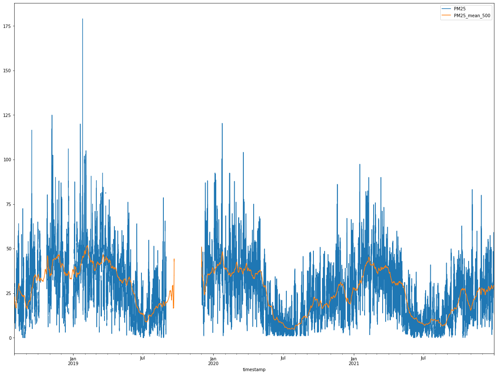
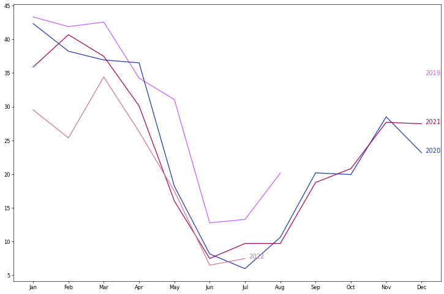
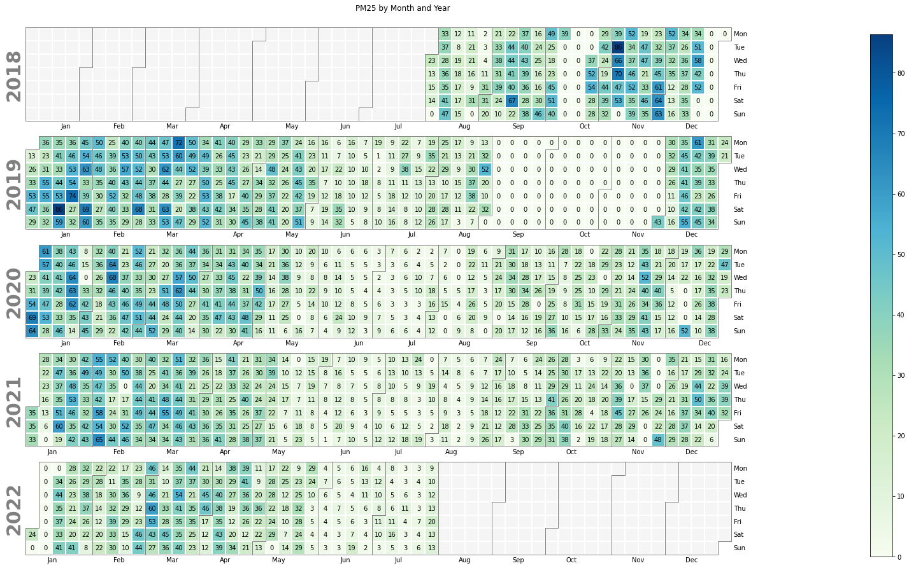
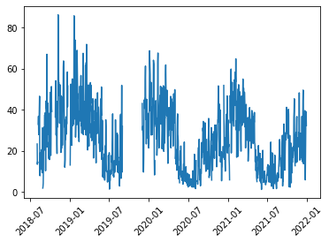

[](https://colab.research.google.com/drive/1MUHXiRiI7o56oZLCU2JrxI-aJEiM6RkJ?usp=sharing)



時間序列資料是依照時間上發生的先後順序形成的資料，通常在資料上的時間間隔會一樣（例如：五分鐘一筆資料、一小時一筆資料），應用的領域相當廣泛，如：金融資訊、太空工程、訊號處理等，在分析上也有許多統計相關的工具可以使用。 同時也可以發現時序資料是很貼近日常生活的，隨著全球氣候變遷的日益加劇，這幾年全球的平均氣溫越來越高，在夏天時更是讓人熱到非常有感，也越來越難以忍受；又或是在一年中某些季節的空氣品質往往特別差，或者某些時間的空氣品質往往比其他時間來的差等。如果想要更加了解這些生活環境的改變，以及其對應的感測器數值是如何變化的，就會運用到時間序列資料的分析，也就是觀察資料與時間的關係，進而得出結果。本章節將會使用三種資料（空氣品質、水資源、氣象）示範。

## 章節目標

- 使用作圖工具觀察時序資料
- 檢測與處理時序資料
- 分解時序資料得到趨勢與週期性

## 套件安裝與引用

在本章節中，我們將會使用到 pandas, matplotlib, numpy, seaborn, statsmodels, warnings 等套件，這些套件由於在我們使用的開發平台 Colab 上皆已預先安裝好，因此不需要再另行安裝。然而，我們還會另外使用兩個 Colab 並未預先安裝好的套件：kats 和 calplot，需使用下列的方式自行安裝：

```python
!pip install --upgrade pip

# Kats
!pip install kats==0.1 ax-platform==0.2.3 statsmodels==0.12.2

# calplot
!pip install calplot
```

待安裝完畢後，即可使用下列的語法先行引入相關的套件，完成本章節的準備工作：

```python
import warnings
import calplot
import pandas as pd
import numpy as np
import matplotlib as mpl
import matplotlib.pyplot as plt
import statsmodels.api as sm
import os, zipfile

from datetime import datetime, timedelta
from dateutil import parser as datetime_parser
from statsmodels.tsa.stattools import adfuller, kpss
from statsmodels.tsa.seasonal import seasonal_decompose
from kats.detectors.outlier import OutlierDetector
from kats.detectors.cusum_detection import CUSUMDetector
from kats.consts import TimeSeriesData, TimeSeriesIterator
from IPython.core.pylabtools import figsize
```

## 讀取資料

我們使用 pandas 進行資料的處理，pandas 是 Python 語言常使用到的資料科學套件，也可以想成是程式語言中類似 Microsoft Excel 的試算表，而 pandas 所提供的 dataframe 物件，更可以想成是一種二維的資料結構，可以用行、列的方式儲存資料，方便各式的資料處理與運算。

本章節的探討主題為時序資料 (time series data) 的分析處理，因此我們將分別以民生公共物聯網資料平台上的空品、水位和氣象資料進行資料讀取的演示，接著再使用空品資料進行更進一步的資料分析。其中，每一類別的資料處理都將使用其中一個測站長期以來觀測到的資料作為資料集，而在 dataframe 的時間欄位名稱則設為 `timestamp`，由於時間欄位的數值具有唯一性，因此我們也將使用此欄位作為 dataframe 的索引 (index)。

### 空品資料

由於我們這次要使用的是長時間的歷史資料，因此我們不直接使用 pyCIOT 套件的讀取資料功能，而直接從民生公共物聯網資料平台的歷史資料庫下載「中研院校園空品微型感測器」的歷史資料，並存入 Air 資料夾中。

同時，由於所下載的資料是 zip 壓縮檔案的格式，我們需要先逐一將其解壓縮，產生每日資料的壓縮檔案，接著再將每日資料的壓縮檔案解壓縮，存入 CSV_Air 資料夾中。

```python
!mkdir Air CSV_Air
!wget -O Air/2018.zip -q "https://history.colife.org.tw/?r=/download&path=L%2Bepuuawo%2BWTgeizqi%2FkuK3noJTpmaJf5qCh5ZyS56m65ZOB5b6u5Z6L5oSf5ris5ZmoLzIwMTguemlw"
!wget -O Air/2019.zip -q "https://history.colife.org.tw/?r=/download&path=L%2Bepuuawo%2BWTgeizqi%2FkuK3noJTpmaJf5qCh5ZyS56m65ZOB5b6u5Z6L5oSf5ris5ZmoLzIwMTkuemlw"
!wget -O Air/2020.zip -q "https://history.colife.org.tw/?r=/download&path=L%2Bepuuawo%2BWTgeizqi%2FkuK3noJTpmaJf5qCh5ZyS56m65ZOB5b6u5Z6L5oSf5ris5ZmoLzIwMjAuemlw"
!wget -O Air/2021.zip -q "https://history.colife.org.tw/?r=/download&path=L%2Bepuuawo%2BWTgeizqi%2FkuK3noJTpmaJf5qCh5ZyS56m65ZOB5b6u5Z6L5oSf5ris5ZmoLzIwMjEuemlw"

#開始進行解壓縮
folder = 'Air'
extension_zip = '.zip'
extension_csv = '.csv'

for subfolder in os.listdir(folder):
    path = f'{folder}/{subfolder}'
    if path.endswith(extension_zip):
      print(path)
      zip_ref = zipfile.ZipFile(path)
      zip_ref.extractall(folder)
      zip_ref.close()

for subfolder in os.listdir(folder):
    path = f'{folder}/{subfolder}'
    if os.path.isdir(path):
        for item in os.listdir(path):
            if item.endswith(extension_zip):
                file_name = f'{path}/{item}'
                print(file_name)
                zip_ref = zipfile.ZipFile(file_name)
                zip_ref.extractall(path)
                zip_ref.close()

        for item in os.listdir(path):
          path2 = f'{path}/{item}'
          if os.path.isdir(path2):
            for it in os.listdir(path2):
              if it.endswith(extension_zip):
                file_name = f'{path2}/{it}'
                print(file_name)
                zip_ref = zipfile.ZipFile(file_name)
                zip_ref.extractall('CSV_Air') # decide path
                zip_ref.close()
          elif item.endswith(extension_csv):
            os.rename(path2, f'CSV_Air/{item}')
```

現在 CSV_Air 資料夾中即有每日所有感測器資料的 csv 格式檔案，為了將單一測站 (例如代碼為 `74DA38C7D2AC` 的測站) 的資料過濾出來，我們需要讀取每個 csv 檔案，並將檔案中該測站的資料存入名叫 `air` 的 dataframe 中。最後我們將所有下載的資料與解壓縮後產生的資料移除，以節省雲端的儲存空間。

```python
folder = 'CSV_Air'
extension_csv = '.csv'
id = '74DA38C7D2AC'

air = pd.DataFrame()
for item in os.listdir(folder):
  file_name = f'{folder}/{item}'
  df = pd.read_csv(file_name)
  if 'pm25' in list(df.columns):
    df.rename({'pm25':'PM25'}, axis=1, inplace=True)
  filtered = df.query(f'device_id==@id')
  air = pd.concat([air, filtered], ignore_index=True)
air.dropna(subset=['timestamp'], inplace=True)

for i, row in air.iterrows():
  aware = datetime_parser.parse(str(row['timestamp']))
  naive = aware.replace(tzinfo=None)
  air.at[i, 'timestamp'] = naive
air.set_index('timestamp', inplace=True)

!rm -rf Air CSV_Air
```

最後，我們重新整理該測站的資料，將不需要用到的欄位資訊刪除，並且依照時間進行排序如下：

```python
air.drop(columns=['device_id', 'SiteName'], inplace=True)
air.sort_values(by='timestamp', inplace=True)
air.info()
print(air.head())
```

```
<class 'pandas.core.frame.DataFrame'>
DatetimeIndex: 195305 entries, 2018-08-01 00:00:05 to 2021-12-31 23:54:46
Data columns (total 1 columns):
 \#   Column  Non-Null Count   Dtype 
---  ------  --------------   ----- 
 0   PM25    195305 non-null  object
dtypes: object(1)
memory usage: 3.0+ MB
                     PM25
timestamp                
2018-08-01 00:00:05  20.0
2018-08-01 00:30:18  17.0
2018-08-01 01:12:34  18.0
2018-08-01 01:18:36  21.0
2018-08-01 01:30:44  22.0
```

### 水位資料

和空品資料的範例一樣，由於我們這次要使用的是長時間的歷史資料，因此我們不直接使用 pyCIOT 套件的讀取資料功能，而直接從民生公共物聯網資料平台的歷史資料庫下載「水利署地下水位站」的歷史資料，並存入 Water 資料夾中。

同時，由於所下載的資料是 zip 壓縮檔案的格式，我們需要先逐一將其解壓縮，產生每日資料的壓縮檔案，接著再將每日資料的壓縮檔案解壓縮，存入 CSV_Water 資料夾中。

```python
!mkdir Water CSV_Water
!wget -O Water/2018.zip "https://history.colife.org.tw/?r=/download&path=L%2BawtOizh%2Ba6kC%2FmsLTliKnnvbJf5rKz5bed5rC05L2N56uZLzIwMTguemlw"
!wget -O Water/2019.zip "https://history.colife.org.tw/?r=/download&path=L%2BawtOizh%2Ba6kC%2FmsLTliKnnvbJf5rKz5bed5rC05L2N56uZLzIwMTkuemlw"
!wget -O Water/2020.zip "https://history.colife.org.tw/?r=/download&path=L%2BawtOizh%2Ba6kC%2FmsLTliKnnvbJf5rKz5bed5rC05L2N56uZLzIwMjAuemlw"
!wget -O Water/2021.zip "https://history.colife.org.tw/?r=/download&path=L%2BawtOizh%2Ba6kC%2FmsLTliKnnvbJf5rKz5bed5rC05L2N56uZLzIwMjEuemlw"

#開始進行解壓縮
folder = 'Water'
extension_zip = '.zip'
extension_csv = '.csv'

for subfolder in os.listdir(folder):
    path = f'{folder}/{subfolder}'
    if path.endswith(extension_zip):
      print(path)
      zip_ref = zipfile.ZipFile(path)
      zip_ref.extractall(folder)
      zip_ref.close()
for subfolder in os.listdir(folder):
    path = f'{folder}/{subfolder}'
    if os.path.isdir(path):
        for item in os.listdir(path):
            if item.endswith(extension_zip):
                file_name = f'{path}/{item}'
                print(file_name)
                zip_ref = zipfile.ZipFile(file_name)
                zip_ref.extractall(path)
                zip_ref.close()

        for item in os.listdir(path):
          path2 = f'{path}/{item}'
          if os.path.isdir(path2):
            for it in os.listdir(path2):
              if it.endswith(extension_zip) and not it.endswith('QC.zip'):
                file_name = f'{path2}/{it}'
                print(file_name)
                zip_ref = zipfile.ZipFile(file_name)
                zip_ref.extractall('CSV_Water') # decide path
                zip_ref.close()
          elif item.endswith(extension_csv):
            os.rename(path2, f'CSV_Water/{item}')
```

現在 CSV_Water 資料夾中即有每日所有感測器資料的 csv 格式檔案，為了將單一測站 (例如代碼為 `338c9c1c-57d8-41d7-9af2-731fb86e632c` 的測站) 的資料過濾出來，我們需要讀取每個 csv 檔案，並將檔案中該測站的資料存入名叫 `water` 的 dataframe 中。最後我們將所有下載的資料與解壓縮後產生的資料移除，以節省雲端的儲存空間。

```python
folder = 'CSV_Water'
extension_csv = '.csv'
id = '338c9c1c-57d8-41d7-9af2-731fb86e632c'

water = pd.DataFrame()
for item in os.listdir(folder):
  file_name = f'{folder}/{item}'
  df = pd.read_csv(file_name)
  if 'pm25' in list(df.columns):
    df.rename({'pm25':'PM25'}, axis=1, inplace=True)
  filtered = df.query(f'station_id==@id')
  water = pd.concat([water, filtered], ignore_index=True)
water.dropna(subset=['timestamp'], inplace=True)

for i, row in water.iterrows():
  aware = datetime_parser.parse(str(row['timestamp']))
  naive = aware.replace(tzinfo=None)
  water.at[i, 'timestamp'] = naive
water.set_index('timestamp', inplace=True)

!rm -rf Water CSV_Water
```

最後，我們重新整理該測站的資料，將不需要用到的欄位資訊刪除，並且依照時間進行排序如下：

```python
water.drop(columns=['station_id', 'ciOrgname', 'ciCategory', 'Organize_Name', 'CategoryInfos_Name', 'PQ_name', 'PQ_fullname', 'PQ_description', 'PQ_unit', 'PQ_id'], inplace=True)
water.sort_values(by='timestamp', inplace=True)
water.info()
print(water.head())
```

```
<class 'pandas.core.frame.DataFrame'>
DatetimeIndex: 213466 entries, 2018-01-01 00:20:00 to 2021-12-07 11:00:00
Data columns (total 1 columns):
 #   Column  Non-Null Count   Dtype  
---  ------  --------------   -----  
 0   value   213465 non-null  float64
dtypes: float64(1)
memory usage: 3.3 MB
                         value
timestamp                     
2018-01-01 00:20:00  49.130000
2018-01-01 00:25:00  49.139999
2018-01-01 00:30:00  49.130001
2018-01-01 00:35:00  49.130001
2018-01-01 00:40:00  49.130001
```

### 氣象資料

我們從民生公共物聯網資料平台的歷史資料庫下載「中央氣象局自動氣象站」的歷史資料，並存入 Weather 資料夾中。

同時，由於所下載的資料是 zip 壓縮檔案的格式，我們需要先逐一將其解壓縮，產生每日資料的壓縮檔案，接著再將每日資料的壓縮檔案解壓縮，存入 CSV_Weather 資料夾中。

```python
!mkdir Weather CSV_Weather
!wget -O Weather/2019.zip "https://history.colife.org.tw/?r=/download&path=L%2Bawo%2BixoS%2FkuK3lpK7msKPosaHlsYBf6Ieq5YuV5rCj6LGh56uZLzIwMTkuemlw"
!wget -O Weather/2020.zip "https://history.colife.org.tw/?r=/download&path=L%2Bawo%2BixoS%2FkuK3lpK7msKPosaHlsYBf6Ieq5YuV5rCj6LGh56uZLzIwMjAuemlw"
!wget -O Weather/2021.zip "https://history.colife.org.tw/?r=/download&path=L%2Bawo%2BixoS%2FkuK3lpK7msKPosaHlsYBf6Ieq5YuV5rCj6LGh56uZLzIwMjEuemlw"

#開始進行解壓縮
folder = 'Weather'
extension_zip = '.zip'
extension_csv = '.csv'

for subfolder in os.listdir(folder):
    path = f'{folder}/{subfolder}'
    if path.endswith(extension_zip):
      print(path)
      zip_ref = zipfile.ZipFile(path)
      zip_ref.extractall(folder)
      zip_ref.close()

for subfolder in os.listdir(folder):
    path = f'{folder}/{subfolder}'
    if os.path.isdir(path):
        for item in os.listdir(path):
            if item.endswith(extension_zip):
                file_name = f'{path}/{item}'
                print(file_name)
                zip_ref = zipfile.ZipFile(file_name)
                zip_ref.extractall(path)
                zip_ref.close()

        for item in os.listdir(path):
          path2 = f'{path}/{item}'
          if os.path.isdir(path2):
            for it in os.listdir(path2):
              if it.endswith(extension_zip):
                file_name = f'{path2}/{it}'
                print(file_name)
                zip_ref = zipfile.ZipFile(file_name)
                zip_ref.extractall('CSV_Weather') # decide path
                zip_ref.close()
          elif item.endswith(extension_csv):
            os.rename(path2, f'CSV_Weather/{item}')
```

現在 CSV_Weather 資料夾中即有每日所有感測器資料的 csv 格式檔案，為了將單一測站 (例如代碼為 `C0U750` 的測站) 的資料過濾出來，我們需要讀取每個 csv 檔案，並將檔案中該測站的資料存入名叫 weather 的 dataframe 中。最後我們將所有下載的資料與解壓縮後產生的資料移除，以節省雲端的儲存空間。

```python
folder = 'CSV_Weather'
extension_csv = '.csv'
id = 'C0U750'

weather = pd.DataFrame()
for item in os.listdir(folder):
  file_name = f'{folder}/{item}'
  df = pd.read_csv(file_name)
  if 'pm25' in list(df.columns):
    df.rename({'pm25':'PM25'}, axis=1, inplace=True)
  filtered = df.query(f'station_id==@id')
  weather = pd.concat([weather, filtered], ignore_index=True)
weather.rename({'obsTime':'timestamp'}, axis=1, inplace=True)
weather.dropna(subset=['timestamp'], inplace=True)

for i, row in weather.iterrows():
  aware = datetime_parser.parse(str(row['timestamp']))
  naive = aware.replace(tzinfo=None)
  weather.at[i, 'timestamp'] = naive
weather.set_index('timestamp', inplace=True)

!rm -rf Weather CSV_Weather
```

最後，我們重新整理該測站的資料，將不需要用到的欄位資訊刪除，並且依照時間進行排序如下：

```python
weather.drop(columns=['station_id'], inplace=True)
weather.sort_values(by='timestamp', inplace=True)
weather.info()
print(weather.head())
```

```
<class 'pandas.core.frame.DataFrame'>
DatetimeIndex: 27093 entries, 2019-01-01 00:00:00 to 2021-12-31 23:00:00
Data columns (total 15 columns):
 #   Column  Non-Null Count  Dtype  
---  ------  --------------  -----  
 0   ELEV    27093 non-null  float64
 1   WDIR    27089 non-null  float64
 2   WDSD    27089 non-null  float64
 3   TEMP    27093 non-null  float64
 4   HUMD    27089 non-null  float64
 5   PRES    27093 non-null  float64
 6   SUN     13714 non-null  float64
 7   H_24R   27089 non-null  float64
 8   H_FX    27089 non-null  float64
 9   H_XD    27089 non-null  object 
 10  H_FXT   23364 non-null  object 
 11  D_TX    27074 non-null  object 
 12  D_TXT   7574 non-null   object 
 13  D_TN    27074 non-null  object 
 14  D_TNT   17 non-null     object 
dtypes: float64(9), object(6)
memory usage: 3.3+ MB
                      ELEV  WDIR  WDSD  TEMP  HUMD   PRES   SUN  H_24R  H_FX  \
timestamp                                                                      
2019-01-01 00:00:00  398.0  35.0   5.8  13.4  0.99  981.1 -99.0   18.5 -99.0   
2019-01-01 01:00:00  398.0  31.0   5.7  14.1  0.99  981.0 -99.0    0.5  10.8   
2019-01-01 02:00:00  398.0  35.0   5.3  13.9  0.99  980.7 -99.0    1.0 -99.0   
2019-01-01 03:00:00  398.0  32.0   5.7  13.8  0.99  980.2 -99.0    1.5 -99.0   
2019-01-01 04:00:00  398.0  37.0   6.9  13.8  0.99  980.0 -99.0    2.0  12.0   

                     H_XD H_FXT  D_TX D_TXT  D_TN D_TNT  
timestamp                                                
2019-01-01 00:00:00 -99.0 -99.0  14.5   NaN  13.4   NaN  
2019-01-01 01:00:00  35.0   NaN  14.1   NaN  13.5   NaN  
2019-01-01 02:00:00 -99.0 -99.0  14.1   NaN  13.5   NaN  
2019-01-01 03:00:00 -99.0 -99.0  14.1   NaN  13.5   NaN  
2019-01-01 04:00:00  39.0   NaN  14.1   NaN  13.5   NaN
```

以上我們已經成功示範空品資料 (air)、水位資料 (water) 和氣象資料 (weather) 的讀取範例，在接下來的探討中，我們將以空品資料示範初步的時間序列資料處理，相同的方法也可以輕易改成使用水位資料或氣象資料而得到類似的結果，大家可以自行嘗試看看。

## 資料視覺化 (Visualization)

時間序列資料處理的第一個步驟，不外乎就是將資料依照時間順序一筆一筆的呈現出來，讓使用者可以看到整體資料的變化，並且衍生更多資料分析的想法與概念，其中使用折線圖進行資料的展示，是最常使用的一種資料視覺化方法。例如若以空品資料為例：

```python
plt.figure(figsize=(15, 10), dpi=60)
plt.plot(air[:]["PM25"])

plt.xlabel("Date")
plt.ylabel("PM2.5")
plt.title("PM2.5 Time Series Plot")

plt.tight_layout()

plt.show()
```


### 重新採樣 (resample)

從上圖空品資料的時序圖中，可以看到其實資料的分佈是很密集的，同時資料數值的變化有時很小有時卻很劇烈，這是因為目前空品資料的採樣頻率約略是每五分鐘一筆，同時採集的環境是生活中的周遭環境資訊，因此資料密集與起伏不定其實是必然的。由於每五分鐘一筆資料的採樣過於頻繁，不易呈現環境空品的整體變化趨勢，因此我們採用重新採樣的方法，在固定的時間間隔內計算資料的平均值，便能呈現資料資料在不同時間尺度的整體變化狀況。例如我們根據現有空品資料的特性，利用下列的語法以較大尺度 (小時、日、月) 的採樣率重新取樣：

```python
air_hour = air.resample('H').mean() #每小時的平均
air_day = air.resample('D').mean()  #每日的平均
air_month = air.resample('M').mean()  #每月的平均

print(air_hour.head())
print(air_day.head())
print(air_month.head())
```

```
                         PM25
timestamp                     
2018-08-01 00:00:00  18.500000
2018-08-01 01:00:00  20.750000
2018-08-01 02:00:00  24.000000
2018-08-01 03:00:00  27.800000
2018-08-01 04:00:00  22.833333
                 PM25
timestamp            
2018-08-01  23.384615
2018-08-02  13.444444
2018-08-03  14.677419
2018-08-04  14.408451
2018-08-05        NaN
                 PM25
timestamp            
2018-08-31  21.704456
2018-09-30  31.797806
2018-10-31  37.217788
2018-11-30  43.228939
```

接著我們使用每小時平均的重新採樣後資料再次進行作圖，可以看到線條曲線變得較為清晰，但曲線的波動還是很大。

```python
plt.figure(figsize=(15, 10), dpi=60)
plt.plot(air_hour[:]["PM25"])

plt.xlabel("Date")
plt.ylabel("PM2.5")
plt.title("PM2.5 Time Series Plot")

plt.tight_layout()

plt.show()
```


### 移動平均 (moving average)

針對原始資料的變化圖，如果想看到更平滑的曲線變化趨勢圖，可以套用移動平均的方法，其中最主要的觀念就是在原始資料的時間軸上設定一個取樣窗 (window)，並在取樣窗內計算所有數值的平均數，並且用平滑移動的方式滑動取樣窗的位置，計算當下資料與窗內前幾筆資料的平均值。例如，若取樣窗的大小為 10，就代表每次要將當下的資料和前面 9 次的資料做平均，經過這樣的處理後每筆資料所代表的意義就不只是某一個時間點，而是原本時間點加上前幾個時間點的平均，如此一來，可以消除突發的變化讓整體曲線的呈現更加圓滑，也更容易觀察整體的變化趨勢。

```python
# plt.figure(figsize=(15, 10), dpi=60)
MA = air_hour
MA10 = MA.rolling(window=500, min_periods=1).mean()

MA.join(MA10.add_suffix('_mean_500')).plot(figsize=(20, 15))
# MA10.plot(figsize(15, 10))
```



上圖中的藍色線為原始資料，橘色線則是經過移動平均後的曲線，可以清楚發現橘色線更能代表整體數值的變化趨勢，同時也存在某種程度的規律起伏，值得後續進一步的分析。

### 多曲線圖

除了將原始資料用單純的折線圖方式呈現外，另一個常見的資料時覺化手法，則是依照時間維度上的週期性，將資料切割為數個連續的片段，分別繪製折線圖，並疊加在同一張多曲線圖中。例如，我們可以將前述的空品資料，依照年份的不同切割出 2019, 2020, 2021, 和 2022 四個子資料集，並分別繪製各自的折線圖於同一張多曲線圖中，如下圖所示。

```python
air_month.reset_index(inplace=True)
air_month['year'] = [d.year for d in air_month.timestamp]
air_month['month'] = [d.strftime('%b') for d in air_month.timestamp]
years = air_month['year'].unique()
print(air)

np.random.seed(100)
mycolors = np.random.choice(list(mpl.colors.XKCD_COLORS.keys()), len(years), replace=False)

plt.figure(figsize=(15, 10), dpi=60)
for i, y in enumerate(years):
  if i > 0:
    plt.plot('month', 'PM25', data=air_month.loc[air_month.year==y, :], color=mycolors[i], label=y)
    plt.text(air_month.loc[air_month.year==y, :].shape[0]-.9, air_month.loc[air_month.year==y, 'PM25'][-1:].values[0], y, fontsize=12, color=mycolors[i])

# plt.gca().set(xlim=(-0.3, 11), ylim=(2, 30), ylabel='PM25', xlabel='Month')
# plt.yticks(fontsize=12, alpha=.7)
# plt.title('Seasonal Plot of PM25 Time Series', fontsize=20)
plt.show()
```



在這張多曲線圖中，我們可以發現 2019 年的資料有大片段的缺失值，2022 年的資料只記載到本文寫作時的七月份，同時也可以發現在這四個年份的折線圖中，不同年份的曲線皆在夏季時達到最低點，秋季時 PM2.5 數值則開始攀升，並且在冬季時達到最高點，呈現約略相同的變化趨勢。

### 日曆熱力圖

日曆熱力圖是一種結合日曆圖 (calendar map) 與熱力圖 (heat map) 的資料視覺化呈現方式，可以更直覺瀏覽資料的分佈狀況，並從中尋找不同時間尺度的規律性。我們使用 calplot 這個 Python 語言的日曆熱力圖套件，將每日的 PM2.5 平均值輸入後，再選擇搭配的顏色 (參數名稱為 `cmap`，在接下來的範例中，我們先設為 `GnBu`，詳細的顏色選項說明，可參閱參考資料)，便能得到下圖的效果，其中藍色代表數值較高，綠色或白色代表數值較低，如果沒有塗色或是數值為 0 則代表當天沒有資料。從產生的圖中，我們可以發現中間部分的月份（夏季）顏色較淡，左邊部分的月份（冬季）顏色#較深，恰與我們之前使用多曲線圖的觀察結果一致。

```python
# cmap: 設定呈現的顏色色盤 (https://matplotlib.org/stable/gallery/color/colormap_reference.html)
# textformat: 設定圖中數字呈現的樣式
pl1 = calplot.calplot(data = air_day['PM25'], cmap = 'GnBu', textformat = '{:.0f}', 
											figsize = (24, 12), suptitle = "PM25 by Month and Year")
```



## 資料品質檢測與處理

在時序資料的基本視覺化呈現後，我們接下來介紹資料品質的檢測與基本處理方法，我們將使用 kats 這個 Python 語言的資料處理與分析套件，並依序進行離群值偵測、改變點偵測與缺失資料處理。

### 離群值偵測 (Outlier detection)

離群值指的是資料中某些數值與其他數值存在顯著的差異，這些差異可能會影響我們對資料的判斷與分析結果，因此需要將離群值找出來後予以標示、刪除、或特別處理。

我們首先將原本使用 dataframe 資料格式的 `air_hour` 轉換成 kats 套件所使用的 `TimeSeriesData` 格式，並將轉換後的資料存成 `air_ts` 這個變數名稱。然後我們再次繪製原始時序資料的折線圖。

```python
air_ts = TimeSeriesData(air_hour.reset_index(), time_col_name='timestamp')
air_ts.plot(cols=["PM25"])
```


接著我們使用 kats 套件中的 `OutlierDetector` 工具偵測時序資料中的離群值。其中，[離群值](https://sphweb.bumc.bu.edu/otlt/mph-modules/bs/bs704_summarizingdata/bs704_summarizingdata7.html)指的是小於第一四分位數 (Q1) 減 1.5 倍四分位距 (IQR) 或大於第三四分位數 (Q3) 加 1.5 倍四分位距的數值。

```python
outlierDetection = OutlierDetector(air_ts, 'additive')
outlierDetection.detector()
outlierDetection.outliers
```

```
[[Timestamp('2018-08-10 16:00:00'),
  Timestamp('2018-08-10 17:00:00'),
  Timestamp('2018-08-20 00:00:00'),
  Timestamp('2018-08-23 03:00:00'),
  Timestamp('2018-08-23 04:00:00'),
  Timestamp('2018-09-02 11:00:00'),
  Timestamp('2018-09-11 00:00:00'),
  Timestamp('2018-09-13 14:00:00'),
  Timestamp('2018-09-13 15:00:00'),
  Timestamp('2018-09-13 16:00:00'),
  Timestamp('2018-09-15 08:00:00'),
  Timestamp('2018-09-15 09:00:00'),
  Timestamp('2018-09-15 10:00:00'),
  Timestamp('2018-09-15 11:00:00'),
  Timestamp('2018-09-22 05:00:00'),
  Timestamp('2018-09-22 06:00:00'),
  Timestamp('2018-10-26 01:00:00'),
  Timestamp('2018-11-06 13:00:00'),
  Timestamp('2018-11-06 15:00:00'),
  Timestamp('2018-11-06 16:00:00'),
  Timestamp('2018-11-06 19:00:00'),
  Timestamp('2018-11-06 20:00:00'),
  Timestamp('2018-11-06 21:00:00'),
  Timestamp('2018-11-06 22:00:00'),
  Timestamp('2018-11-07 07:00:00'),
  Timestamp('2018-11-07 08:00:00'),
  Timestamp('2018-11-07 09:00:00'),
  Timestamp('2018-11-09 00:00:00'),
  Timestamp('2018-11-09 01:00:00'),
  Timestamp('2018-11-09 02:00:00'),
  Timestamp('2018-11-09 03:00:00'),
  Timestamp('2018-11-10 02:00:00'),
  Timestamp('2018-11-10 03:00:00'),
  Timestamp('2018-11-16 01:00:00'),
  Timestamp('2018-11-16 02:00:00'),
  Timestamp('2018-11-16 03:00:00'),
  Timestamp('2018-11-16 04:00:00'),
  Timestamp('2018-11-21 00:00:00'),
  Timestamp('2018-11-21 18:00:00'),
  Timestamp('2018-11-21 19:00:00'),
  Timestamp('2018-11-25 08:00:00'),
  Timestamp('2018-11-30 14:00:00'),
  Timestamp('2018-12-01 06:00:00'),
  Timestamp('2018-12-01 16:00:00'),
  Timestamp('2018-12-01 17:00:00'),
  Timestamp('2018-12-15 02:00:00'),
  Timestamp('2018-12-19 03:00:00'),
  Timestamp('2018-12-19 04:00:00'),
  Timestamp('2018-12-19 05:00:00'),
  Timestamp('2018-12-19 06:00:00'),
  Timestamp('2018-12-19 07:00:00'),
  Timestamp('2018-12-19 08:00:00'),
  Timestamp('2018-12-19 10:00:00'),
  Timestamp('2018-12-19 11:00:00'),
  Timestamp('2018-12-19 12:00:00'),
  Timestamp('2018-12-19 13:00:00'),
  Timestamp('2018-12-19 14:00:00'),
  Timestamp('2018-12-19 15:00:00'),
  Timestamp('2018-12-19 16:00:00'),
  Timestamp('2018-12-19 17:00:00'),
  Timestamp('2018-12-20 03:00:00'),
  Timestamp('2018-12-20 04:00:00'),
  Timestamp('2018-12-20 05:00:00'),
  Timestamp('2018-12-20 06:00:00'),
  Timestamp('2018-12-20 07:00:00'),
  Timestamp('2018-12-20 08:00:00'),
  Timestamp('2018-12-20 11:00:00'),
  Timestamp('2018-12-20 12:00:00'),
  Timestamp('2018-12-20 13:00:00'),
  Timestamp('2018-12-20 14:00:00'),
  Timestamp('2018-12-20 15:00:00'),
  Timestamp('2019-01-05 02:00:00'),
  Timestamp('2019-01-05 08:00:00'),
  Timestamp('2019-01-05 09:00:00'),
  Timestamp('2019-01-05 22:00:00'),
  Timestamp('2019-01-19 06:00:00'),
  Timestamp('2019-01-19 07:00:00'),
  Timestamp('2019-01-19 08:00:00'),
  Timestamp('2019-01-19 09:00:00'),
  Timestamp('2019-01-19 13:00:00'),
  Timestamp('2019-01-19 14:00:00'),
  Timestamp('2019-01-19 15:00:00'),
  Timestamp('2019-01-25 18:00:00'),
  Timestamp('2019-01-25 19:00:00'),
  Timestamp('2019-01-25 20:00:00'),
  Timestamp('2019-01-26 00:00:00'),
  Timestamp('2019-01-26 01:00:00'),
  Timestamp('2019-01-26 02:00:00'),
  Timestamp('2019-01-26 03:00:00'),
  Timestamp('2019-01-26 04:00:00'),
  Timestamp('2019-01-30 06:00:00'),
  Timestamp('2019-01-30 11:00:00'),
  Timestamp('2019-01-30 12:00:00'),
  Timestamp('2019-01-30 13:00:00'),
  Timestamp('2019-01-30 14:00:00'),
  Timestamp('2019-02-02 16:00:00'),
  Timestamp('2019-02-02 17:00:00'),
  Timestamp('2019-02-02 18:00:00'),
  Timestamp('2019-02-02 19:00:00'),
  Timestamp('2019-02-02 20:00:00'),
  Timestamp('2019-02-03 03:00:00'),
  Timestamp('2019-02-03 04:00:00'),
  Timestamp('2019-02-03 05:00:00'),
  Timestamp('2019-02-03 06:00:00'),
  Timestamp('2019-02-03 07:00:00'),
  Timestamp('2019-02-03 10:00:00'),
  Timestamp('2019-02-03 11:00:00'),
  Timestamp('2019-02-03 12:00:00'),
  Timestamp('2019-02-03 13:00:00'),
  Timestamp('2019-02-03 22:00:00'),
  Timestamp('2019-02-03 23:00:00'),
  Timestamp('2019-02-07 05:00:00'),
  Timestamp('2019-02-07 06:00:00'),
  Timestamp('2019-02-16 22:00:00'),
  Timestamp('2019-02-16 23:00:00'),
  Timestamp('2019-02-18 18:00:00'),
  Timestamp('2019-02-18 20:00:00'),
  Timestamp('2019-02-18 21:00:00'),
  Timestamp('2019-02-19 10:00:00'),
  Timestamp('2019-02-19 11:00:00'),
  Timestamp('2019-02-19 12:00:00'),
  Timestamp('2019-02-19 13:00:00'),
  Timestamp('2019-02-19 14:00:00'),
  Timestamp('2019-02-19 15:00:00'),
  Timestamp('2019-02-19 16:00:00'),
  Timestamp('2019-02-19 23:00:00'),
  Timestamp('2019-02-20 00:00:00'),
  Timestamp('2019-02-20 03:00:00'),
  Timestamp('2019-03-02 17:00:00'),
  Timestamp('2019-03-03 06:00:00'),
  Timestamp('2019-03-05 13:00:00'),
  Timestamp('2019-03-09 23:00:00'),
  Timestamp('2019-03-12 01:00:00'),
  Timestamp('2019-03-16 01:00:00'),
  Timestamp('2019-03-16 02:00:00'),
  Timestamp('2019-03-16 03:00:00'),
  Timestamp('2019-03-20 00:00:00'),
  Timestamp('2019-03-20 01:00:00'),
  Timestamp('2019-03-20 02:00:00'),
  Timestamp('2019-03-20 03:00:00'),
  Timestamp('2019-03-20 11:00:00'),
  Timestamp('2019-03-27 00:00:00'),
  Timestamp('2019-03-27 01:00:00'),
  Timestamp('2019-04-05 03:00:00'),
  Timestamp('2019-04-18 17:00:00'),
  Timestamp('2019-04-20 16:00:00'),
  Timestamp('2019-05-10 07:00:00'),
  Timestamp('2019-05-22 20:00:00'),
  Timestamp('2019-05-23 03:00:00'),
  Timestamp('2019-05-23 16:00:00'),
  Timestamp('2019-05-26 18:00:00'),
  Timestamp('2019-05-27 05:00:00'),
  Timestamp('2019-07-28 01:00:00'),
  Timestamp('2019-08-23 08:00:00'),
  Timestamp('2019-08-24 02:00:00'),
  Timestamp('2019-08-24 03:00:00'),
  Timestamp('2019-08-24 04:00:00'),
  Timestamp('2019-08-24 05:00:00'),
  Timestamp('2019-08-24 07:00:00'),
  Timestamp('2019-08-24 08:00:00'),
  Timestamp('2019-12-10 11:00:00'),
  Timestamp('2019-12-10 12:00:00'),
  Timestamp('2019-12-10 13:00:00'),
  Timestamp('2019-12-10 20:00:00'),
  Timestamp('2019-12-11 04:00:00'),
  Timestamp('2019-12-16 20:00:00'),
  Timestamp('2019-12-17 11:00:00'),
  Timestamp('2020-01-03 15:00:00'),
  Timestamp('2020-01-05 08:00:00'),
  Timestamp('2020-01-05 09:00:00'),
  Timestamp('2020-01-06 08:00:00'),
  Timestamp('2020-01-07 10:00:00'),
  Timestamp('2020-01-07 15:00:00'),
  Timestamp('2020-01-10 11:00:00'),
  Timestamp('2020-01-15 08:00:00'),
  Timestamp('2020-01-22 14:00:00'),
  Timestamp('2020-01-22 17:00:00'),
  Timestamp('2020-01-22 22:00:00'),
  Timestamp('2020-01-22 23:00:00'),
  Timestamp('2020-01-23 00:00:00'),
  Timestamp('2020-01-23 01:00:00'),
  Timestamp('2020-01-23 02:00:00'),
  Timestamp('2020-01-23 10:00:00'),
  Timestamp('2020-01-23 11:00:00'),
  Timestamp('2020-01-23 12:00:00'),
  Timestamp('2020-01-23 13:00:00'),
  Timestamp('2020-01-23 15:00:00'),
  Timestamp('2020-01-23 16:00:00'),
  Timestamp('2020-01-23 17:00:00'),
  Timestamp('2020-01-23 18:00:00'),
  Timestamp('2020-01-23 20:00:00'),
  Timestamp('2020-01-23 21:00:00'),
  Timestamp('2020-01-23 22:00:00'),
  Timestamp('2020-01-23 23:00:00'),
  Timestamp('2020-01-24 00:00:00'),
  Timestamp('2020-01-24 01:00:00'),
  Timestamp('2020-01-24 02:00:00'),
  Timestamp('2020-01-24 03:00:00'),
  Timestamp('2020-02-12 10:00:00'),
  Timestamp('2020-02-12 11:00:00'),
  Timestamp('2020-02-12 12:00:00'),
  Timestamp('2020-02-12 13:00:00'),
  Timestamp('2020-02-12 14:00:00'),
  Timestamp('2020-02-12 19:00:00'),
  Timestamp('2020-02-12 20:00:00'),
  Timestamp('2020-02-12 22:00:00'),
  Timestamp('2020-02-12 23:00:00'),
  Timestamp('2020-02-13 20:00:00'),
  Timestamp('2020-02-14 00:00:00'),
  Timestamp('2020-02-14 01:00:00'),
  Timestamp('2020-02-15 10:00:00'),
  Timestamp('2020-02-19 08:00:00'),
  Timestamp('2020-02-19 09:00:00'),
  Timestamp('2020-02-19 10:00:00'),
  Timestamp('2020-02-25 02:00:00'),
  Timestamp('2020-02-25 03:00:00'),
  Timestamp('2020-03-09 07:00:00'),
  Timestamp('2020-03-18 21:00:00'),
  Timestamp('2020-03-18 22:00:00'),
  Timestamp('2020-03-19 01:00:00'),
  Timestamp('2020-03-20 04:00:00'),
  Timestamp('2020-03-21 09:00:00'),
  Timestamp('2020-03-21 10:00:00'),
  Timestamp('2020-03-28 22:00:00'),
  Timestamp('2020-04-15 03:00:00'),
  Timestamp('2020-04-28 03:00:00'),
  Timestamp('2020-04-28 04:00:00'),
  Timestamp('2020-05-01 13:00:00'),
  Timestamp('2020-05-01 15:00:00'),
  Timestamp('2020-05-01 23:00:00'),
  Timestamp('2020-05-02 00:00:00'),
  Timestamp('2020-11-17 14:00:00'),
  Timestamp('2020-11-17 20:00:00'),
  Timestamp('2020-11-17 21:00:00'),
  Timestamp('2020-11-17 22:00:00'),
  Timestamp('2020-11-18 19:00:00'),
  Timestamp('2020-11-18 20:00:00'),
  Timestamp('2020-11-18 23:00:00'),
  Timestamp('2020-11-19 00:00:00'),
  Timestamp('2020-11-19 01:00:00'),
  Timestamp('2020-12-21 15:00:00'),
  Timestamp('2020-12-27 14:00:00'),
  Timestamp('2020-12-27 15:00:00'),
  Timestamp('2020-12-27 16:00:00'),
  Timestamp('2020-12-27 21:00:00'),
  Timestamp('2021-01-16 09:00:00'),
  Timestamp('2021-01-16 10:00:00'),
  Timestamp('2021-01-16 11:00:00'),
  Timestamp('2021-02-01 10:00:00'),
  Timestamp('2021-02-03 09:00:00'),
  Timestamp('2021-02-03 10:00:00'),
  Timestamp('2021-02-06 11:00:00'),
  Timestamp('2021-02-06 17:00:00'),
  Timestamp('2021-02-08 11:00:00'),
  Timestamp('2021-02-11 14:00:00'),
  Timestamp('2021-02-25 22:00:00'),
  Timestamp('2021-03-12 08:00:00'),
  Timestamp('2021-03-19 15:00:00'),
  Timestamp('2021-03-19 20:00:00'),
  Timestamp('2021-03-29 13:00:00'),
  Timestamp('2021-04-06 07:00:00'),
  Timestamp('2021-04-12 15:00:00'),
  Timestamp('2021-04-13 16:00:00'),
  Timestamp('2021-11-04 14:00:00'),
  Timestamp('2021-11-04 15:00:00'),
  Timestamp('2021-11-04 23:00:00'),
  Timestamp('2021-11-05 00:00:00'),
  Timestamp('2021-11-05 01:00:00'),
  Timestamp('2021-11-05 05:00:00'),
  Timestamp('2021-11-05 06:00:00'),
  Timestamp('2021-11-05 11:00:00'),
  Timestamp('2021-11-05 15:00:00'),
  Timestamp('2021-11-28 15:00:00'),
  Timestamp('2021-11-29 10:00:00'),
  Timestamp('2021-12-21 11:00:00')]]
```

最後我們把偵測出來的離群值從原始資料中刪除，然後再次做圖並與一開始的折線圖進行比較，便可以很清楚地發現一些異常值（例如 2022-07 有一個異常的高峰) 都被移除了。

```
outliers_removed = outlierDetection.remover(interpolate=False)
outliers_removed
outliers_removed.plot(cols=['y_0'])
```


### 改變點偵測 (Change point detection)

改變點是資料中突然發生重大改變的時間點，代表的是事件的發生、資料狀態的轉變或資料分布的轉變，因此改變點偵測也常被視為資料分析與資料預測的重要前處理步驟。

在以下的範例中，我們使用空品資料的日平均值來進行改變點偵測，同時也使用 kats 套件的 `TimeSeriesData` 資料格式來儲存資料，並使用 kats 提供的 `CUSUMDetector` 偵測器來進行偵測，並在作圖中用紅色的點來代表偵測到的改變點。很不湊巧的是，在本次的範例中一如肉眼觀察的結果，並無明顯的改變點存在，建議讀者可參考這次的範例，帶入其他的資料做更多的演練與偵測。

```python
air_ts = TimeSeriesData(air_day.reset_index(), time_col_name='timestamp')
detector = CUSUMDetector(air_ts)

change_points = detector.detector(change_directions=["increase", "decrease"])
# print("The change point is on", change_points[0][0].start_time)

# plot the results
plt.xticks(rotation=45)
detector.plot(change_points)
plt.show()
```



### 缺失資料 (missing data) 處理

在我們進行資料分析時，常常不免會遇上缺失資料的問題，這些缺失資料有的是在資料收取時便已經缺失
（例如感測器故障、網路斷線等原因），有些則是在資料前處理時不得不把某些資料刪除（離群值或明顯異常值），但對於後續的資料處理與分析而言，我們又往往需要資料能維持固定的採樣率，以方便各項方法工具的套用，因此便衍生出各種不同的缺失資料填值方法。以下我們介紹三種常見的方法：

1. 將該筆缺失資料標示為 Nan (Not a number)：Nan 代表非數，用來表示未定義或不可表示的值，如果已知後續的資料分析會額外處理這些 Nan 的特例，便可採用此方法以維護資料的真實性。
2. Forward fill 法：如果 Nan 對後續的資料分析有困難，必須將缺失的值填補適當的數值資料，最簡單的方法就是 forward fill，亦即用前一個數值來填補當下的缺失值。
```python
# forward fill
df_ffill = air.ffill(inplace=False)

df_ffill.plot()
```

3. K-Nearest Neighbor (KNN) 法：顧名思義，KNN 的方法是尋找距離缺失值最近的 k 個數值進行平均，並用來填補這個缺失值。
```python
def knn_mean(ts, n):
    out = np.copy(ts)
    for i, val in enumerate(ts):
        if np.isnan(val):
            n_by_2 = np.ceil(n/2)
            lower = np.max([0, int(i-n_by_2)])
            upper = np.min([len(ts)+1, int(i+n_by_2)])
            ts_near = np.concatenate([ts[lower:i], ts[i:upper]])
            out[i] = np.nanmean(ts_near)
    return out

# KNN
df_knn = air.copy()
df_knn['PM25'] = knn_mean(air.PM25.to_numpy(), 5000)
df_knn.plot()
```


## 資料分解(Decomposition)

在前面的基本資料處理範例中，我們已能約略觀察資料數值的變化趨勢，並且發現可能的規律變化，為了能更近一步深入探討時序資料的變化規律性，我們接著介紹時序資料所常使用的資料分解分法，將原本的時序資料拆解成趨勢波 (trend)、週期波 (seasonal) 及殘差波(residual)。

我們首先將空品資料的每日平均資料另外複製一份為 `air_process`，並採用 forward fill 方法進行缺失資料的處理，然後把原始資料直接用圖表的方式呈現。

```python
air_process = air_day.copy()
# new.round(1).head(12)
air_process.ffill(inplace=True)
air_process.plot()
```


接著我們使用 seasonal_decompose 方法對 `air_process` 資料進行分解，其中我們需要設定一個 period 參數，指的是資料被拆解的週期，我們先設定為 30天，接著在執行後便會依序產出四張圖：原始資料、趨勢圖、週期性圖與殘差圖。

```python
decompose = seasonal_decompose(air_process['PM25'],model='additive', period=30)
decompose.plot().set_size_inches((15, 15))
plt.show()
```


在趨勢圖 (trend) 中，我們也可以發現與原始資料的圖表有著十分雷同的特性，在一月附近的數值較高，七月附近的數值則較低；而在週期性圖 (Seasonal) 中，我們可以發現資料在每個週期 (30天) 內存在固定的週期變化，代表空品資料存在著以月為週期的變動。

倘若我們將 period 變數改為 365，亦即以較大的時間尺度 (一年) 來進行資料分解，我們可以從週期性圖中發現一月附近數值較高，而七月附近數值較低的趨勢，而且這個趨勢變化是規律地週期性發生的；同時，在趨勢圖中也可以看到整體緩降的趨勢，說明 PM2.5 的濃度在大趨勢下是逐漸好轉降低的，從這邊也可以理解到為什麼在尋找 change point 時無法成功，因為 PM2.5 的趨勢變化是平順的遞減，並沒有發生突如其來的變化。

```python
decompose = seasonal_decompose(air_process['PM25'],model='additive', period=365)
decompose.plot().set_size_inches((15, 15))
plt.show()
```


## 參考資料

- 民生公共物聯網歷史資料 ([https://history.colife.org.tw/](https://history.colife.org.tw/#/))
- Matplotlib - Colormap reference ([https://matplotlib.org/stable/gallery/color/colormap_reference.html](https://matplotlib.org/stable/gallery/color/colormap_reference.html))
- Decomposition of time series - Wikipedia ([https://en.wikipedia.org/wiki/Decomposition_of_time_series](https://en.wikipedia.org/wiki/Decomposition_of_time_series))
- Kats: a Generalizable Framework to Analyze Time Series Data in Python | by Khuyen Tran | Towards Data Science ([https://towardsdatascience.com/kats-a-generalizable-framework-to-analyze-time-series-data-in-python-3c8d21efe057?gi=36d1c3d8372](https://towardsdatascience.com/kats-a-generalizable-framework-to-analyze-time-series-data-in-python-3c8d21efe057?gi=36d1c3d8372))
- Decomposition in Time Series Data | by Abhilasha Chourasia | Analytics Vidhya | Medium ([https://medium.com/analytics-vidhya/decomposition-in-time-series-data-b20764946d63](https://medium.com/analytics-vidhya/decomposition-in-time-series-data-b20764946d63))
