[](https://colab.research.google.com/drive/1lAqt91m88srcPWLSabbN9Tdbxw1y2I2n?usp=sharing)



The previous chapter has introduced various methods of processing time series data, including visual presentation of data, decomposition of time series data, etc. In this chapter, we will further extract the characteristics of these data and use various predictive models to find the law of the data and predict the future.

## Goal

- Stationary evaluation of time series data
- Comparison of different forecasting models
- The practice of time series data forecasting

## Package Installation and Importing

In this article, we will use the pandas, matplotlib, numpy, statsmodels, and warnings packages, which are pre-installed on our development platform, Google Colab, and do not need to be installed manually. However, we will also use two additional packages that Colab does not have pre-installed: kats and pmdarima, which need to be installed by :

```python
!pip install --upgrade pip
!pip install kats==0.1 ax-platform==0.2.3 statsmodels==0.12.2
!pip install pmdarima
```

After the installation is complete, we can use the following syntax to import the relevant packages to complete the preparations in this article.

```python
import warnings
import numpy as np
import pandas as pd
import pmdarima as pm
import statsmodels.api as sm
import matplotlib.pyplot as plt
import os, zipfile

from dateutil import parser as datetime_parser
from statsmodels.tsa.arima.model import ARIMA
from statsmodels.tsa.statespace.sarimax import SARIMAX
from statsmodels.tsa.stattools import adfuller, kpss
from kats.consts import TimeSeriesData, TimeSeriesIterator
from kats.detectors.outlier import OutlierDetector
from kats.models.prophet import ProphetModel, ProphetParams
from kats.models.lstm import LSTMModel, LSTMParams
from kats.models.holtwinters import HoltWintersParams, HoltWintersModel
```

## Data Access

The topic of this paper is the analysis and processing of time series data. We will use the air quality, water level and meteorological data on the Civil IoT Taiwan Data Service Platform for data access demonstration, and then use the air quality data for further data analysis. Among them, each type of data is the data observed by a collection of stations for a long time, and the time field name in the dataframe is set to `timestamp`. Because the value of the time field is unique, we also use this field as the index of the dataframe.

### Air Quality Data

Since we want to use long-term historical data in this article, we do not directly use the data access methods of the pyCIOT package, but directly download the data archive of “Academia Sinica - Micro Air Quality Sensors” from the historical database of the Civil IoT Taiwan Data Service Platform and store in the `Air` folder.

At the same time, since the downloaded data is in the format of a zip compressed file, we need to decompress it to generate a number of compressed daily file, and then decompress the compressed daily file and store it in the `CSV_Air` folder.

```python
!mkdir Air CSV_Air
!wget -O Air/2018.zip -q "https://history.colife.org.tw/?r=/download&path=L%2Bepuuawo%2BWTgeizqi%2FkuK3noJTpmaJf5qCh5ZyS56m65ZOB5b6u5Z6L5oSf5ris5ZmoLzIwMTguemlw"
!wget -O Air/2019.zip -q "https://history.colife.org.tw/?r=/download&path=L%2Bepuuawo%2BWTgeizqi%2FkuK3noJTpmaJf5qCh5ZyS56m65ZOB5b6u5Z6L5oSf5ris5ZmoLzIwMTkuemlw"
!wget -O Air/2020.zip -q "https://history.colife.org.tw/?r=/download&path=L%2Bepuuawo%2BWTgeizqi%2FkuK3noJTpmaJf5qCh5ZyS56m65ZOB5b6u5Z6L5oSf5ris5ZmoLzIwMjAuemlw"
!wget -O Air/2021.zip -q "https://history.colife.org.tw/?r=/download&path=L%2Bepuuawo%2BWTgeizqi%2FkuK3noJTpmaJf5qCh5ZyS56m65ZOB5b6u5Z6L5oSf5ris5ZmoLzIwMjEuemlw"

folder = 'Air'
extension_zip = '.zip'
extension_csv = '.csv'

for subfolder in os.listdir(folder):
    path = f'{folder}/{subfolder}'
    if path.endswith(extension_zip):
      print(path)
      zip_ref = zipfile.ZipFile(path)
      zip_ref.extractall(folder)
      zip_ref.close()

for subfolder in os.listdir(folder):
    path = f'{folder}/{subfolder}'
    if os.path.isdir(path):
        for item in os.listdir(path):
            if item.endswith(extension_zip):
                file_name = f'{path}/{item}'
                print(file_name)
                zip_ref = zipfile.ZipFile(file_name)
                zip_ref.extractall(path)
                zip_ref.close()

        for item in os.listdir(path):
          path2 = f'{path}/{item}'
          if os.path.isdir(path2):
            for it in os.listdir(path2):
              if it.endswith(extension_zip):
                file_name = f'{path2}/{it}'
                print(file_name)
                zip_ref = zipfile.ZipFile(file_name)
                zip_ref.extractall('CSV_Air') # decide path
                zip_ref.close()
          elif item.endswith(extension_csv):
            os.rename(path2, f'CSV_Air/{item}')
```

The CSV_Air folder now contains all daily sensor data in CSV format. To filter out data for a single station (such as the station with code `74DA38C7D2AC`), we need to read each CSV file and put the data for that station into a dataframe called `air`. Finally, we delete all downloaded data and data generated after decompression to save storage space in the cloud.

```python
folder = 'CSV_Air'
extension_csv = '.csv'
id = '74DA38C7D2AC'

air = pd.DataFrame()
for item in os.listdir(folder):
  file_name = f'{folder}/{item}'
  df = pd.read_csv(file_name)
  if 'pm25' in list(df.columns):
    df.rename({'pm25':'PM25'}, axis=1, inplace=True)
  filtered = df.query(f'device_id==@id')
  air = pd.concat([air, filtered], ignore_index=True)
air.dropna(subset=['timestamp'], inplace=True)

for i, row in air.iterrows():
  aware = datetime_parser.parse(str(row['timestamp']))
  naive = aware.replace(tzinfo=None)
  air.at[i, 'timestamp'] = naive
air.set_index('timestamp', inplace=True)

!rm -rf Air CSV_Air
```

Finally, we rearrange the data in the site, delete unnecessary field information, and sort them by time as follows:

```python
air.drop(columns=['device_id', 'SiteName'], inplace=True)
air.sort_values(by='timestamp', inplace=True)
air.info()
print(air.info())
```

```
<class 'pandas.core.frame.DataFrame'>
DatetimeIndex: 195305 entries, 2018-08-01 00:00:05 to 2021-12-31 23:54:46
Data columns (total 1 columns):
 \#   Column  Non-Null Count   Dtype 
---  ------  --------------   ----- 
 0   PM25    195305 non-null  object
dtypes: object(1)
memory usage: 3.0+ MB
                     PM25
timestamp                
2018-08-01 00:00:05  20.0
2018-08-01 00:30:18  17.0
2018-08-01 01:12:34  18.0
2018-08-01 01:18:36  21.0
2018-08-01 01:30:44  22.0
```

### Water Level Data

Like the example of air quality data, since we are going to use long-term historical data this time, we do not directly use the data access methods of the pyCIOT suite, but directly download the data archive of “Water Resources Agency - Groundwater Level Station” from the historical database of the Civil IoT Taiwan Data Service Platform and store in the `Water` folder.

At the same time, since the downloaded data is in the format of a zip compressed file, we need to decompress it to generate a number of compressed daily file, and then decompress the compressed daily file and store it in the `CSV_Water` folder.

```python
!mkdir Water CSV_Water
!wget -O Water/2018.zip "https://history.colife.org.tw/?r=/download&path=L%2BawtOizh%2Ba6kC%2FmsLTliKnnvbJf5rKz5bed5rC05L2N56uZLzIwMTguemlw"
!wget -O Water/2019.zip "https://history.colife.org.tw/?r=/download&path=L%2BawtOizh%2Ba6kC%2FmsLTliKnnvbJf5rKz5bed5rC05L2N56uZLzIwMTkuemlw"
!wget -O Water/2020.zip "https://history.colife.org.tw/?r=/download&path=L%2BawtOizh%2Ba6kC%2FmsLTliKnnvbJf5rKz5bed5rC05L2N56uZLzIwMjAuemlw"
!wget -O Water/2021.zip "https://history.colife.org.tw/?r=/download&path=L%2BawtOizh%2Ba6kC%2FmsLTliKnnvbJf5rKz5bed5rC05L2N56uZLzIwMjEuemlw"

folder = 'Water'
extension_zip = '.zip'
extension_csv = '.csv'

for subfolder in os.listdir(folder):
    path = f'{folder}/{subfolder}'
    if path.endswith(extension_zip):
      print(path)
      zip_ref = zipfile.ZipFile(path)
      zip_ref.extractall(folder)
      zip_ref.close()
for subfolder in os.listdir(folder):
    path = f'{folder}/{subfolder}'
    if os.path.isdir(path):
        for item in os.listdir(path):
            if item.endswith(extension_zip):
                file_name = f'{path}/{item}'
                print(file_name)
                zip_ref = zipfile.ZipFile(file_name)
                zip_ref.extractall(path)
                zip_ref.close()

        for item in os.listdir(path):
          path2 = f'{path}/{item}'
          if os.path.isdir(path2):
            for it in os.listdir(path2):
              if it.endswith(extension_zip) and not it.endswith('QC.zip'):
                file_name = f'{path2}/{it}'
                print(file_name)
                zip_ref = zipfile.ZipFile(file_name)
                zip_ref.extractall('CSV_Water') # decide path
                zip_ref.close()
          elif item.endswith(extension_csv):
            os.rename(path2, f'CSV_Water/{item}')
```

The CSV_Water folder now contains all daily sensor data in CSV format. To filter out data for a single station (such as the station with code `338c9c1c-57d8-41d7-9af2-731fb86e632c`), we need to read each CSV file and put the data for that station into a dataframe called `water`. Finally, we delete all downloaded data and data generated after decompression to save storage space in the cloud.

```python
folder = 'CSV_Water'
extension_csv = '.csv'
id = '338c9c1c-57d8-41d7-9af2-731fb86e632c'

water = pd.DataFrame()
for item in os.listdir(folder):
  file_name = f'{folder}/{item}'
  df = pd.read_csv(file_name)
  if 'pm25' in list(df.columns):
    df.rename({'pm25':'PM25'}, axis=1, inplace=True)
  filtered = df.query(f'station_id==@id')
  water = pd.concat([water, filtered], ignore_index=True)
water.dropna(subset=['timestamp'], inplace=True)

for i, row in water.iterrows():
  aware = datetime_parser.parse(str(row['timestamp']))
  naive = aware.replace(tzinfo=None)
  water.at[i, 'timestamp'] = naive
water.set_index('timestamp', inplace=True)

!rm -rf Water CSV_Water
```

Finally, we rearrange the data in the site, delete unnecessary field information, and sort them by time as follows:

```python
water.drop(columns=['station_id', 'ciOrgname', 'ciCategory', 'Organize_Name', 'CategoryInfos_Name', 'PQ_name', 'PQ_fullname', 'PQ_description', 'PQ_unit', 'PQ_id'], inplace=True)
water.sort_values(by='timestamp', inplace=True)
water.info()
print(water.head())
```

```
<class 'pandas.core.frame.DataFrame'>
DatetimeIndex: 213466 entries, 2018-01-01 00:20:00 to 2021-12-07 11:00:00
Data columns (total 1 columns):
 \#   Column  Non-Null Count   Dtype  
---  ------  --------------   -----  
 0   value   213465 non-null  float64
dtypes: float64(1)
memory usage: 3.3 MB
                         value
timestamp                     
2018-01-01 00:20:00  49.130000
2018-01-01 00:25:00  49.139999
2018-01-01 00:30:00  49.130001
2018-01-01 00:35:00  49.130001
2018-01-01 00:40:00  49.130001
```

### Meteorological Data

We download the data archive of “Central Weather Bureau - Automatic Weather Station” from the historical database of the Civil IoT Taiwan Data Service Platform and store in the `Weather` folder.

At the same time, since the downloaded data is in the format of a zip compressed file, we need to decompress it to generate a number of compressed daily file, and then decompress the compressed daily file and store it in the `CSV_Weather` folder.

```python
!mkdir Weather CSV_Weather
!wget -O Weather/2019.zip "https://history.colife.org.tw/?r=/download&path=L%2Bawo%2BixoS%2FkuK3lpK7msKPosaHlsYBf6Ieq5YuV5rCj6LGh56uZLzIwMTkuemlw"
!wget -O Weather/2020.zip "https://history.colife.org.tw/?r=/download&path=L%2Bawo%2BixoS%2FkuK3lpK7msKPosaHlsYBf6Ieq5YuV5rCj6LGh56uZLzIwMjAuemlw"
!wget -O Weather/2021.zip "https://history.colife.org.tw/?r=/download&path=L%2Bawo%2BixoS%2FkuK3lpK7msKPosaHlsYBf6Ieq5YuV5rCj6LGh56uZLzIwMjEuemlw"

folder = 'Weather'
extension_zip = '.zip'
extension_csv = '.csv'

for subfolder in os.listdir(folder):
    path = f'{folder}/{subfolder}'
    if path.endswith(extension_zip):
      print(path)
      zip_ref = zipfile.ZipFile(path)
      zip_ref.extractall(folder)
      zip_ref.close()

for subfolder in os.listdir(folder):
    path = f'{folder}/{subfolder}'
    if os.path.isdir(path):
        for item in os.listdir(path):
            if item.endswith(extension_zip):
                file_name = f'{path}/{item}'
                print(file_name)
                zip_ref = zipfile.ZipFile(file_name)
                zip_ref.extractall(path)
                zip_ref.close()

        for item in os.listdir(path):
          path2 = f'{path}/{item}'
          if os.path.isdir(path2):
            for it in os.listdir(path2):
              if it.endswith(extension_zip):
                file_name = f'{path2}/{it}'
                print(file_name)
                zip_ref = zipfile.ZipFile(file_name)
                zip_ref.extractall('CSV_Weather') # decide path
                zip_ref.close()
          elif item.endswith(extension_csv):
            os.rename(path2, f'CSV_Weather/{item}')
```

The CSV_Weather folder now contains all daily sensor data in CSV format. To filter out data for a single station (such as the station with code `C0U750`), we need to read each CSV file and put the data for that station into a dataframe called `weather`. Finally, we delete all downloaded data and data generated after decompression to save storage space in the cloud.

```python
folder = 'CSV_Weather'
extension_csv = '.csv'
id = 'C0U750'

weather = pd.DataFrame()
for item in os.listdir(folder):
  file_name = f'{folder}/{item}'
  df = pd.read_csv(file_name)
  if 'pm25' in list(df.columns):
    df.rename({'pm25':'PM25'}, axis=1, inplace=True)
  filtered = df.query(f'station_id==@id')
  weather = pd.concat([weather, filtered], ignore_index=True)
weather.rename({'obsTime':'timestamp'}, axis=1, inplace=True)
weather.dropna(subset=['timestamp'], inplace=True)

for i, row in weather.iterrows():
  aware = datetime_parser.parse(str(row['timestamp']))
  naive = aware.replace(tzinfo=None)
  weather.at[i, 'timestamp'] = naive
weather.set_index('timestamp', inplace=True)

!rm -rf Weather CSV_Weather
```

Finally, we rearrange the data in the site, delete unnecessary field information, and sort them by time as follows:

```python
weather.drop(columns=['station_id'], inplace=True)
weather.sort_values(by='timestamp', inplace=True)
weather.info()
print(weather.head())
```

```
<class 'pandas.core.frame.DataFrame'>
DatetimeIndex: 27093 entries, 2019-01-01 00:00:00 to 2021-12-31 23:00:00
Data columns (total 15 columns):
 \#   Column  Non-Null Count  Dtype  
---  ------  --------------  -----  
 0   ELEV    27093 non-null  float64
 1   WDIR    27089 non-null  float64
 2   WDSD    27089 non-null  float64
 3   TEMP    27093 non-null  float64
 4   HUMD    27089 non-null  float64
 5   PRES    27093 non-null  float64
 6   SUN     13714 non-null  float64
 7   H_24R   27089 non-null  float64
 8   H_FX    27089 non-null  float64
 9   H_XD    27089 non-null  object 
 10  H_FXT   23364 non-null  object 
 11  D_TX    27074 non-null  object 
 12  D_TXT   7574 non-null   object 
 13  D_TN    27074 non-null  object 
 14  D_TNT   17 non-null     object 
dtypes: float64(9), object(6)
memory usage: 3.3+ MB
                      ELEV  WDIR  WDSD  TEMP  HUMD   PRES   SUN  H_24R  H_FX  \
timestamp                                                                      
2019-01-01 00:00:00  398.0  35.0   5.8  13.4  0.99  981.1 -99.0   18.5 -99.0   
2019-01-01 01:00:00  398.0  31.0   5.7  14.1  0.99  981.0 -99.0    0.5  10.8   
2019-01-01 02:00:00  398.0  35.0   5.3  13.9  0.99  980.7 -99.0    1.0 -99.0   
2019-01-01 03:00:00  398.0  32.0   5.7  13.8  0.99  980.2 -99.0    1.5 -99.0   
2019-01-01 04:00:00  398.0  37.0   6.9  13.8  0.99  980.0 -99.0    2.0  12.0   

                     H_XD H_FXT  D_TX D_TXT  D_TN D_TNT  
timestamp                                                
2019-01-01 00:00:00 -99.0 -99.0  14.5   NaN  13.4   NaN  
2019-01-01 01:00:00  35.0   NaN  14.1   NaN  13.5   NaN  
2019-01-01 02:00:00 -99.0 -99.0  14.1   NaN  13.5   NaN  
2019-01-01 03:00:00 -99.0 -99.0  14.1   NaN  13.5   NaN  
2019-01-01 04:00:00  39.0   NaN  14.1   NaN  13.5   NaN
```

Above, we have successfully demonstrated the reading example of air quality data (air), water level data (water) and meteorological data (weather). In the following discussion, we will use air quality data to demonstrate basic time series data processing. The same methods can also be easily applied to water level data or meteorological data and obtain similar results. You are encouraged to try it yourself.

## Data Preprocessing

We first resample the data according to the method introduced in Section 4.1 and take the hourly average (`air_hour`), daily average (`air_day`), and monthly average (`air_month`) of the data, respectively.

```python
air_hour = air.resample('H').mean()
air_day = air.resample('D').mean()
air_month = air.resample('M').mean()
```

Then we remove the outliers in the `air_hour` data according to the outlier detection method introduced in Section 4.1 and fill in the missing data with the Forward fill method.

```python
air_ts = TimeSeriesData(air_hour.reset_index(), time_col_name='timestamp')

# remove the outliers
outlierDetection = OutlierDetector(air_ts, 'additive')
outlierDetection.detector()
outliers_removed = outlierDetection.remover(interpolate=False)

air_hour_df = outliers_removed.to_dataframe()
air_hour_df.rename(columns={'time': 'timestamp', 'y_0': 'PM25'}, inplace=True)
air_hour_df.set_index('timestamp', inplace=True)
air_hour = air_hour_df
air_hour = air_hour.resample('H').mean()

# fill in the missing data with the Forward fill method
air_hour.ffill(inplace=True)
```

## Stationary Evaluation

Before proceeding to predict the data, we first check the [stationarity](https://www.itl.nist.gov/div898/handbook/pmc/section4/pmc442.htm) of the data. We select the period we want to detect (for example, 2020-06-10 ~ 2020-06-17) and store the data of this period in the `data` variable.

```python
data = air_hour.loc['2020-06-10':'2020-06-17']
```

Then we calculate these data's mean (mean) and variation (var) and plot them.

```python
nmp = data.PM25.to_numpy()
size = np.size(nmp)

nmp_mean = np.zeros(size)
nmp_var = np.zeros(size)
for i in range(size):
  nmp_mean[i] = nmp[:i+1].mean()
  nmp_var[i] = nmp[:i+1].var()

y1 = nmp_mean[:]
y2 = nmp_var[:]
y3 = nmp
x = np.arange(size)
plt.plot(x, y1, label='mean')
plt.plot(x, y2, label='var')
plt.legend()
plt.show()
```

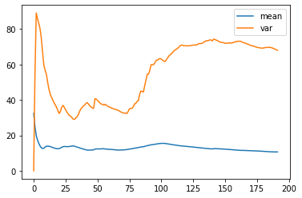

It can be seen from the figure that the mean does not change much, but the variance varies greatly. We say that such data are poorly stationary; conversely, if the data is stationary, the change in its mean and variance will have nothing to do with time.

In other words, if the data distribution has a particular trend over time, it has no stationarity. If the data distribution does not change over time, while the mean and variance remain fixed, it has stationarity. The information on stationarity helps find a suitable model and predict future values.

There are at least two common ways to check whether data is stationary:

1. Augmented Dickey Fuller (ADF) test: Using the [unit root test](https://en.wikipedia.org/wiki/Unit_root_test)，the data are stationary if the *p-value* < 0.05.
2. Kwiatkowski-Phillips-Schmidt-Shin (KPSS) test: Contrary to the ADF test, if *p-value* < 0.05, the data is not stationary.

```python
# ADF Test
result = adfuller(data.PM25.values, autolag='AIC')
print(f'ADF Statistic: {result[0]}')
print(f'p-value: {result[1]}')
for key, value in result[4].items():
    print('Critial Values:')
    print(f'   {key}, {value}')

# KPSS Test
result = kpss(data.PM25.values, regression='c')
print('\nKPSS Statistic: %f' % result[0])
print('p-value: %f' % result[1])
for key, value in result[3].items():
    print('Critial Values:')
    print(f'   {key}, {value}')
```

```
ADF Statistic: -2.7026194088541704
p-value: 0.07358609270498144
Critial Values:
   1%, -3.4654311561944873
Critial Values:
   5%, -2.8769570530458792
Critial Values:
   10%, -2.574988319755886

KPSS Statistic: 0.620177
p-value: 0.020802
Critial Values:
   10%, 0.347
Critial Values:
   5%, 0.463
Critial Values:
   2.5%, 0.574
Critial Values:
   1%, 0.739
```

If we take the sample data we use as an example, the *p-value* obtained by the ADF test is 0.073, so the information is not stationary. To achieve stationarity, we next differentiate the data, subtract the i-1th data from the i-th data, and use the obtained results to test again.

In the data format of the dataframe, we can directly use `data.diff()` to differentiate the data and name the differentiated data as `data_diff`.

```python
data_diff = data.diff()
data_diff
```

```
                         PM25
timestamp	
2020-06-10 00:00:00	NaN
2020-06-10 01:00:00	-14.700000
2020-06-10 02:00:00	-8.100000
2020-06-10 03:00:00	0.200000
2020-06-10 04:00:00	-1.900000
...	...
2020-06-17 19:00:00	0.750000
2020-06-17 20:00:00	4.875000
2020-06-17 21:00:00	-3.375000
2020-06-17 22:00:00	1.930556
2020-06-17 23:00:00	3.944444
```

We can see that the first data is *Nan* because the first data cannot be subtracted from the previous data, so we have to discard the first data.

```python
data_diff = data_diff[1:]
data_diff
```

```
                         PM25
timestamp	
2020-06-10 01:00:00	-14.700000
2020-06-10 02:00:00	-8.100000
2020-06-10 03:00:00	0.200000
2020-06-10 04:00:00	-1.900000
2020-06-10 05:00:00	-1.300000
...	...
2020-06-17 19:00:00	0.750000
2020-06-17 20:00:00	4.875000
2020-06-17 21:00:00	-3.375000
2020-06-17 22:00:00	1.930556
2020-06-17 23:00:00	3.944444
```

Then we plot the data to observe the relationship between the mean and variance of the data after differentiation over time.

```python
nmp = data_diff.PM25.to_numpy()
size = np.size(nmp)

nmp_mean = np.zeros(size)
nmp_var = np.zeros(size)
for i in range(size):
  nmp_mean[i] = nmp[:i+1].mean()
  nmp_var[i] = nmp[:i+1].var()

y1 = nmp_mean[:]
y2 = nmp_var[:]
y3 = nmp
x = np.arange(size)
plt.plot(x, y1, label='mean')
plt.plot(x, y2, label='var')
plt.legend()
plt.show()
```

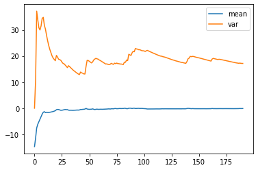

From the above results, we find that the change in the mean is still small, while the change in the variance becomes smaller. We then repeat the above stationarity evaluation steps:

```python
# PM25
# ADF Test
result = adfuller(data_diff.PM25.values, autolag='AIC')
print(f'ADF Statistic: {result[0]}')
print(f'p-value: {result[1]}')
for key, value in result[4].items():
    print('Critial Values:')
    print(f'   {key}, {value}')

# KPSS Test
result = kpss(data_diff.PM25.values, regression='c')
print('\nKPSS Statistic: %f' % result[0])
print('p-value: %f' % result[1])
for key, value in result[3].items():
    print('Critial Values:')
    print(f'   {key}, {value}')
```

```
ADF Statistic: -13.350457196046884
p-value: 5.682260865619701e-25
Critial Values:
   1%, -3.4654311561944873
Critial Values:
   5%, -2.8769570530458792
Critial Values:
   10%, -2.574988319755886

KPSS Statistic: 0.114105
p-value: 0.100000
Critial Values:
   10%, 0.347
Critial Values:
   5%, 0.463
Critial Values:
   2.5%, 0.574
Critial Values:
   1%, 0.739
```

After the test, the *p-value* of the ADF test is 5.68e-25, which shows that the data after a difference is stationary, and this result will be used in the subsequent prediction model in the following.

## Data Forecast

After data preprocessing, we demonstrate using different prediction models to predict time series data. We will use  [ARIMA](https://otexts.com/fpp2/arima.html), [SARIMAX](https://www.statsmodels.org/stable/examples/notebooks/generated/statespace_sarimax_stata.html), [auto_arima](https://alkaline-ml.com/pmdarima/modules/generated/pmdarima.arima.auto_arima.html), [Prophet](https://facebook.github.io/prophet/), [LSTM](https://en.wikipedia.org/wiki/Long_short-term_memory), and [Holt-Winter](https://otexts.com/fpp2/holt-winters.html) models.

### ARIMA

The ARIMA model is an extended version of the ARMA model, so we first introduce the ARMA model and split the ARMA model into two parts, namely:

1. Autoregressive model (AR): Use a parameter `p` and make a linear combination of the previous *p* historical values to predict the current value.
2. Moving average model (MA): Use a parameter `q` and make a linear combination of the previous *q* prediction errors using the AR model to predict the current value.

The ARIMA model uses one more parameter, `d`, than the ARMA model. If the data is not stationary, it needs to be differentiated, and the parameter `d` represents the number of times to be differentiated.

Below we use air quality data to conduct an exercise. First, we plot the data to select the piece of data to use:

```python
air_hour.loc['2020-06-01':'2020-06-30']['PM25'].plot(figsize=(12, 8))
```

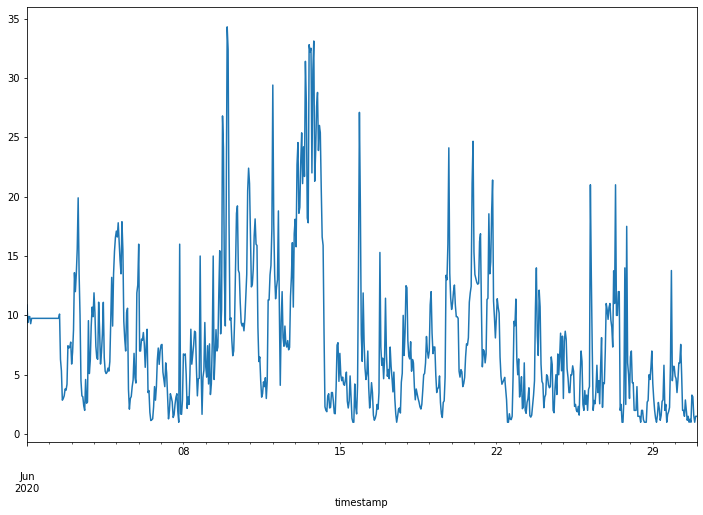

We select a piece of data that we want to use and divide the data into two parts:

1. Train data: used to train the model and find the most suitable parameters.
2. Test data: used to evaluate the model's accuracy in data prediction.

In our following example, we set the length of the test data to be 48 hours (`train_len=-48`) and the training data to be all the data minus the last 48 hours.

```python
data_arima = air_hour.loc['2020-06-17':'2020-06-21']
train_len = -48
train = data_arima.iloc[:train_len]
test = data_arima.iloc[train_len:]
```

We first evaluate the stationarity of this piece of data. Then we determine the value of the `d` parameter by the number of differentiations required.

```python
# Run Dicky-Fuller test
result = adfuller(train)

# Print test statistic
print('The test stastics:', result[0])

# Print p-value
print("The p-value:",result[1])
```

```
The test stastics: -3.1129543556288826
The p-value: 0.025609243615341074
```

Since the *p-value* is already smaller than 0.05, we can continue exploring the parameters `p` and `q` in the ARIMA model without differentiations (`d`=0). We take a simple method to combine the possible combinations of `p` and `q`, respectively, and determine the parameter values by evaluating the quality of the resulting models.

We can use the [AIC](https://en.wikipedia.org/wiki/Akaike_information_criterion) or [BIC](https://en.wikipedia.org/wiki/Bayesian_information_criterion) method to evaluate whether the model fits the training data. Generally speaking, the smaller the judged value, the better the effect of the model. For example, we first limit the range of `p` and `q` between 0 and 2 so that there are nine possible combinations. Then, we check the values of AIC and BIC, respectively, and use the combination of `p` and `q` with the smallest value as the decision value of the parameters.

```python
warnings.filterwarnings('ignore')
order_aic_bic =[]

# Loop over p values from 0-2
for p in range(3):
    # Loop over q values from 0-2
    for q in range(3):
      
        try:
            # create and fit ARMA(p,q) model
            model = sm.tsa.statespace.SARIMAX(train['PM25'], order=(p, 0, q))
            results = model.fit()
            
            # Print order and results
            order_aic_bic.append((p, q, results.aic, results.bic))            
        except:
            print(p, q, None, None)
            
# Make DataFrame of model order and AIC/BIC scores
order_df = pd.DataFrame(order_aic_bic, columns=['p', 'q', 'aic','bic'])

# lets sort them by AIC and BIC

# Sort by AIC
print("Sorted by AIC ")
# print("\n")
print(order_df.sort_values('aic').reset_index(drop=True))

# Sort by BIC
print("Sorted by BIC ")
# print("\n")
print(order_df.sort_values('bic').reset_index(drop=True))
```

```
Sorted by AIC 
   p  q         aic         bic
0  1  0  349.493661  354.046993
1  1  1  351.245734  358.075732
2  2  0  351.299268  358.129267
3  1  2  352.357930  361.464594
4  2  1  353.015921  362.122586
5  2  2  353.063243  364.446574
6  0  2  402.213407  409.043405
7  0  1  427.433962  431.987294
8  0  0  493.148188  495.424854
Sorted by BIC 
   p  q         aic         bic
0  1  0  349.493661  354.046993
1  1  1  351.245734  358.075732
2  2  0  351.299268  358.129267
3  1  2  352.357930  361.464594
4  2  1  353.015921  362.122586
5  2  2  353.063243  364.446574
6  0  2  402.213407  409.043405
7  0  1  427.433962  431.987294
8  0  0  493.148188  495.424854
```

We found that when `(p,q) = (1,0)`, the values of AIC and BIC are the smallest, representing the best configuration of the model. Therefore, we set the three parameters `p`, `d`, and `q` to 1, 0, and 0, respectively, and then started training the model.

```python
# Instantiate model object
model = ARIMA(train, order=(1,0,0))

# Fit model
results = model.fit()
print(results.summary())
results.plot_diagnostics(figsize=(10, 10))
```

```
                               SARIMAX Results
==============================================================================
Dep. Variable:                   PM25   No. Observations:                   72
Model:                 ARIMA(1, 0, 0)   Log Likelihood                -168.853
Date:                Fri, 26 Aug 2022   AIC                            343.706
Time:                        05:01:13   BIC                            350.536
Sample:                    06-17-2020   HQIC                           346.425
                         - 06-19-2020
Covariance Type:                  opg
==============================================================================
                 coef    std err          z      P>|z|      [0.025      0.975]
------------------------------------------------------------------------------
const          6.3774      1.959      3.255      0.001       2.537      10.218
ar.L1          0.7792      0.047     16.584      0.000       0.687       0.871
sigma2         6.2934      0.746      8.438      0.000       4.832       7.755
===================================================================================
Ljung-Box (L1) (Q):                   0.08   Jarque-Bera (JB):                76.49
Prob(Q):                              0.77   Prob(JB):                         0.00
Heteroskedasticity (H):               2.30   Skew:                             1.44
Prob(H) (two-sided):                  0.05   Kurtosis:                         7.15
===================================================================================

```

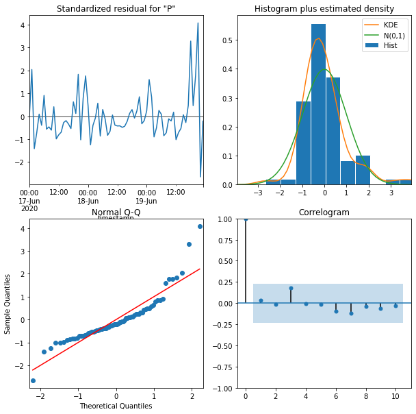

We then use the test data to make predictions and evaluate the accuracy of the predictions. From the resulting graph, we can find that the curve of the data prediction result is too smooth, which is very different from the actual value. If you observe the changing trend of the overall data, you will find that the raw data itself fluctuates regularly, but ARIMA can only predict the trend of the data. If you want to predict the data's value accurately, there is still a considerable gap in the results.

```python
data_arima['forecast'] = results.predict(start=24*5-48, end=24*5)
data_arima[['PM25', 'forecast']].plot(figsize=(12, 8))
```

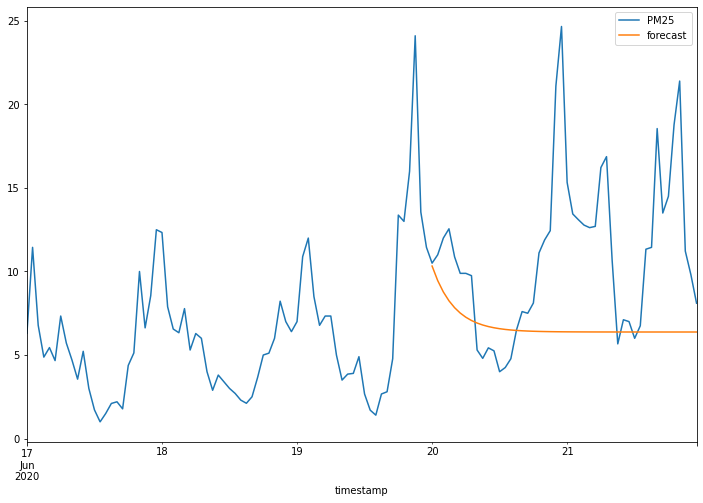

### SARIMAX

```python
data_sarimax = air_hour.loc['2020-06-17':'2020-06-21']
train_len = -48
train = data_sarimax.iloc[:train_len]
test = data_sarimax.iloc[train_len:]
```

We next introduce the SARIMAX model. The SARIMAX model has seven parameters, `p`, `d`, `q`, `P`, `D`, `Q`, `s`. These parameters can be divided into two groups: the first group is `order=(p, d, q)`, and they are the same as the parameters of the ARIMA model; the other group is `seasonal_order=(P, D, Q, s)`, and they are the periodic AR model parameters, the periodic differentiation times, the periodic MA model parameters, and the periodic length.

| 參數 | 說明 |
| --- | --- |
| p | AR 模型參數 |
| d | 達到平穩性所需要的差分次數 |
| q | MA 模型參數 |
| P | 週期性的 AR 模型參數 |
| D | 週期上達到平穩性所需要的差分次數 |
| Q | 週期性的 MA 模型參數 |
| s | 週期長度 |

Since the previous observations demonstrated that these data generally have a periodic change of about 24 hours, we set `s=24` and use the following commands to build the model.

```python
# Instantiate model object
model = SARIMAX(train, order=(1,0,0), seasonal_order=(0, 1, 0, 24))

# Fit model
results = model.fit()
print(results.summary())
results.plot_diagnostics(figsize=(10, 10))
```

```
                                     SARIMAX Results
==========================================================================================
Dep. Variable:                               PM25   No. Observations:                   72
Model:             SARIMAX(1, 0, 0)x(0, 1, 0, 24)   Log Likelihood                -121.463
Date:                            Fri, 26 Aug 2022   AIC                            246.926
Time:                                    05:01:26   BIC                            250.669
Sample:                                06-17-2020   HQIC                           248.341
                                     - 06-19-2020
Covariance Type:                              opg
==============================================================================
                 coef    std err          z      P>|z|      [0.025      0.975]
------------------------------------------------------------------------------
ar.L1          0.6683      0.069      9.698      0.000       0.533       0.803
sigma2         9.1224      1.426      6.399      0.000       6.328      11.917
===================================================================================
Ljung-Box (L1) (Q):                   0.11   Jarque-Bera (JB):                 5.70
Prob(Q):                              0.75   Prob(JB):                         0.06
Heteroskedasticity (H):               2.03   Skew:                             0.42
Prob(H) (two-sided):                  0.17   Kurtosis:                         4.46
===================================================================================

```

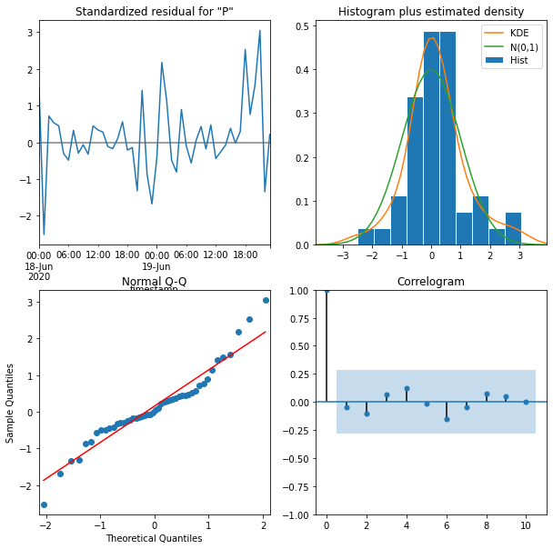

Next, we make predictions using the test data and visualize the prediction results. Although the SARIMA model's prediction results still have room to improve, they are already much better than the ARIMA model.

```python
data_sarimax['forecast'] = results.predict(start=24*5-48, end=24*5)
data_sarimax[['PM25', 'forecast']].plot(figsize=(12, 8))
```


### auto_arima

We use the [pmdarima](https://pypi.org/project/pmdarima/) Python package, which is similar to the `auto.arima` model in R. The package can automatically find the most suitable ARIMA model parameters, increasing users' convenience when using ARIMA models. The `pmdarima.ARIMA` object in the `pmdarima` package currently contains three models: ARMA, ARIMA, and SARIMAX. When using the `pmdarima.auto_arima` method, as long as the parameters `p`, `q,` `P`, and `Q` ranges are provided, the most suitable parameter combination is found within the specified range.

Next, we will implement how to use `pmdarima.auto_arima`, and first divide the data set into training data and test data:

```python
data_autoarima = air_hour.loc['2020-06-17':'2020-06-21']
train_len = -48
train = data_autoarima.iloc[:train_len]
test = data_autoarima.iloc[train_len:]
```

For the four parameters `p`, `q`, `P`, `Q`, we use `start` and `max` to specify the corresponding ranges. We also set the periodic parameter `seasonal` to True and the periodic variable `m` to 24 hours. Then we can directly get the best model parameter combination and model fitting results.

```python
results = pm.auto_arima(train,start_p=0, d=0, start_q=0, max_p=5, max_d=5, max_q=5, start_P=0, D=1, start_Q=0, max_P=5, max_D=5, max_Q=5, m=24, seasonal=True, error_action='warn', trace = True, supress_warnings=True, stepwise = True, random_state=20, n_fits = 20)
print(results.summary())
```

```
Performing stepwise search to minimize aic
 ARIMA(0,0,0)(0,1,0)[24] intercept   : AIC=268.023, Time=0.04 sec
 ARIMA(1,0,0)(1,1,0)[24] intercept   : AIC=247.639, Time=0.85 sec
 ARIMA(0,0,1)(0,1,1)[24] intercept   : AIC=250.711, Time=0.79 sec
 ARIMA(0,0,0)(0,1,0)[24]             : AIC=271.305, Time=0.04 sec
 ARIMA(1,0,0)(0,1,0)[24] intercept   : AIC=247.106, Time=0.09 sec
 ARIMA(1,0,0)(0,1,1)[24] intercept   : AIC=247.668, Time=0.45 sec
 ARIMA(1,0,0)(1,1,1)[24] intercept   : AIC=inf, Time=2.63 sec
 ARIMA(2,0,0)(0,1,0)[24] intercept   : AIC=249.013, Time=0.15 sec
 ARIMA(1,0,1)(0,1,0)[24] intercept   : AIC=248.924, Time=0.21 sec
 ARIMA(0,0,1)(0,1,0)[24] intercept   : AIC=250.901, Time=0.11 sec
 ARIMA(2,0,1)(0,1,0)[24] intercept   : AIC=250.579, Time=0.30 sec
 ARIMA(1,0,0)(0,1,0)[24]             : AIC=246.926, Time=0.06 sec
 ARIMA(1,0,0)(1,1,0)[24]             : AIC=247.866, Time=0.28 sec
 ARIMA(1,0,0)(0,1,1)[24]             : AIC=247.933, Time=0.31 sec
 ARIMA(1,0,0)(1,1,1)[24]             : AIC=inf, Time=2.35 sec
 ARIMA(2,0,0)(0,1,0)[24]             : AIC=248.910, Time=0.08 sec
 ARIMA(1,0,1)(0,1,0)[24]             : AIC=248.893, Time=0.09 sec
 ARIMA(0,0,1)(0,1,0)[24]             : AIC=252.779, Time=0.08 sec
 ARIMA(2,0,1)(0,1,0)[24]             : AIC=250.561, Time=0.17 sec

Best model:  ARIMA(1,0,0)(0,1,0)[24]
Total fit time: 9.122 seconds
                                     SARIMAX Results
==========================================================================================
Dep. Variable:                                  y   No. Observations:                   72
Model:             SARIMAX(1, 0, 0)x(0, 1, 0, 24)   Log Likelihood                -121.463
Date:                            Fri, 26 Aug 2022   AIC                            246.926
Time:                                    05:01:37   BIC                            250.669
Sample:                                06-17-2020   HQIC                           248.341
                                     - 06-19-2020
Covariance Type:                              opg
==============================================================================
                 coef    std err          z      P>|z|      [0.025      0.975]
------------------------------------------------------------------------------
ar.L1          0.6683      0.069      9.698      0.000       0.533       0.803
sigma2         9.1224      1.426      6.399      0.000       6.328      11.917
===================================================================================
Ljung-Box (L1) (Q):                   0.11   Jarque-Bera (JB):                 5.70
Prob(Q):                              0.75   Prob(JB):                         0.06
Heteroskedasticity (H):               2.03   Skew:                             0.42
Prob(H) (two-sided):                  0.17   Kurtosis:                         4.46
===================================================================================
```

Finally, we use the best model found for data prediction, and plot the prediction results and test data on the same graph in the form of an overlay. Since the best model found this time is the SARIMAX model just introduced, the results of both predictors are roughly the same.

```python
results.predict(n_periods=10)
```

```
2020-06-20 00:00:00    10.371336
2020-06-20 01:00:00    13.142043
2020-06-20 02:00:00    13.505843
2020-06-20 03:00:00     9.506395
2020-06-20 04:00:00     7.450378
2020-06-20 05:00:00     7.782850
2020-06-20 06:00:00     7.633757
2020-06-20 07:00:00     5.200781
2020-06-20 08:00:00     3.634188
2020-06-20 09:00:00     3.946824
Freq: H, dtype: float64
```

```python
data_autoarima['forecast']= pd.DataFrame(results.predict(n_periods=48), index=test.index)
data_autoarima[['PM25', 'forecast']].plot(figsize=(12, 8))
```

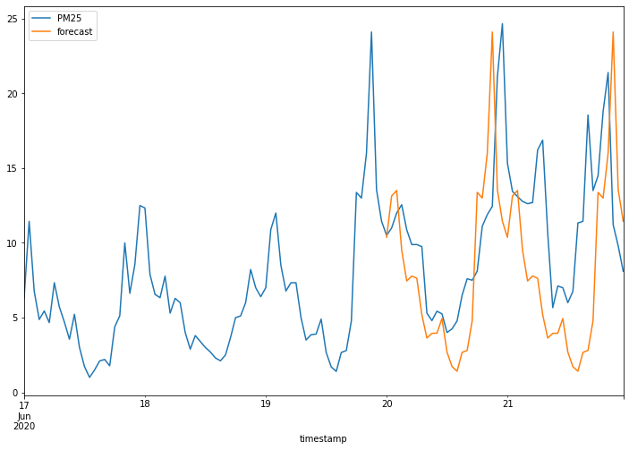

### Prophet

Next, we use the [Prophet](https://facebook.github.io/prophet/) model provided in the kats suite for data prediction. This model is proposed by Facebook's data science team, and it is good at predicting periodic time series data and can tolerate missing data, data shift, and outliers.

We first divide the dataset into training and prediction data and observe the changes in the training data by drawing.

```python
data_prophet = air_hour.loc['2020-06-17':'2020-06-21']
train_len = -48
train = data_prophet.iloc[:train_len]
test = data_prophet.iloc[train_len:]

trainData = TimeSeriesData(train.reset_index(), time_col_name='timestamp')
trainData.plot(cols=["PM25"])
```


We then use `ProphetParams` to set the Prophet model's parameters and the training data and parameters to initialize the `ProphetModel`. Then we use the `fit` method to build the model and use the `predict` method to predict the data, and then we can get the final prediction result.

```python
# Specify parameters
params = ProphetParams(seasonality_mode="multiplicative")

# Create a model instance
m = ProphetModel(trainData, params)

# Fit mode
m.fit()

# Forecast
fcst = m.predict(steps=48, freq="H")
data_prophet['forecast'] = fcst[['time','fcst']].set_index('time')
fcst
```

```
                 time	    fcst	fcst_lower fcst_upper
0	2020-06-20 00:00:00	14.705192	12.268361	17.042476
1	2020-06-20 01:00:00	15.089580	12.625568	17.573396
2	2020-06-20 02:00:00	14.921077	12.459802	17.411335
3	2020-06-20 03:00:00	13.846131	11.444988	16.200284
4	2020-06-20 04:00:00	12.278140	9.863531	14.858334
5	2020-06-20 05:00:00	10.934739	8.372450	13.501025
6	2020-06-20 06:00:00	10.126712	7.654647	12.658054
7	2020-06-20 07:00:00	9.535067	7.034313	11.762639
8	2020-06-20 08:00:00	8.661877	6.255147	11.132732
9	2020-06-20 09:00:00	7.424133	5.055052	9.770750
10	2020-06-20 10:00:00	6.229786	3.640543	8.625856
11	2020-06-20 11:00:00	5.464764	3.039011	7.939283
12	2020-06-20 12:00:00	4.998005	2.692023	7.550191
13	2020-06-20 13:00:00	4.334771	1.961382	6.506875
14	2020-06-20 14:00:00	3.349172	1.059836	5.768178
15	2020-06-20 15:00:00	2.819902	0.399350	5.226658
16	2020-06-20 16:00:00	4.060070	1.556264	6.322976
17	2020-06-20 17:00:00	7.792830	5.331987	10.237182
18	2020-06-20 18:00:00	13.257767	10.873149	15.542380
19	2020-06-20 19:00:00	18.466805	15.895210	20.874602
20	2020-06-20 20:00:00	21.535994	19.150397	23.960260
21	2020-06-20 21:00:00	22.005943	19.509141	24.691836
22	2020-06-20 22:00:00	21.014449	18.610361	23.661906
23	2020-06-20 23:00:00	20.191905	17.600568	22.868388
24	2020-06-21 00:00:00	20.286952	17.734177	22.905280
25	2020-06-21 01:00:00	20.728067	18.235829	23.235212
26	2020-06-21 02:00:00	20.411124	17.755181	22.777073
27	2020-06-21 03:00:00	18.863739	16.261775	21.315573
28	2020-06-21 04:00:00	16.661351	13.905466	19.374726
29	2020-06-21 05:00:00	14.781150	12.401465	17.499478
30	2020-06-21 06:00:00	13.637436	11.206142	16.239831
31	2020-06-21 07:00:00	12.793609	9.940829	15.319559
32	2020-06-21 08:00:00	11.580455	9.059603	14.261605
33	2020-06-21 09:00:00	9.891025	7.230943	12.471543
34	2020-06-21 10:00:00	8.271552	5.840853	10.677227
35	2020-06-21 11:00:00	7.231671	4.829449	9.733231
36	2020-06-21 12:00:00	6.592515	4.108251	9.107216
37	2020-06-21 13:00:00	5.699548	3.288052	8.019402
38	2020-06-21 14:00:00	4.389985	1.848621	6.825121
39	2020-06-21 15:00:00	3.685033	1.196467	6.150064
40	2020-06-21 16:00:00	5.289956	2.907623	8.012851
41	2020-06-21 17:00:00	10.124029	7.397842	12.676256
42	2020-06-21 18:00:00	17.174959	14.670539	19.856592
43	2020-06-21 19:00:00	23.856724	21.102924	26.712359
44	2020-06-21 20:00:00	27.746195	24.636118	30.673178
45	2020-06-21 21:00:00	28.276321	25.175013	31.543197
46	2020-06-21 22:00:00	26.932054	23.690073	29.882014
47	2020-06-21 23:00:00	25.811943	22.960132	28.912079
```

```python
data_prophet
```

```
          timestamp		  PM25	forecast
2020-06-17 00:00:00	6.300000	NaN
2020-06-17 01:00:00	11.444444	NaN
2020-06-17 02:00:00	6.777778	NaN
2020-06-17 03:00:00	4.875000	NaN
2020-06-17 04:00:00	5.444444	NaN
...	...	...
2020-06-21 19:00:00	18.777778	23.856724
2020-06-21 20:00:00	21.400000	27.746195
2020-06-21 21:00:00	11.222222	28.276321
2020-06-21 22:00:00	9.800000	26.932054
2020-06-21 23:00:00	8.100000	25.811943
```

We use the built-in drawing method of `ProphetModel` to draw the training data (black curve) and prediction results (blue curve).

```python
m.plot()
```

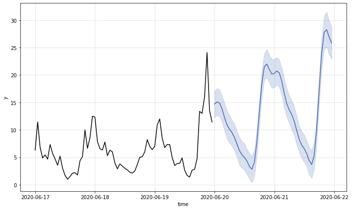

To evaluate the correctness of the prediction results, we also use another drawing method to draw the training data (black curve), test data (black curve), and prediction results (blue curve) at the same time. The figure shows that the blue and black curves are roughly consistent in the changing trend and value range, and overall the data prediction results are satisfactory.

```python
fig, ax = plt.subplots(figsize=(12, 7))

train.plot(ax=ax, label='train', color='black')
test.plot(ax=ax, color='black')
fcst.plot(x='time', y='fcst', ax=ax, color='blue')

ax.fill_between(test.index, fcst['fcst_lower'], fcst['fcst_upper'], alpha=0.1)
ax.get_legend().remove()
```

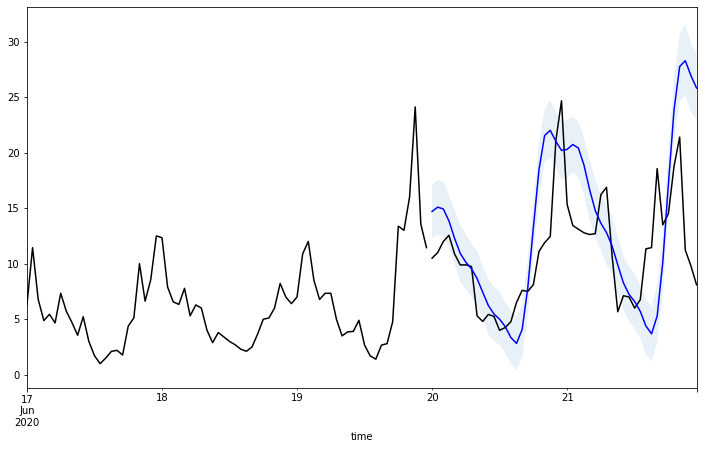

### LSTM

Next, we introduce the Long Short-Term Memory (LSTM) model for data prediction. The LSTM model is a predictive model suitable for continuous data because it will generate different long-term and short-term memories for data at different times and use it to predict the final result. Currently, the LSTM model is provided in the kats package, so we can directly use the syntax similar to using the Prophet model.

We first divide the dataset into training and prediction data and observe the changes in the training data by drawing.

```python
data_lstm = air_hour.loc['2020-06-17':'2020-06-21']
train_len = -48
train = data_lstm.iloc[:train_len]
test = data_lstm.iloc[train_len:]

trainData = TimeSeriesData(train.reset_index(), time_col_name='timestamp')
trainData.plot(cols=["PM25"])
```


Then we select the parameters of the LSTM model in order, namely the number of training times (`num_epochs`), the time length of data read in at one time (`time_window`), and the number of neural network layers related to long-term and short-term memory (`hidden_size`). Then you can directly perform model training and data prediction.

```python
params = LSTMParams(
    hidden_size=10, # number of hidden layers
    time_window=24,
    num_epochs=30
)
m = LSTMModel(trainData, params)
m.fit()

fcst = m.predict(steps=48, freq="H")
data_lstm['forecast'] = fcst[['time', 'fcst']].set_index('time')
fcst
```

```
                 time	    fcst	fcst_lower	fcst_upper
0	2020-06-20 00:00:00	11.905971	11.310672	12.501269
1	2020-06-20 01:00:00	10.804338	10.264121	11.344554
2	2020-06-20 02:00:00	9.740741	9.253704	10.227778
3	2020-06-20 03:00:00	8.696406	8.261586	9.131226
4	2020-06-20 04:00:00	7.656923	7.274077	8.039769
5	2020-06-20 05:00:00	6.608442	6.278019	6.938864
6	2020-06-20 06:00:00	5.543790	5.266600	5.820979
7	2020-06-20 07:00:00	4.469023	4.245572	4.692474
8	2020-06-20 08:00:00	3.408312	3.237897	3.578728
9	2020-06-20 09:00:00	2.411980	2.291381	2.532578
10	2020-06-20 10:00:00	1.564808	1.486567	1.643048
11	2020-06-20 11:00:00	0.982147	0.933040	1.031255
12	2020-06-20 12:00:00	0.792612	0.752981	0.832242
13	2020-06-20 13:00:00	1.105420	1.050149	1.160691
14	2020-06-20 14:00:00	1.979013	1.880062	2.077964
15	2020-06-20 15:00:00	3.408440	3.238018	3.578862
16	2020-06-20 16:00:00	5.337892	5.070997	5.604786
17	2020-06-20 17:00:00	7.659332	7.276365	8.042299
18	2020-06-20 18:00:00	10.104147	9.598940	10.609355
19	2020-06-20 19:00:00	12.047168	11.444809	12.649526
20	2020-06-20 20:00:00	12.880240	12.236228	13.524252
21	2020-06-20 21:00:00	12.748750	12.111312	13.386187
22	2020-06-20 22:00:00	12.128366	11.521947	12.734784
23	2020-06-20 23:00:00	11.311866	10.746273	11.877459
24	2020-06-21 00:00:00	10.419082	9.898128	10.940036
25	2020-06-21 01:00:00	9.494399	9.019679	9.969119
26	2020-06-21 02:00:00	8.551890	8.124296	8.979485
27	2020-06-21 03:00:00	7.592260	7.212647	7.971873
28	2020-06-21 04:00:00	6.613075	6.282421	6.943729
29	2020-06-21 05:00:00	5.614669	5.333936	5.895402
30	2020-06-21 06:00:00	4.605963	4.375664	4.836261
31	2020-06-21 07:00:00	3.611552	3.430974	3.792129
32	2020-06-21 08:00:00	2.679572	2.545593	2.813550
33	2020-06-21 09:00:00	1.887442	1.793070	1.981814
34	2020-06-21 10:00:00	1.340268	1.273255	1.407282
35	2020-06-21 11:00:00	1.156494	1.098669	1.214318
36	2020-06-21 12:00:00	1.440240	1.368228	1.512252
37	2020-06-21 13:00:00	2.251431	2.138859	2.364002
38	2020-06-21 14:00:00	3.592712	3.413076	3.772347
39	2020-06-21 15:00:00	5.415959	5.145161	5.686757
40	2020-06-21 16:00:00	7.613187	7.232528	7.993847
41	2020-06-21 17:00:00	9.918564	9.422636	10.414493
42	2020-06-21 18:00:00	11.755348	11.167580	12.343115
43	2020-06-21 19:00:00	12.576593	11.947764	13.205423
44	2020-06-21 20:00:00	12.489052	11.864599	13.113504
45	2020-06-21 21:00:00	11.915885	11.320090	12.511679
46	2020-06-21 22:00:00	11.133274	10.576610	11.689938
47	2020-06-21 23:00:00	10.264495	9.751270	10.777719
```

We also use the built-in drawing method of `LSTMModel` to draw the training data (black curve) and prediction results (blue curve).

```python
m.plot()
```

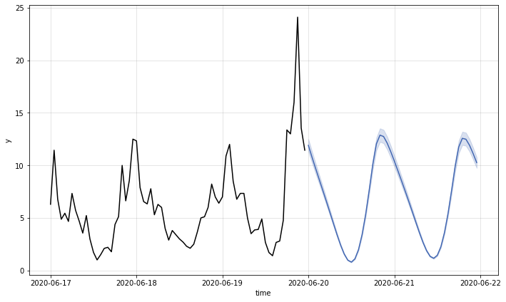

To evaluate the correctness of the prediction results, we also use another drawing method to draw the training data (black curve), test data (black curve), and prediction results (blue curve) at the same time. The figure shows that the blue and black curves are roughly consistent in the changing trend and value range, but overall, the data prediction result (blue curve) is slightly lower than the test data (black curve).

```python
fig, ax = plt.subplots(figsize=(12, 7))

train.plot(ax=ax, label='train', color='black')
test.plot(ax=ax, color='black')
fcst.plot(x='time', y='fcst', ax=ax, color='blue')

ax.fill_between(test.index, fcst['fcst_lower'], fcst['fcst_upper'], alpha=0.1)
ax.get_legend().remove()
```

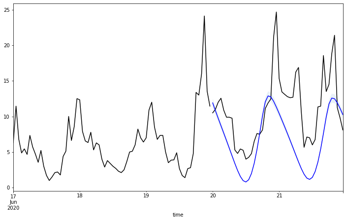

### Holt-Winter

We also use the Holt-Winter model provided by the kats package, a method that uses moving averages to assign weights to historical data for data forecasting. We first divide the dataset into training and prediction data and observe the changes in the training data by drawing.

```python
data_hw = air_hour.loc['2020-06-17':'2020-06-21']
train_len = -48
train = data_hw.iloc[:train_len]
test = data_hw.iloc[train_len:]

trainData = TimeSeriesData(train.reset_index(), time_col_name='timestamp')
trainData.plot(cols=["PM25"])
```

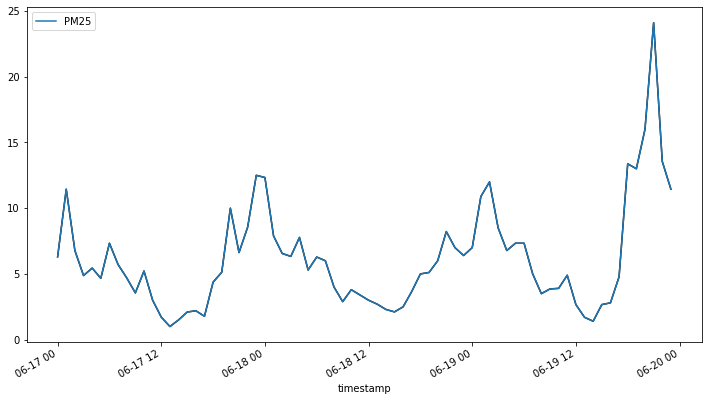

Then we need to set the parameters of the Holt-Winter model, which are to select whether to use addition or multiplication to decompose the time series data (the following example uses multiplication, `mul`), and the length of the period (the following example uses 24 hours). Then we can perform model training and data prediction.

```python
warnings.simplefilter(action='ignore')

# Specify parameters
params = HoltWintersParams(
            trend="mul",
            seasonal="mul",
            seasonal_periods=24,
        )

# Create a model instance
m = HoltWintersModel(
    data=trainData, 
    params=params)

# Fit mode
m.fit()

# Forecast
fcst = m.predict(steps=48, freq='H')
data_hw['forecast'] = fcst[['time', 'fcst']].set_index('time')
fcst
```

```
                   time	    fcst
72	2020-06-20 00:00:00	14.140232
73	2020-06-20 01:00:00	14.571588
74	2020-06-20 02:00:00	12.797056
75	2020-06-20 03:00:00	10.061594
76	2020-06-20 04:00:00	9.927476
77	2020-06-20 05:00:00	8.732691
78	2020-06-20 06:00:00	10.257460
79	2020-06-20 07:00:00	8.169070
80	2020-06-20 08:00:00	6.005400
81	2020-06-20 09:00:00	5.038056
82	2020-06-20 10:00:00	6.391835
83	2020-06-20 11:00:00	5.435677
84	2020-06-20 12:00:00	3.536135
85	2020-06-20 13:00:00	2.725477
86	2020-06-20 14:00:00	2.588198
87	2020-06-20 15:00:00	2.967987
88	2020-06-20 16:00:00	3.329448
89	2020-06-20 17:00:00	4.409821
90	2020-06-20 18:00:00	10.295263
91	2020-06-20 19:00:00	10.587033
92	2020-06-20 20:00:00	14.061718
93	2020-06-20 21:00:00	18.597275
94	2020-06-20 22:00:00	12.040684
95	2020-06-20 23:00:00	12.124081
96	2020-06-21 00:00:00	13.522973
97	2020-06-21 01:00:00	13.935499
98	2020-06-21 02:00:00	12.238431
99	2020-06-21 03:00:00	9.622379
100	2020-06-21 04:00:00	9.494116
101	2020-06-21 05:00:00	8.351486
102	2020-06-21 06:00:00	9.809694
103	2020-06-21 07:00:00	7.812468
104	2020-06-21 08:00:00	5.743248
105	2020-06-21 09:00:00	4.818132
106	2020-06-21 10:00:00	6.112815
107	2020-06-21 11:00:00	5.198396
108	2020-06-21 12:00:00	3.381773
109	2020-06-21 13:00:00	2.606503
110	2020-06-21 14:00:00	2.475216
111	2020-06-21 15:00:00	2.838426
112	2020-06-21 16:00:00	3.184109
113	2020-06-21 17:00:00	4.217320
114	2020-06-21 18:00:00	9.845847
115	2020-06-21 19:00:00	10.124881
116	2020-06-21 20:00:00	13.447887
117	2020-06-21 21:00:00	17.785455
118	2020-06-21 22:00:00	11.515076
119	2020-06-21 23:00:00	11.594832
```

We also use the built-in drawing method of `HoltWintersModel` to draw the training data (black curve) and prediction results (blue curve).

```python
m.plot()
```

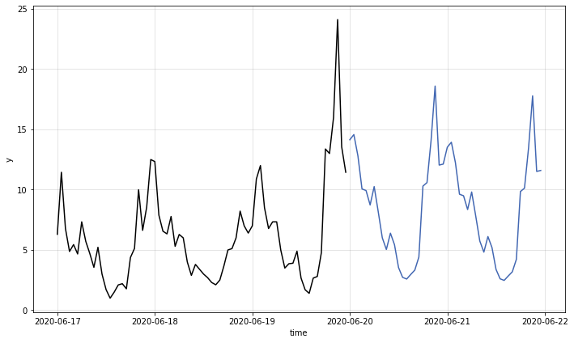

To evaluate the correctness of the prediction results, we also use another drawing method to draw the training data (black curve), test data (black curve), and prediction results (blue curve) at the same time. The figure shows that the blue and black curves are roughly consistent in the changing trend and value range. Still, overall, the data prediction result (blue curve) responds slightly slower to the rising slope than the test data (black curve).

```python
fig, ax = plt.subplots(figsize=(12, 7))

train.plot(ax=ax, label='train', color='black')
test.plot(ax=ax, color='black')
fcst.plot(x='time', y='fcst', ax=ax, color='blue')

# ax.fill_between(test.index, fcst['fcst_lower'], fcst['fcst_upper'], alpha=0.1)
ax.get_legend().remove()
```


### Comparison

Finally, to facilitate observation and comparison, we will draw the prediction results of the six models introduced in the figure below simultaneously (Note: You must first run all the codes of the above prediction models to see the results of these six prediction models). We can observe and compare the prediction accuracy of the six models under different time intervals and curve change characteristics, which is convenient for users to decide on the final model selection and possible future applications.

```python
fig, axes = plt.subplots(nrows=3, ncols=2, figsize=(12, 8))

data_arima[['PM25', 'forecast']].plot(ax=axes[0, 0], title='ARIMA')
data_sarimax[['PM25', 'forecast']].plot(ax=axes[1, 0], title='SARIMAX')
data_autoarima[['PM25', 'forecast']].plot(ax=axes[2, 0], title='auto_arima')
data_prophet[['PM25', 'forecast']].plot(ax=axes[0, 1], title='Prophet')
data_lstm[['PM25', 'forecast']].plot(ax=axes[1, 1], title='LSTM')
data_hw[['PM25', 'forecast']].plot(ax=axes[2, 1], title='Holt-Winter')

fig.tight_layout(pad=1, w_pad=2, h_pad=5)
```

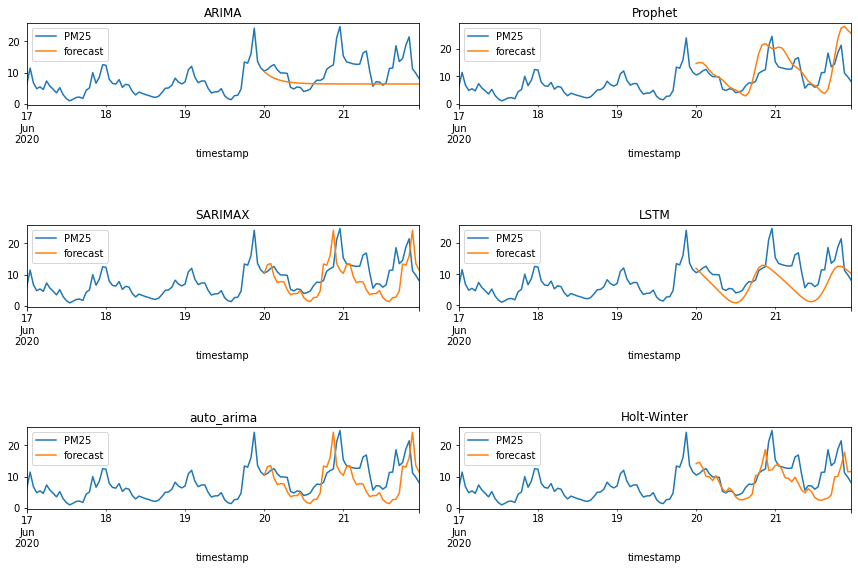

## References

- Civil IoT Taiwan: Historical Data ([https://history.colife.org.tw/](https://history.colife.org.tw/#/))
- Rob J Hyndman and George Athanasopoulos, Forecasting: Principles and Practice, 3rd edition ([https://otexts.com/fpp3/](https://otexts.com/fpp3/))
- Stationarity, NIST Engineering Statistics Handbook ([https://www.itl.nist.gov/div898/handbook/pmc/section4/pmc442.htm](https://www.itl.nist.gov/div898/handbook/pmc/section4/pmc442.htm))
- Unit root test - Wikipedia ([https://en.wikipedia.org/wiki/Unit_root_test](https://en.wikipedia.org/wiki/Unit_root_test))
- Akaike information criterion (AIC) - Wikipedia ([https://en.wikipedia.org/wiki/Akaike_information_criterion](https://en.wikipedia.org/wiki/Akaike_information_criterion))
- Bayesian information criterion (BIC) - Wikipedia ([https://en.wikipedia.org/wiki/Bayesian_information_criterion](https://en.wikipedia.org/wiki/Bayesian_information_criterion))
- ARIMA models ([https://otexts.com/fpp2/arima.html](https://otexts.com/fpp2/arima.html))
- SARIMAX: Introduction ([https://www.statsmodels.org/stable/examples/notebooks/generated/statespace_sarimax_stata.html](https://www.statsmodels.org/stable/examples/notebooks/generated/statespace_sarimax_stata.html))
- Prophet: Forecasting at scale ([https://facebook.github.io/prophet/](https://facebook.github.io/prophet/))
- Long short-term memory (LSTM) – Wikipedia ([https://en.wikipedia.org/wiki/Long_short-term_memory](https://en.wikipedia.org/wiki/Long_short-term_memory))
- Time Series Forecasting with ARIMA Models In Python [Part 1] | by Youssef Hosni | May, 2022 | Towards AI ([https://pub.towardsai.net/time-series-forecasting-with-arima-models-in-python-part-1-c2940a7dbc48?gi=264dc7630363](https://pub.towardsai.net/time-series-forecasting-with-arima-models-in-python-part-1-c2940a7dbc48?gi=264dc7630363))
- Time Series Forecasting with ARIMA Models In Python [Part 2] | by Youssef Hosni | May, 2022 | Towards AI ([https://pub.towardsai.net/time-series-forecasting-with-arima-models-in-python-part-2-91a30d10efb0](https://pub.towardsai.net/time-series-forecasting-with-arima-models-in-python-part-2-91a30d10efb0))
- Kats: a Generalizable Framework to Analyze Time Series Data in Python | by Khuyen Tran | Towards Data Science ([https://towardsdatascience.com/kats-a-generalizable-framework-to-analyze-time-series-data-in-python-3c8d21efe057](https://towardsdatascience.com/kats-a-generalizable-framework-to-analyze-time-series-data-in-python-3c8d21efe057))
- Kats - Time Series Forecasting By Facebook | by Himanshu Sharma | MLearning.ai | Medium ([https://medium.com/mlearning-ai/kats-time-series-forecasting-by-facebook-a2741794d814](https://medium.com/mlearning-ai/kats-time-series-forecasting-by-facebook-a2741794d814))
