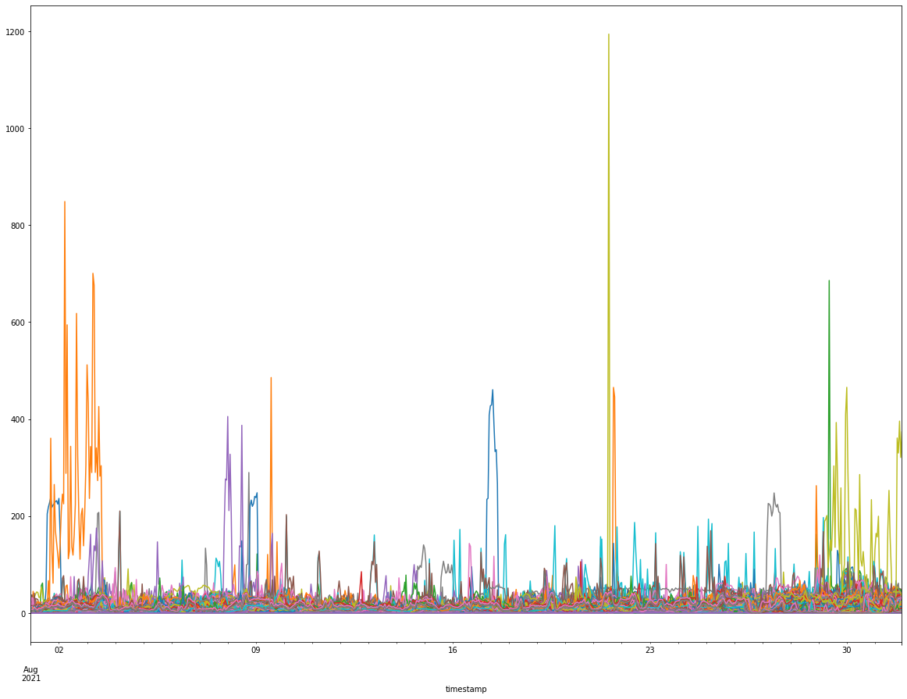
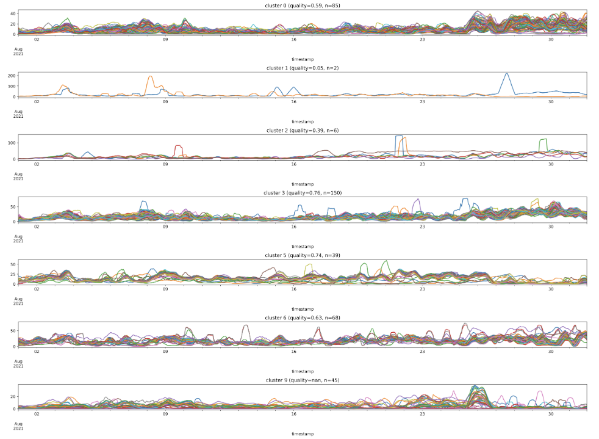
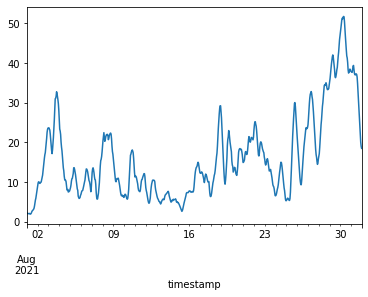
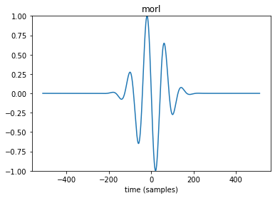

[](https://colab.research.google.com/drive/1n01pJ_3HlUN3iOru3G1E9onkUlSfu-Z6?usp=sharing)



集群分析 (Cluster Analysis) 是資料科學中常見的資料處理方法，其主要目的是被用來找出資料中相似的群聚，透過集群分析後，將性質相近的資料群聚在一起，以方便使用者可以針對特徵相似的資料進行更深入的分析與處理。在民生公共物聯網的開放資料中，由於每一種感測器的資料都是時序性的資料，為了將為數眾多的感測器進行適當的分群，以利更深入的資料分析，我們在這個單元將介紹時序資料在分群時常使用的特徵擷取方法，以及在集群分析時常使用到的分群方法。

## 章節目標

- 學習使用快速傅立葉轉換 (FFT) 與小波轉換 (Wavelet) 擷取時序資料的特徵
- 採用非監督式學習的方法，針對時序資料進行分群

## 套件安裝與引用

在本章節中，我們將會使用到 pandas, numpy, matplotlib, pywt 等 Colab 開發平台已預先安裝好的套件，以及另外一個 Colab 並未預先安裝的套件 tslearn ，需使用下列的方式自行安裝：

```python
!pip install --upgrade pip
!pip install tslearn
```

待安裝完畢後，即可使用下列的語法先行引入相關的套件，完成本章節的準備工作：

```python
import numpy as np
import pandas as pd
import pywt
import os, zipfile
import matplotlib.pyplot as plt

from datetime import datetime, timedelta
from numpy.fft import fft, ifft
from pywt import cwt
from tslearn.clustering import TimeSeriesKMeans
```

## 讀取資料與資料預處理 (Preprocessing)

由於我們這次要使用的是長時間的歷史資料，因此我們不直接使用 pyCIOT 套件的讀取資料功能，而直接從民生公共物聯網資料平台的歷史資料庫下載「中研院校園空品微型感測器」的 2021 年歷史資料，並存入 Air 資料夾中。

```python
!mkdir Air CSV_Air
!wget -O Air/2021.zip -q "https://history.colife.org.tw/?r=/download&path=L%2Bepuuawo%2BWTgeizqi%2FkuK3noJTpmaJf5qCh5ZyS56m65ZOB5b6u5Z6L5oSf5ris5ZmoLzIwMjEuemlw"
!unzip Air/2021.zip -d Air
```

同時，由於所下載的資料是 zip 壓縮檔案的格式，我們需要先將其解壓縮，產生每日資料的壓縮檔案。由於我們在接下來的範例中只會使用到 2021/08 的資料，因此我們將 202108 子資料夾中的檔案進行解壓縮，讀取當中 csv 檔的資料，再存入 `air_month` 這個 dataframe 中。

```python
folder = 'Air/2021/202108'
extension_zip = 'zip'
extension_csv = 'csv'

for item in os.listdir(folder):
  if item.endswith(extension_zip):
    file_name = f'{folder}/{item}'
    zip_ref = zipfile.ZipFile(file_name)
    zip_ref.extractall(folder)
    zip_ref.close()

air_month = pd.DataFrame()
for item in os.listdir(folder):
  if item.endswith(extension_csv):
    file_name = f'{folder}/{item}'
    df = pd.read_csv(file_name, parse_dates=['timestamp'])
    air_month = air_month.append(df)
air_month.set_index('timestamp', inplace=True)
air_month.sort_values(by='timestamp', inplace=True)
```

目前 `air_month` 的格式還不符合我們的需求，需要先將其整理成以站點資料為欄，以時間資料為列的資料格式。我們先找出資料中共有多少站點，並將這些站點資訊存在一個序列中。

```python
id_list = air_month['device_id'].to_numpy()
id_uniques = np.unique(id_list)
id_uniques
```

```
array(['08BEAC07D3E2', '08BEAC09FF12', '08BEAC09FF22', ...,
       '74DA38F7C648', '74DA38F7C64A', '74DA38F7C64C'], dtype=object)
```

接著我們將每個站點的資料存成一個欄，並放入 `air` 這個 dataframe 中。最後我們將所有下載的資料與解壓縮後產生的資料移除，以節省雲端的儲存空間。

```python
air = pd.DataFrame()
for i in range(len(id_uniques)):
  # print('device_id=="' + id_uniques[i] + '"')
  query = air_month.query('device_id=="' + id_uniques[i] + '"')
  query.sort_values(by='timestamp', inplace=True)
  query_mean = query.resample('H').mean()
  query_mean.rename(columns={'PM25': id_uniques[i]}, inplace=True)
  air = pd.concat([air, query_mean], axis=1)

!rm -rf Air
```

我們可以用下列的語法快速查看 air 的內容。

```python
air.info()
print(air.head())
```

```
<class 'pandas.core.frame.DataFrame'>
DatetimeIndex: 745 entries, 2021-08-01 00:00:00 to 2021-09-01 00:00:00
Freq: H
Columns: 1142 entries, 08BEAC07D3E2 to 74DA38F7C64C
dtypes: float64(1142)
memory usage: 6.5 MB
                     08BEAC07D3E2  08BEAC09FF12  08BEAC09FF22  08BEAC09FF2A  \
timestamp                                                                     
2021-08-01 00:00:00      2.272727      1.250000     16.818182     12.100000   
2021-08-01 01:00:00      1.909091      1.285714     13.181818     14.545455   
2021-08-01 02:00:00      2.000000      1.125000     12.727273     16.600000   
2021-08-01 03:00:00      2.083333      3.000000     11.800000     12.090909   
2021-08-01 04:00:00      2.000000      2.600000     10.090909      8.545455   

                     08BEAC09FF34  08BEAC09FF38  08BEAC09FF42  08BEAC09FF44  \
timestamp                                                                     
2021-08-01 00:00:00      2.727273      0.000000      1.181818           NaN   
2021-08-01 01:00:00      2.000000      0.545455      0.909091           NaN   
2021-08-01 02:00:00      4.090909      1.583333      0.636364           NaN   
2021-08-01 03:00:00      0.545455      1.454545      1.181818           NaN   
2021-08-01 04:00:00      1.363636      1.363636      2.454545           NaN   

                     08BEAC09FF46  08BEAC09FF48  ...  74DA38F7C62A  \
timestamp                                        ...                 
2021-08-01 00:00:00      2.636364      2.545455  ...      6.777778   
2021-08-01 01:00:00      1.636364      2.272727  ...      7.800000   
2021-08-01 02:00:00      1.400000      3.100000  ...      7.300000   
2021-08-01 03:00:00      2.181818      4.000000  ...     12.000000   
2021-08-01 04:00:00      1.909091      2.100000  ...      9.000000   

                     74DA38F7C630  74DA38F7C632  74DA38F7C634  74DA38F7C63C  \
timestamp                                                                     
2021-08-01 00:00:00      9.800000     13.200000           5.0      6.200000   
2021-08-01 01:00:00     13.000000     15.700000           5.2      6.800000   
2021-08-01 02:00:00     12.800000     19.300000           5.0      7.300000   
2021-08-01 03:00:00      8.444444     15.200000           5.1      6.777778   
2021-08-01 04:00:00      6.500000     10.222222           4.9      6.100000   

                     74DA38F7C63E  74DA38F7C640  74DA38F7C648  74DA38F7C64A  \
timestamp                                                                     
2021-08-01 00:00:00           NaN      7.500000      5.000000      9.000000   
2021-08-01 01:00:00           NaN     10.200000      4.900000      6.600000   
2021-08-01 02:00:00           NaN     10.500000      3.666667      7.600000   
2021-08-01 03:00:00           NaN      8.500000      8.400000      8.000000   
2021-08-01 04:00:00           NaN      5.571429      6.200000      5.666667   

                     74DA38F7C64C  
timestamp                          
2021-08-01 00:00:00      7.600000  
2021-08-01 01:00:00      7.700000  
2021-08-01 02:00:00      7.888889  
2021-08-01 03:00:00      6.400000  
2021-08-01 04:00:00      5.000000  
```

接下來，我們首先將資料中有資料缺漏的部分 (數值為 Nan) 予以刪除，並且先將資料繪製成圖形，觀察資料的分布狀況。

```python
air = air[:-1]
air_clean = air.dropna(1, how='any') # 將具有Nan值的欄位捨棄
air_clean.plot(figsize=(20, 15), legend=None)
```



由於原始資料中感測器的瞬間數值容易因為環境變化而有瞬間劇烈的變動，因此我們使用移動平均的方式，將每十次的感測值進行移動平均，讓處理過的資料可以較為平順並反映感測器周遭的整體趨勢，以方便進入接下來的集群分析。

```python
air_clean = air_clean.rolling(window=10, min_periods=1).mean() # 使用移動平均使曲線變化更為平順
air_clean.plot(figsize=(20, 15), legend=None)
```


## 資料分群 / 集群分析 (Clustering)

由於目前 dataframe 內的資料儲存是將每一個測站的資料分別放在獨立的一欄 (column) 中，而將每一列 (row) 存放特定時間點所有站點的感測器數值，此種資料格式較適合作以時間為主軸的時序資料處理與分析，但是對於我們接下來要進行的資料分群，反而需要改成以測站為主軸進行資料處理，因此我們在開始之前，需要先將現有資料進行轉製 (transpose)，也就是將資料的欄與列交換，然後才能進入資料分群。

資料分群已是一項十分普遍的資料科學方法，在許多常見的資料分群方法中，我們選用 tslearn 套件所提供的 KMeans 分群方法 (TimeSeriesKMeans)，在機器學習的領域中，把這類的方法歸類為一種「非監督式學習」的方法，因為在分群的過程中並沒有一定的標準將資料歸為某一群，而是只利用資料彼此間的相似度決定分群，因此後續若要找出離群值或進行預測也更為方便。

KMeans 分群法的內部運作大致分為下列幾個步驟：

1. 先決定 *k* 的值，亦即最後要分成幾個群；
2. 隨機 *k* 筆資料，當為起始的 k 個群的中心點 (又稱「群心」)；
3. 根據距離公式計算每筆資料到每個群心的距離，並選擇最近的群心，將該筆資料歸屬到該群；
4. 針對每個群，重新計算其新的群心，並重複上述步驟，直到 *k* 的群的群心不再有變動為止。

我們先設定 *k*=10，並使用 `TimeSeriesKMeans`，將資料分為 10 群 (0~9) 如下：

```python
air_transpose = air_clean.transpose()
model = TimeSeriesKMeans(n_clusters=10, metric="dtw", max_iter=5) # n_cluster:分群數量, max_iter: 分群的步驟最多重複幾次
pre = model.fit(air_transpose)
pre.labels_
```

```
array([3, 3, 6, 3, 3, 3, 3, 6, 9, 6, 3, 6, 3, 3, 3, 3, 3, 1, 3, 3, 6, 3,
3, 3, 3, 6, 6, 6, 6, 3, 3, 3, 3, 3, 3, 3, 3, 3, 6, 3, 9, 3, 3, 3,
3, 3, 6, 3, 2, 6, 3, 2, 3, 3, 3, 6, 9, 3, 3, 3, 3, 6, 6, 3, 3, 3,
6, 6, 3, 3, 3, 3, 3, 6, 3, 6, 3, 3, 3, 3, 3, 6, 6, 3, 3, 3, 6, 3,
3, 3, 6, 3, 3, 3, 3, 3, 3, 6, 9, 6, 7, 3, 2, 3, 6, 3, 3, 3, 6, 3,
3, 3, 3, 6, 3, 3, 3, 6, 3, 6, 6, 3, 6, 3, 3, 3, 3, 6, 3, 3, 3, 3,
3, 3, 3, 3, 3, 3, 3, 0, 3, 6, 3, 3, 3, 0, 6, 0, 6, 3, 0, 3, 3, 3,
6, 6, 6, 6, 3, 3, 6, 3, 3, 9, 6, 3, 6, 3, 6, 6, 3, 2, 3, 3, 3, 6,
9, 6, 6, 3, 3, 6, 3, 0, 3, 3, 6, 6, 6, 3, 0, 0, 6, 3, 6, 6, 6, 3,
6, 6, 3, 0, 3, 3, 0, 3, 3, 6, 3, 6, 6, 6, 3, 0, 3, 0, 0, 0, 9, 0,
0, 0, 0, 0, 0, 0, 0, 0, 0, 9, 9, 9, 9, 0, 0, 0, 9, 9, 0, 0, 0, 4,
9, 9, 9, 9, 0, 0, 0, 0, 0, 0, 0, 9, 0, 9, 0, 0, 0, 9, 9, 0, 9, 0,
0, 0, 5, 0, 0, 0, 0, 9, 9, 0, 1, 0, 9, 2, 9, 9, 0, 0, 5, 0, 9, 0,
9, 0, 0, 0, 3, 0, 0, 0, 0, 0, 3, 2, 3, 3, 0, 3, 0, 0, 0, 6, 3, 0,
8, 9, 3, 9, 9, 0, 5, 0, 3, 0, 9, 9, 5, 5, 5, 3, 5, 9, 3, 0, 0, 3,
0, 0, 0, 3, 5, 5, 3, 0, 5, 6, 5, 5, 5, 0, 9, 0, 6, 6, 6, 3, 0, 3,
5, 5, 9, 6, 3, 0, 0, 0, 0, 3, 5, 0, 5, 5, 0, 3, 3, 9, 5, 5, 9, 5,
9, 9, 9, 9, 5, 5, 5, 5, 5, 5, 9, 5, 5, 5, 5, 5, 5, 5, 5, 5, 9, 5,
5, 5])
```

由於分群的結果有可能因為少數感測器擁有特殊的資料特徵而自成一個群集，而這些感測器其實可以被視為偏離測站，並沒有進一步分析的價值，因此我們下一步便要先統計一下每一個分離出來的群集，其內部感測器的個數是否只有一個，如果是的話，便將該群集捨棄掉。例如在這個範例中，我們便會捨棄掉其中只有一個感測器的群集如下：

```python
# build helper df to map metrics to their cluster labels
df_cluster = pd.DataFrame(list(zip(air_clean.columns, pre.labels_)), columns=['metric', 'cluster'])

# make some helper dictionaries and lists
cluster_metrics_dict = df_cluster.groupby(['cluster'])['metric'].apply(lambda x: [x for x in x]).to_dict()
cluster_len_dict = df_cluster['cluster'].value_counts().to_dict()
clusters_dropped = [cluster for cluster in cluster_len_dict if cluster_len_dict[cluster]==1]
clusters_final = [cluster for cluster in cluster_len_dict if cluster_len_dict[cluster]>1]
clusters_final.sort()

clusters_dropped
```

```
[7, 4, 8]
```

最後，我們將剩下的群集分別用繪圖的方式展示，可以發現每一個群集內的資料皆呈現極高的相似度，而不同群集的資料，彼此則呈現明顯可分辨的差異。為了量化群集內資料的相似度，我們定義一個新的變數 `qualiuty`，且這個變數的值等於內部每筆資料與其他資料的相關性 (correlation) 的平均值，且 `quality` 的值越低代表這個群集內部的資料越相似。

```python
fig, axes = plt.subplots(nrows=len(clusters_final), ncols=1, figsize=(20, 15), dpi=500)
# legend = axes.legend(loc="upper left", bbox_to_anchor=(1.02, 0, 0.07, 1))
for idx, cluster_number in enumerate(clusters_final):
  x_corr = air_clean[cluster_metrics_dict[cluster_number]].corr().abs().values
  x_corr_mean = round(x_corr[np.triu_indices(x_corr.shape[0],1)].mean(),2)
  plot_title = f'cluster {cluster_number} (quality={x_corr_mean}, n={cluster_len_dict[cluster_number]})'
  air_clean[cluster_metrics_dict[cluster_number]].plot(ax=axes[idx], title=plot_title)
  axes[idx].get_legend().remove()

fig.tight_layout()
plt.show()
```



到目前為止，我們已經展示如何使用空品感測的資料，針對資料內的特徵資訊進行資料分群，然而由於原始資料中夾雜許多的雜訊干擾，因此在分群上的表現仍有所不足。為了減少原始資料中的雜訊干擾，我們以下介紹兩種常用的進階方法：傅立葉轉換 (Fourier transform)、小波轉換 (wavelet transform)，分別提取時序資料的進階特徵後，再用來進行資料分群，可以更有效提升感測器分群的成效。

### 快速傅立葉轉換 (Fast Fourier Transform)

傅立葉轉換 (Fourier Transform) 是一種常用的信號分析方法，能將原始資料由時域 (time domain) 轉換至頻域 (frequency domain) ，以方便更進一步的特徵擷取與資料分析，常見於工程與數學領域，以及聲音與時序資料的分析。由於標準的傅立葉轉換牽涉到複雜的數學運算，在實作上較為複雜費時，因此後來發展出將原始資料離散化的快速傅立葉轉換方法，可以大幅減少傅立葉轉換的運算複雜度，特別適用於大量數據資料的處理；因此在我們接下來的主題中，將使用快速傅立葉轉換的方法，來協助資料分群所需要的資料特徵的擷取。

我們首先針對單一測站 (‘`08BEAC07D3E2`’) 透過繪圖的方式，觀察其在時域下的變化圖。

```python
air_clean['08BEAC07D3E2'].plot() # 畫出id=08BEAC07D3E2的測站資料
```



接著我們使用 numpy 套件中的快速傅立葉轉換工具 `fft`，將測站的資料輸入進行轉換，並用繪圖的方式觀察轉換到頻域後的資料分佈狀況。

```python
X = fft(air_clean['08BEAC07D3E2'])
N = len(X)
n = np.arange(N)
# get the sampling rate
sr = 1 / (60*60)
T = N/sr
freq = n/T 

# Get the one-sided specturm
n_oneside = N//2
# get the one side frequency
f_oneside = freq[:n_oneside]

plt.figure(figsize = (12, 6))
plt.plot(f_oneside, np.abs(X[:n_oneside]), 'b')
plt.xlabel('Freq (Hz)')
plt.ylabel('FFT Amplitude |X(freq)|')
plt.show()
```


然後我們將相同的轉換步驟，擴及到所有的感測器，並且將所有感測器完成快速傅立葉轉換後的結果，儲存在 `air_fft` 變數中。

```python
air_fft = pd.DataFrame()
col_names = list(air_clean.columns)
for name in col_names:
  X = fft(air_clean[name])
  N = len(X)
  n = np.arange(N)
  # get the sampling rate
  sr = 1 / (60*60)
  T = N/sr
  freq = n/T 

  # Get the one-sided specturm
  n_oneside = N//2
  # get the one side frequency
  f_oneside = freq[:n_oneside]
  air_fft[name] = np.abs(X[:n_oneside])
print(air_fft.head())
```

```
08BEAC07D3E2  08BEAC09FF22  08BEAC09FF2A  08BEAC09FF42  08BEAC09FF48  \
0  12019.941563  11255.762431  13241.408211  12111.740447  11798.584351   
1   3275.369377   2640.372699   1501.672853   3096.493565   3103.006928   
2   1109.613670   1201.362571    257.659947   1085.384353   1128.373457   
3   2415.899146   1631.128345    888.838822   2281.597031   2301.936400   
4   1130.973327    446.032078    411.940722   1206.512460   1042.054041   

   08BEAC09FF66  08BEAC09FF80  08BEAC09FF82  08BEAC09FF8C  08BEAC09FF9C  ...  \
0  12441.845754  11874.390693  12259.096742   3553.255916  13531.649701  ...   
1   3262.357287   2999.042917   1459.720167   1109.764942    646.846038  ...   
2   1075.877632   1005.445596    478.569869    368.572815   1163.425916  ...   
3   2448.646527   2318.870954    956.029693    272.486798    553.409732  ...   
4   1087.461354   1172.755489    437.920193    471.824176    703.557830  ...   

   74DA38F7C504  74DA38F7C514  74DA38F7C524  74DA38F7C554  74DA38F7C5BA  \
0  11502.841221  10589.689400  11220.068048  10120.220198  11117.146124   
1   2064.762890   1407.105290   1938.647888   1126.088084   2422.787262   
2   2163.528535   1669.014077   2054.586664   1759.326882   1782.523300   
3   1564.407983   1157.759192   1253.849261   1244.799149   1519.477057   
4   1484.232397   1177.909914   1318.704021   1106.349846   1373.167639   

   74DA38F7C5BC  74DA38F7C5E0  74DA38F7C60C  74DA38F7C62A  74DA38F7C648  
0  11243.094213     26.858333   9408.414826  11228.246949   8931.871618  
1   2097.343959     15.020106   1667.485473   1687.251179   1395.239491  
2   1806.524987     10.659603   1585.987276   1851.628868   1527.925427  
3   1521.392873      6.021244   1217.547879   1240.173667   1022.239794  
4   1393.469185      3.361938   1161.975844   1350.756178   1051.434944  

[5 rows x 398 columns]
```

我們接著使用和前面相同的方法，使用 `TimeSeriesKMeans` 針對已轉換到頻域的感測器資料分成 10 個群集，並將分群後只有單一感測器的群集予以刪除，在這個範例中，最後會剩下 9 個群集，我們把每個感測器所屬的群集代碼列印出來。

```python
fft_transpose = air_fft.transpose() # 將資料行列交換以符合分群模型輸入的需求
model = TimeSeriesKMeans(n_clusters=10, metric="dtw", max_iter=5)
pre = model.fit(fft_transpose)

# build helper df to map metrics to their cluster labels
df_cluster = pd.DataFrame(list(zip(air_fft.columns, pre.labels_)), columns=['metric', 'cluster'])

# make some helper dictionaries and lists
cluster_metrics_dict = df_cluster.groupby(['cluster'])['metric'].apply(lambda x: [x for x in x]).to_dict()
cluster_len_dict = df_cluster['cluster'].value_counts().to_dict()
clusters_dropped = [cluster for cluster in cluster_len_dict if cluster_len_dict[cluster]==1]
clusters_final = [cluster for cluster in cluster_len_dict if cluster_len_dict[cluster]>1]
clusters_final.sort()

print(df_cluster.head(10))
```

```
         metric  cluster
0  08BEAC07D3E2        7
1  08BEAC09FF22        3
2  08BEAC09FF2A        0
3  08BEAC09FF42        7
4  08BEAC09FF48        7
5  08BEAC09FF66        7
6  08BEAC09FF80        7
7  08BEAC09FF82        0
8  08BEAC09FF8C        2
9  08BEAC09FF9C        8
```

最後，我們把九個群集的感測器資料分別繪製出來，可以發現每個群集內的感測器在頻域上的資料皆有極度的相似性，同時不同群集的感測器在頻域上的資料彼此相異程度，亦明顯比同群集內的感測器資料差異度為大。

```python
fig, axes = plt.subplots(nrows=len(clusters_final), ncols=1, figsize=(20, 15), dpi=500)
for idx, cluster_number in enumerate(clusters_final):
  x_corr = air_fft[cluster_metrics_dict[cluster_number]].corr().abs().values
  x_corr_mean = round(x_corr[np.triu_indices(x_corr.shape[0],1)].mean(),2)
  plot_title = f'cluster {cluster_number} (quality={x_corr_mean}, n={cluster_len_dict[cluster_number]})'
  air_fft[cluster_metrics_dict[cluster_number]].plot(ax=axes[idx], title=plot_title)
  axes[idx].get_legend().remove()

fig.tight_layout()
plt.show()
```


### 小波轉換 (Wavelet Transform)

除了傅立葉轉換外，小波轉換也是另一種將原始資料從時域轉換到頻域的常見手法，相較於傅立葉轉換，小波轉換可以提供更多頻域資料的觀察角度，因此近期無論在視訊、音訊、時序等相關的資料分析，已被廣泛地使用，並得到很好的效果。

我們使用 pywt 套件進行小波轉換的資料處理，由於小波轉換會使用到母小波來擷取時序資料中的特徵，因此我們先用下列的語法查看可使用的母小波名稱。

```python
wavlist = pywt.wavelist(kind="continuous")
print(wavlist)
```

```
['cgau1', 'cgau2', 'cgau3', 'cgau4', 'cgau5', 'cgau6', 'cgau7', 'cgau8', 'cmor', 'fbsp', 'gaus1', 'gaus2', 'gaus3', 'gaus4', 'gaus5', 'gaus6', 'gaus7', 'gaus8', 'mexh', 'morl', 'shan']
```

不同於傅立葉轉換只能看到頻率上的變化，小波轉換可以將有限長的母小波進行縮放並在一段資料上擷取特徵，而在挑選母小波時可以先將其作圖觀察後再做決定，若以 *morl* 母小波為例，我們可以使用下列的語法進行作圖。

```python
wav = pywt.ContinuousWavelet("morl")
scale = 1

int_psi, x = pywt.integrate_wavelet(wav, precision=10)
int_psi /= np.abs(int_psi).max()
wav_filter = int_psi[::-1]

nt = len(wav_filter)
t = np.linspace(-nt // 2, nt // 2, nt)
plt.plot(t, wav_filter.real)
plt.ylim([-1, 1])
plt.xlabel("time (samples)")
```



我們首先進行小波轉換的基本參數設定，並且使用 *morl* 母小波，針對所選定的感測器，將小波的縮放範圍設為 1~31 倍，進行小波轉換並作圖。

```python
# 參數設定
F = 1  #Samples per hour
hours = 744
nos = np.int(F*hours)  #No of samples in 31 days

x = air_clean['08BEAC09FF2A']
scales = np.arange(1, 31, 1)
coef, freqs = cwt(x, scales, 'morl')

# scalogram
plt.figure(figsize=(15, 10))
plt.imshow(abs(coef), extent=[0, 744, 30, 1], interpolation='bilinear', cmap='viridis',
           aspect='auto', vmax=abs(coef).max(), vmin=abs(coef).min())
plt.gca().invert_yaxis()
plt.yticks(np.arange(1, 31, 1))
plt.xticks(np.arange(0, nos/F, nos/(20*F)))
plt.ylabel("scales")
plt.xlabel("hour")
plt.colorbar()
plt.show()
```


整體而言，我們可以發現在圖中 scales 較大時的顏色較偏向黃綠色，代表擷取出來的特徵與母小波較為相近，反之則較偏向藍色，這些比對結果的特徵數值將會被用於接下來的資料分群。

不過，由於經過小波轉換後，每個測站的資料已經轉為二維的特徵數值，在開始進行資料分群前，我們需要先將原本二維資料的每一個欄位串接起來，變成一維的資料格式，並存入 `air_cwt` 變數中。

```python
air_cwt = pd.DataFrame()
scales = np.arange(28, 31, 2)
col_names = list(air_clean.columns)
for name in col_names:
  coef, freqs = cwt(air_clean[name], scales, 'morl')
  air_cwt[name] = np.abs(coef.reshape(coef.shape[0]*coef.shape[1]))

print(air_cwt.head())
```

```
08BEAC07D3E2  08BEAC09FF22  08BEAC09FF2A  08BEAC09FF42  08BEAC09FF48  \
0      0.778745      6.336664      2.137342      1.849035      0.778745   
1      0.929951      8.348031      2.977576      1.829540      0.958915   
2      1.190476     11.476048      3.223773      1.832544      1.292037   
3      1.227021     12.890554      4.488244      1.634717      1.338655   
4      1.252126     14.103178      5.715656      1.430744      1.376562   

   08BEAC09FF66  08BEAC09FF80  08BEAC09FF82  08BEAC09FF8C  08BEAC09FF9C  ...  \
0      0.555941      0.334225      8.110581      2.287378      0.409913  ...   
1      0.596532      0.201897      8.774271      1.706411      0.311242  ...   
2      0.771641      0.294242      8.327808      1.018296      2.754100  ...   
3      0.713931      0.065011      8.669036      0.249029      3.278048  ...   
4      0.670639      0.193083      8.795376      0.624988      3.628597  ...   

   74DA38F7C504  74DA38F7C514  74DA38F7C524  74DA38F7C554  74DA38F7C5BA  \
0      1.875873      1.090635      0.284901      1.111999      1.049112   
1      0.643478      1.446061      0.420701      0.974641      0.478931   
2      1.101801      2.404254      1.389941      1.190141      0.511454   
3      2.370436      2.510728      1.927692      0.703424      1.054164   
4      3.563873      2.387982      2.463458      0.098485      1.448078   

   74DA38F7C5BC  74DA38F7C5E0  74DA38F7C60C  74DA38F7C62A  74DA38F7C648  
0      1.107551      0.000918      0.080841      0.859855      0.415574  
1      0.245802      0.005389      1.053260      1.762642      0.190458  
2      1.162331      0.009754      2.667145      3.210326      0.516525  
3      1.993138      0.014496      3.669712      3.889207      0.666492  
4      2.672666      0.020433      4.482730      4.311888      0.677992  

[5 rows x 398 columns]
```

由於經過二維資料轉換成一維資料的程序，每筆資料的特徵數值數量因而增加，將造成後續資料運算的複雜度大幅提升，因此我們先只取前 100 個特徵數值做為每個感測器的代表性特徵，並以此套用 KMeans 方法進行資料分群。

由於小波轉換可以得到更細微的資料特徵，因此我們在資料分群的過程中，預設分為 20 個群集（讀者可自行測試不同的群集數目設定，觀察結果會產生哪些變化）；此外，我們對於分群結果也一樣先檢查是否存在只有單一感測器的小群集，並將其剔除，以避免少數特殊狀況的感測器，影響整體資料分群的結果。

```python
air_cwt_less = air_cwt.iloc[:, 0:101]

cwt_transpose = air_cwt_less.transpose() # 將資料行列交換以符合分群模型輸入的需求
model = TimeSeriesKMeans(n_clusters=20, metric="dtw", max_iter=10, verbose=1, n_jobs=-1)
pre = model.fit(cwt_transpose)

# build helper df to map metrics to their cluster labels
df_cluster = pd.DataFrame(list(zip(air_cwt.columns, pre.labels_)), columns=['metric', 'cluster'])

# make some helper dictionaries and lists
cluster_metrics_dict = df_cluster.groupby(['cluster'])['metric'].apply(lambda x: [x for x in x]).to_dict()
cluster_len_dict = df_cluster['cluster'].value_counts().to_dict()
clusters_dropped = [cluster for cluster in cluster_len_dict if cluster_len_dict[cluster]==1]
clusters_final = [cluster for cluster in cluster_len_dict if cluster_len_dict[cluster]>1]
clusters_final.sort()

print(df_cluster.head(10))
```

```
metric  cluster
0  08BEAC07D3E2        7
1  08BEAC09FF22        3
2  08BEAC09FF2A        6
3  08BEAC09FF42       10
4  08BEAC09FF48        7
5  08BEAC09FF66        7
6  08BEAC09FF80        7
7  08BEAC09FF82        6
8  08BEAC09FF8C       15
9  08BEAC09FF9C       19
```

在我們的範例中，經過上述的程序後，最後留下 14 個群集，我們將每個群集內的感測器原始資料一一繪出，我們可以發現相同群集內的感測器資料一致性更加明顯，同時不同群集間的差異也更加細緻明確，比之前使用原始資料或傅立葉轉換時的成效更為明顯。

```python
fig, axes = plt.subplots(nrows=len(clusters_final), ncols=1, figsize=(20, 15), dpi=500)
# legend = axes.legend(loc="upper left", bbox_to_anchor=(1.02, 0, 0.07, 1))
for idx, cluster_number in enumerate(clusters_final):
  x_corr = air_cwt[cluster_metrics_dict[cluster_number]].corr().abs().values
  x_corr_mean = round(x_corr[np.triu_indices(x_corr.shape[0],1)].mean(),2)
  plot_title = f'cluster {cluster_number} (quality={x_corr_mean}, n={cluster_len_dict[cluster_number]})'
  air_cwt[cluster_metrics_dict[cluster_number]].plot(ax=axes[idx], title=plot_title)
  axes[idx].get_legend().remove()

fig.tight_layout()
plt.show()
```


## 參考資料

- 民生公共物聯網歷史資料 ([https://history.colife.org.tw/](https://history.colife.org.tw/#/))
- Time Series Clustering — Deriving Trends and Archetypes from Sequential Data | by Denyse | Towards Data Science ([https://towardsdatascience.com/how-to-apply-k-means-clustering-to-time-series-data-28d04a8f7da3](https://towardsdatascience.com/how-to-apply-k-means-clustering-to-time-series-data-28d04a8f7da3))
- How to Apply K-means Clustering to Time Series Data | by Alexandra Amidon | Towards Data Science ([https://towardsdatascience.com/how-to-apply-k-means-clustering-to-time-series-data-28d04a8f7da3](https://towardsdatascience.com/how-to-apply-k-means-clustering-to-time-series-data-28d04a8f7da3))
- Understanding K-means Clustering: Hands-On with SciKit-Learn | by Carla Martins | May, 2022 | Towards AI ([https://pub.towardsai.net/understanding-k-means-clustering-hands-on-with-scikit-learn-b522c0698c81](https://pub.towardsai.net/understanding-k-means-clustering-hands-on-with-scikit-learn-b522c0698c81))
- Fast Fourier Transform. How to implement the Fast Fourier… | by Cory Maklin | Towards Data Science ([https://towardsdatascience.com/fast-fourier-transform-937926e591cb](https://towardsdatascience.com/fast-fourier-transform-937926e591cb))
- PyWavelets/pywt: PyWavelets - Wavelet Transforms in Python ([https://github.com/PyWavelets/pywt](https://github.com/PyWavelets/pywt))
