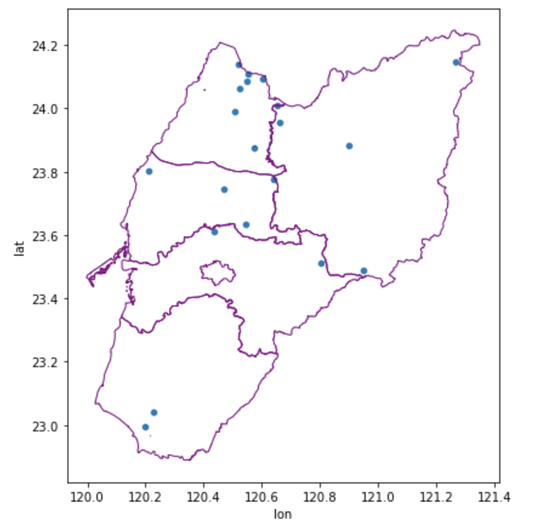
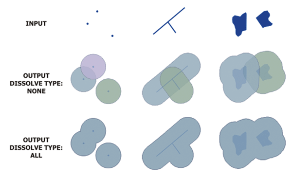
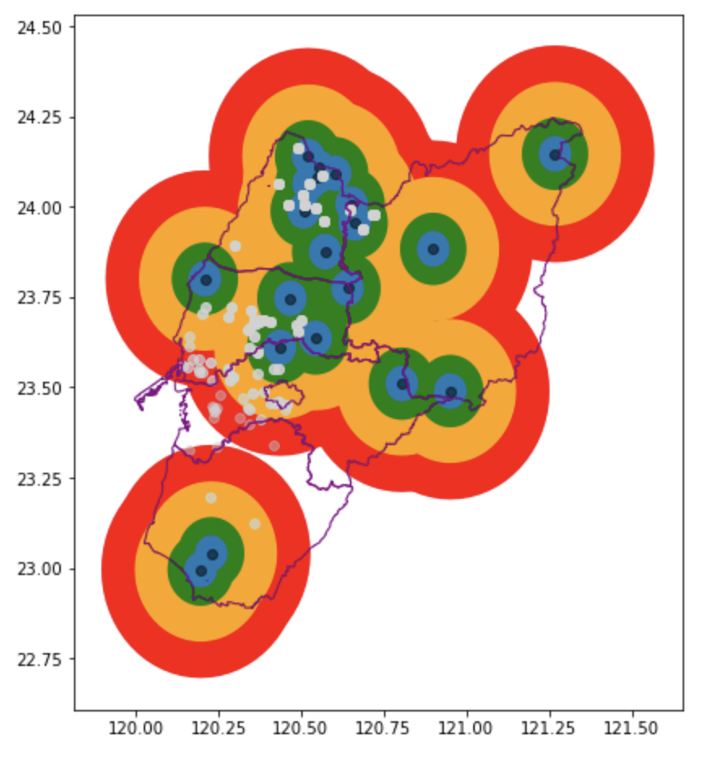
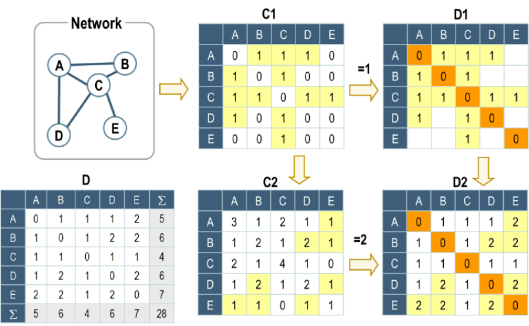
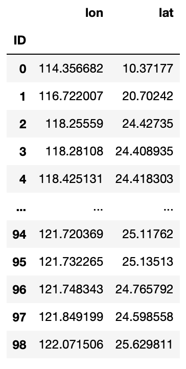

[](https://colab.research.google.com/drive/1qSeWVhJr8usqQQzJwRTS-6hp8KV4bbz9?usp=sharing)




In the past, if we’re curious about geospatial phenomena such as air quality, earthquakes or floods, we rely on information provided by public sectors or experts to grasp the spatial domain and intensity of phenomena.

Suppose that we want to see the air quality in neighborhoods of our house, one important information source would be the Taiwan Air Quality Monitoring Network run by Environmental Protection Administration Executive Yuan. However, due to the high cost of implementation and small quantity of advanced meteorological stations, the nearest may actually be 10 kilometer far from where we are, which makes us doubt: is the air quality homogeneous within 10 kilometer? On the other hand, since it’s not so costly to implement microsensors, so data provided by microsensors of IoT could be closer to our living spaces, allowing us to understand how air quality may be influenced by schools, intersections and temples near our houses, or even our mothers’ cooking. So, for the first step, how can we find out the sensor stations that meet our needs and further use the data?

Each station of IoT has a corresponding spatial placement. For stations that are more adjacent than others, their sensing values may share common trends because of the similar environmental factors surrounding them—this is the first law of geography: “All things are related, but nearby things are more related than distant things.” (Waldo R. Tobler)

Besides, interfering factors surrounding individual stations may affect sensing values and lead to bigger fluctuations. Therefore, to ensure the data reliability, we need to set  individual stations as centers, selecting ID of nearby stations and their sensing values according to administrative regions to which the center station belongs or specific distance (radius), and finally represent the data in forms of sheets or maps.

In this chapter, we’ll practice selections of spatial information with data from the  air quality monitoring stations (Environmental Protection Administration, EPA), weather stations (Central Weather Bureau, CWB) and flood sensors (Water Resources Agency, WRA).

```python
import matplotlib.pyplot as plt
import seaborn as sns
import pandas as pd
import numpy as np
import urllib.request
import ssl
import json
#install geopython libraries
!apt install gdal-bin python-gdal python3-gdal
#install python3-rtree - Geopandas requirement
!apt install python3-rtree 
#install geopandas
!pip install geopandas

#install descartes - Geopandas requirement
!pip install descartes
import geopandas as gpd
!pip install pyCIOT
import pyCIOT.data as CIoT
```

```python
# downlaod the county boundary shpfile from open database
!wget -O "shp.zip" -q "https://data.moi.gov.tw/MoiOD/System/DownloadFile.aspx?DATA=72874C55-884D-4CEA-B7D6-F60B0BE85AB0"
!unzip shp.zip -d shp
```

```python
# get flood sensors' data by pyCIOT
wa = CIoT.Water().get_data(src="FLOODING:WRA")
wa2 = CIoT.Water().get_data(src="FLOODING:WRA2")
wea_list = CIoT.Weather().get_station('GENERAL:CWB')
county = gpd.read_file('county.shp')
basemap = county.loc[county['COUNTYNAME'].isin(["嘉義縣","嘉義市"])]

# convert to geopandas.GeoDataFrame
flood_list = wa + wa2

flood_df = pd.DataFrame([],columns = ['name',  'Observations','lon', 'lat'])
for i in flood_list:
    #print(i['data'][0])
    if len(i['data'])>0:
        df = pd.DataFrame([[i['properties']['stationName'],i['data'][0]['values'][0]['value'],i['location']['longitude'],i['location']['latitude']]],columns = ['name',  'Observations','lon', 'lat'])
    else :
        df = pd.DataFrame([[i['properties']['stationName'],-999,-999,-999]],columns = ['name',  'Observations','lon', 'lat'])
    flood_df = pd.concat([flood_df,df])
    #print(df)

result_df = flood_df.drop_duplicates(subset=['name'], keep='first')
station=result_df.sort_values(by=['lon', 'lat'])
station = station[station.lon!=-999]
station.reset_index(inplace=True, drop=True)
gdf_flood = gpd.GeoDataFrame(
    station, geometry=gpd.points_from_xy(station.lon, station.lat),crs="EPSG:4326")

weather_df = pd.DataFrame([],columns = ['name','lon', 'lat'])
for i in wea_list:
    #print(i['data'][0])
    df = pd.DataFrame([[i['name'],i['location']['longitude'],i['location']['latitude']]],columns = ['name','lon', 'lat'])

    weather_df = pd.concat([weather_df,df])
    #print(df)

result_df = weather_df.drop_duplicates(subset=['name'], keep='first')
station=result_df.sort_values(by=['lon', 'lat'])
station.reset_index(inplace=True, drop=True)
gdf_weather = gpd.GeoDataFrame(
    station, geometry=gpd.points_from_xy(station.lon, station.lat),crs="EPSG:4326")
```

## Intersect

Generally speaking, we can take administrative boundaries such as villages or towns as scopes, obtaining station IDs within one administrative region with the intersection of data, and we can use API to attain instantaneous values, hourly averages, daily averages and weekly averages of these stations. Also, we’re able to inspect if stations in the same administrative region share similar value trends, or to see if specific stations provide values significantly different from others.

```python
import matplotlib.pyplot as plt
import seaborn as sns

fig, ax = plt.subplots(figsize=(6, 10))
ax = sns.scatterplot(x='lon', y='lat', data=gdf_weather) 
# this is plotting the datapoints from the EPA dataframe
basemap.plot(ax=ax, facecolor='none', edgecolor='purple');
# plotting the city's boundaries here, with facecolor = none to 
# remove the polygon's fill color
plt.tight_layout();
```


```python
# selecting the polygon's geometry field to filter out points that 
basemap = basemap.set_crs(4326,allow_override=True)
intersected_data = gpd.overlay(gdf_weather, basemap, how='intersection') 

```

```python
fig, ax = plt.subplots(figsize=(6, 10))
ax = sns.scatterplot(x='lon', y='lat', data=intersected_data) 
basemap.plot(ax=ax, facecolor='none', edgecolor='purple');
plt.tight_layout();
```



## Buffer

Additionally, since parts of stations may be located in boundaries between two regions, the result may be biased if we take administrative boundaries as selection criteria. In this case, with the concept of buffering, we set the coordinates of stations as the center, assigning a distance radius to draw a virtual circle, in which we locate the stations that have buffers.

Once we have the concept of buffering, we can also set certain landmarks (such as schools, parks or factories, etc) as centers to find nearby stations. Furthermore, with a line (roads or rivers, for example) or a polygon (parks or industrial districts, for example) as the center, we can build up a searching scope to find out the station we want more specifically.




```python
# set the buffer distance for  0.05 degree
fig, ax = plt.subplots(figsize=(6, 10))
buffer = intersected_data.buffer(0.05)
buffer.plot(ax=ax, alpha=0.5)
intersected_data.plot(ax=ax, color='red', alpha=0.5)
basemap.plot(ax=ax, facecolor='none', edgecolor='purple');
plt.tight_layout();
```


## Multi-ring buffer

We can surely set different distances as radius to create buffers of concentric circles, with which we can group nearby stations according to different distances/classes, seeing if nearby stations share value trends that are more similar.


```python
# set the buffer distance 0.05 degree=blue；0.1 degree=green；0.2 degree=orange；0.3 degree=red
fig, ax = plt.subplots(figsize=(6, 10))
buffer_03 = intersected_data.buffer(0.3)
buffer_03.plot(ax=ax, color='red', alpha=1)
buffer_02 = intersected_data.buffer(0.2)
buffer_02.plot(ax=ax, color='orange', alpha=1)
buffer_01 = intersected_data.buffer(0.1)
buffer_01.plot(ax=ax, color='green', alpha=1)
buffer_005 = intersected_data.buffer(0.05)
buffer_005.plot(ax=ax, alpha=1)
intersected_data.plot(ax=ax, color='black', alpha=0.5)

# intersect with the flood sensors
buffer = gpd.GeoDataFrame(buffer_03,geometry=buffer_03)
buffer = buffer.to_crs(4326)
intersected_flood = gpd.overlay(gdf_flood, buffer, how='intersection') 
intersected_flood.plot(ax=ax, color='lightgray', alpha=0.5)
basemap.plot(ax=ax, facecolor='none', edgecolor='purple');
plt.tight_layout();
```



## Distance matrix

Since each observation station is assigned specific position coordinates, we can thus acquire the absolute distance between two stations by combining trigonometric functions with coordination values. Therefore, we can construct the distance matrix between all stations, which helps us quickly examine the distance relation between two stations and ensure if geographic proximity exists within (graph 3). In this example, we can transform the locations of flooding sensors in Taipei to distance matrices, which allows us to ensure if proximity exists in flood events.




```python
gdf_weather["ID"] = gdf_weather.index
df = pd.DataFrame(gdf_weather, columns=['ID','lon', 'lat'])
df.set_index('ID')
```



```python
# convert to the dustance matrix
from scipy.spatial import distance_matrix

pd.DataFrame(distance_matrix(df.values, df.values), 
							index=df.index, columns=df.index)
```


## Brief Summary

With methods explained above, we can create a station selection mechanism with concepts of administrative regions or topology, and examine the correlations between sensing values by analyzing geospatial features of stations.

# References

- Geopanda documentation ([https://geopandas.org/en/stable/docs.html](https://geopandas.org/en/stable/docs.html))
- Introduction to the shp file ([https://en.wikipedia.org/wiki/Shapefile](https://en.wikipedia.org/wiki/Shapefile))
- Taiwan's  Datum and coordinate system ([https://wiki.osgeo.org/wiki/Taiwan_datums](https://wiki.osgeo.org/wiki/Taiwan_datums))
- Introduction to WGS 84 (****EPSG:4326****) coordinate system ([https://epsg.io/4326](https://epsg.io/4326))
- Introduction to TWD 97 (****EPSG:3826****) coordinate system ([https://epsg.io/3826](https://epsg.io/3826))
