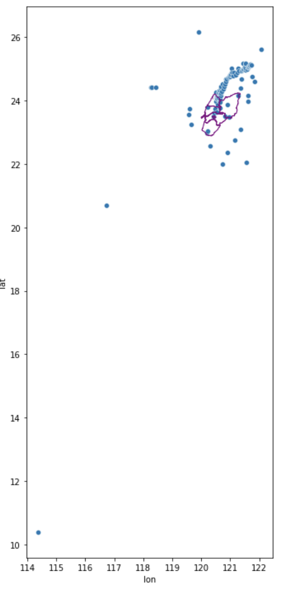
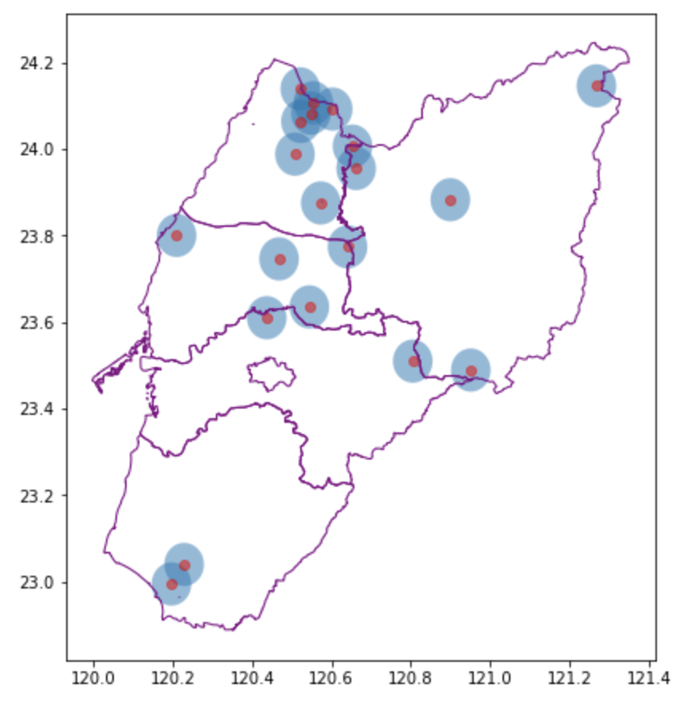
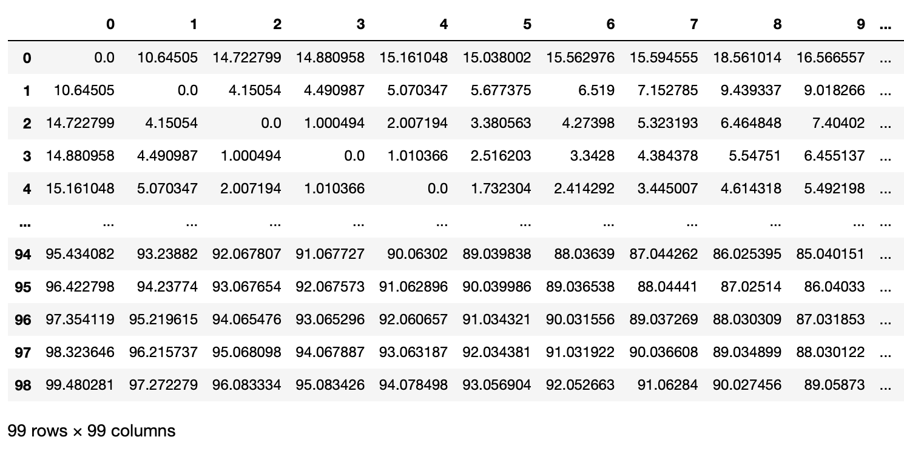



民生公共物聯網的測站都有其空間位置，由於同一區域內常有類似的環境因子，所以它們的感測數值也會具有類似的起伏趨勢，而這也就是地理學的第一定律：“All things are related, but nearby things are more related than distant things.” (Waldo R. Tobler)

此外，單一測站的感測數據有可能因為局部干擾因子的影響，而產生較大的起伏，所以為進一步確認數據的可信度，我們會需要以單一測站為中心，依照其所屬的行政區或是指定距離 (半徑)，選取鄰近的測站ID與數值，並將其以表單或地圖的方式呈現，以便進行比對。

這個章節中，我們會利用環保署的空品測站、氣象局的局屬測站以及水利署在各縣市佈建的淹水感測器，示範如何利用地理空間篩選測站，並以其「位置」與「數值」為基礎，轉化成可利用的空間資訊。

```python
import matplotlib.pyplot as plt
import seaborn as sns
import pandas as pd
import numpy as np
import urllib.request
import ssl
import json
#install geopython libraries
!apt install gdal-bin python-gdal python3-gdal
#install python3-rtree - Geopandas requirement
!apt install python3-rtree 
#install geopandas
!pip install geopandas

#install descartes - Geopandas requirement
!pip install descartes
import geopandas as gpd
!pip install pyCIOT
import pyCIOT.data as CIoT
```

```python
# 前往政府開放資料庫下載 縣市界線(TWD97經緯度) 的資料，並解壓縮到名為 shp 的資料夾
!wget -O "shp.zip" -q "https://data.moi.gov.tw/MoiOD/System/DownloadFile.aspx?DATA=72874C55-884D-4CEA-B7D6-F60B0BE85AB0"
!unzip shp.zip -d shp
```

```python
# 以水利署淹水感測器資料為例，其中，資料集 gpd 為感測器數值與位置資料、basemap 為 county.shp (台灣縣市邊界)
# 以pyCIOT取得資料
wa = CIoT.Water().get_data(src="FLOODING:WRA")
wa2 = CIoT.Water().get_data(src="FLOODING:WRA2")
wea_list = CIoT.Weather().get_station('GENERAL:CWB')
county = gpd.read_file('county.shp')
basemap = county.loc[county['COUNTYNAME'].isin(["嘉義縣","嘉義市"])]

# 整理資料並轉成 geopandas.GeoDataFrame 格式
flood_list = wa + wa2

flood_df = pd.DataFrame([],columns = ['name',  'Observations','lon', 'lat'])
for i in flood_list:
    #print(i['data'][0])
    if len(i['data'])>0:
        df = pd.DataFrame([[i['properties']['stationName'],i['data'][0]['values'][0]['value'],i['location']['longitude'],i['location']['latitude']]],columns = ['name',  'Observations','lon', 'lat'])
    else :
        df = pd.DataFrame([[i['properties']['stationName'],-999,-999,-999]],columns = ['name',  'Observations','lon', 'lat'])
    flood_df = pd.concat([flood_df,df])
    #print(df)

result_df = flood_df.drop_duplicates(subset=['name'], keep='first')
station=result_df.sort_values(by=['lon', 'lat'])
station = station[station.lon!=-999]
station.reset_index(inplace=True, drop=True)
gdf_flood = gpd.GeoDataFrame(
    station, geometry=gpd.points_from_xy(station.lon, station.lat),crs="EPSG:4326")

weather_df = pd.DataFrame([],columns = ['name','lon', 'lat'])
for i in wea_list:
    #print(i['data'][0])
    df = pd.DataFrame([[i['name'],i['location']['longitude'],i['location']['latitude']]],columns = ['name','lon', 'lat'])

    weather_df = pd.concat([weather_df,df])
    #print(df)

result_df = weather_df.drop_duplicates(subset=['name'], keep='first')
station=result_df.sort_values(by=['lon', 'lat'])
station.reset_index(inplace=True, drop=True)
gdf_weather = gpd.GeoDataFrame(
    station, geometry=gpd.points_from_xy(station.lon, station.lat),crs="EPSG:4326")
```

## 交集 (Intersect)

一般而言，手邊有很多的測站點位時，我們可以利用村里或鄉鎮等行政區界為範圍，利用資料的在空間上的交集 (intersect) 以篩選出特定行政區內的測站ID，並以API擷取這些測站的：瞬時值、小時平均值、日平均值、週平均值，這樣我們就可以檢視同一行政區內的測站，是否有類似的數值趨勢，抑或哪些測站的數值與其他測站有明顯的差異。

```python
import matplotlib.pyplot as plt
import seaborn as sns

fig, ax = plt.subplots(figsize=(6, 10))
ax = sns.scatterplot(x='lon', y='lat', data=gdf_weather) 
# this is plotting the datapoints from the EPA dataframe
basemap.plot(ax=ax, facecolor='none', edgecolor='purple');
# plotting the city's boundaries here, with facecolor = none to 
# remove the polygon's fill color
plt.tight_layout();
```



```python
basemap = basemap.set_crs(4326,allow_override=True)
intersected_data = gpd.overlay(gdf_weather, basemap, how='intersection') 
# selecting the polygon's geometry field to filter out points that 
# are not overlaid
```

```python
# 資料剩下感測器與地理邊界交集重疊的點位
fig, ax = plt.subplots(figsize=(6, 10))
ax = sns.scatterplot(x='lon', y='lat', data=intersected_data) 
basemap.plot(ax=ax, facecolor='none', edgecolor='purple');
plt.tight_layout();
```


## 緩衝區 (Buffer)

此外，部分測站也有可能是位在兩個行政界的邊界處，所以用行政界當成選取的標準，就有可能出現偏誤。所以這種狀況下，我們可以利用緩衝區 (buffer) 的概念，以測站的座標位置為中心，並指定一個距離半徑以建立一個虛擬的圓形 (圖1)，並以此範圍去查找有幾何相交的測站位置。

當我們掌握了緩衝區的概念後，我們也可以某個地標 (例如：學校、公園、工廠...）標為中心，去查找鄰近的測站。甚至，我們可以用一個線段 (Line 例如：道路、河流…) 或一個區域 (polygon 例如：公園、工業區)，去建立一個查找範圍，以更具體地找出自己想要的測站點位。在這個範例中，我們以氣象局的局屬氣象站為中心，去建立緩衝區。


```python
# 設定buffer 緩衝帶邊界距離 （此處設定0.05，因為x,y 為經緯度，1單位距離約100km）
fig, ax = plt.subplots(figsize=(6, 10))
buffer = intersected_data.buffer(0.05)
buffer.plot(ax=ax, alpha=0.5)
intersected_data.plot(ax=ax, color='red', alpha=0.5)
basemap.plot(ax=ax, facecolor='none', edgecolor='purple');
plt.tight_layout();
```



## 多重緩衝區 (Multi-ring buffer)

當然，我們也可以設定不同的距離半徑 ，進而把緩衝區畫成多個同心圓 (圖2)，這樣就可以利用不同的遠近/階層，以將鄰近的測站分組，從而檢視越鄰近的測站是否有越相近的數值趨勢。在這個案例中，我們可以用氣象局的局屬氣象站去建立多重緩衝區，並檢視不同的緩衝區內的水利署淹水感測器，從而探勘：雨量、水平距離與淹水高度之間的關係。


```python
# 利用不同的經緯度作為半徑以建立多重緩衝區，並依照 0.05度=藍色；0.1度=綠色；0.2度=橘色；0.3=紅色 進行顏色設定
fig, ax = plt.subplots(figsize=(6, 10))
buffer_03 = intersected_data.buffer(0.3)
buffer_03.plot(ax=ax, color='red', alpha=1)
buffer_02 = intersected_data.buffer(0.2)
buffer_02.plot(ax=ax, color='orange', alpha=1)
buffer_01 = intersected_data.buffer(0.1)
buffer_01.plot(ax=ax, color='green', alpha=1)
buffer_005 = intersected_data.buffer(0.05)
buffer_005.plot(ax=ax, alpha=1)
intersected_data.plot(ax=ax, color='black', alpha=0.5)

# 用最大的 buffer 跟淹水感測器 intersect
buffer = gpd.GeoDataFrame(buffer_03,geometry=buffer_03)
buffer = buffer.to_crs(4326)
intersected_flood = gpd.overlay(gdf_flood, buffer, how='intersection') 
intersected_flood.plot(ax=ax, color='lightgray', alpha=0.5)
basemap.plot(ax=ax, facecolor='none', edgecolor='purple');
plt.tight_layout();
```


## 距離矩陣 (Distance Matrix)

最後，因為每一個測站都有具體的座標數值，所以我們也可以三角函數結合座標數值，取得兩兩測站間的絕對距離，從而建立所有測站間的距離矩陣 (distance matrix)，而這樣的矩陣可以協助我們快速檢視兩兩測站間的距離關係，並從中確認測站是否具有鄰近性，從而以更一步確認感測間的數值趨勢是否與其距離具有相關性 (圖3)。在這個範例中，我們可以利用台北市內的淹水感測器位置，並將其轉換成為距離矩陣，以協助我們掌握淹水是否具有鄰近關係。


```python
# 製作每個感測器位置之間的距離矩陣，首先將資料整理成座標資料
gdf_weather["ID"] = gdf_weather.index
df = pd.DataFrame(gdf_weather, columns=['ID','lon', 'lat'])
df.set_index('ID')
```


```python
# 計算感測器位置彼此的距離，並轉化為距離矩陣
from scipy.spatial import distance_matrix

pd.DataFrame(distance_matrix(df.values, df.values), 
							index=df.index, columns=df.index)
```



## 小結

透過前述的方式，我們可以從地理空間 (行政區或鄰近性)  進行測站的篩選機制，並從而能從地理空間的特性檢視測站間的數值相關性。

# References

- Geopanda Documentation ([https://geopandas.org/en/stable/docs.html](https://geopandas.org/en/stable/docs.html))
- Shpfile 格式介紹 ([https://en.wikipedia.org/wiki/Shapefile](https://en.wikipedia.org/wiki/Shapefile))
- 臺灣的大地基準及座標系統 ([https://wiki.osgeo.org/wiki/Taiwan_datums](https://wiki.osgeo.org/wiki/Taiwan_datums))
- WGS 84 (****EPSG:4326****) 參數介紹 ([https://epsg.io/4326](https://epsg.io/4326))
- TWD 97 (****EPSG:3826****) 參數介紹 ([https://epsg.io/3826](https://epsg.io/3826))
