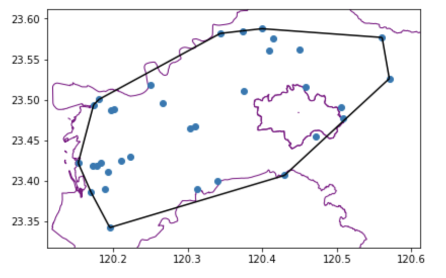
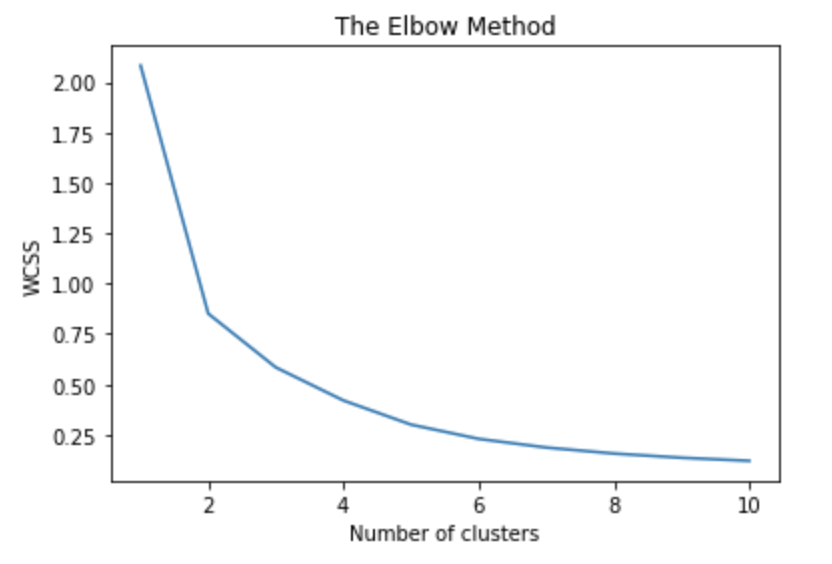
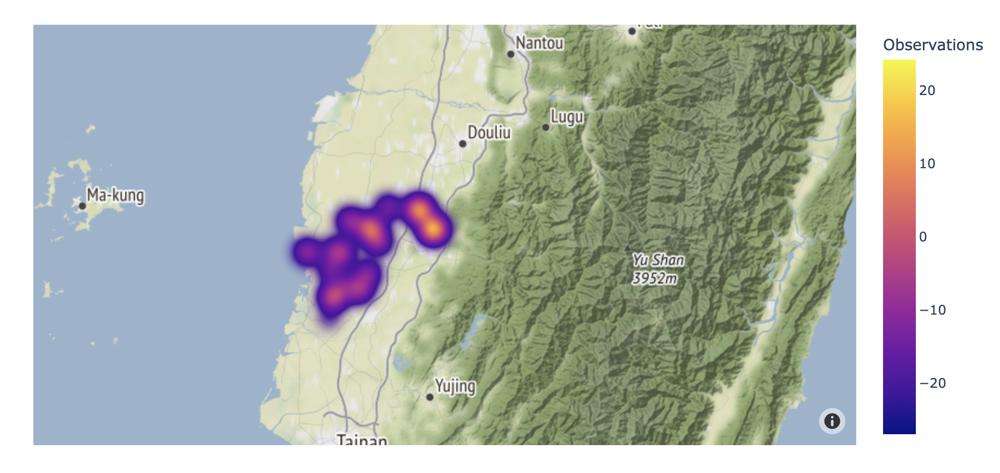
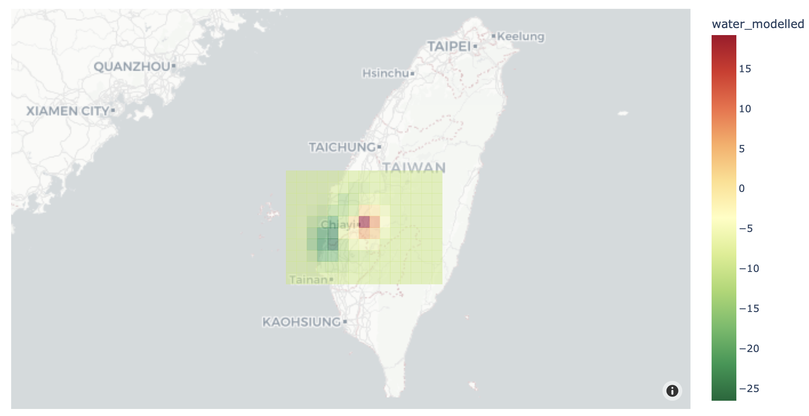
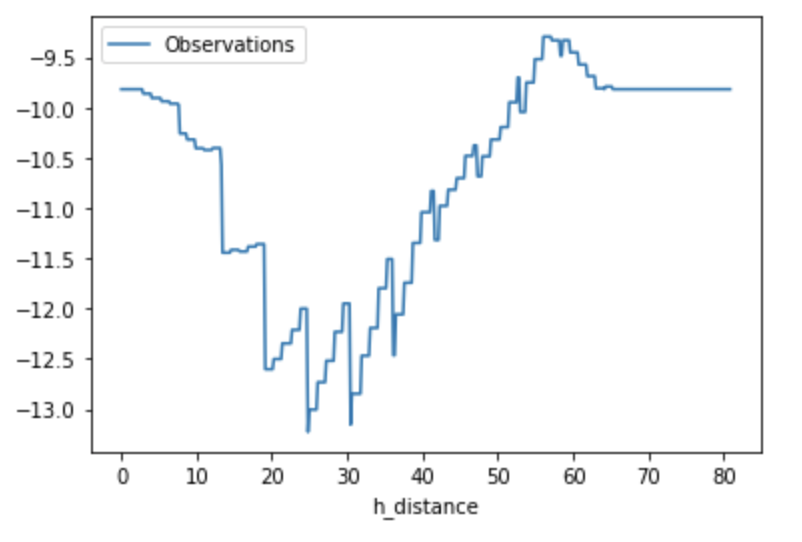

[](https://colab.research.google.com/drive/1dZ26qA1BLee7AMaoBk0lcWvB3PAOLKV-?usp=sharing)

{{ < toc > }}

Microsensors that are widespread in the environment help us obtain environmental information, making decisions and taking actions accordingly. Therefore, it’s fundamental for us to clearly understand the spatial relationships between stations when analyzing data of stations. Apart from that the location of stations itself may form certain geometric structures or spatial clusters, we can also estimate the values where there’s no stations according to the location of stations and their value differences. Thus, we will have a picture of value distribution that’s more comprehensive, within which we may explore the correlations between values and environmental factors. In this section, with data of flooding sensors and groundwater table observation stations in different counties provided by the Water Resources Agency (MOEA), we can practice some simple spatial analyses.

## Voronoi diagram

First of all, we may need to clarify the service/defense area of individual stations, within which we further ask if data of certain stations can represent certain areas. In this case, Voronoi Diagram can help us look for the area. The principle of Voronoi Diagram is that by building vertical and equally divided lines between two nearby stations and integrating them, a polygon can be made. The center of each polygon is the station, of which the data represent values within this area. In this section, we can try to practice creating Voronoi Diagrams with data of flooding sensors in Chiayi City and Chiayi County. Thus, we can have a rough understanding about the sphere of influence of flooding sensors.

```python
import matplotlib.pyplot as plt
import seaborn as sns
import pandas as pd
import numpy as np
import urllib.request
import ssl
import json
#install geopython libraries
!apt install gdal-bin python-gdal python3-gdal
#install python3-rtree - Geopandas requirement
!apt install python3-rtree 
#install geopandas
!pip install geopandas
#install pykrige
!pip install pykrige
#install elevation
!pip install elevation
#install affine rasterio
!pip install affine rasterio

#install descartes - Geopandas requirement
!pip install descartes
import geopandas as gpd
!pip install pyCIOT
import pyCIOT.data as CIoT
```

```python
# downlaod the county boundary shpfile from open database
!wget -O "shp.zip" -q "https://data.moi.gov.tw/MoiOD/System/DownloadFile.aspx?DATA=72874C55-884D-4CEA-B7D6-F60B0BE85AB0"
!unzip shp.zip -d shp
```

```python
# # get flood sensors' data by pyCIOT
wa = CIoT.Water().get_data(src="FLOODING:WRA")
wa2 = CIoT.Water().get_data(src="FLOODING:WRA2")

flood_list = wa + wa2

county = gpd.read_file('/content/shp/COUNTY_MOI_1090820.shp')
basemap = county.loc[county['COUNTYNAME'].isin(["嘉義縣","嘉義市"])]

flood_df = pd.DataFrame([],columns = ['name',  'Observations','lon', 'lat'])
for i in flood_list:
    #print(i['data'][0])
    if len(i['data'])>0:
        df = pd.DataFrame([[i['properties']['stationName'],i['data'][0]['values'][0]['value'],i['location']['longitude'],i['location']['latitude']]],columns = ['name',  'Observations','lon', 'lat'])
    else :
        df = pd.DataFrame([[i['properties']['stationName'],-999,-999,-999]],columns = ['name',  'Observations','lon', 'lat'])
    flood_df = pd.concat([flood_df,df])
    #print(df)

result_df = flood_df.drop_duplicates(subset=['name'], keep='first')
station=result_df.sort_values(by=['lon', 'lat'])
station = station[station.lon!=-999]
station.reset_index(inplace=True, drop=True)
gdf_flood = gpd.GeoDataFrame(
    station, geometry=gpd.points_from_xy(station.lon, station.lat),crs="EPSG:4326")

station=result_df.sort_values(by=['lon', 'lat'])
station = station[station.lon!=-999]
station.reset_index(inplace=True, drop=True)
gdf_flood = gpd.GeoDataFrame(
    station, geometry=gpd.points_from_xy(station.lon, station.lat),crs="EPSG:4326")

basemap = basemap.set_crs(4326,allow_override=True)
intersected_data = gpd.overlay(gdf_flood, basemap, how='intersection') 

```

```python
from scipy.spatial import Voronoi, voronoi_plot_2d
fig, ax = plt.subplots(figsize=(6, 10))
inputp = intersected_data[['lon','lat']]
basemap.plot(ax=ax, facecolor='none', edgecolor='purple');
vor = Voronoi(inputp)
voronoi_plot_2d(vor,ax = ax,show_vertices=False,)
plt.show()
```


Besides, we can describe the service/defense areas of stations with Delaunay Triangulation, with which we choose one station as the center and search for two nearest dots to create a triangular service area. If we consider the triangular service area as a homogeneous sphere, in which data of sensors can be replaced with the average values obtained from the three nodal stations.

Overall, the two algorithms can help us understand the spatial distribution of sensors and the spatial structure it constructs as graphics.

```python
from scipy.spatial import Delaunay, delaunay_plot_2d
import numpy as np
fig, ax = plt.subplots(figsize=(6, 10))
#input should be array
inputp = np.array(inputp)
tri = Delaunay(inputp)
basemap.plot(ax=ax, facecolor='none', edgecolor='purple');
delaunay_plot_2d(tri,ax=ax)
plt.show()
```


## Convex hull

The algorithm of Convex Hull aims at selecting stations located at marginal areas from a group of stations, and form a polygon with smallest side lengths while containing all points. Therefore, we can locate the clustering range among many stations, with which more calculation can be done. To compute the algorithm of Convex Hull, we basically have to arrange the order of stations according to their x coordinates; if the x coordinates are identical, we can use y coordinates for arrangement to find out the peripheral endpoints to form polygons. (Of course, there are many other methods applying similar concepts.) With such an algorithm, we can evaluate the effective inspection areas of stations. Accordingly, we can examine the covering area of flooding sensors with data of their distribution in Chiayi City and Chiayi County.

```python
from scipy.spatial import ConvexHull, convex_hull_plot_2d
fig, ax = plt.subplots(figsize=(6, 10))
hull = ConvexHull(inputp)
basemap.plot(ax=ax, facecolor='none', edgecolor='purple');
convex_hull_plot_2d(hull,ax=ax)
plt.tight_layout()
```



## Clustering

As explained above, the nearer the stations are, the more similar the interfering factors in surrounding environments are. So, with K-means algorithm serving as a partitioning method, we can partition stations into clusters to explore the relationship between sensor data and environmental factors.

After we decide to partition our observations into n clusters, K-means clustering will randomly select n points as centers to search for their nearby neighbors; by measuring the linear distance between observation points and their centers, K-means clustering partitions the observation points and calculates the average of each cluster. Repeating the procedure above, K-means clustering aims to minimize average distances between all observation points and their centers, and the partitioning will be finished once the distance becomes shortest.

```python
# get the groundwater station data through pyCIOT
count = 733
num = 0
water_level = pd.DataFrame([])
while(num<=count):
    url_level = "https://sta.ci.taiwan.gov.tw/STA_WaterResource_v2/v1.0/Datastreams?$skip="+str(num)+"&$filter=%28%28Thing%2Fproperties%2Fauthority_type+eq+%27%E6%B0%B4%E5%88%A9%E7%BD%B2%27%29+and+substringof%28%27Datastream_Category_type%3D%E5%9C%B0%E4%B8%8B%E6%B0%B4%E4%BD%8D%E7%AB%99%27%2CDatastreams%2Fdescription%29%29&$expand=Thing,Thing%28%24expand%3DLocations%29,Observations%28%24top%3D1%3B%24orderby%3DphenomenonTime+desc%3B%24top%3D1%29&$count=true"
    ssl._create_default_https_context = ssl._create_unverified_context
    r_l = urllib.request.urlopen(url_level)
    string_l = r_l.read().decode('utf-8')

    jf_level = json.loads(string_l)

    station = pd.DataFrame(jf_level['value']).filter(items=['Thing','observedArea','Observations'])
    station['lat']=station['observedArea']
    for i in range(len(station)):
        station['Thing'][i] = station['Thing'][i]['properties']['stationName']

        if pd.isnull(station['observedArea'][i]):
            station['lat'][i]=-1
            station['observedArea'][i]=-1
        else:
            station['lat'][i]=station['lat'][i]['coordinates'][1]
            station['observedArea'][i]=station['observedArea'][i]['coordinates'][0]

        if len(station['Observations'][i])!=0:
            station['Observations'][i] = station['Observations'][i][0]['result']
        else:
            station['Observations'][i] = -1
    station = station.rename(columns={"Thing": "name", 'observedArea': 'lon'})
    if num ==0 :
        water_level = station
    else:
        water_level = pd.concat([water_level, station])
    num+=100
    
result_df = water_level.drop_duplicates(subset=['name'], keep='first')
station=result_df.sort_values(by=['lon', 'lat'])
station.reset_index(inplace=True, drop=True)
station = station[station.lon!=-1]
gdf_level = gpd.GeoDataFrame(
    station, geometry=gpd.points_from_xy(station.lon, station.lat),crs="EPSG:4326")
```

```python
# intersect with county boundary 
basemap = county.loc[county['COUNTYNAME'].isin(["雲林縣"])]
basemap = basemap.set_crs(4326,allow_override=True)
intersected_data = gpd.overlay(gdf_level, basemap, how='intersection') 
```

```python
from sklearn.cluster import KMeans
from scipy.spatial import ConvexHull
import folium
clusterp = intersected_data[["name","lon", 'lat', 'Observations']]

# 1. identify the clusters by kmeans
#1.1 pre-processing
X = clusterp.iloc[:, 1:3].values
# ddecide the number groups by elbow method
wcss = []
for i in range(1, 11):
    kmeans = KMeans(n_clusters = i, init = 'k-means++', random_state = 42)
    kmeans.fit(X)
    wcss.append(kmeans.inertia_)
plt.plot(range(1, 11), wcss)
plt.title('The Elbow Method')
plt.xlabel('Number of clusters')
plt.ylabel('WCSS')
plt.show()
```



```python
# 1.2 applying K-Means model 
kmeans = KMeans(n_clusters = 3, init = 'k-means++', random_state = 42)
y_kmeans = kmeans.fit_predict(X)
# 1.3 map data back to df
clusterp['cluster'] = y_kmeans+1 # to step up to group 1 to 4
```

```python
# 2. display the result on maps
m = folium.Map(location=[clusterp['lat'].mean(), clusterp['lon'].mean()],
               tiles='CartoDB positron',
               zoom_start=7)
# create the layer by kmeans
layer1 = folium.FeatureGroup(name= '<u><b>group1</b></u>',show= True)
m.add_child(layer1)
layer2 = folium.FeatureGroup(name= '<u><b>group2</b></u>',show= True)
m.add_child(layer2)
layer3 = folium.FeatureGroup(name= '<u><b>group3</b></u>',show= True)
m.add_child(layer3)
layer4 = folium.FeatureGroup(name= '<u><b>group4</b></u>',show= True)
m.add_child(layer4)

# create symbology
my_symbol_css_class= """ <style>
.fa-g1:before {
    font-family: Arial; 
    font-weight: bold;
    font-size: 12px;
    color: black;
    background-color:white;
    border-radius: 10px; 
    white-space: pre;
    content: ' g1 ';
    }
.fa-g2:before {
    font-family: Arial; 
    font-weight: bold;
    font-size: 12px;
    color: black;
    background-color:white;
    border-radius: 10px; 
    white-space: pre;
    content: ' g2 ';
    }
.fa-g3:before {
    font-family: Arial; 
    font-weight: bold;
    font-size: 12px;
    color: black;
    background-color:white;
    border-radius: 10px; 
    white-space: pre;
    content: ' g3 ';
    }
.fa-g4:before {
    font-family: Arial; 
    font-weight: bold;
    font-size: 12px;
    color: black;
    background-color:white;
    border-radius: 10px; 
    white-space: pre;
    content: ' g4 ';
    }
.fa-g1bad:before {
    font-family: Arial; 
    font-weight: bold;
    font-size: 12px;
    color: white;
    background-color:red;
    border-radius: 10px; 
    white-space: pre;
    content: ' g1 ';
    }
.fa-g2bad:before {
    font-family: Arial; 
    font-weight: bold;
    font-size: 12px;
    color: white;
    background-color:red;
    border-radius: 10px; 
    white-space: pre;
    content: ' g2 ';
    }
.fa-g3bad:before {
    font-family: Arial; 
    font-weight: bold;
    font-size: 12px;
    color: white;
    background-color:red;
    border-radius: 10px; 
    white-space: pre;
    content: ' g3 ';
    }
.fa-g4bad:before {
    font-family: Arial; 
    font-weight: bold;
    font-size: 12px;
    color: white;
    background-color:red;
    border-radius: 10px; 
    white-space: pre;
    content: ' g4 ';
    }
</style>
"""
# add the symbology code to the map      
m.get_root().html.add_child(folium.Element(my_symbol_css_class))

for index, row in clusterp.iterrows():
    if row['cluster'] == 1:
        color='black'
        fa_symbol = 'fa-g1'
        lay = layer1
    elif row['cluster'] == 2:
        color='purple'
        fa_symbol = 'fa-g2'
        lay = layer2
    elif row['cluster'] == 3:
        color='orange'
        fa_symbol = 'fa-g3'
        lay = layer3
    elif row['cluster'] == 4:
        color='blue'
        fa_symbol = 'fa-g4'
        lay = layer4
        
    folium.Marker(
        location=[row['lat'], row['lon']],
        title = row['name']+ 'group:{}'.format(str(row["cluster"])),
        popup = row['name']+ 'group:{},value:{}'.format(str(row["cluster"]),str(row['Observations'])),
        icon= folium.Icon(color=color, icon=fa_symbol, prefix='fa')).add_to(lay)
```

```python
# display the result on maps
layer_list = [layer1,layer2,layer3,layer4]
color_list = ['black','purple','orange','blue']
for g in clusterp['cluster'].unique():
    latlon_cut =clusterp[clusterp['cluster']==g].iloc[:, 1:3]
    hull = ConvexHull(latlon_cut.values)
    Lat = latlon_cut.values[hull.vertices,0]
    Long = latlon_cut.values[hull.vertices,1] 
    cluster = pd.DataFrame({'lat':Lat,'lon':Long })       
    area = list(zip(cluster['lat'],cluster['lon']))

    list_index = g-1 
    lay_cluster = layer_list[list_index ] 
    folium.Polygon(locations=area,
        color=color_list[list_index],
        weight=2,
        fill=True,
        fill_opacity=0.1,
        opacity=0.8).add_to(lay_cluster) 
            
folium.LayerControl(collapsed=False,position= 'bottomright').add_to(m)
print(m)
m.save('River_clustering.html')
```


## Kernel density

The concept of density allows us to describe the intensity of clustering, and it’s traditionally defined by the formula d = N/A, where d is density, N is number of observations, and A is area. However, the formula above is easily influenced by the area, which makes it possible that the same station/case numbers in towns that have different area sizes result in different densities. Therefore, we might have difficulty calculating the intensity of clustering events correctly.

In order to avoid calculation differences of areas, we describe the clustering intensity with the concept of kernel density, which takes observation points as centers and a fixed radius to select neighbors, and finally replaces the original observation values with the total values obtained from all neighbors. Such method standardizes the “area” in the density formula and thus obtains a more comprehensive density distribution, which helps us understand the distribution intensity of events.


```python
basemap = county.loc[county['COUNTYNAME'].isin(["嘉義縣","嘉義市"])]
basemap = basemap.set_crs(4326,allow_override=True)
gdf = gpd.overlay(gdf_level, basemap, how='intersection') 
# selecting the polygon's geometry field to filter out points that 
# are not overlaid
```

```python
import plotly.express as px
fig = px.density_mapbox(gdf, lat='lat', lon='lon', z='Observations', radius=25,
                        center=dict(lat=23.5, lon=120.5), zoom=8,
                        mapbox_style="stamen-terrain")
fig.show()
```



## Spatial interpolation

The implementation of microsensors is similar to our spatial samplings, with which we can estimate the population distribution with statistical analyses. Since it’s impossible to spread observation stations all over earth's surface, we are faced with conditions in which some places are rich in data while others aren’t. In such a scenario, spatial interpolation is a statistical method that helps us estimate regions without data, and to further obtain a whole picture of our study area.

Before conducting spatial interpolation, we need to clarify two concepts: deterministic model and stochastic model. In a deterministic model, if we know the distribution rule of certain spatial phenomena, we can estimate the value of unknown areas with correlation parameters. Take the house number in Taiwan for example. House numbers in Taiwan are arranged by odd and even numbers respectively. So, suppose we wonder the number of certain house, and we know the previous one is 6 while  the next one is 10, we can therefore presume the house in the middle (which is the one we’re interested in) is 8. As for a stochastic model, it assumes that the reality is rather complicated, and we can only construct suitable estimation models with probability and variety of variances while accepting the uncertainty.

### Inverse Distance Weighting

With Inverse Distance Weighting, we construct an estimation model with value deviations and intervals of known observation points. Generally speaking, if the deviation of two points is 10 and the interval is 100 meter, then the deviation per 10 meter should be 1 theoretically. But, since there may not be a linear relationship in the deviation distributions, the principle of IDW emphasizes on the first law of geography: nearby things are closer than others, and estimates value deviations of two points. By obtaining the reciprocal of the cube of the product of deviation and distance, IDW allows us to estimate values of certain positions. So, the shorter the distance is, the larger the weighting is, and vice versa.

```python
import numpy as np
import matplotlib.pyplot as plt
from scipy.interpolate import Rbf

def distance_matrix(x0, y0, x1, y1):
    obs = np.vstack((x0, y0)).T
    interp = np.vstack((x1, y1)).T
    
    # build distance matrix
    d0 = np.subtract.outer(obs[:,0], interp[:,0])
    d1 = np.subtract.outer(obs[:,1], interp[:,1])
    print(d0.dtype,d1.dtype)
    
    return np.hypot(d0, d1)

def simple_idw(x, y, z, xi, yi, pows):
    dist = distance_matrix(x,y, xi,yi)

    # the IDW weight is 1 / distance
    weights = 1.0 / dist

    # weight is 1
    weights /= weights.sum(axis=0)

    # set the Z value
    zi = np.dot(weights.T, z)
    return zi

fig, ax = plt.subplots(figsize=(6, 4))
ax.set_aspect('equal')
pows = 2
nx, ny = 100, 100
xmin, xmax = 119.8, 121.2
ymin, ymax = 23, 24
interpolatep = gdf[["lon", 'lat', 'Observations']]
x = interpolatep['lon']
y = interpolatep['lat']
z = interpolatep['Observations']
x = x.astype("float64")
y = y.astype("float64")
z = z.astype("float64")
xi = np.linspace(xmin,xmax, nx)
yi = np.linspace(ymin, ymax, ny)
xi, yi = np.meshgrid(xi, yi)
xi, yi = xi.flatten(), yi.flatten()

# 計算 IDW
grid = simple_idw(x,y,z,xi,yi,pows)
grid = grid.reshape((ny, nx))
grid = grid.astype("float64")

plt.imshow(grid, extent=(xmin, xmax, ymin, ymax))

basemap.plot(ax=ax, facecolor='none', edgecolor='lightgray');
ax.scatter(x, y, marker=".", color='orange', s=z,label="input point")
plt.colorbar()
plt.xlim(xmin, xmax)
plt.ylim(ymin, ymax)

plt.title('IDW')

plt.show()
```


### Kriging

The principle of Kriging is to build a semi-variogram with the value and position of known observed points, and we can partition the observations based on the semi-variogram to obtain several regionalized variables for value estimation. Similar to IDW, Kriging also utilizes values and distances of known points to estimate nearby unknown points. Notice that in Kriging, we divide observations into groups by distances, and the estimation formulas will be adjusted according to distances.

```python
# set the data extend and resolution
import numpy as np
resolution = 0.1  # cell size in meters
gridx = np.arange(119.8, 121.2, resolution)
gridy = np.arange(23, 24, resolution)
```

```python
# set the raster to polygon 
import itertools
from shapely.geometry import Polygon

def pixel2poly(x, y, z, resolution):
    """
    x: x coords of cell
    y: y coords of cell
    z: matrix of values for each (x,y)
    resolution: spatial resolution of each cell
    """
    polygons = []
    values = []
    half_res = resolution / 2
    for i, j  in itertools.product(range(len(x)), range(len(y))):
        minx, maxx = x[i] - half_res, x[i] + half_res
        miny, maxy = y[j] - half_res, y[j] + half_res
        polygons.append(Polygon([(minx, miny), (minx, maxy), (maxx, maxy), (maxx, miny)]))
        if isinstance(z, (int, float)):
            values.append(z)
        else:
            values.append(z[j, i])
    return polygons, values
```

```python
# calculate ithe pykrige package
from pykrige.ok import OrdinaryKriging
krig = OrdinaryKriging(x=gdf["lon"], y=gdf["lat"], z=gdf['Observations'], variogram_model="spherical", pseudo_inv=True)
z, ss = krig.execute("grid", gridx, gridy)
plt.imshow(z);
```


```python
# dispaly by plotly
import plotly.express as px
polygons, values = pixel2poly(gridx, gridy, z, resolution)
water_model = (gpd.GeoDataFrame({"water_modelled": values}, geometry=polygons, crs="EPSG:4326")
                 .to_crs("EPSG:4326")
                 )

fig = px.choropleth_mapbox(water_model, geojson=water_model.geometry, locations=water_model.index,
                           color="water_modelled", color_continuous_scale="RdYlGn_r", opacity=0.5,
                           center={"lat": 24, "lon": 121}, zoom=6,
                           mapbox_style="carto-positron")
fig.update_layout(margin=dict(l=0, r=0, t=30, b=10))
fig.update_traces(marker_line_width=0)
```



### Nearest neighbor Interpolation

Nearest Neighbor Interpolation is actually quite simple. If we want to know the value of a certain position, we only need to find the nearest station with data, thus taking it in replacement. The design of this method basically follows the principle of “nearby things are more similar,” and it’s often applied in image processing and cases of enlargement.

```python
from scipy.interpolate import NearestNDInterpolator
import matplotlib.pyplot as plt

fig, ax = plt.subplots(figsize=(6, 4))

interpolatep = gdf[["lon", 'lat', 'Observations']]
xd = interpolatep['lon']
yd = interpolatep['lat']
zd = interpolatep['Observations']
xd = xd.astype("float64")
yd = yd.astype("float64")
zd = zd.astype("float64")

X = np.linspace(min(xd), max(xd))
Y = np.linspace(min(yd), max(yd))
X, Y = np.meshgrid(X, Y)  # 2D grid for interpolation
interp = NearestNDInterpolator(list(zip(xd, yd)), zd)
Z = interp(X, Y)
im = ax.pcolormesh(X, Y, Z, shading='auto')
basemap.plot(ax=ax, facecolor='none', edgecolor='gray');
sns.scatterplot(x='lon', y='lat', data=interpolatep,label="input point")
plt.legend()
plt.colorbar(im)
plt.xlim(xmin, xmax)
plt.ylim(ymin, ymax)
plt.show()
```


## Contour

Generally speaking, after conducting spatial interpolation to the position and values of stations, we will obtain comprehensive grid data. How can we analyze the grid data? First, the easiest method is to draw a line connecting nearby points by the values and positions of the grid, which is similar to drawing contours on changing landforms, so that we can consider values on the same line as equivalent.

```python
from osgeo import gdal
import numpy as np
import matplotlib 
import matplotlib.pyplot as plt
import elevation 
# 利用 Matplotlib 中的 'contourf' 函式來畫
fig, ax = plt.subplots(figsize=(6, 10))

X = np.linspace(xmin, xmax)
Y = np.linspace(ymin, ymax)
krig = OrdinaryKriging(x=interpolatep['lon'], y=interpolatep['lat'], z=interpolatep['Observations'], variogram_model="spherical")
z, ss = krig.execute("grid", X, Y)

im = ax.contourf(z, cmap = "viridis", 
            levels = list(range(-30, 30, 10)),extent=(xmin, xmax, ymin, ymax))
basemap.plot(ax=ax, facecolor='none', edgecolor='black');
plt.title("Elevation Contours Taiwan")

plt.show()
```


### Profile

Contours help us attain value distribution and ranges, and geographical profiling is another method for understanding value distribution. By drawing a straight line between two points, geographical profiling helps us to retrieve corresponding values according to positions of lines for estimation. This method allows us to inspect value variation between two points. In some studies of air quality, scientists evaluate changes of PM2.5 on both sides of roads with geographical profiling.

```python
def export_kde_raster(Z, XX, YY, min_x, max_x, min_y, max_y, proj, filename):
    '''Export and save a kernel density raster.'''

    # 取得解析度
    xres = (max_x - min_x) / len(XX)
    yres = (max_y - min_y) / len(YY)

    # 取得 bound 等資訊
    transform = Affine.translation(min_x - xres / 2, min_y - yres / 2) * Affine.scale(xres, yres)

    # 輸出為 raster
    with rasterio.open(
            filename,
            mode = "w",
            driver = "GTiff",
            height = Z.shape[0],
            width = Z.shape[1],
            count = 1,
            dtype = Z.dtype,
            crs = proj,
            transform = transform,
    ) as new_dataset:
            new_dataset.write(Z, 1)
```

```python
from pykrige.ok import OrdinaryKriging
from affine import Affine
import rasterio
import math
start_cor = [119.9,23.2]
end_cor = [120.1,23.9]
npoints=100
X = np.linspace(xmin, xmax, npoints)
Y = np.linspace(ymin, ymax, npoints)
interpolatep = gdf[["lon", 'lat', 'Observations']]
xd = interpolatep['lon']
yd = interpolatep['lat']
zd = interpolatep['Observations']
xd = xd.astype("float64")
yd = yd.astype("float64")
zd = zd.astype("float64")

krig = OrdinaryKriging(x=xd, y=yd, z=zd, variogram_model="spherical")
zr, ss = krig.execute("grid", X, Y)

# 輸出 raster
export_kde_raster(Z = zr, XX = X, YY = Y,
                  min_x = xmin, max_x = xmax, min_y = ymin, max_y = ymax,
                  proj = 4326, filename = "kriging_result.tif")
kriging = rasterio.open("kriging_result.tif",mode='r')

dist = math.sqrt((end_cor[0]-start_cor[0])**2+(end_cor[1]-start_cor[1])**2)*111
npoints=500
lat = np.linspace(start_cor[1], end_cor[1],npoints)
lon = np.linspace(start_cor[0], end_cor[0],npoints)
distarray = np.linspace(0, dist,npoints)
np.append(distarray, dist)
df = pd.DataFrame({'Latitude': lat, 'Longtitude':lon,'h_distance':distarray})

df['Observations']=0
gdf_pcs = gpd.GeoDataFrame(df, geometry = gpd.points_from_xy(df.Longtitude, df.Latitude))
gdf_pcs.crs = {'init':'epsg:4326'}

for index, row in gdf_pcs.iterrows():
    rows, cols = kriging.index(row['geometry'].x,row['geometry'].y)
    kri_data = kriging.read(1)    
    df['Observations'].loc[index] = kri_data[rows, cols]
profile = df[['h_distance','Observations']]
profile.plot(x='h_distance',y='Observations')

kriging.close()
```



## References

- Geopandas [https://ithelp.ithome.com.tw/articles/10202336](https://ithelp.ithome.com.tw/articles/10202336)
- scipy.spatial  ([https://docs.scipy.org/doc/scipy/reference/spatial.html](https://docs.scipy.org/doc/scipy/reference/spatial.html))
- scipy.interpolate  ([https://docs.scipy.org/doc/scipy/reference/interpolate.html](https://docs.scipy.org/doc/scipy/reference/interpolate.html))
- pykrige  ([https://geostat-framework.readthedocs.io/projects/pykrige/en/stable/api.html#krigging-algorithms](https://geostat-framework.readthedocs.io/projects/pykrige/en/stable/api.html#krigging-algorithms))
