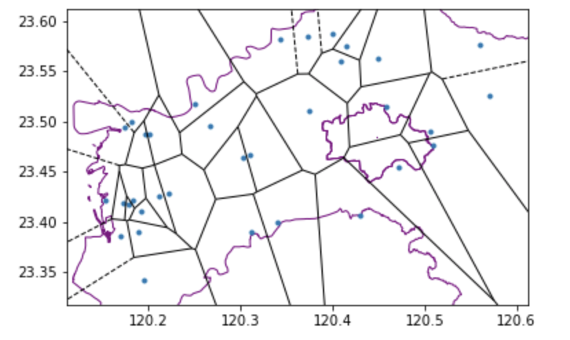
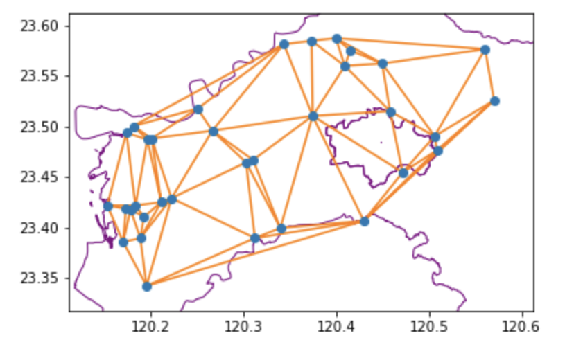
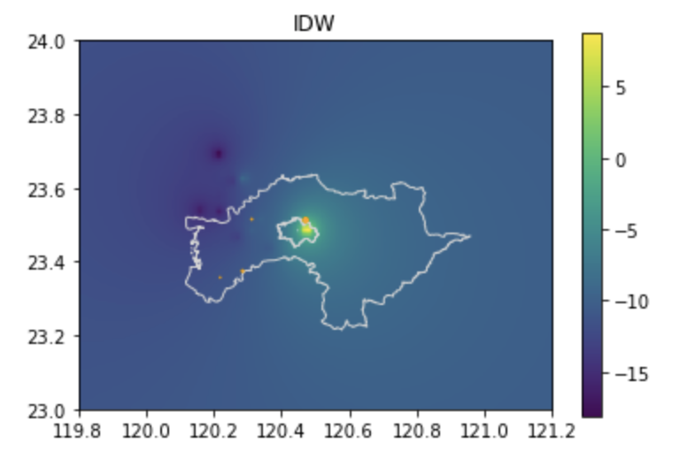
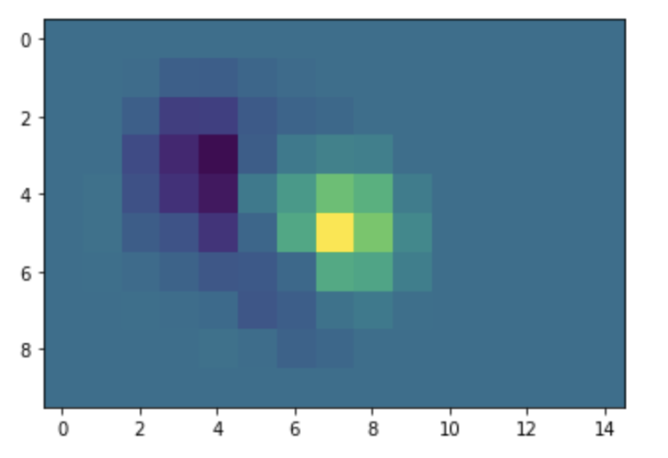
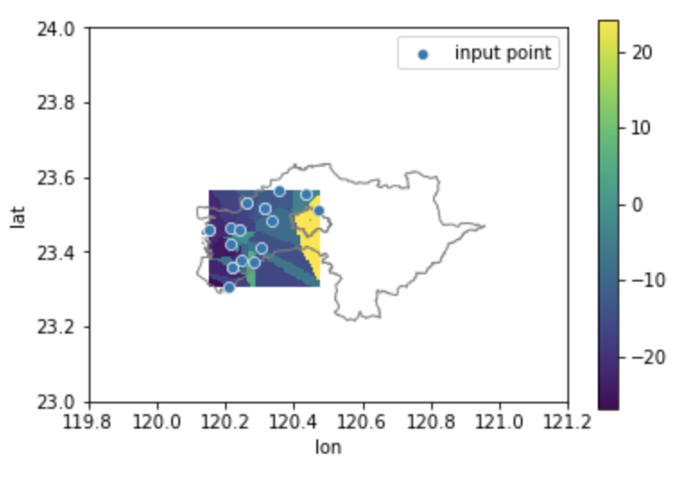
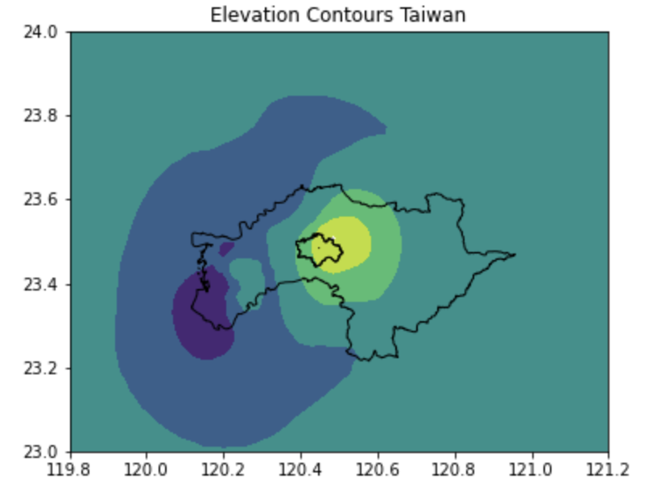

[](https://colab.research.google.com/drive/1dZ26qA1BLee7AMaoBk0lcWvB3PAOLKV-?usp=sharing)



廣布在生活環境中的微型測站，協助我們掌握細緻的環境變化，並可據以決策跟行動。所以，清楚地掌握測站間的分布和數據特性，也是我們在分析測站數據時的重要基礎。這些測站除了本身的位置可能會形成某種幾何結構或空間群聚。同時，我們也可以依照測站位置與數值的差異，去推估沒有測站的區域的數值，從而獲得一個更為全面的數值分佈狀況，並從中探索感測數值與環境因子間的相關性。在這一個段落中，我們會利用水利署在不同縣市的淹水感測器與地下水位站資料，來進行一些簡單的空間分析。

## 勢力分佈圖 (Voronoi diagram)

首先，我們可能需要釐清個別測站的服務/防守範圍，並以此範圍中的測站數據來代表該區的現況。這個時候，我們可以利用沃羅諾伊圖（voronoi diagram）的方法去找尋這個範圍。沃羅諾伊圖的原理是在兩個相鄰測站間建立一條垂直平分線段，並藉由整合這些線段以構成一個多邊形；每個多邊形範圍的中心點就是測站，而該測站的數值則約可代表這個範圍內的數值。在這個範例中，我們嘗試利用嘉義縣、嘉義市的淹水感測器資料，去練習建立沃羅諾伊圖，這樣我們就可以初略知道這些淹水感測器的勢力分佈範圍。

```python
import matplotlib.pyplot as plt
import seaborn as sns
import pandas as pd
import numpy as np
import urllib.request
import ssl
import json
#install geopython libraries
!apt install gdal-bin python-gdal python3-gdal
#install python3-rtree - Geopandas requirement
!apt install python3-rtree 
#install geopandas
!pip install geopandas
#install pykrige
!pip install pykrige
#install elevation
!pip install elevation
#install affine rasterio
!pip install affine rasterio

#install descartes - Geopandas requirement
!pip install descartes
import geopandas as gpd
!pip install pyCIOT
import pyCIOT.data as CIoT
```

```python
# 前往政府開放資料庫下載 縣市界線(TWD97經緯度) 的資料，並解壓縮到名為 shp 的資料夾
!wget -O "shp.zip" -q "https://data.moi.gov.tw/MoiOD/System/DownloadFile.aspx?DATA=72874C55-884D-4CEA-B7D6-F60B0BE85AB0"
!unzip shp.zip -d shp
```

```python
# 以水利署淹水感測器資料為例，資料集 gpd 為感測器數值與位置資料、basemap為台灣縣市地理邊界 shp file
# 以pyCIOT取得資料
wa = CIoT.Water().get_data(src="FLOODING:WRA")
wa2 = CIoT.Water().get_data(src="FLOODING:WRA2")

flood_list = wa + wa2

county = gpd.read_file('/content/shp/COUNTY_MOI_1090820.shp')
basemap = county.loc[county['COUNTYNAME'].isin(["嘉義縣","嘉義市"])]

flood_df = pd.DataFrame([],columns = ['name',  'Observations','lon', 'lat'])
for i in flood_list:
    #print(i['data'][0])
    if len(i['data'])>0:
        df = pd.DataFrame([[i['properties']['stationName'],i['data'][0]['values'][0]['value'],i['location']['longitude'],i['location']['latitude']]],columns = ['name',  'Observations','lon', 'lat'])
    else :
        df = pd.DataFrame([[i['properties']['stationName'],-999,-999,-999]],columns = ['name',  'Observations','lon', 'lat'])
    flood_df = pd.concat([flood_df,df])
    #print(df)

result_df = flood_df.drop_duplicates(subset=['name'], keep='first')
station=result_df.sort_values(by=['lon', 'lat'])
station = station[station.lon!=-999]
station.reset_index(inplace=True, drop=True)
gdf_flood = gpd.GeoDataFrame(
    station, geometry=gpd.points_from_xy(station.lon, station.lat),crs="EPSG:4326")

station=result_df.sort_values(by=['lon', 'lat'])
station = station[station.lon!=-999]
station.reset_index(inplace=True, drop=True)
gdf_flood = gpd.GeoDataFrame(
    station, geometry=gpd.points_from_xy(station.lon, station.lat),crs="EPSG:4326")

basemap = basemap.set_crs(4326,allow_override=True)
intersected_data = gpd.overlay(gdf_flood, basemap, how='intersection') 

```

```python
from scipy.spatial import Voronoi, voronoi_plot_2d
fig, ax = plt.subplots(figsize=(6, 10))
inputp = intersected_data[['lon','lat']]
basemap.plot(ax=ax, facecolor='none', edgecolor='purple');
vor = Voronoi(inputp)
voronoi_plot_2d(vor,ax = ax,show_vertices=False,)
plt.show()
```



此外，我們也可以利用德勞內三角分割（Delaunay triangulation）去描述測站的服務/防守範圍；它的原理是以單一測站為中心，並尋找最鄰近的兩個點，以連接成一個三角形範圍。若我們將三角形的範圍視為一個均質的平面，而這個範圍內的感測數值則可用三個節點測站值的平均來替代。

整體而言，這兩個演算法都可以協助我們以圖形的方式，理解感測器在空間上的分佈，及其所建立的空間結構。

```python
from scipy.spatial import Delaunay, delaunay_plot_2d
import numpy as np
fig, ax = plt.subplots(figsize=(6, 10))
#input should be array
inputp = np.array(inputp)
tri = Delaunay(inputp)
basemap.plot(ax=ax, facecolor='none', edgecolor='purple');
delaunay_plot_2d(tri,ax=ax)
plt.show()
```



## 最小範圍多邊形/凸包 (Convex hull)

最小範圍多邊形的演算法，是從一群測站中，選出位於最邊緣的若干個測站構成一個能含納所有的點位、且邊長最小的多邊形，這樣我們就可以在一堆測站中，找到一個群聚的範圍，並用這個範圍來發展一些計算。最小範圍多邊形的演算法，主要是依照測站的x座標排序測站位置，而當 X 座標相同則以 Y 座標大小排序，從而找到最外圍的端點並連接成為多邊形 (當然類似的概念還有許多方法)，透過最小範圍多邊形的演算，我們可以評估測站的有效監測範圍。所以，我們也可以利用嘉義縣、嘉義市的淹水感測器分佈，已瞭解這些淹水感測器的覆蓋範圍。

```python
from scipy.spatial import ConvexHull, convex_hull_plot_2d
fig, ax = plt.subplots(figsize=(6, 10))
hull = ConvexHull(inputp)
basemap.plot(ax=ax, facecolor='none', edgecolor='purple');
convex_hull_plot_2d(hull,ax=ax)
plt.tight_layout()
```


## 空間群聚 (Clustering)

正如前文所說，越鄰近的測站，其周邊環境中的干擾因子可能也越相似，所以我們可以利用 Kmeans 這種分類演算法，將測站進行分群，以進一步探勘其感測數據與環境因子間的關係。Kmeans主要是根據我們預先設定的分群的數量 *n*，並隨機尋找 *n* 個點做為中心，去尋找周邊的鄰居，經由量測樣本點與中心點的直線距離，去把樣本點分群並計算各群的平均值，最後，重複前述的程序直到所有樣本點與中心點的距離平均值最短，即可完成分群。

此外，測站不單只有空間位置，也會有其量測數值，如果我們同時參考其空間位置與量測數值，將量測數值較為相似且地理位置相近的測站聚集起來，這些聚集的測站所遭受的環境干擾因子亦較為接近，而透過測站的空間位置，亦正可以反映出不同環境干擾因子在地理空間上的影像範圍。因此，空間群聚也是地理空間資料分析的重要一環。在這個案例中，我們也嘗試以雲林地區的地下水位站為案例，去描述這些測站的空間群聚狀況。

```python
# 獲取地下水位站資料
count = 733
num = 0
water_level = pd.DataFrame([])
while(num<=count):
    url_level = "https://sta.ci.taiwan.gov.tw/STA_WaterResource_v2/v1.0/Datastreams?$skip="+str(num)+"&$filter=%28%28Thing%2Fproperties%2Fauthority_type+eq+%27%E6%B0%B4%E5%88%A9%E7%BD%B2%27%29+and+substringof%28%27Datastream_Category_type%3D%E5%9C%B0%E4%B8%8B%E6%B0%B4%E4%BD%8D%E7%AB%99%27%2CDatastreams%2Fdescription%29%29&$expand=Thing,Thing%28%24expand%3DLocations%29,Observations%28%24top%3D1%3B%24orderby%3DphenomenonTime+desc%3B%24top%3D1%29&$count=true"
    ssl._create_default_https_context = ssl._create_unverified_context
    r_l = urllib.request.urlopen(url_level)
    string_l = r_l.read().decode('utf-8')

    jf_level = json.loads(string_l)

    station = pd.DataFrame(jf_level['value']).filter(items=['Thing','observedArea','Observations'])
    station['lat']=station['observedArea']
    for i in range(len(station)):
        station['Thing'][i] = station['Thing'][i]['properties']['stationName']

        if pd.isnull(station['observedArea'][i]):
            station['lat'][i]=-1
            station['observedArea'][i]=-1
        else:
            station['lat'][i]=station['lat'][i]['coordinates'][1]
            station['observedArea'][i]=station['observedArea'][i]['coordinates'][0]

        if len(station['Observations'][i])!=0:
            station['Observations'][i] = station['Observations'][i][0]['result']
        else:
            station['Observations'][i] = -1
    station = station.rename(columns={"Thing": "name", 'observedArea': 'lon'})
    if num ==0 :
        water_level = station
    else:
        water_level = pd.concat([water_level, station])
    num+=100
    
result_df = water_level.drop_duplicates(subset=['name'], keep='first')
station=result_df.sort_values(by=['lon', 'lat'])
station.reset_index(inplace=True, drop=True)
station = station[station.lon!=-1]
gdf_level = gpd.GeoDataFrame(
    station, geometry=gpd.points_from_xy(station.lon, station.lat),crs="EPSG:4326")
```

```python
# 與雲林縣範圍 intersect 
basemap = county.loc[county['COUNTYNAME'].isin(["雲林縣"])]
basemap = basemap.set_crs(4326,allow_override=True)
intersected_data = gpd.overlay(gdf_level, basemap, how='intersection') 
```

```python
from sklearn.cluster import KMeans
from scipy.spatial import ConvexHull
import folium
clusterp = intersected_data[["name","lon", 'lat', 'Observations']]

# 1. 利用 kmeans 對資料進行分群
#1.1 資料前處理
X = clusterp.iloc[:, 1:3].values
# 利用 elbow method 看應該分成幾群
wcss = []
for i in range(1, 11):
    kmeans = KMeans(n_clusters = i, init = 'k-means++', random_state = 42)
    kmeans.fit(X)
    wcss.append(kmeans.inertia_)
plt.plot(range(1, 11), wcss)
plt.title('The Elbow Method')
plt.xlabel('Number of clusters')
plt.ylabel('WCSS')
plt.show()
```


```python
# 1.2 根據分群的數量訓練 K-Means model 
kmeans = KMeans(n_clusters = 3, init = 'k-means++', random_state = 42)
y_kmeans = kmeans.fit_predict(X)
# 1.3 map data back to df
clusterp['cluster'] = y_kmeans+1 # to step up to group 1 to 4
```

```python
# 2.將資料畫在地圖上
# 創建底圖(m)
m = folium.Map(location=[clusterp['lat'].mean(), clusterp['lon'].mean()],
               tiles='CartoDB positron',
               zoom_start=7)
# 根據分群數量建立圖層
layer1 = folium.FeatureGroup(name= '<u><b>group1</b></u>',show= True)
m.add_child(layer1)
layer2 = folium.FeatureGroup(name= '<u><b>group2</b></u>',show= True)
m.add_child(layer2)
layer3 = folium.FeatureGroup(name= '<u><b>group3</b></u>',show= True)
m.add_child(layer3)
layer4 = folium.FeatureGroup(name= '<u><b>group4</b></u>',show= True)
m.add_child(layer4)

# 建立圖標(利用 html 的 CSS 語法)
my_symbol_css_class= """ <style>
.fa-g1:before {
    font-family: Arial; 
    font-weight: bold;
    font-size: 12px;
    color: black;
    background-color:white;
    border-radius: 10px; 
    white-space: pre;
    content: ' g1 ';
    }
.fa-g2:before {
    font-family: Arial; 
    font-weight: bold;
    font-size: 12px;
    color: black;
    background-color:white;
    border-radius: 10px; 
    white-space: pre;
    content: ' g2 ';
    }
.fa-g3:before {
    font-family: Arial; 
    font-weight: bold;
    font-size: 12px;
    color: black;
    background-color:white;
    border-radius: 10px; 
    white-space: pre;
    content: ' g3 ';
    }
.fa-g4:before {
    font-family: Arial; 
    font-weight: bold;
    font-size: 12px;
    color: black;
    background-color:white;
    border-radius: 10px; 
    white-space: pre;
    content: ' g4 ';
    }
.fa-g1bad:before {
    font-family: Arial; 
    font-weight: bold;
    font-size: 12px;
    color: white;
    background-color:red;
    border-radius: 10px; 
    white-space: pre;
    content: ' g1 ';
    }
.fa-g2bad:before {
    font-family: Arial; 
    font-weight: bold;
    font-size: 12px;
    color: white;
    background-color:red;
    border-radius: 10px; 
    white-space: pre;
    content: ' g2 ';
    }
.fa-g3bad:before {
    font-family: Arial; 
    font-weight: bold;
    font-size: 12px;
    color: white;
    background-color:red;
    border-radius: 10px; 
    white-space: pre;
    content: ' g3 ';
    }
.fa-g4bad:before {
    font-family: Arial; 
    font-weight: bold;
    font-size: 12px;
    color: white;
    background-color:red;
    border-radius: 10px; 
    white-space: pre;
    content: ' g4 ';
    }
</style>
"""
# 將語法加進地圖中      
m.get_root().html.add_child(folium.Element(my_symbol_css_class))
# 創建每個圖標的 icon 
for index, row in clusterp.iterrows():
    if row['cluster'] == 1:
        color='black'
        fa_symbol = 'fa-g1'
        lay = layer1
    elif row['cluster'] == 2:
        color='purple'
        fa_symbol = 'fa-g2'
        lay = layer2
    elif row['cluster'] == 3:
        color='orange'
        fa_symbol = 'fa-g3'
        lay = layer3
    elif row['cluster'] == 4:
        color='blue'
        fa_symbol = 'fa-g4'
        lay = layer4
        
    folium.Marker(
        location=[row['lat'], row['lon']],
        title = row['name']+ 'group:{}'.format(str(row["cluster"])),
        popup = row['name']+ 'group:{},value:{}'.format(str(row["cluster"]),str(row['Observations'])),
        icon= folium.Icon(color=color, icon=fa_symbol, prefix='fa')).add_to(lay)
```

```python
# 準備將資料畫上地圖
layer_list = [layer1,layer2,layer3,layer4]
color_list = ['black','purple','orange','blue']
for g in clusterp['cluster'].unique():
# 利用 ConvexHull 找到每個群的邊界
    # 首先，取出每群的 lat lon 
    latlon_cut =clusterp[clusterp['cluster']==g].iloc[:, 1:3]
    # 再來，使用 scipy 中的 ConvexHull 函式
    # 將剛剛的資料 (lat lon) 放進該函式
    hull = ConvexHull(latlon_cut.values)
    # 取得每群的 lat lon 邊界
    Lat = latlon_cut.values[hull.vertices,0]
    Long = latlon_cut.values[hull.vertices,1] 
    # 將 boundary 存成 dataframe ，並轉成 lat lon 的 list
    # 在 folium 中畫出邊界的 polygon
    cluster = pd.DataFrame({'lat':Lat,'lon':Long })       
    area = list(zip(cluster['lat'],cluster['lon']))

    list_index = g-1 
    lay_cluster = layer_list[list_index ] 
    folium.Polygon(locations=area,
        color=color_list[list_index],
        weight=2,
        fill=True,
        fill_opacity=0.1,
        opacity=0.8).add_to(lay_cluster) 
            
# 加入可以選擇 layer 的控制區
folium.LayerControl(collapsed=False,position= 'bottomright').add_to(m)
# 存成 html 檔
print(m)
# 地圖會存在與程式碼相同路徑的資料夾中
m.save('River_clustering.html')
```


## 密度 (Kernel density)

密度是我們常用以描述事件聚集強度的觀念，而傳統一般的密度都是以：個數/面積的公式去計算，但是，這樣的計算方法卻容易受到面積的影響，同樣的測站數/案例數在面積不同的鄉鎮，就會出現不同的密度，反而讓我們無法正確地探勘事件的聚集強度。

因此，為了避免面積造成計算的差異，所以我們可以用核密度 (kernel density) 的方式去描述事件聚集的強度；核密度的概念就是：以樣本點為中心，並利用固定半徑的移動視窗 (moving windows) 去框選其他樣本點，最後以所有樣本點的數值加總來取代樣本點的舊有數值。這樣的方式可以標準化密度公式中的「面積」，並取得一個全面性的密度分佈圖，以協助我們瞭解整體事件的分佈強度 (圖1)。

在這個案例中，我們也來看看是否能用核密度的方法去描述地下水位站的分佈強弱。


```python
basemap = county.loc[county['COUNTYNAME'].isin(["嘉義縣","嘉義市"])]
basemap = basemap.set_crs(4326,allow_override=True)
gdf = gpd.overlay(gdf_level, basemap, how='intersection') 
# selecting the polygon's geometry field to filter out points that 
# are not overlaid
```

```python
# 利用plotly套件 畫出河川水位核密度地圖，gdf為河川水位資料點位與數值
import plotly.express as px
fig = px.density_mapbox(gdf, lat='lat', lon='lon', z='Observations', radius=25,
                        center=dict(lat=23.5, lon=120.5), zoom=8,
                        mapbox_style="stamen-terrain")
fig.show()
```


## 空間內插 (Spatial interpolation)

微型感測站的設置就像是我們在空間上進行數值採樣，透過這些採樣的結果，我們可以利用一些統計方法還原母體的全貌。因為我們無法在每一吋土地上佈滿測站，所以一定會面臨有些地區有資料，有些地區卻沒有資料的狀況，而空間內插 (Spatial interpolation) 就是以統計的方法，協助我們推估沒有資料的區域，進而了解母體全貌的方法。

要利用空間內插的方法，首先，我們必須要先瞭解：確定性模型（Deterministic model）與機率性模型 (Stochastic model) 這兩個概念。所謂確定性模型就是我們再掌握某空間現象的分佈規則下，舊可以利用某個相關性參數，去推估未知區域的數值，例如台灣的門牌號碼是將單數與雙數非別排列，所以假若某間房子的前一個門牌為6號，而後一個門牌為10號，那我們可以推估中間這個房子的門牌為8號。而機率性則是假設真實環境非常複雜，然而我們只能透過機率以及變異數的變化去建立適當的推估模型，並接受其差值以及不確定性 (uncertainty)。

所以，接下來我們就利用雲林的地下水位站來練習幾種常見的空間內插方法。

### 反距離加權法 (Inverse Distance Weighting)

在反距離加權法的模式中，我們會利用已知樣本點間的數值差與間距建立推估模型。一般而言，若兩點的差值為10單位、而間距為100公尺，則理論上每10公尺的差值應該為1，但是考量到差值的分佈不應該是線性關係，所以反距離加權法利用地理學第一定律：越鄰近的事物越相近，去以距離作為評估兩點之間數值差異的依據，其策略就是把差值X距離次方的倒數，以獲得該位置的推估值。所以，距離越大權數越小，反之距離越近，權數愈大。 

```python
import numpy as np
import matplotlib.pyplot as plt
from scipy.interpolate import Rbf

def distance_matrix(x0, y0, x1, y1):
    obs = np.vstack((x0, y0)).T
    interp = np.vstack((x1, y1)).T
    
    # 在指定範圍中建立 distance matrix
    # 參考資料: <http://stackoverflow.com/questions/1871536>
    d0 = np.subtract.outer(obs[:,0], interp[:,0])
    d1 = np.subtract.outer(obs[:,1], interp[:,1])
    print(d0.dtype,d1.dtype)
    
    return np.hypot(d0, d1)

def simple_idw(x, y, z, xi, yi, pows):
    dist = distance_matrix(x,y, xi,yi)

    # IDW 權重為 1 / distance
    weights = 1.0 / dist

    # 使權重加總為 1
    weights /= weights.sum(axis=0)

    # 在每個要插值的點上，將權重乘以 Z 值
    zi = np.dot(weights.T, z)
    return zi

fig, ax = plt.subplots(figsize=(6, 4))
ax.set_aspect('equal')
pows = 2
nx, ny = 100, 100
xmin, xmax = 119.8, 121.2
ymin, ymax = 23, 24
interpolatep = gdf[["lon", 'lat', 'Observations']]
x = interpolatep['lon']
y = interpolatep['lat']
z = interpolatep['Observations']
x = x.astype("float64")
y = y.astype("float64")
z = z.astype("float64")
xi = np.linspace(xmin,xmax, nx)
yi = np.linspace(ymin, ymax, ny)
xi, yi = np.meshgrid(xi, yi)
xi, yi = xi.flatten(), yi.flatten()

# 計算 IDW
grid = simple_idw(x,y,z,xi,yi,pows)
grid = grid.reshape((ny, nx))
grid = grid.astype("float64")

plt.imshow(grid, extent=(xmin, xmax, ymin, ymax))

basemap.plot(ax=ax, facecolor='none', edgecolor='lightgray');
ax.scatter(x, y, marker=".", color='orange', s=z,label="input point")
plt.colorbar()
plt.xlim(xmin, xmax)
plt.ylim(ymin, ymax)

plt.title('IDW')

plt.show()
```



### 克力金法 (Kriging)

克利金法的原理則是利用已知點的位置與數值，去建立一個半變異圖 (semi-variogram)，並依據這個圖進行樣本點的分組，以得到數個區域性變量 (regionalized variable)，並以其為基礎進行數值推估。克利金法與前述反距離加權法相似，都是利用已知點的數值與距離去推估鄰近地區的未知點數值，比較大的差異是克力金法會將樣本的依照距離作分組，從而依照距離調整其不同的推估公式。

```python
# 建立網格範圍與解析度
import numpy as np
resolution = 0.1  # cell size in meters
gridx = np.arange(119.8, 121.2, resolution)
gridy = np.arange(23, 24, resolution)
```

```python
# 定義函式 raster to polygon 
import itertools
from shapely.geometry import Polygon

def pixel2poly(x, y, z, resolution):
    """
    x: x coords of cell
    y: y coords of cell
    z: matrix of values for each (x,y)
    resolution: spatial resolution of each cell
    """
    polygons = []
    values = []
    half_res = resolution / 2
    for i, j  in itertools.product(range(len(x)), range(len(y))):
        minx, maxx = x[i] - half_res, x[i] + half_res
        miny, maxy = y[j] - half_res, y[j] + half_res
        polygons.append(Polygon([(minx, miny), (minx, maxy), (maxx, maxy), (maxx, miny)]))
        if isinstance(z, (int, float)):
            values.append(z)
        else:
            values.append(z[j, i])
    return polygons, values
```

```python
# 利用pykrige 內插計算網格數值
from pykrige.ok import OrdinaryKriging
krig = OrdinaryKriging(x=gdf["lon"], y=gdf["lat"], z=gdf['Observations'], variogram_model="spherical", pseudo_inv=True)
z, ss = krig.execute("grid", gridx, gridy)
plt.imshow(z);
```



```python
# 利用plotly 將網格與地圖疊合呈現
import plotly.express as px
polygons, values = pixel2poly(gridx, gridy, z, resolution)
water_model = (gpd.GeoDataFrame({"water_modelled": values}, geometry=polygons, crs="EPSG:4326")
                 .to_crs("EPSG:4326")
                 )

fig = px.choropleth_mapbox(water_model, geojson=water_model.geometry, locations=water_model.index,
                           color="water_modelled", color_continuous_scale="RdYlGn_r", opacity=0.5,
                           center={"lat": 24, "lon": 121}, zoom=6,
                           mapbox_style="carto-positron")
fig.update_layout(margin=dict(l=0, r=0, t=30, b=10))
fig.update_traces(marker_line_width=0)
```


### 最近鄰居插值 (Nearest neighbor Interpolation)

最近鄰居法的方法其實很簡單，若我們想得知空間上某一個位置的數值，只需要找到最鄰近且有數值的測站，就可以當作是這個位置的數值。這個方法基本上也是依循越鄰近越相似的原理去設計，且常被應用在影像處理及放大的案例上。

```python
from scipy.interpolate import NearestNDInterpolator
import matplotlib.pyplot as plt

fig, ax = plt.subplots(figsize=(6, 4))

interpolatep = gdf[["lon", 'lat', 'Observations']]
xd = interpolatep['lon']
yd = interpolatep['lat']
zd = interpolatep['Observations']
xd = xd.astype("float64")
yd = yd.astype("float64")
zd = zd.astype("float64")

X = np.linspace(min(xd), max(xd))
Y = np.linspace(min(yd), max(yd))
X, Y = np.meshgrid(X, Y)  # 2D grid for interpolation
interp = NearestNDInterpolator(list(zip(xd, yd)), zd)
Z = interp(X, Y)
im = ax.pcolormesh(X, Y, Z, shading='auto')
basemap.plot(ax=ax, facecolor='none', edgecolor='gray');
sns.scatterplot(x='lon', y='lat', data=interpolatep,label="input point")
plt.legend()
plt.colorbar(im)
plt.xlim(xmin, xmax)
plt.ylim(ymin, ymax)
plt.show()
```



## 空間內插後的資料處理

### 擷取等值線資料 (contour)

一般來說，我們將測站依照其位置與數值進行空間內插後，就會得到一個全面性的網格資料，然而，我們可以如何解析這些網格資料呢？首先，最容易的方式就是依照網格的數值與位置，去將數值相近的點連成一條線，其概念類似於在起伏不定的地形上，劃設等高線，而我們這樣的話法可以將其視為等值線。

```python
from osgeo import gdal
import numpy as np
import matplotlib 
import matplotlib.pyplot as plt
import elevation 
# 利用 Matplotlib 中的 'contourf' 函式來畫
fig, ax = plt.subplots(figsize=(6, 10))

X = np.linspace(xmin, xmax)
Y = np.linspace(ymin, ymax)
krig = OrdinaryKriging(x=interpolatep['lon'], y=interpolatep['lat'], z=interpolatep['Observations'], variogram_model="spherical")
z, ss = krig.execute("grid", X, Y)

im = ax.contourf(z, cmap = "viridis", 
            levels = list(range(-30, 30, 10)),extent=(xmin, xmax, ymin, ymax))
basemap.plot(ax=ax, facecolor='none', edgecolor='black');
plt.title("Elevation Contours Taiwan")

plt.show()
```



### 擷取橫切面的資料 (Profile)

劃設等值線可以讓我們獲知數值的分佈梯度與範圍，而另一個協助我們瞭解數值分佈的方式則是剖面線，其原理就是在兩點之間劃設一條直線，並依照直線的位置去擷取相對應的推估數值。這樣的方法可以協助我們知道兩點之間的數值變化起伏，在某些空氣品質的研究中，科學家就會利用剖面線的方式評估道路兩側的PM2.5變化。

```python
def export_kde_raster(Z, XX, YY, min_x, max_x, min_y, max_y, proj, filename):
    '''Export and save a kernel density raster.'''

    # 取得解析度
    xres = (max_x - min_x) / len(XX)
    yres = (max_y - min_y) / len(YY)

    # 取得 bound 等資訊
    transform = Affine.translation(min_x - xres / 2, min_y - yres / 2) * Affine.scale(xres, yres)

    # 輸出為 raster
    with rasterio.open(
            filename,
            mode = "w",
            driver = "GTiff",
            height = Z.shape[0],
            width = Z.shape[1],
            count = 1,
            dtype = Z.dtype,
            crs = proj,
            transform = transform,
    ) as new_dataset:
            new_dataset.write(Z, 1)
```

```python
from pykrige.ok import OrdinaryKriging
from affine import Affine
import rasterio
import math
start_cor = [119.9,23.2]
end_cor = [120.1,23.9]
npoints=100
X = np.linspace(xmin, xmax, npoints)
Y = np.linspace(ymin, ymax, npoints)
interpolatep = gdf[["lon", 'lat', 'Observations']]
xd = interpolatep['lon']
yd = interpolatep['lat']
zd = interpolatep['Observations']
xd = xd.astype("float64")
yd = yd.astype("float64")
zd = zd.astype("float64")

krig = OrdinaryKriging(x=xd, y=yd, z=zd, variogram_model="spherical")
zr, ss = krig.execute("grid", X, Y)

# 輸出 raster
export_kde_raster(Z = zr, XX = X, YY = Y,
                  min_x = xmin, max_x = xmax, min_y = ymin, max_y = ymax,
                  proj = 4326, filename = "kriging_result.tif")
kriging = rasterio.open("kriging_result.tif",mode='r')

dist = math.sqrt((end_cor[0]-start_cor[0])**2+(end_cor[1]-start_cor[1])**2)*111
npoints=500
lat = np.linspace(start_cor[1], end_cor[1],npoints)
lon = np.linspace(start_cor[0], end_cor[0],npoints)
distarray = np.linspace(0, dist,npoints)
np.append(distarray, dist)
df = pd.DataFrame({'Latitude': lat, 'Longtitude':lon,'h_distance':distarray})

df['Observations']=0
gdf_pcs = gpd.GeoDataFrame(df, geometry = gpd.points_from_xy(df.Longtitude, df.Latitude))
gdf_pcs.crs = {'init':'epsg:4326'}

for index, row in gdf_pcs.iterrows():
    rows, cols = kriging.index(row['geometry'].x,row['geometry'].y)
    kri_data = kriging.read(1)    
    df['Observations'].loc[index] = kri_data[rows, cols]
profile = df[['h_distance','Observations']]
profile.plot(x='h_distance',y='Observations')

kriging.close()
```


## 參考資源

- Geopandas初探, Chimin. [https://ithelp.ithome.com.tw/articles/10202336](https://ithelp.ithome.com.tw/articles/10202336)
- scipy.spatial 空間處理模組說明 ([https://docs.scipy.org/doc/scipy/reference/spatial.html](https://docs.scipy.org/doc/scipy/reference/spatial.html))
- scipy.interpolate 空間內插模組說明 ([https://docs.scipy.org/doc/scipy/reference/interpolate.html](https://docs.scipy.org/doc/scipy/reference/interpolate.html))
- pykrige 克力金內插模組說明 ([https://geostat-framework.readthedocs.io/projects/pykrige/en/stable/api.html#krigging-algorithms](https://geostat-framework.readthedocs.io/projects/pykrige/en/stable/api.html#krigging-algorithms))

