[](https://colab.research.google.com/drive/14xfpf7Nv_1uadSeJh3vC61HL7r4z6KT8?usp=sharing)



## Preamble

In the previous chapters, we have introduced the rich open data content of Civil IoT Taiwan. At the same time, we have presented various data analyses and processing from the perspective of time and space dimensions. In this chapter, we will further explore applications of machine learning and introduces two classic machine learning problems, namely the classification problem and the clustering problem.

### Classification

Classification problems are classic problems in machine learning theory. If we describe this problem more mathematically, we can assume that a set of data `X` has been classified, and the label set `Y` is obtained after each data is classified. The classification problem is constructing an effective classifier through this set of classified data and labels, which can find the corresponding label `Y'` for each piece of data from the unclassified data `X'`.

Therefore, the focus of classification problems is to construct an efficient classifier. We will first build a model and use the labeled data for training to achieve this goal. Our goal is to make the model as close as possible to fit the distribution of these data and then use the final product model as a classifier to infer labels for unknown data.

This process of building a classifier is called supervised learning in machine learning. Standard classifier models include the *[Nearest Neighbors](https://en.wikipedia.org/wiki/K-nearest_neighbors_algorithm)*, *[SVM Classifier](https://en.wikipedia.org/wiki/Support-vector_machine)*, *[Decision Tree](https://en.wikipedia.org/wiki/Decision_tree)*, *[Random Forest](https://en.wikipedia.org/wiki/Random_forest)*, etc. In our later articles, we will not explain each model in depth but will only use these models directly as tools. Readers interested in these models can refer to relevant resources and do more in-depth exploration.

### Clustering

Clustering problems are very similar to classification problems. The main difference is that the classification problem uses labeled known data to infer unknown data, while clustering problems are entirely "out of thin air," forming data into different groupings.

If we describe this problem more mathematically, we can assume that there is a set of entirely unlabeled data `X`. The clustering problem is to divide the data of `X` into `k` groups through a particular algorithm. The data in each data group has High similarity, while data within different groups are highly diverse.

The clustering algorithms are mainly based on the characteristics of the data and constantly judge the similarity and dissimilarities between the data. Then, they let similar data gathered together and made the different data mutually exclusive in the distribution. Standard clustering algorithms include [K-Means](https://en.wikipedia.org/wiki/K-means_clustering), [DBSCAN](https://en.wikipedia.org/wiki/DBSCAN), [Hierarchical Clustering](https://en.wikipedia.org/wiki/Hierarchical_clustering), [BIRCH](https://en.wikipedia.org/wiki/BIRCH), etc. In our later articles, we will not explain each model in depth but will only use these models directly as tools. Readers interested in these models can refer to relevant resources and explore them more in-depth.

## Package Installation and Importing

In this article, we will use the andas, numpy, matplotlib, json, os, glob, math, seaborn, tqdm, datetime,  geopy, scipy, and warnings packages, which are pre-installed on our development platform, Google Colab, and do not need to be installed manually. However, we will also use three additional packages that Colab does not have pre-installed: pyCIOT, fastdtw and sklearn, as well as the TaipeiSansTCBeta-Regular font, which need to be installed by :

```python
!pip3 install fastdtw --quiet
!pip3 install scikit-learn --quiet
!pip3 install pyCIOT --quiet
!wget -q -O TaipeiSansTCBeta-Regular.ttf https://drive.google.com/uc?id=1eGAsTN1HBpJAkeVM57_C7ccp7hbgSz3_&export=download
```

After the installation is complete, we can use the following syntax to import the relevant packages to complete the preparations in this article.

```python
from pyCIOT.data import *
import json, os, glob, math
import numpy as np
import pandas as pd
import matplotlib as mpl
import matplotlib.pyplot as plt
from matplotlib.font_manager import fontManager
from tqdm import tqdm_notebook as tqdm
from datetime import datetime, timedelta

import seaborn as sns
sns.set(font_scale=0.8)
fontManager.addfont('TaipeiSansTCBeta-Regular.ttf')
mpl.rc('font', family='Taipei Sans TC Beta')

import warnings
warnings.simplefilter(action='ignore')

import geopy.distance
from scipy.spatial.distance import euclidean
from fastdtw import fastdtw

import sklearn
from sklearn.metrics import accuracy_score, confusion_matrix
from sklearn.neural_network import MLPClassifier
from sklearn.neighbors import KNeighborsClassifier
from sklearn.svm import SVC
from sklearn.gaussian_process.kernels import RBF
from sklearn.tree import DecisionTreeClassifier
from sklearn.ensemble import RandomForestClassifier, AdaBoostClassifier
from sklearn.naive_bayes import GaussianNB
from sklearn.discriminant_analysis import QuadraticDiscriminantAnalysis
from sklearn.cluster import KMeans
```

Next, we use the water level and air quality data of Civil IoT Taiwan to introduce data classification and clustering.

## Case 1: Location Type Classification of Air Quality Sensors

In this case, we use the data of the Environmental Protection Agency’s micro air quality sensors (‘`OBS:EPA_IoT`’) in Civil IoT Taiwan to demonstrate data classification.

We first use the `Air().get_data()` method provided by pyCIOT to download the latest sensing data of all EPA micro air quality sensors. Note that this step may take a little longer due to a large amount of content.

```python
Source = 'OBS:EPA_IoT'
Data = Air().get_data(src=Source)
Data = [datapoint for datapoint in Data if len(datapoint['data']) == 3 and 'areaType' in datapoint['properties'].keys()]
print(json.dumps(Data[0], indent=4, ensure_ascii=False))
```

```
{
    "name": "智慧城鄉空品微型感測器-10287974676",
    "description": "智慧城鄉空品微型感測器-10287974676",
    "properties": {
        "city": "新北市",
        "areaType": "社區",
        "isMobile": "false",
        "township": "鶯歌區",
        "authority": "行政院環境保護署",
        "isDisplay": "true",
        "isOutdoor": "true",
        "stationID": "10287974676",
        "locationId": "TW040203A0507221",
        "Description": "廣域SAQ-210",
        "areaDescription": "鶯歌區"
    },
    "data": [
        {
            "name": "Relative humidity",
            "description": "相對溼度",
            "timestamp": "2022-08-05T06:51:29.000Z",
            "value": 70.77
        },
        {
            "name": "Temperature",
            "description": "溫度",
            "timestamp": "2022-08-05T06:51:29.000Z",
            "value": 33.78
        },
        {
            "name": "PM2.5",
            "description": "細懸浮微粒 PM2.5",
            "timestamp": "2022-08-05T06:51:29.000Z",
            "value": 9.09
        }
    ],
    "location": {
        "latitude": 24.9507,
        "longitude": 121.3408416,
        "address": null
    }
}
```

We can find that in the data of each sensor, there is information such as temperature, relative humidity, and PM2.5 concentration. At the same time, the basic knowledge of the sensor is also recorded, such as city, town, machine number, location number, area type, etc. In our example, we will use "location type" as label data and train a classifier using sensory data (temperature, relative humidity, and PM2.5 concentration). We first observe the content state of the current "AreaType.”

```python
Label = list(dict.fromkeys([datapoint['properties']['areaType'] for datapoint in Data if datapoint['properties']['areaType']]))
count = dict.fromkeys(Label, 0)
for datapoint in Data:
    count[datapoint['properties']['areaType']] += 1
print("Before data cleaning, There are {} records.".format(len(Data)))
print(json.dumps(count, indent=4, ensure_ascii=False))
```

```
Before data cleaning, There are 8620 records.
{
    "社區": 223,
    "交通": 190,
    "一般社區": 2021,
    "工業": 12,
    "測站比對": 66,
    "工業區": 3333,
    "交通區": 683,
    "鄰近工業區社區": 948,
    "輔助區": 165,
    "特殊區(民眾陳情熱區)": 143,
    "特殊區(敏感族群聚集區)": 200,
    "特殊區(測站比對)": 32,
    "輔助區(無測站區)": 4,
    "工業感測": 196,
    "特殊感測": 4,
    "輔助感測": 295,
    "交通感測": 102,
    "機動感測": 2,
    "社區感測": 1
}
```

### Data Cleansing

Since there are currently 8,620 records scattered in 19 types of places, we first merge similar types of area types to conform to the meaning of the data. Then, for simplicity, we only focus on four major area types: general communities, transportation areas, industrial areas, and industrial-adjacent communities. We rearrange the data using the following code:

```python
for datapoint in Data:
    if datapoint['properties']['areaType'] == '社區':
        datapoint['properties']['areaType'] = '一般社區'
    elif datapoint['properties']['areaType'] == '社區感測':
        datapoint['properties']['areaType'] = '一般社區'
    elif datapoint['properties']['areaType'] == '交通':
        datapoint['properties']['areaType'] = '交通區'
    elif datapoint['properties']['areaType'] == '交通感測':
        datapoint['properties']['areaType'] = '交通區'
    elif datapoint['properties']['areaType'] == '工業':
        datapoint['properties']['areaType'] = '工業區'
    elif datapoint['properties']['areaType'] == '工業感測':
        datapoint['properties']['areaType'] = '工業區'
    if not datapoint['properties']['areaType'] in ['一般社區', '交通區', '工業區', '鄰近工業區社區']:
        datapoint['properties']['areaType'] = None
Data = [datapoint for datapoint in Data if datapoint['properties']['areaType'] != None]
Label = ['一般社區', '交通區', '工業區', '鄰近工業區社區']
count = dict.fromkeys(Label, 0)
for datapoint in Data:
    count[datapoint['properties']['areaType']] += 1
print("After data cleaning, There are {} records.".format(len(Data)))
print(json.dumps(count, indent=4, ensure_ascii=False))
```

```
After data cleaning, There are 7709 records.
{
    "一般社區": 2245,
    "交通區": 975,
    "工業區": 3541,
    "鄰近工業區社區": 948
}
```

After data cleansing, 7,709 records were left, distributed in four major areas. For these records, we consider each data's temperature, relative humidity, and PM2.5 concentration and use different colors in the three-dimensional data distribution map to represent the data of different types of areas.

```python
DataX, DataY = [], []
for datapoint in Data:
    TmpX = [None]*3
    TmpY = None
    for rawdata_array in datapoint['data']:
        if(rawdata_array['name'] == 'Temperature'):
            TmpX[0] = rawdata_array['values'][0].get('value')
        if(rawdata_array['name'] == 'Relative humidity'):
            TmpX[1] = rawdata_array['values'][0].get('value')
        if(rawdata_array['name'] == 'PM2.5'):
            TmpX[2] = rawdata_array['values'][0].get('value')
    TmpY = Label.index(datapoint['properties']['areaType'])
    DataX.append(TmpX)
    DataY.append(TmpY)

DataX_Numpy = np.array(DataX)
DataY_Numpy = np.array(DataY)
plt.rc('legend',fontsize="xx-small")
fig = plt.figure(figsize=(8, 6), dpi=150)
ax = fig.add_subplot(projection='3d')
for i in range(len(Label)):
    ax.scatter(DataX_Numpy[DataY_Numpy==i][:,0],DataX_Numpy[DataY_Numpy==i][:,1],DataX_Numpy[DataY_Numpy==i][:,2], s=0.1, label=Label[i])
ax.legend()
ax.set_xlabel('Temperature(℃)')
ax.set_ylabel('Relative Humidity(%)')
ax.set_zlabel('PM2.5(μg/$m^{3}$)')
plt.show()
```


The data distribution diagram shows that most of the data are gathered in a specific space, but a few are scattered in a very peripheral place. These data that are far from the group are called outliers. For data classification or clustering, outliers can easily lead our model or algorithm to extremes, thus losing its versatility, so we need to remove these data first.

### Outlier removal

The method of removing outliers is nothing more than using the statistical characteristics of the data, which can be defined according to the needs of different application scenarios. In our example, we define one of the sensor data as an outlier if its value deviates from the mean by more than two standard deviations. After removing the data of these outliers, we redraw the three-dimensional distribution map to observe its distribution.

```python
def Outlier_Filter(arr, k):
    Boolean_Arr =  np.ones(arr.shape[0], dtype=bool)
    for i in range(arr.shape[1]):
        Boolean_Arr = Boolean_Arr & (abs(arr[:,i] - np.mean(arr[:,i])) <  k*np.std(arr[:,i]))
    return Boolean_Arr

OutlierFilter = Outlier_Filter(DataX_Numpy, 2)
DataX_Numpy = DataX_Numpy[OutlierFilter]
DataY_Numpy = DataY_Numpy[OutlierFilter]
print("After removing Outliers, there are {} records left.".format(DataX_Numpy.shape[0]))
plt.rc('legend',fontsize="xx-small")
fig = plt.figure(figsize=(8, 6), dpi=150)
ax = fig.add_subplot(projection='3d')
for i in range(len(Label)):
    ax.scatter(DataX_Numpy[DataY_Numpy==i][:,0],DataX_Numpy[DataY_Numpy==i][:,1],DataX_Numpy[DataY_Numpy==i][:,2], s=0.1, label=Label[i])
ax.legend()
ax.set_xlabel('Temperature(℃)')
ax.set_ylabel('Relative Humidity(%)')
ax.set_zlabel('PM2.5(μg/$m^{3}$)')
plt.show()
```

```
After removing Outliers, there are 7161 records left.
```

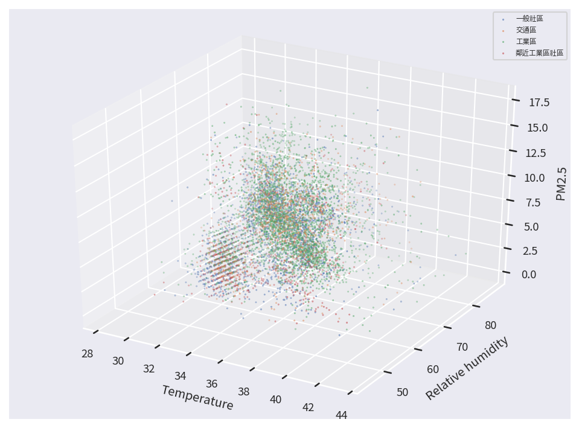

Judging from the final results, we have removed 7,709 - 7,161 = 548 outlier records in total. The distribution of the remaining data in the three-dimensional space is relatively concentrated without deviations in the periphery. For ease of observation, we plot the distribution of the three data in different dimensions by selecting two dimensions at a time.

```python
plt.rc('legend',fontsize="large")
fig, axes = plt.subplots(1,3,figsize=(24, 6))
for i in range(DataX_Numpy.shape[1]):
    for j in range(len(Label)):
        axes[i].scatter(DataX_Numpy[DataY_Numpy==j][:,i%3],DataX_Numpy[DataY_Numpy==j][:,(i+1)%3], s=1, label=Label[j])
        axes[i].legend(loc=2)
        Axis_label = ['Temperature(℃)', 'Relative Humidity(%)', 'PM2.5(μg/$m^{3}$)']
        axes[i].set_xlabel(Axis_label[i%3])
        axes[i].set_ylabel(Axis_label[(i+1)%3])
plt.tight_layout()
```


From these three graphs, we can see a special relationship between the data of different colors (area types). Although it is challenging to describe directly, we will introduce a classification model to build a dedicated classifier.

### Train data and test data

Before entering the model training of the classifier, we have another step to deal with: splitting the existing data set into training and test data. As the name suggests, the training data will be used to tune the classifier's model, while the test data will be used to test how well the built classifier works on new data. We use the following sample program to split the dataset into training and testing data at a ratio of 4:1.

```python
indices = np.random.permutation(DataX_Numpy.shape[0])
Train_idx, Test_idx = indices[:int(DataX_Numpy.shape[0]*0.8)], indices[80:(DataX_Numpy.shape[0] - int(DataX_Numpy.shape[0]*0.8))]
TrainX, TestX = DataX_Numpy[Train_idx,:], DataX_Numpy[Test_idx,:]
TrainY, TestY = DataY_Numpy[Train_idx], DataY_Numpy[Test_idx]
```

### Using the pre-built Sklearn models

We use the classifier model provided by the Python package Scikit Learn (sklearn) for training and testing. We use nine models in a series of examples, including nearest neighbor, linear SVM, RBF SVM, decision tree, random forest, neural network, Adaboost, Naive Bayes, and QDA. We sequentially introduce training data for adjustment and then test data for prediction. We compare the test data with the label content in the predicted results and use a [confusion matrix](https://en.wikipedia.org/wiki/Confusion_matrix) to present the classification results for different label combinations.

```python
classifier_names = [
    "Nearest Neighbors",
    "Linear SVM",
    "RBF SVM",
    "Decision Tree",
    "Random Forest",
    "Neural Net",
    "AdaBoost",
    "Naive Bayes",
    "QDA",
]

classifiers = [
    KNeighborsClassifier(3),
    SVC(kernel="linear", C=0.025),
    SVC(gamma=2, C=1),
    DecisionTreeClassifier(max_depth=5),
    RandomForestClassifier(max_depth=5, n_estimators=10, max_features=1),
    MLPClassifier(alpha=1, max_iter=1000),
    AdaBoostClassifier(),
    GaussianNB(),
    QuadraticDiscriminantAnalysis(),
]

fig, axes = plt.subplots(3,3,figsize=(18, 13.5))
for i, model in enumerate(classifiers):
    model.fit(TrainX, TrainY)
    Result = model.predict(TestX)
    mat = confusion_matrix(TestY, Result)
    sns.heatmap(mat.T, square=True, annot=True, fmt='d', cbar=False,
                xticklabels=Label, yticklabels=Label, ax = axes[i//3][i%3])
    axes[i//3][i%3].set_title("{},  Accuracy : {}".format(classifier_names[i], round(accuracy_score(Result, TestY), 3)), fontweight="bold", size=13)
    axes[i//3][i%3].set_xlabel('true label', fontsize = 10.0)
    axes[i//3][i%3].set_ylabel('predicted label', fontsize = 10.0)
plt.tight_layout()
```

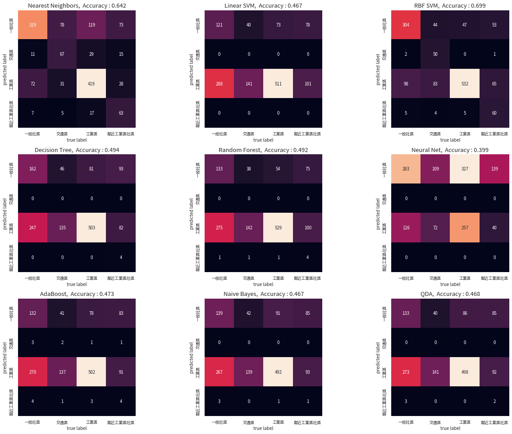

Among the classification results of these nine classification models, we found that RBF SVM can achieve a classification success rate of nearly 70%. This is only the result of using the original data without further processing and analysis. If readers are interested in the classifier, you can refer to relevant resources for more in-depth exploration, further improving the classifier's ability to classify different data types.

## Case 2: Clustering of Air Quality Sensors

In this case, we use the sensing data of the Taiwan EPA air quality monitoring station in Civil IoT Taiwan and analyze its historical data. The relationship is grouped so that each group's stations have similar sensory data trends.

### Data download and preprocessing

We use the following codes to download all the sensing data of the Taiwan EPA air quality monitoring stations in 2021 from the historical database of the Civil IoT Taiwan Data Service Platform and decompress the downloaded file into `/content` directory.

```python
!wget -O 'EPA_OD_2021.zip' -q "https://history.colife.org.tw/?r=/download&path=L%2Bepuuawo%2BWTgeizqi%2FnkrDkv53nvbJf5ZyL5a6256m65ZOB5ris56uZL0VQQV9PRF8yMDIxLnppcA%3D%3D"
!unzip -q 'EPA_OD_2021.zip' && rm 'EPA_OD_2021.zip' 
!unzip -q '/content/EPA_OD_2021/EPA_OD_202112.zip' -d '/content'
!rm -rf '/content/EPA_OD_2021'
```

We first select the data of December 2021 and delete the unnecessary fields `Pollutant`, `SiteId`, `Status`, `SO2_AVG`. Then we change the data type of the sensing data to a floating point number to facilitate subsequent processing.

```python
Dataframe = pd.read_csv("/content/EPA_OD_202112.csv", parse_dates=['PublishTime'])
Dataframe = Dataframe.drop(columns=["Pollutant", "SiteId", "Status", "SO2_AVG"])
Numerical_ColumnNames = list(Dataframe.columns.values)
for ColumnName in ['SiteName', 'County', 'PublishTime']:
    Numerical_ColumnNames.remove(ColumnName)
for Numerical_ColumnName in Numerical_ColumnNames:
    Dataframe[Numerical_ColumnName] = pd.to_numeric(Dataframe[Numerical_ColumnName], errors='coerce').astype('float64')
Dataframe = Dataframe.dropna()
Dataframe.head()
```


Due to the massive amount of data in one month, to shorten the execution time of the sample program, we extract the data of the five days from 2021-12-13 to 2021-12-17 as `FiveDay_Dataframe`, as in the example below, and use the `Country` and `SiteName` fields to merge the data. We then sort the data by when it was published.

```python
FiveDay_Dataframe = Dataframe.loc[(Dataframe['PublishTime'] <= '2021-12-17 23:00:00') & (Dataframe['PublishTime'] >= '2021-12-13 00:00:00')]
FiveDay_Dataframe['CountyAndSiteName'] = FiveDay_Dataframe['County'] + FiveDay_Dataframe['SiteName']
FiveDay_Dataframe = FiveDay_Dataframe.drop(columns=["County", "SiteName"])
FiveDay_Dataframe = FiveDay_Dataframe.sort_values(by=['CountyAndSiteName','PublishTime'])
FiveDay_Dataframe = FiveDay_Dataframe.set_index(keys = ['CountyAndSiteName'])
FiveDay_Dataframe
```

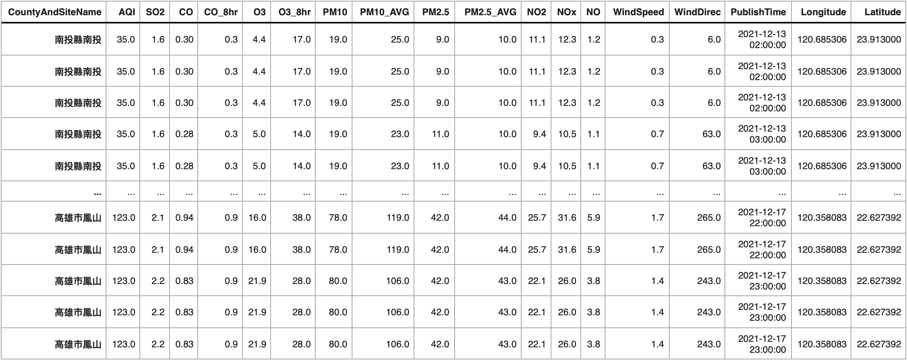

### Dynamic Time Warping (DTW)

Next, we judge the "similarity" between the two sites and quantify it into a number. The primary similarity measurement method is to directly align the data of two measuring stations according to the perception time and then calculate the gap between the two air quality measurements. However, since air pollution may occur in different orders between sites and the duration of its effects is not necessarily the same, more flexibility in estimating the similarity between two sites is needed. Therefore, we used the dynamic time wrapping (DTW) method to measure the similarity. The smaller the DTW distance between the two stations, the higher their similarity.

```python
Site_TimeSeriesData = dict()
for Site in np.unique(FiveDay_Dataframe.index.values):
    tmp = FiveDay_Dataframe[FiveDay_Dataframe.index == Site]
    tmp = tmp.groupby(['CountyAndSiteName', 'PublishTime'], as_index=False).mean()
    tmp = tmp.loc[:,~tmp.columns.isin(['CountyAndSiteName', 'PublishTime'])]
    Site_TimeSeriesData[Site] = tmp.to_numpy()

DictKeys = Site_TimeSeriesData.keys()
Sites_DTW = dict()
for i, key1 in enumerate(DictKeys):
    for j, key2 in enumerate(DictKeys):
        if i >= j: 
            continue
        else:
            Sites_DTW[str(key1)+" "+str(key2)] = fastdtw(Site_TimeSeriesData[key1][:,:-4], Site_TimeSeriesData[key2][:,:-4], dist=euclidean)[0]
Sites_DTW_keys = np.array(list(Sites_DTW.keys()))
Site_DTW_Numpy = np.array([[value] for _, value in Sites_DTW.items()])
```

We plot the DTW distance between all sites in the figure below, where the DTW distance is small to large. For further processing, we need to start analyzing with clustering algorithms.

```python
fig = plt.figure(figsize=(4, 3), dpi=150)
ax = fig.add_subplot(1,1,1)
ax.scatter(Site_DTW_Numpy[:,0], [1]*len(Sites_DTW.items()), s=0.05)
ax.get_yaxis().set_visible(False)
fig.text(0.5, 0.01, 'DTW distance', ha='center', va='center')
fig.text(0.06, 0.5, 'Group number', ha='center', va='center', rotation='vertical')
```

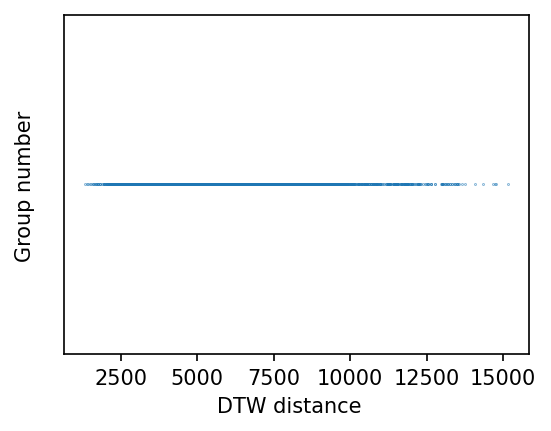

### K-Mean clustering

We use the K-Means module in the sklearn package for data clustering. Since the clustering algorithm needs to set the number of clusters to be generated in advance, we first set it to 3. We clustered using the following code and plotted the results with the cluster number as Y-axis and the DTW similarity value to other data as X-axis.

```python
from sklearn.cluster import KMeans

model = KMeans(n_clusters=3, random_state=0).fit([[value] for _, value in Sites_DTW.items()])
Result = model.labels_
for i in np.unique(Result):
    print("Number of Cluster{} : {}".format(i,len(Result[Result==i])))

fig = plt.figure(figsize=(4, 3), dpi=150)
ax = fig.add_subplot(1,1,1)
for i in np.unique(Result):
    ax.scatter(Site_DTW_Numpy[Result==i][:,0],[i]*len(Site_DTW_Numpy[Result==i]), s=0.05)
ax.get_yaxis().set_visible(False)
fig.text(0.5, 0.01, 'DTW distance', ha='center', va='center')
fig.text(0.06, 0.5, 'Group number', ha='center', va='center', rotation='vertical')
```

```
Number of Cluster0 : 1165
Number of Cluster1 : 994
Number of Cluster2 : 542
```

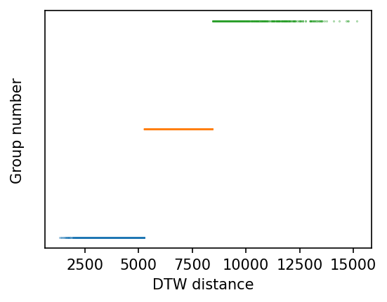

The clustering results show that the K-Means algorithm divides the original data into three clusters, with 1,165, 994, and 542 data, respectively. To further understand the causes of these three groups, we continue to trace each possible reason for the formation of a group.

### Correlation between data clusters and geographical locations

We first assume that the change in air quality is regional, so we explore whether the results of data clustering are related to the geographical location of air quality stations. We first retrieve the GPS coordinates of the stations and compute the physical distances of the two geographical locations. Then, according to the results of data clustering, we conduct a simple statistical analysis of the physical distances of different clusters and draw them in the picture below.

```python
Dist_for_Clusters = [None]*len(np.unique(Result))
for i in np.unique(Result):
    Dist_for_Cluster = []
    Cluster = Sites_DTW_keys[Result==i]
    for Sites in Cluster:
        Site1, Site2 = Sites.split(' ')
        coord1 = Site_TimeSeriesData[Site1][0,-1], Site_TimeSeriesData[Site1][0,-2]
        coord2 = Site_TimeSeriesData[Site2][0,-1], Site_TimeSeriesData[Site2][0,-2]
        Dist_for_Cluster.append(geopy.distance.geodesic(coord1, coord2).km)
    Dist_for_Cluster = np.array(Dist_for_Cluster)
    Dist_for_Clusters[i] = Dist_for_Cluster
Dist_for_Clusters = np.array(Dist_for_Clusters)
# for Dist_for_Cluster in Dist_for_Clusters:
#     print(np.mean(Dist_for_Cluster))

fig = plt.figure(figsize=(4, 3), dpi=150)
ax = fig.add_subplot(1,1,1)
for i in np.unique(Result):
    gtMean = Dist_for_Clusters[i][Dist_for_Clusters[i]>np.mean(Dist_for_Clusters[i])]
    ltMean = Dist_for_Clusters[i][Dist_for_Clusters[i]<np.mean(Dist_for_Clusters[i])]
    print("Mean Distance between Sites for Cluster{} : {}".format(i, np.mean(Dist_for_Clusters[i])))
    print("In Cluster{} there are {:.2%} less than mean, and {:.2%} greater than mean.\n".format(i, len(ltMean)/len(Dist_for_Clusters[i]), len(gtMean)/len(Dist_for_Clusters[i])))
    ax.scatter(gtMean, [i]*len(gtMean), s=0.05, color="orange")
    ax.scatter(ltMean, [i]*len(ltMean), s=0.05, color="pink")
    ax.axvline(np.mean(Dist_for_Clusters[i]), ymin = 0.45*i, ymax = 0.45*i+0.1, color = "red", linewidth=0.5)
ax.get_yaxis().set_visible(False)
fig.text(0.5, 0.01, 'DTW distance', ha='center', va='center')
fig.text(0.06, 0.5, 'Group number', ha='center', va='center', rotation='vertical')
```

```
Mean Distance between Sites for Cluster0 : 84.34126465234523
In Cluster0 there are 60.09% less than mean, and 39.91% greater than mean.

Mean Distance between Sites for Cluster1 : 180.26230465399215
In Cluster1 there are 54.53% less than mean, and 45.47% greater than mean.

Mean Distance between Sites for Cluster2 : 234.89206124762546
In Cluster2 there are 39.48% less than mean, and 60.52% greater than mean.
```

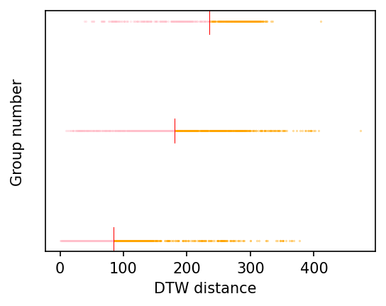

The analysis results show that the group with a higher DTW value (lower time series similarity) has a more considerable average distance between stations and vice versa. The similarity of the station data is related to the difference in geographical location, which should also support our hypothesis, confirming that the dispersion of air pollutants is indeed affected by geographical distance.

### Correlation between data clusters and wind directions

We then assume that the change in air quality is affected by the environmental wind field, so we explore whether the results of data clustering are related to the wind direction where the air quality station is located. We first retrieve the GPS coordinates of the station and convert the azimuth relationship between the two geographical locations. Then, according to the data clustering results, we calculated the correlation between the geographical location of azimuth and the wind direction on site. Finally, we conduct a simple statistical analysis of the obtained values and draw them in the figure below.

```python
def get_bearing(lat1, long1, lat2, long2):
    dLon = (long2 - long1)
    x = math.cos(math.radians(lat2)) * math.sin(math.radians(dLon))
    y = math.cos(math.radians(lat1)) * math.sin(math.radians(lat2)) - math.sin(math.radians(lat1)) * math.cos(math.radians(lat2)) * math.cos(math.radians(dLon))
    brng = np.arctan2(x,y)
    brng = np.degrees(brng)
    return brng

def Check_Wind_Dirc(brng, wind_dirc):
    if brng > 180:
        return ((brng < wind_dirc + 45) and (brng > wind_dirc - 45)) or ((brng - 180 < wind_dirc + 45) and (brng - 180 > wind_dirc - 45))
    else:
        return ((brng < wind_dirc + 45) and (brng > wind_dirc - 45)) or ((brng + 180 < wind_dirc + 45) and (brng + 180 > wind_dirc - 45))

Brng_for_Clusters = [None]*len(np.unique(Result))
Boolean_WindRelated_for_Clusters = [None]*len(np.unique(Result))
for i in np.unique(Result):
    Brng_for_Cluster = []
    Boolean_WindRelated_for_Cluster = []
    Cluster = Sites_DTW_keys[Result==i]
    for Sites in Cluster:
        Site1, Site2 = Sites.split(' ')
        coord1 = Site_TimeSeriesData[Site1][0,-1], Site_TimeSeriesData[Site1][0,-2]
        coord2 = Site_TimeSeriesData[Site2][0,-1], Site_TimeSeriesData[Site2][0,-2]
        Brng_Between_Site = get_bearing(coord1[0], coord1[1], coord2[0], coord2[1])
        Brng_for_Cluster.append(Brng_Between_Site)
        MeanWindDirc1 = np.mean(Site_TimeSeriesData[Site1][:,-3])
        MeanWindDirc2 = np.mean(Site_TimeSeriesData[Site2][:,-3])
        Boolean_WindRelated_for_Cluster.append(Check_Wind_Dirc(Brng_Between_Site, MeanWindDirc1) or Check_Wind_Dirc(Brng_Between_Site, MeanWindDirc2))
    Brng_for_Cluster = np.array(Brng_for_Cluster)
    Boolean_WindRelated_for_Cluster = np.array(Boolean_WindRelated_for_Cluster)
    Boolean_WindRelated_for_Clusters[i] = Boolean_WindRelated_for_Cluster
    Brng_for_Clusters[i] = Brng_for_Cluster
Brng_for_Clusters = np.array(Brng_for_Clusters)
Boolean_WindRelated_for_Clusters = np.array(Boolean_WindRelated_for_Clusters)

fig = plt.figure(figsize=(4, 3), dpi=150)
ax = fig.add_subplot(1,1,1)
for i in np.unique(Result):
    print("Relevance for Cluster{} : {:.2%}".format(i, len(Dist_for_Clusters[i][Boolean_WindRelated_for_Clusters[i] == True])/len(Dist_for_Clusters[i])))
    ax.scatter(Dist_for_Clusters[i][Boolean_WindRelated_for_Clusters[i] == True],\
               [i]*len(Dist_for_Clusters[i][Boolean_WindRelated_for_Clusters[i] == True]), s=2, color="green")
    ax.scatter(Dist_for_Clusters[i][Boolean_WindRelated_for_Clusters[i] == False],\
               [i]*len(Dist_for_Clusters[i][Boolean_WindRelated_for_Clusters[i] == False]), s=0.05, color="violet")
    ax.axvline(np.mean(Dist_for_Clusters[i]), ymin = 0.45*i, ymax = 0.45*i+0.1, color = "red", linewidth=2)
ax.get_yaxis().set_visible(False)
fig.text(0.5, 0.01, 'DTW distance', ha='center', va='center')
fig.text(0.06, 0.5, 'Group number', ha='center', va='center', rotation='vertical')
```

```
Relevance for Cluster0 : 54.08%
Relevance for Cluster1 : 39.24%
Relevance for Cluster2 : 22.69%
```


The analysis results show that the smaller the DTW value, the higher the correlation between the inter-station azimuth and the wind direction, and vice versa. It can be seen that the similarity of the site data is indeed related to the wind direction of the ambient wind field, which also confirms our hypothesis and confirms that the diffusion of air pollutants is certainly affected by the wind direction of the ambient wind field.

## Case 3: Clustering and Classification Application of Water and Meteorological Data

This case combines the application examples of data clustering and data classification. We use rain gauge data (Central Weather Bureau) and flood sensor data (Water Resource Agency) from Civil IoT Taiwan and use historical data analysis through data clustering to find the group of river water level stations most correlated with rainfall changes. We then use a data classification approach to predict whether a particular region will flood, given only rain gauge data.

### Data download and preprocessing

We use the following codes to download all the sensing data of the rain gauge (Central Weather Bureau) and flood sensors (Water Resource Agency) in 2021 from the [historical database](https://history.colife.org.tw/) of the Civil IoT Taiwan Data Service Platform and decompress the downloaded file into `/content` directory.

```python
!wget -O 'Rain_2021.zip' -q "https://history.colife.org.tw/?r=/download&path=L%2Bawo%2BixoS%2FkuK3lpK7msKPosaHlsYBf6Zuo6YeP56uZLzIwMjEuemlw"
!wget -O 'Rain_Stataion.csv' -q "https://history.colife.org.tw/?r=/download&path=L%2Bawo%2BixoS%2FkuK3lpK7msKPosaHlsYBf6Zuo6YeP56uZL3JhaW5fc3RhdGlvbi5jc3Y%3D"
!unzip -q 'Rain_2021.zip' && rm 'Rain_2021.zip' 
!find '/content/2021' -name '*.zip'  -exec unzip -q {} -d '/content/Rain_2021_csv' \;
!rm -rf '/content/2021'

!wget -O 'Flood_2021.zip' -q "https://history.colife.org.tw/?r=/download&path=L%2BawtOizh%2Ba6kC%2FmsLTliKnnvbLvvIjoiIfnuKPluILmlL%2FlupzlkIjlu7rvvIlf5re55rC05oSf5ris5ZmoLzIwMjEuemlw"
!wget -O 'Flood_Stataion.csv' -q "https://history.colife.org.tw/?r=/download&path=L%2BawtOizh%2Ba6kC%2FmsLTliKnnvbLvvIjoiIfnuKPluILmlL%2FlupzlkIjlu7rvvIlf5re55rC05oSf5ris5ZmoL3N0YXRpb25f5rC05Yip572y77yI6IiH57ij5biC5pS%2F5bqc5ZCI5bu677yJX%2Ba3ueawtOaEn%2Ba4rOWZqC5jc3Y%3D"
!unzip -q 'Flood_2021.zip' && rm 'Flood_2021.zip' 
!find '/content/2021' -name '*_QC.zip'  -exec unzip -q {} -d '/content/Flood_2021_csv' \;
!rm -rf '/content/2021'
```

We first deal with the rain gauge data and delete the unnecessary fields `MIN_10`, `HOUR_6`, `HOUR_12`, and `NOW`. Then we remove the data after November and store the remaining records in `Rain_df`. We also import the information on rain gauges and keep it into `Rain_Station_df`. Since the amount of data processed in this step is huge, it will take a long time; please wait patiently.

```python
csv_files = glob.glob(os.path.join("/content/Rain_2021_csv", "*.csv"))
csv_files.sort()
Rain_df = pd.DataFrame()

for csv_file in tqdm(csv_files):
    tmp_df = pd.read_csv(csv_file, parse_dates=['obsTime'])
    tmp_df.drop(['MIN_10','HOUR_6', 'HOUR_12', 'NOW'], axis=1, inplace=True)
    try:
        tmp_df = tmp_df.loc[tmp_df['obsTime'].dt.minute == 00]
        Rain_df =  pd.concat([Rain_df, tmp_df])
    except:
        print(csv_file)
        continue
Rain_df = Rain_df.loc[Rain_df['obsTime'] < "2021-11-01 00:00:00"]
num = Rain_df._get_numeric_data()
num[num < 0] = 0
Rain_df.dropna(inplace=True)
Rain_df.sort_values(by=['station_id','obsTime'], inplace=True)
Rain_Station_df = pd.read_csv('/content/Rain_Stataion.csv')
Rain_df
```

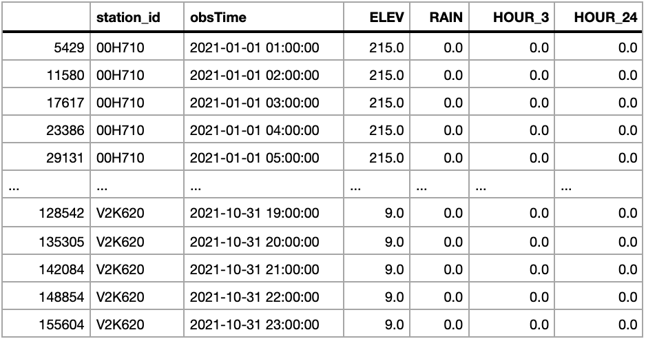

We also deal with the flood sensor data and remove the records after November. Then, we delete the records with missing values and store the remaining records in `Flood_df`. We also import the information on flood sensors and keep it into `Flood_Station_df`. The amount of data processed in this step is huge, and it will take a long time; please wait patiently.

```python
csv_files = glob.glob(os.path.join("/content/Flood_2021_csv", "*_QC.csv"))
csv_files.sort()
Flood_df = pd.DataFrame()

for csv_file in tqdm(csv_files):
    tmp_df = pd.read_csv(csv_file, parse_dates=['timestamp'])
    tmp_df = tmp_df.loc[(tmp_df['PQ_unit'] == 'cm')]
    Flood_df = pd.concat([Flood_df,tmp_df], axis=0, ignore_index=True)
Flood_df = Flood_df.loc[Flood_df['timestamp'] < "2021-11-01 00:00:00"]
Flood_df.replace(-999.0,0.0, inplace=True)
Flood_df.dropna(inplace=True)
Flood_df.sort_values(by=['timestamp'], inplace=True)
Flood_Station_df = pd.read_csv('/content/Flood_Stataion.csv')
Flood_df
```

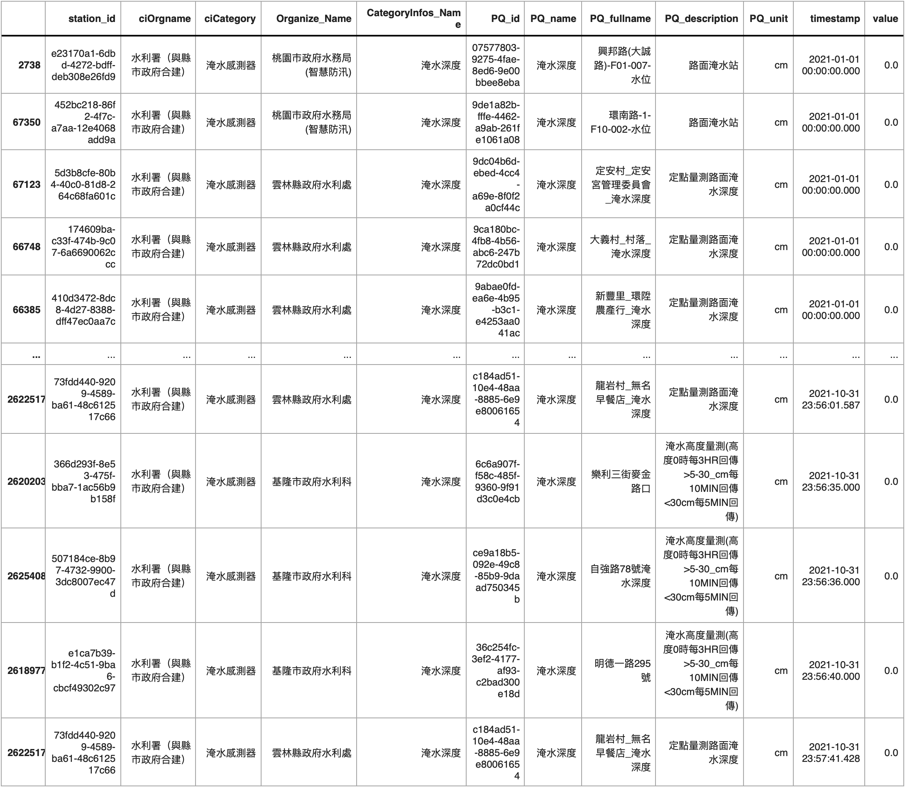

### Correlation of flood sensors and rain gauges

Due to the large amount of flood sensor data, we select the flood sensor number `43b2aec1-69b0-437b-b2a2-27c76a3949e8` located in Yunlin County and store its data in the `Flood_Site_df` object as an example of subsequent processing.

```python
Flood_Site_df = Flood_df.loc[Flood_df['station_id'] == '43b2aec1-69b0-437b-b2a2-27c76a3949e8']
Flood_Site_df.head()
```


We then compute the similarity between the rain gauge data and the selected flood sensor. We use Dynamic Time Warping (DTW) for our measurements. The smaller the value of DTW, the greater the similarity. To express the similarity more intuitively, we define the similarity in this example as the reciprocal of the DTW value and calculate the similarity between the selected flood sensor and all rain gauge data.

```python
Flood_Sensor_np = np.array([[v,v,v] for v in Flood_Site_df['value'].to_numpy()])
Site_dtw_Dist = dict()
Rain_tmp_df = Rain_df.loc[(Rain_df['obsTime'].dt.hour == 1)]
for Site in tqdm(np.unique(Rain_Station_df.loc[Rain_Station_df['city']=='雲林縣']['station_id'].to_numpy())):
    tmp_df = Rain_tmp_df.loc[(Rain_tmp_df['station_id'] == Site)]
    if tmp_df.empty:
        continue
    tmp_np = tmp_df[['RAIN','HOUR_3','HOUR_24']].to_numpy()
    Site_dtw_Dist[Site] = (1/fastdtw(Flood_Sensor_np, tmp_np, dist=euclidean)[0])
Site_dtw_Dist = dict(sorted(Site_dtw_Dist.items(), key=lambda item: item[1]))
print(json.dumps(Site_dtw_Dist, indent=4, ensure_ascii=False))
```

```
{
    "88K590": 4.580649481044748e-05,
    "C0K560": 4.744655320519647e-05,
    "C0K490": 4.79216996101994e-05,
    "C0K520": 5.038234963332513e-05,
    "C0K420": 5.0674082994877385e-05,
    "C0K250": 5.1021366345465985e-05,
    "C0K280": 5.118406054309105e-05,
    "A0K420": 5.1515699268157996e-05,
    "C0K400": 5.178763059243615e-05,
    "O1J810": 5.2282255279259976e-05,
    "C0K240": 5.2470804312991397e-05,
    "01J960": 5.334885670256585e-05,
    "C0K470": 5.438256498969844e-05,
    "81K580": 5.45854441959214e-05,
    "C0K410": 5.5066753408217084e-05,
    "A2K570": 5.520214274022887e-05,
    "01J970": 5.529887546186233e-05,
    "C0K480": 5.5374254960644355e-05,
    "C0K460": 5.5657892623955056e-05,
    "72K220": 5.5690175197363816e-05,
    "C0K510": 5.5742273217039165e-05,
    "C1K540": 5.618025674136218e-05,
    "C0K550": 5.621240903075098e-05,
    "C0K450": 5.62197509062689e-05,
    "C0K291": 5.6380522616008906e-05,
    "C0K330": 5.638960953991442e-05,
    "C0K530": 5.6525582441919285e-05,
    "C0K500": 5.6825555408648244e-05,
    "C0K440": 5.692254536595e-05,
    "C0K430": 5.697351917955081e-05,
    "01J930": 5.7648109890427854e-05,
    "C0K580": 5.770344946580767e-05,
    "C0K390": 5.782553930260475e-05,
    "01J100": 5.7933240408734325e-05,
    "01K060": 5.8343415644572526e-05
}
```

### Data clustering to find highly correlated rain gauges

We divide the rain gauges into three groups according to the similarity relationship through the clustering algorithm, and find out the group with the highest similarity and the codes of the rain gauges in this group. In our example, we found three clusters with 9, 23, and 3 rain gauges, and the second cluster had the time series data most similar to the flood sensor data.

```python
cluster_model = KMeans(n_clusters=3).fit([[value] for _, value in Site_dtw_Dist.items()])
Result = cluster_model.labels_
for i in np.unique(Result):
    print("Number of Cluster {} : {}".format(i,len(Result[Result==i])))
fig = plt.figure(figsize=(4, 3), dpi=150)
ax = fig.add_subplot(1,1,1)
fig.text(0.5, 0.01, 'DTW distance', ha='center', va='center')
fig.text(0.06, 0.5, 'Group number', ha='center', va='center', rotation='vertical')

Site_DTW_Numpy = np.array([value for _, value in Site_dtw_Dist.items()])
Site_Name_Numpy = np.array([key for key, _ in Site_dtw_Dist.items()])
Mean_Dis_For_Cluster = [None] * len(np.unique(Result))
for i in np.unique(Result):
    Mean_Dis_For_Cluster[i] = (np.mean(Site_DTW_Numpy[Result==i]))
    ax.scatter(Site_DTW_Numpy[Result==i],[i]*len(Site_DTW_Numpy[Result==i]), s=10)
    print("Mean Distance of Cluster {} : {}".format(i,Mean_Dis_For_Cluster[i]))
ax.get_yaxis().set_visible(False)
Best_Cluster = np.where(Mean_Dis_For_Cluster == np.amax(Mean_Dis_For_Cluster))[0]
Best_Site = Site_Name_Numpy[Result == Best_Cluster]
print(Best_Site)
```

```
Number of Cluster0 : 23
Number of Cluster1 : 3
Number of Cluster2 : 9
Mean Similarity of Cluster0 : 5.6307994901628334e-05
Mean Similarity of Cluster1 : 4.7058249208614454e-05
Mean Similarity of Cluster2 : 5.1629678408018994e-05
['C0K470' '81K580' 'C0K410' 'A2K570' '01J970' 'C0K480' 'C0K460' '72K220'
 'C0K510' 'C1K540' 'C0K550' 'C0K450' 'C0K291' 'C0K330' 'C0K530' 'C0K500'
 'C0K440' 'C0K430' '01J930' 'C0K580' 'C0K390' '01J100' '01K060']
```

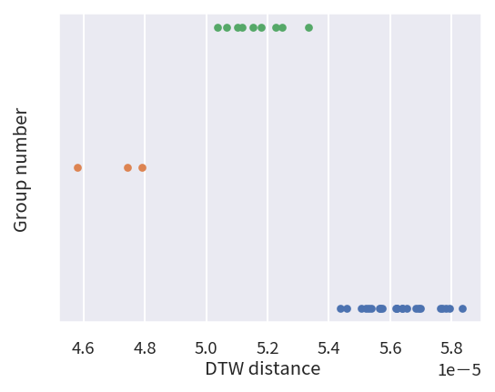

To better understand the correlation between the flood sensor and the 23 rain gauges, we plotted the sensing data of this selected flood sensor in chronological order.

```python
tmp= Flood_Site_df['value'].to_numpy()
fig= plt.figure(figsize=(6, 3), dpi=150)
ax= fig.add_subplot(1,1,1)
ax.plot(range(len(tmp)),tmp, linewidth=0.5)
ax.set_xlabel('Time sequence')
ax.set_ylabel('Water level')
```

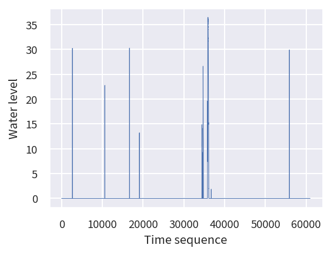

We then plotted hourly rainfall data chronologically from the 23 rain gauges in the most similar group into 23 graphs. The figures also show that when the value of the flood sensor is high, the value of the rain gauge also increases. The changing trends of the two are indeed very similar, which is in line with our common sense expectations.

```python
fig = plt.figure(figsize=(8, 2*(len(Best_Site)//4+1)), dpi=150)
for i, Site in enumerate(Best_Site):
    tmp = Rain_df.loc[Rain_df['station_id']==Site]['RAIN']
    ax = fig.add_subplot(len(Best_Site)//4+1,4,i+1)
    ax.plot(range(len(tmp)),tmp, linewidth=0.5)
```

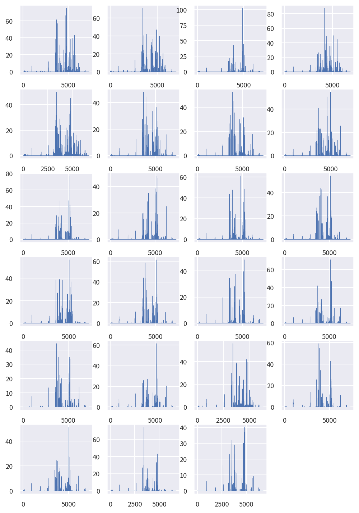

### Data classification to predict flooding by rainfall data

Next, we use the flood data recorded by the selected flood sensors as labels and use the best similarity group of rain gauges to build a simple classifier to predict whether flooding occurs at the location of the flood sensor. We divide the original data from January 2021 to October 2021 into the training data (the first seven months) and the test data (the next two months). Then we mark the data with a value greater than 0 in the flood sensor as a flood event, and data with a value of 0 is marked as having no flood events. We store the sorted data in the training data `Train_DataSet` object.

Note: In this example, based on the principle of ease of use, the most lenient standard is adopted, and events with a water level greater than 0 are identified as flood events. But in fact, there are stricter regulations for determining flood events. For proper use, it is recommended to carry out identification following relevant laws and regulations.

```python
Flooding = Flood_Site_df.loc[(Flood_Site_df['value'] > 0.0) & (Flood_Site_df['timestamp'] < "2021-08-01 00:00:00")][['timestamp', 'value']].values
Not_Flooding = Flood_Site_df.loc[(Flood_Site_df['value'] == 0.0) & (Flood_Site_df['timestamp'] < "2021-08-01 00:00:00")][['timestamp', 'value']]\
                .sample(n=10*len(Flooding)).values

Train_DataSet = {'x':[], 'y':[]}
for timestamp, _ in  tqdm(Flooding):
    tmp_x = []
    tmp_df = Rain_df.loc[(Rain_df['obsTime'] < (timestamp - timedelta(hours=1))) & (Rain_df['obsTime'] > (timestamp - timedelta(hours=60)))]
    for Site in Best_Site:
        Site_tmp_df = tmp_df.loc[(tmp_df['station_id']==Site)]
        if not Site_tmp_df.empty:
            tmp_x.append(Site_tmp_df.tail(24)[['RAIN', 'HOUR_3']].values.flatten())
    while len(tmp_x) < len(Best_Site):
        tmp_x.append(tmp_x[0])
    tmp_x = np.array(tmp_x).flatten()
    if len(tmp_x) == 24*len(Best_Site)*2:
        Train_DataSet['x'].append(tmp_x)
        Train_DataSet['y'].append(1)

for timestamp, _ in  tqdm(Not_Flooding):
    tmp_x = []
    tmp_df = Rain_df.loc[(Rain_df['obsTime'] < (timestamp - timedelta(hours=1))) & (Rain_df['obsTime'] > (timestamp - timedelta(hours=60)))]
    for Site in Best_Site:
        Site_tmp_df = tmp_df.loc[(tmp_df['station_id']==Site)]
        if not Site_tmp_df.empty:
            tmp_x.append(Site_tmp_df.tail(24)[['RAIN', 'HOUR_3']].values.flatten())
    tmp_x = np.array(tmp_x).flatten()
    if len(tmp_x) == 24*len(Best_Site)*2:
        Train_DataSet['x'].append(tmp_x)
        Train_DataSet['y'].append(0)
```

In the same way, we mark the data with a value greater than 0 in the flood sensor from August 2021 to October 2021 as a flood event, and the data with a value equal to 0 as a non-flood event. We store the sorted data in the test data `Test_DataSet` object.

```python
Flooding = Flood_Site_df.loc[(Flood_Site_df['value'] > 0.0) & (Flood_Site_df['timestamp'] > "2021-08-01 00:00:00")][['timestamp', 'value']].values
Not_Flooding = Flood_Site_df.loc[(Flood_Site_df['value'] == 0.0) & (Flood_Site_df['timestamp'] > "2021-08-01 00:00:00")][['timestamp', 'value']]\
                .sample(n=2*len(Flooding)).values

Test_DataSet = {'x':[], 'y':[]}
for timestamp, _ in  tqdm(Flooding):
    tmp_x = []
    tmp_df = Rain_df.loc[(Rain_df['obsTime'] < (timestamp - timedelta(hours=1))) & (Rain_df['obsTime'] > (timestamp - timedelta(hours=60)))]
    for Site in Best_Site:
        Site_tmp_df = tmp_df.loc[(tmp_df['station_id']==Site)]
        if not Site_tmp_df.empty:
            tmp_x.append(Site_tmp_df.tail(24)[['RAIN', 'HOUR_3']].values.flatten())
    while len(tmp_x) < len(Best_Site):
        tmp_x.append(tmp_x[0])
    tmp_x = np.array(tmp_x).flatten()
    if len(tmp_x) == 24*len(Best_Site)*2:
        Test_DataSet['x'].append(tmp_x)
        Test_DataSet['y'].append(1)

for timestamp, _ in  tqdm(Not_Flooding):
    tmp_x = []
    tmp_df = Rain_df.loc[(Rain_df['obsTime'] < (timestamp - timedelta(hours=1))) & (Rain_df['obsTime'] > (timestamp - timedelta(hours=60)))]
    for Site in Best_Site:
        Site_tmp_df = tmp_df.loc[(tmp_df['station_id']==Site)]
        if not Site_tmp_df.empty:
            tmp_x.append(Site_tmp_df.tail(24)[['RAIN', 'HOUR_3']].values.flatten())
    tmp_x = np.array(tmp_x).flatten()
    if len(tmp_x) == 24*len(Best_Site)*2:
        Test_DataSet['x'].append(tmp_x)
        Test_DataSet['y'].append(0)
```

We use the classifier model provided by the Python package Scikit Learn (sklearn) for training and testing. We use nine models in a series of examples, including nearest neighbor, linear SVM, RBF SVM, decision tree, random forest, neural network, Adaboost, Naive Bayes, and QDA. We sequentially introduce training data for adjustment and then test data for prediction. We compare the test data with the label content in the predicted results and use a [confusion matrix](https://en.wikipedia.org/wiki/Confusion_matrix) to present the classification results for different label combinations.

```python
names = [
    "Nearest Neighbors",
    "Linear SVM",
    "RBF SVM",
    "Decision Tree",
    "Random Forest",
    "Neural Net",
    "AdaBoost",
    "Naive Bayes",
    "QDA",
]

classifiers = [
    KNeighborsClassifier(3),
    SVC(kernel="linear", C=0.025),
    SVC(gamma=2, C=1),
    DecisionTreeClassifier(max_depth=5),
    RandomForestClassifier(max_depth=5, n_estimators=10, max_features=1),
    MLPClassifier(alpha=1, max_iter=1000),
    AdaBoostClassifier(),
    GaussianNB(),
    QuadraticDiscriminantAnalysis(),
]

fig, axes = plt.subplots(3,3,figsize=(18, 13.5))
for i, model in enumerate(classifiers):
    model.fit(Train_DataSet['x'], Train_DataSet['y'])
    Result = model.predict(Test_DataSet['x'])
    mat = confusion_matrix(Test_DataSet['y'], Result)
    sns.heatmap(mat.T, square=True, annot=True, fmt='d', cbar=False,
                xticklabels=["不淹水","淹水"], yticklabels=["不淹水","淹水"], ax = axes[i//3][i%3])
    axes[i//3][i%3].set_title("{},  Accuracy : {}".format(names[i], round(accuracy_score(Result, Test_DataSet['y']), 3)), fontweight="bold", size=13)
    axes[i//3][i%3].set_xlabel('true label', fontsize = 10.0)
    axes[i//3][i%3].set_ylabel('predicted label', fontsize = 10.0)
plt.tight_layout()
```

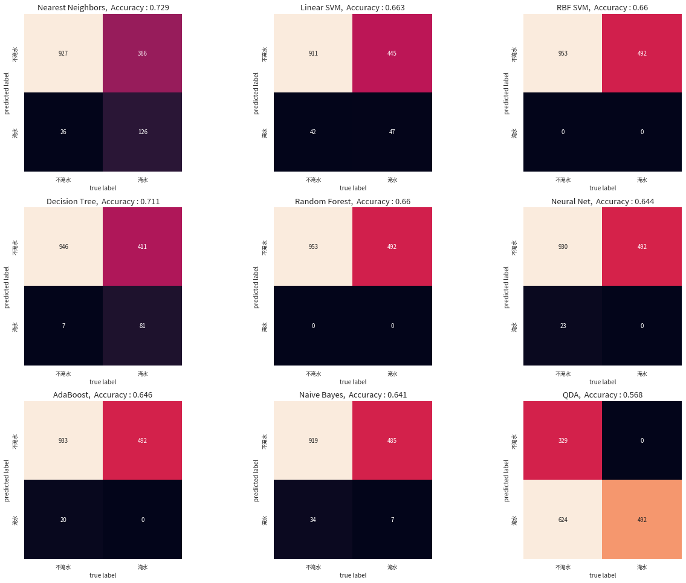

In this case, we found that the nearest neighbor method can achieve a classification success rate of nearly 7.3%. This is just the result of using raw data without further processing and analysis. If we do more research on the data itself, we still have the potential to continue to improve the classification success rate. Readers interested in classifiers can refer to related resources for more in-depth exploration, which will further enhance the ability of classifiers to classify different types of data.

## References

- Ibrahim Saidi, Your First Machine Learning Project in Python, Medium, Jan, 2022, ([https://ibrahimsaidi.com.au/your-first-machine-learning-project-in-python-e3b90170ae41](https://ibrahimsaidi.com.au/your-first-machine-learning-project-in-python-e3b90170ae41))
- Esmaeil Alizadeh, An Illustrative Introduction to Dynamic Time Warping, Medium, Oct. 2020, ([https://towardsdatascience.com/an-illustrative-introduction-to-dynamic-time-warping-36aa98513b98](https://towardsdatascience.com/an-illustrative-introduction-to-dynamic-time-warping-36aa98513b98))
- Jason Brownlee, 10 Clustering Algorithms With Python, Machine Learning Mastery, Aug. 2020, ([https://machinelearningmastery.com/clustering-algorithms-with-python/](https://machinelearningmastery.com/clustering-algorithms-with-python/))
- Alexandra Amidon, How to Apply K-means Clustering to Time Series Data, TOwards Data Science, July 2020, ([https://towardsdatascience.com/how-to-apply-k-means-clustering-to-time-series-data-28d04a8f7da3](https://towardsdatascience.com/how-to-apply-k-means-clustering-to-time-series-data-28d04a8f7da3))
- scikit-learn Tutorials ([https://scikit-learn.org/stable/tutorial/index.html](https://scikit-learn.org/stable/tutorial/index.html))
- scikit-learn Classifier comparison ([https://scikit-learn.org/stable/auto_examples/classification/plot_classifier_comparison.html](https://scikit-learn.org/stable/auto_examples/classification/plot_classifier_comparison.html))
- FastDTW - A Python implementation of FastDTW, ([https://github.com/slaypni/fastdtw](https://github.com/slaypni/fastdtw))
- Nearest Neighbors - Wikipedia, ([https://en.wikipedia.org/wiki/K-nearest_neighbors_algorithm](https://en.wikipedia.org/wiki/K-nearest_neighbors_algorithm))
- SVM Classifier - Wikipedia, ([https://en.wikipedia.org/wiki/Support-vector_machine](https://en.wikipedia.org/wiki/Support-vector_machine))
- Decision Tree - Wikipedia, ([https://en.wikipedia.org/wiki/Decision_tree](https://en.wikipedia.org/wiki/Decision_tree))
- Random Forest - Wikipedia, ([https://en.wikipedia.org/wiki/Random_forest](https://en.wikipedia.org/wiki/Random_forest))
- K-Means - Wikipedia, ([https://en.wikipedia.org/wiki/K-means_clustering](https://en.wikipedia.org/wiki/K-means_clustering))
- DBSCAN - Wikipedia, ([https://en.wikipedia.org/wiki/DBSCAN](https://en.wikipedia.org/wiki/DBSCAN))
- Hierarchical Clustering - Wikipedia, ([https://en.wikipedia.org/wiki/Hierarchical_clustering](https://en.wikipedia.org/wiki/Hierarchical_clustering))
- BIRCH - Wikipedia, ([https://en.wikipedia.org/wiki/BIRCH](https://en.wikipedia.org/wiki/BIRCH))
- Confusion matrix - Wikipedia, ([https://en.wikipedia.org/wiki/Confusion_matrix#Confusion_matrices_with_more_than_two_categories](https://en.wikipedia.org/wiki/Confusion_matrix#Confusion_matrices_with_more_than_two_categories))
