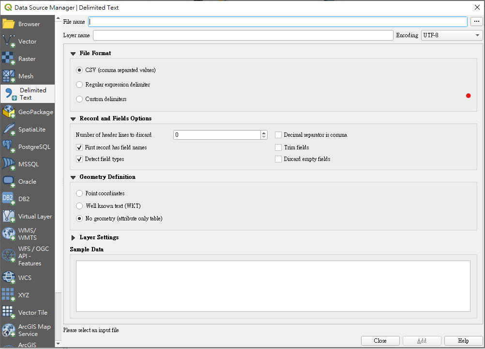
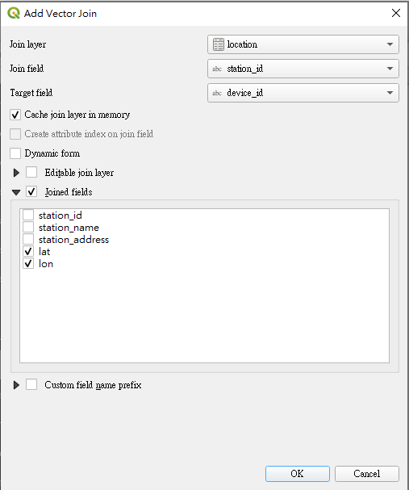
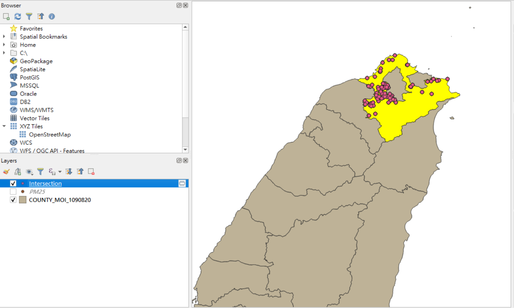
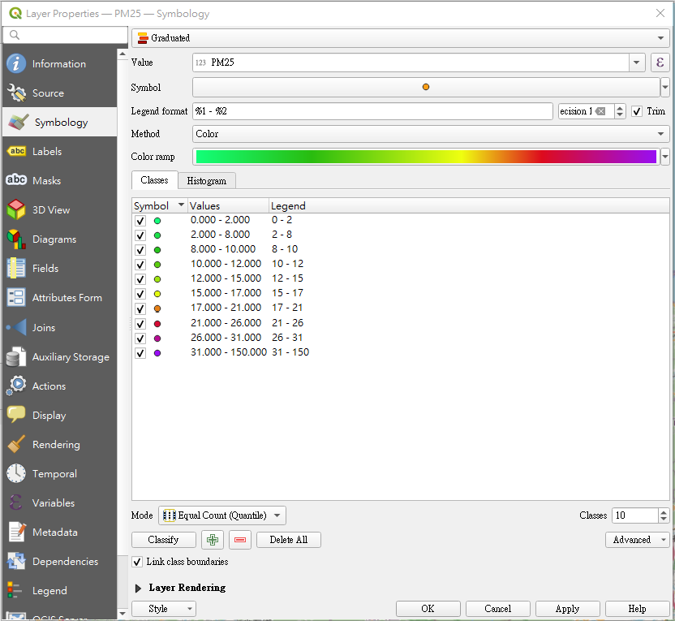
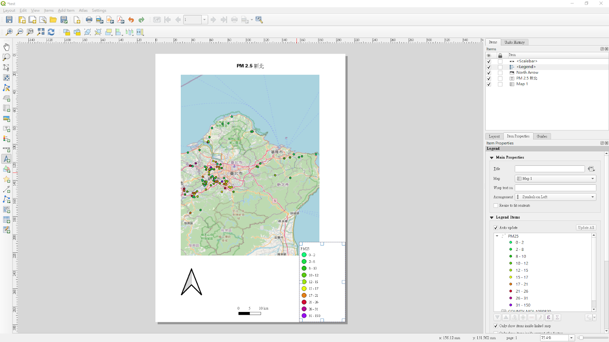
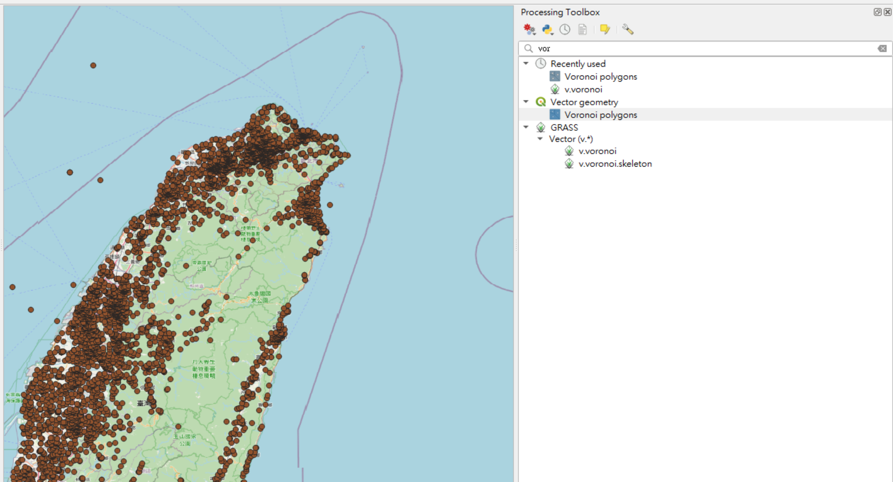



QGIS is a free geographic information system. In addition to presenting the data collected by users in the form of geographic data, users can also process, analyze and integrate geospatial data through QGIS, and draw thematic maps. In this article, we will use QGIS to assist in the analysis and presentation of PM2.5 data obtained from Civil IoT Taiwan, and output the results as a thematic map for interpretation after the analysis is complete. We also demonstrate how to combine the disaster prevention data of Civil IoT Taiwan to draw a distribution map of disaster prevention shelters through the QGIS system, allowing citizens to easily query the nearest disaster shelters.

{}
Note: The QGIS version used in this article is 3.16.8, but the functions used in this article are the basic functions of the software. If you use another version of the software, you should still be able to run it normally.
{}

## Goal

- Import data into QGIS
- Basic geographic and spatial data analysis in QGIS
- Export thematic maps from QGIS

## QGIS Basic Operation

After entering the QGIS software, you can see the following operation interface. In addition to the data frame in the middle area, the upper part is the standard toolbar, which provides various basic operation tools and functions. There are two sub-areas on the left, which are the data catalog window and layers; on the right is the analysis toolbar, which provides various analysis tools.

### Data Preparation

Data source: Civil IoT Taiwan - Historical Data ([https://history.colife.org.tw/#/?cd=%2F空氣品質%2F中研院_校園空品微型感測器](https://history.colife.org.tw/#/?cd=%2F空氣品質%2F中研院_校園空品微型感測器))

In this section, we will first describe how to import data into QGIS. Since some data will be split into multiple different data tables during the storage process, we should pay special attention to whether this is the case with the data at hand when analyzing, and recombine the data into the original single data table. Here's how to recombine the data:

- Import data
  
  First, we need to import the csv file directly downloaded from Civil IoT Taiwan Historical Data into QGIS. Since there are Chinese characters in the data, garbled characters will be displayed when importing, so the import method is Layer (at the top menu) > Add Layer > Add Delimited Text Layer, and the import interface is as follows:
  
    
- Join data

  Since the original data divides PM2.5 and station coordinates (latitude and longitude) into two files, it is necessary to join PM2.5 and latitude and longitude coordinates first.
  
  The join method is as follows, right-click the file to be joined > Properties > joins > click the + sign to enter Add Vector Join, as shown below
  
  There are four options after entering:
  - Join Layer: the layer you want to join
  - Join field: corresponding to the Target field, which is the reference for Join (similar to Primary key)
  - Target field: corresponding to the Join field, which is the reference for Join (similar to Foreign key)
  - Joined field: the fields you want to join
  
    

### GeoJSON Output

Then we use the built-in functions of QGIS to convert the original csv data into [GeoJSON](https://en.wikipedia.org/wiki/GeoJSON) files, which is a geographical data representation in JSON format. The operation procedure is to click Processing > Toolbox > Create points from table.

Please note that after clicking, select the Table to be imported, select lon in X, enter lat in Y, and specify WGS 84 (latitude and longitude coordinates) in Target CRS, and then enter the name of the file to be output, as shown below.

Then select the file format you want to export, and click "Save".

### Data Filter and Change Colors

Next, we demonstrate how to use QGIS to filter the required stations, and let the color of the stations change with the PM2.5 value.

- Use Intersection to filter the required stations by county
    
  Before screening, you need to download the shp files of municipalities, counties and cities from the [government data open platform](https://data.gov.tw/dataset/7442), and then import the shp files of the county and city boundaries into QGIS, as shown below:
  {}
  Note: In the Civil IoT Taiwan project, National Chi Nan University is responsible for the deployment of micro air quality sensors in Changhua and Nantou counties and cities. Therefore, in the data obtained this time, there is no Changhua and Nantou. material.
  {}
  
  Then we click on the icon for “Select Feature”, then click on “Country of Country” and select the desired county. Selected counties will be displayed in yellow. Here we take New Taipei City as an example, as shown in the following figure:
  
  We then look for the “Intersection” function in “Processing Toolbox”, and after clicking, the following interface will appear, in which there are three input options, namely:
  - Input Layer
  - Overlay Layer
  - Intersection (Output)

  Next, please put the PM2.5 layer in the “Input Layer”, put the county-city boundary layer in the “Overlay Layer” and check “Select features only”, which means that only the stations that intersect with the New Taipei City selected in the previous step are filtered out. Next, enter the name of the file to be exported in the “Intersection”. The supported export file format options are the same as the previously selected options.

  Then, the following results will be obtained:

    
- Display different colors according to the value of PM2.5
    
  Then we right click on the PM2.5 layer > Properties > Symbology to see the dot color settings. The color setting steps for each PM2.5 station are as follows:
    
  1. Change the top original setting from “No Symbols” to “Graduated” as follows
  2. Select PM25 in the “Value” part
  3. Click the “Classify” button at the bottom
  4. Set the number of colors in “Classes” (Note: It is recommended to set the number of categories should not be too many)
  5. Go to “Color ramp” to set the color of each value
  6. Clock “OK”

  When everything is set, you will get the following image, where the color of the dots changes with the PM 2.5 value, and the Layer on the right shows the PM 2.5 value represented by the different colors.
  {}
  Note: The new version of QGIS (after 3.16) already has the basemap of OpenStreetMap, you can click XYZ Tiles -> OpenStreetMap in the figure below to add the OSM basemap.
  {}
    

    

### Export Thematic Maps

After completing the above settings, the next step is to output the QGIS project as a JPG image. After we click Project > New Print Layout, the Layout name setting will pop up. After the setting is completed, the following screen will appear:

Click “Add map” on the left, and select the range on the drawing area to add the PM 2.5 map, as shown below

Next, click “Add Legend” on the left and select a range to import the label, while the “Item Properties” on the right can be used to change the font size, color, etc. in the label. Finally, we put the title, scale bar, and compass to complete the thematic map.

Finally, click Layout > Export as Image in the upper left corner to export the thematic map as an image file.

## Example 2: Distribution of Emergency Shelters

Data source: [https://data.gov.tw/dataset/73242](https://data.gov.tw/dataset/73242)

In the government's public information, Taiwan's emergency shelters have been organized into electronic files for the convenience of citizens to download and use. In this example, we'll use this data to describe how to find the closest shelter to home via QGIS.

We first obtain the shelter information from the above URL, and then load the information according to the method mentioned above, as shown below:

Due to the large number of shelters in Taiwan, this article only analyzes the shelters in Taipei City, and other counties and cities can also be analyzed in the same way. Readers are welcome to try it for themselves. We first use the above intersection method to find the shelters in Taipei City, and then use the Voronoi Polygons on the side toolbar to draw the Voronoi diagram, as shown below:

Fill in the layer of the shelters in Voronoi Polygons and press “Run”

According to the characteristics of Voronoi Diagram, we can know the location of the closest shelter to our house, as shown below:

After the analysis is completed, the analysis results can be produced into a thematic map according to the previous method.

## Conclusion

In this chapter, we introduced how to import data into QGIS, and how to use the analysis tools in QGIS to investigate the data. Finally, we introduce the method of data exporting, which can make the analyzed data into thematic maps for interpretation. Of course, there are still many functions in QGIS that are not covered in this chapter. If you are interested in QGIS, you can refer to additional resources below.

## References

- QGIS: A Free and Open Source Geographic Information System ([https://qgis.org/](https://qgis.org/))
- QGIS Tutorials and Tips ([https://www.qgistutorials.com/en/](https://www.qgistutorials.com/en/))
- QGIS Documentation ([https://www.qgis.org/en/docs/index.html](https://www.qgis.org/en/docs/index.html))
