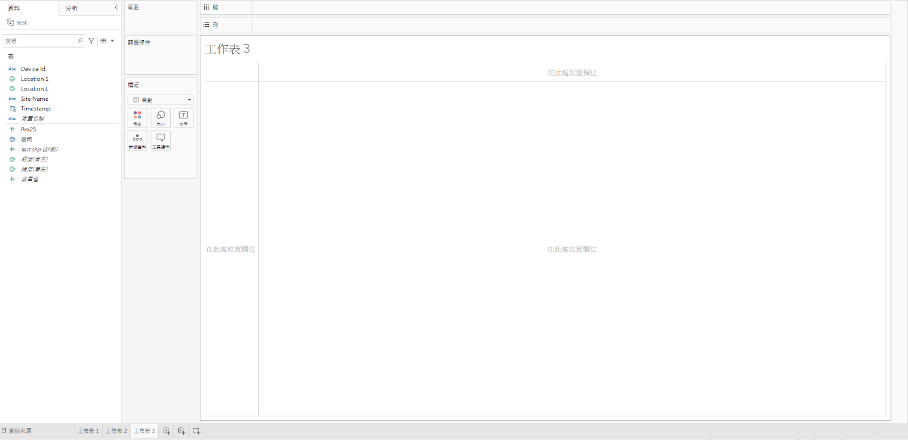
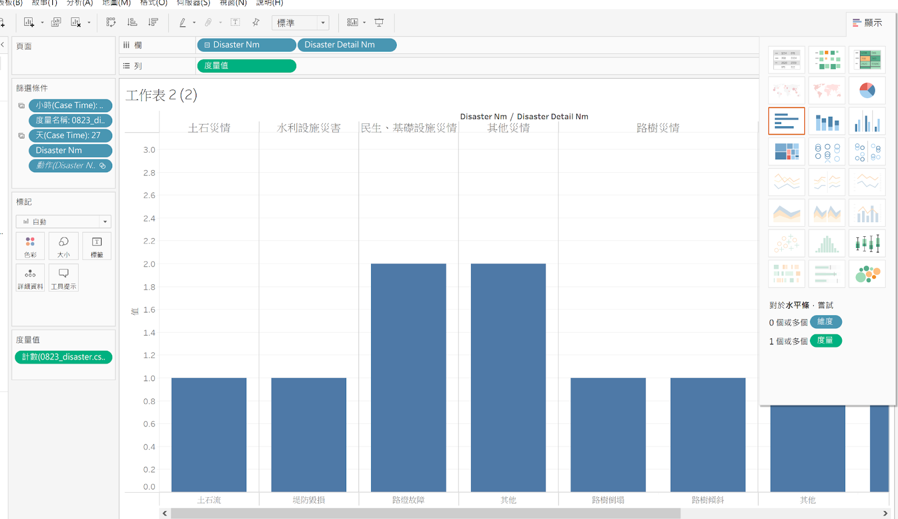
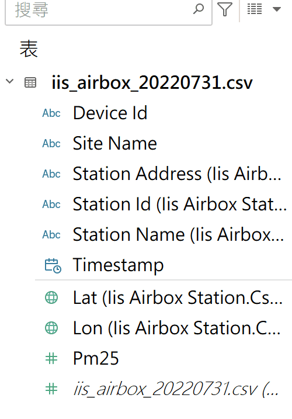
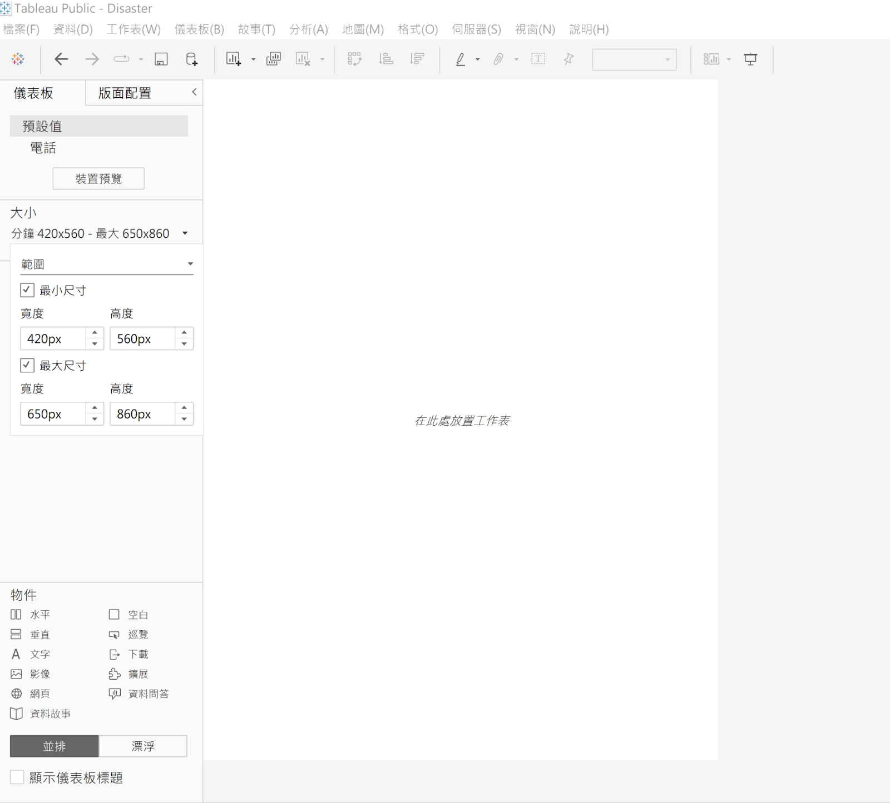
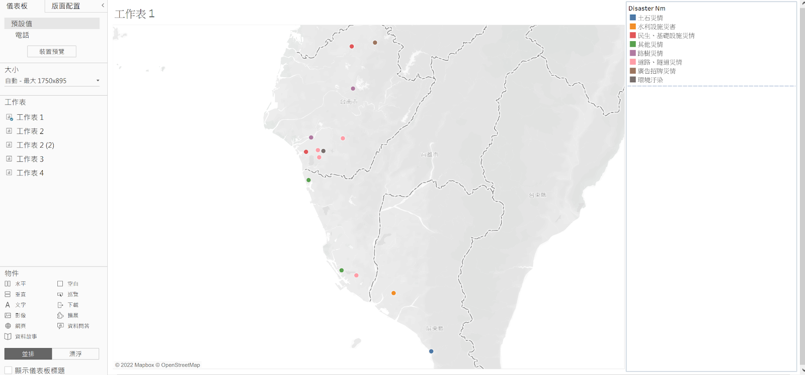
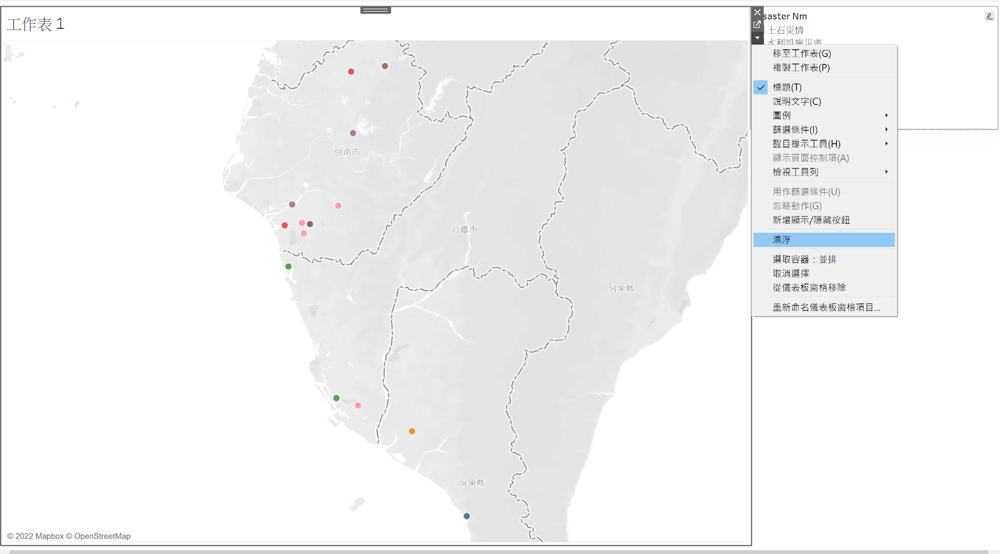
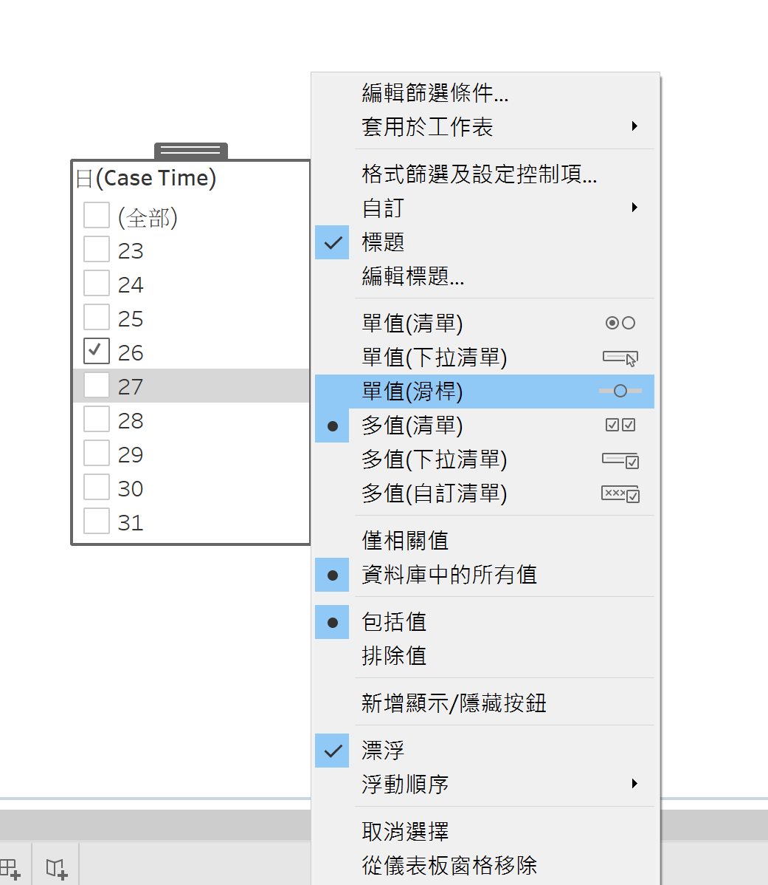
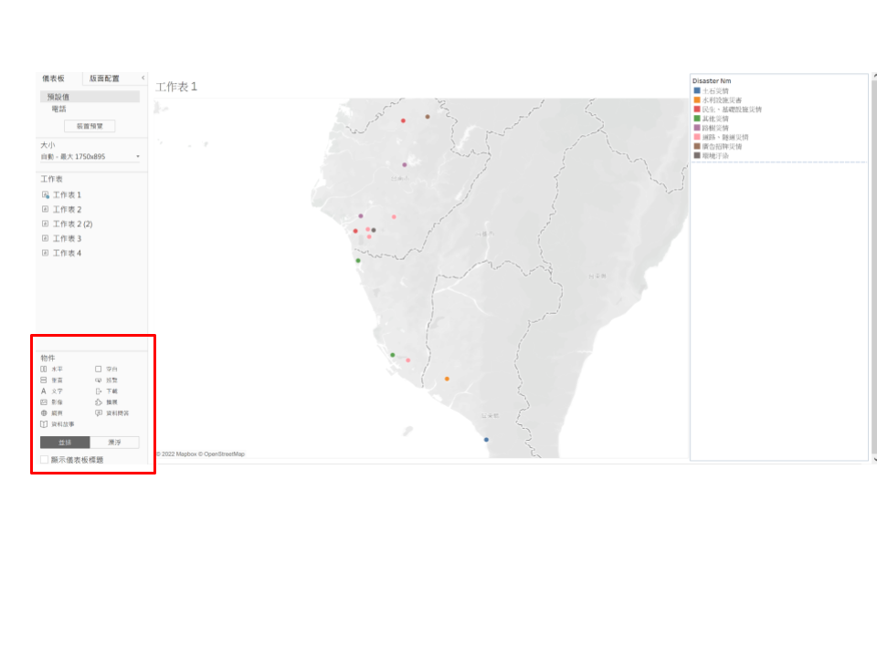



Data visualization is a method of expressing data in a graphical way, which can help us to have a better understanding of the data. When visualizing data, different types of graphs are suitable for different types of data. For example, when presenting data with latitude and longitude coordinates, map-type charts are mostly used; when presenting time series data, line charts or histograms can be used. However, many real-world data often have more than one characteristic. For example, the sensor data of Civil IoT Taiwan has both latitude and longitude coordinates and time series characteristics. Therefore, when presenting these data, it is often necessary to use more than one kind of chart to present the insight of the data. In this chapter, we will introduce a very popular software, Tableau, to help us present the above-mentioned complex data types.

Tableau is an easy-to-use visual analysis platform. In addition to quickly creating various charts, its dashboard function makes it easier for users to present and integrate different data charts. In addition, dashboards allow users to interact with graphs, which not only helps users understand data more easily and quickly, but also makes data analysis easier. Tableau was originally a paid commercial software, but it also provides a free version of [Tableau Public](https://public.tableau.com/) for everyone to use. Note, however, that when using the free version of Tableau, all work produced with it must be made public.

{}
Note: The Tableau Public version used in this article is Tableau Desktop Public Edition (2022.2.2 (20222.22.0916.1526) 64-bit), but the functions used in this article are the basic functions of the software. If you use other versions of the software, you should still be able to run it normally.
{}

## Goal

- Import data into Tableau for data visualization
- Create data charts using Worksheets
- Create interactive charts and reports using dashboards and stories in Tableau Public

## Data Source

- Civil IoT Taiwan Historical Data: Academia Sinica - Micro Air Quality Sensors ([https://history.colife.org.tw/#/?cd=%2F空氣品質%2F中研院_校園空品微型感測器](https://history.colife.org.tw/#/?cd=%2F空氣品質%2F中研院_校園空品微型感測器))
- Civil IoT Taiwan Historical Data: National Fire Agency - Disaster Notifications ([https://history.colife.org.tw/#/?cd=%2F災害示警與災情通報%2F消防署_災情通報](https://history.colife.org.tw/#/?cd=%2F%E7%81%BD%E5%AE%B3%E7%A4%BA%E8%AD%A6%E8%88%87%E7%81%BD%E6%83%85%E9%80%9A%E5%A0%B1%2F%E6%B6%88%E9%98%B2%E7%BD%B2_%E7%81%BD%E6%83%85%E9%80%9A%E5%A0%B1))

## Tableau Basic Operation

### Data Import

Tableau can read text files (csv) and spatial information files (shp, geojson). To import data, click Data > Add Data Source to select the data file to be imported.

Depending on the type of input file, we provide different examples of operations below:

- Examples using geospatial data format (shp、geojson)
    1. First, please click the data source in the lower left corner, and then you can see the data fields imported now.
        
      
 
    2. Then click the symbol above the field name to change the properties of that field.
        
       
 
    3. Finally, we assign the latitude and longitude coordinates to geographic roles for subsequent work.
        
       

- Examples using test data format (CSV)
    1. After importing the PM 2.5 records and station locations into Tableau, we establish the relationship between the data tables:
 
       
 
    2. Next we establish the link between the PM 2.5 station and the station coordinates. We first click the station data twice to enter the connection canvas, and drag another data table to the connection canvas.
        
       
 
    3. Finally, we click the link icon in the middle to set the link type and operation logic.
        
       
 
    4. When the setting is completed, you can see that the Station id in the lower right corner is from the Location data table, so that the PM 2.5 data and the station location data are linked together.

### Worksheet Introduction

A worksheet is where Tableau can use to visualize data. In addition to plotting data into traditional graphs such as pie, bar, and line graphs, it can also be used to map geographic information. Next we will show how to draw different shapes.

After processing the data, click the new worksheet in the lower left, and you can see the interface below after entering the worksheet.

There is a "Show" button in the upper right corner of the worksheet. After clicking, you will see different types of charts (the system will automatically determine the charts that can be drawn, and those that cannot be drawn will be highlighted), and then you can click the desired type to change the chart.

## Tableau Example 1: Spatio-temporal Distribution of Air Quality Data

### Spatial Distribution Graph

Before starting to draw, we need to change the latitude and longitude from a measure to a dimension. For a detailed explanation of the measure and dimension, please refer to the [reference materials](https://help.tableau.com/current/pro/desktop/en-us/datafields_typesandroles.htm). The detailed operation process is shown in the following animation:

Then we drag the latitude and longitude to the position of the column and row, and drag the PM 2.5 value to the marked position. Then we change the mark to color to generate the distribution map of PM 2.5 in Taiwan, as shown in the following animation.

We can click on the color to change the color of the dots, and the filter above can filter the PM 2.5 value for a specific condition. If you click PM 2.5 > Metric, you can select the mean, sum, or median value of PM 2.5. The following will demonstrate how to display the PM 2.5 value for New Taipei City.

1. Drag “Site Name” to filter
2. Click on wildcards, click “Include” and enter New Taipei City
3. Click “OK”

### Time Series Graph

We drag "Timestamp" to the column and "Site Name" and PM 2.5 value to the row. Then we click "Timestamp" to set the time interval. For example, we set the interval to 1 hour in the image below. Note that, similar to plotting the spatial distribution, the filter function can also be used to filter the stations to be displayed. In the animation below, we demonstrate how to display the monitoring values of the Kaohsiung PM2.5 station throughout the day.

## Tableau Example 2: Disaster Notification Dashboard

Dashboards can combine different worksheets (charts) to present richer information and allow users to interact with thedata. In the following example, we will introduce how to create a simple dashboard using the rainstorm disaster data provided by the Civil IoT Taiwan project.

### Disaster data format conversion

We use the 823 flood that occurred on 2018/08/23 as an example. Since the original data format is an xml file, we first use the following URL to convert the original data to a csv file: [https://www.convertcsv.com/xml-to-csv.htm](https://www.convertcsv.com/xml-to-csv.htm) (animated below)

### Dashboard size

After clicking Dashboard in the Tableau menu, you can set the size of the dashboard in the tool list on the left.

### Add worksheets to a dashboard

Then you can see the previously created worksheet in the tool list on the left, you can add it to the dashboard by dragging and dropping the worksheet to the empty space of the dashboard.

After Tableau receives the data of the worksheet, it will automatically read the information of the content and automatically generate the corresponding initial chart.

The worksheet you just dragged in has a fixed size and cannot be changed at will. There is a downward arrow at the top right of the worksheet, and you can change the size of the graph by clicking and selecting "Float".

### Add interactions

Next, we demonstrate how to provide an interactive interface that allows users to select the point in time in the disaster data that they want to observe.

We start by clicking the down arrow in the upper right corner of the sheet, then selecting Filters, then Case Time.

After clicking, you will see a selection field pop up in the worksheet where you can check the date. At this time, the user only needs to check the date they want to observe, and then they can see the disaster situation on that day.

If we want to change the date selection method, we can also click the down key at the top right of the selection field to change the style of the selection field.

For example, we can change the selection method from the original list method to the slider method as follows.

### Interacting multiple worksheet

The above interaction buttons can only be used for one worksheet. If you want multiple worksheets on the dashboard to share the same interactive button at the same time, you can refer to the following methods:

1. According to the above method, first create an interactive button field;
2. Click the down button at the top right of the interactive button field, select Apply to worksheet and click the selected worksheet;
 
   
 
3. Select the worksheet to apply to complete the setting.
    
   
 

### Additional information

If you need to add other information on the dashboard, you can find an object column at the bottom left of the toolbar, which contains text, pictures and other objects. Just drag and drop the required objects to the top of the dashboard to display them in the dashboard, and then add text, pictures and other objects.

## Story

A story is a combination of multiple dashboards or sheets used to create a slideshow-like display. Adding a story to a dashboard or sheet is the same as adding a sheet from a dashboard, just drag the sheet or dashboard created on the right to the empty space of the story.

If you need to add a new story page, you can click New Story at the top to add a new blank page, or copy an existing page to become a new page.

Finally, to make the text information better fit its content, we can modify the title of the page by double-clicking the box above the text page.

## Conclusion

In this chapter, we briefly introduce the basic operations of Tableau, and use Tableau to design presentations/charts that interact with users. However, Tableau's functions are far more than these, and there are many classic examples created using Tableau on the Internet. If you are interested in Tableau, you can refer to additional resources below.

## References

- Tableau Public ([https://public.tableau.com/](https://public.tableau.com/))
- Tableau - About data field roles and types ([https://help.tableau.com/current/pro/desktop/en-us/datafields_typesandroles.htm](https://help.tableau.com/current/pro/desktop/en-us/datafields_typesandroles.htm))
- Get Started with Tableau ([https://help.tableau.com/current/guides/get-started-tutorial/en-us/get-started-tutorial-home.htm](https://help.tableau.com/current/guides/get-started-tutorial/en-us/get-started-tutorial-home.htm))
- Tableau Tutorial — Learn Data Visualization Using Tableau ([https://medium.com/edureka/tableau-tutorial-71ef4c122e55](https://medium.com/edureka/tableau-tutorial-71ef4c122e55))
- YouTube: Tableau For Data Science 2022 ([https://www.youtube.com/watch?v=Wh4sCCZjOwo](https://www.youtube.com/watch?v=Wh4sCCZjOwo))
- YouTube: Tableau Online Training ([https://www.youtube.com/watch?v=ttCDqyfrcEc](https://www.youtube.com/watch?v=ttCDqyfrcEc))

