

在資料分析中，將資料視覺化往往可以協助我們對資料有更進一步的理解。而在將資料圖像化時，不同的資料類型在進行資料圖像化時所使用的圖表類型也有所不同，例如在呈現有經緯度座標的資料時，多半會使用地圖類的圖表，而在呈現時間序列資料時，則可以使用折線圖、直方圖等。然而，許多的資料常常具備不只一種特性，如民生公共物聯網的感測器資料就同時具備了經緯座標及時間序列，因此在呈現時，往往需要用到不只一種圖表才能呈現資料的意涵。而本章節要來介紹一款十分方便的軟體 Tableau，來幫助我們呈現上述複雜的資料型態。

Tableau 是一個提供使用者容易上手的視覺化分析平台，除了可以用其來快速製作各式圖表外，其 Dashboard 更是可以讓使用者更加方便地呈現不同的圖表資料；此外，Dashboard 還可以讓讀者與圖表進行互動，除了可以幫助讀者更加輕鬆快速地理解資料外，同時也讓資料分析變得更加地容易。Tableau 原本是一款付費的商業軟體，不過它也有提供免費版的 [Tableau Public](https://public.tableau.com/)，來供大家使用。然而要注意的是，因為是 "Public" 所以利用它所製作出來的成果均會被公開。

{}
本文所操作之 Tableau Public 版本為 Tableau Desktop Public Edition (2022.2.2 (20222.22.0916.1526) 64 位)，惟本文所使用之功能皆為該軟體之基本功能，若使用其他版本軟體，應仍可正常操作。
{}

## 章節目標

- 知道如何將資料導入 Tableau 進行圖像化呈現
- 利用工作表 (Worksheet) 來繪製出分析圖表
- 利用儀錶板 (Dashboard) 及文本 (Story) 來設計出互動式圖表/簡報

## 資料來源

- 民生公共物聯網歷史資料 - 空品資料 - 中研院_校園空品微型感測 ([https://history.colife.org.tw/#/?cd=%2F空氣品質%2F中研院_校園空品微型感測器](https://history.colife.org.tw/#/?cd=%2F空氣品質%2F中研院_校園空品微型感測器))
- 民生公共物聯網歷史資料 - 災害示警與災情通報 - 消防署_災情通報 ([https://history.colife.org.tw/#/?cd=%2F災害示警與災情通報%2F消防署_災情通報](https://history.colife.org.tw/#/?cd=%2F%E7%81%BD%E5%AE%B3%E7%A4%BA%E8%AD%A6%E8%88%87%E7%81%BD%E6%83%85%E9%80%9A%E5%A0%B1%2F%E6%B6%88%E9%98%B2%E7%BD%B2_%E7%81%BD%E6%83%85%E9%80%9A%E5%A0%B1))

## Tableau 基本操作說明

### 資料導入

Tableau 可以讀取文字檔 (csv) 及空間資訊檔 (shp、geojson)，要匯入資料時點選 資料 > 新增資料來源，來選擇要匯入的資料檔案。

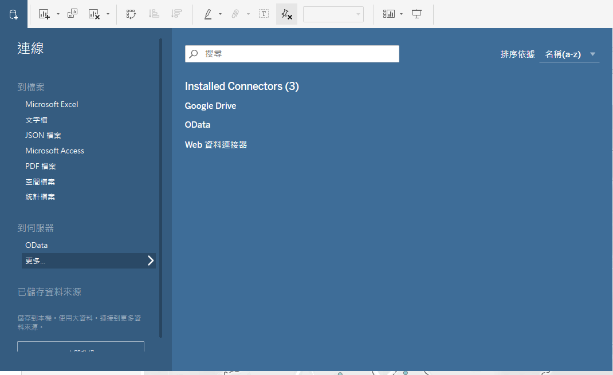

根據輸入的檔案類型不同，下面提供不同的操作範例：

- 空間檔案 (shp、geojson) 匯入範例
    1. 首先點擊左下角的資料來源，可以看到現在匯入的資料欄位等。
        
      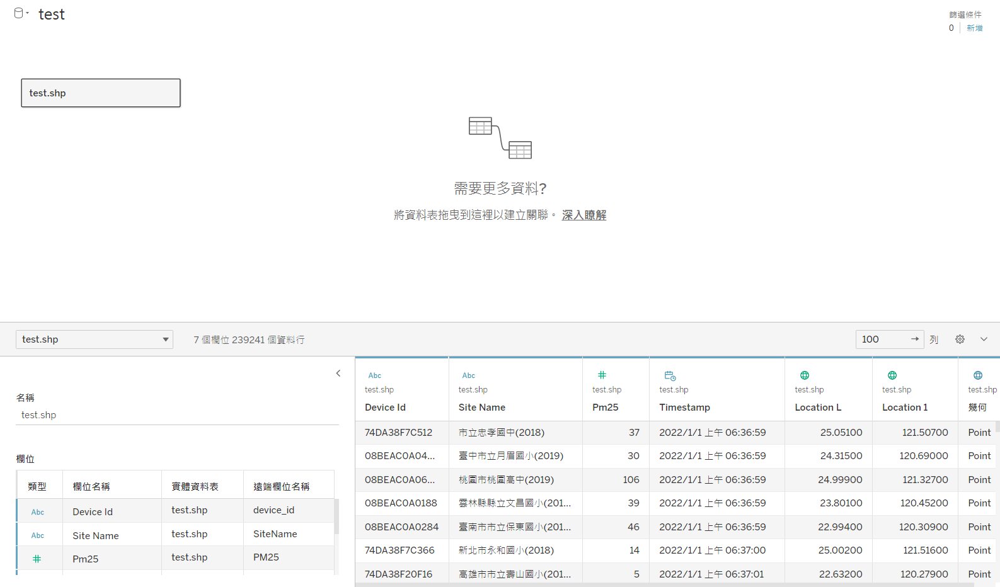
 
    2. 接著點擊欄位名稱的上方符號可以更改該欄位資料的屬性。
        
       
 
    3. 最後將經緯度座標賦予地理角色，以便後續的繪圖工作
        
       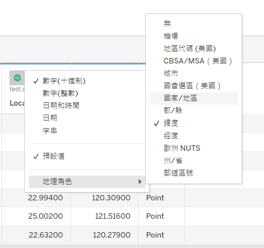
 
- 文字檔案 (CSV) 匯入範例
    1. 將 PM 2.5 的紀錄值及測站位置匯入 Tableau 後，先建立起資料表之間的關係：
        
       
 
    2. 接下來建立 PM 2.5 測站與測站座標之間的連結，點擊兩下測站資料進入聯結畫布，將另一個資料表拖到聯結畫布上。
        
       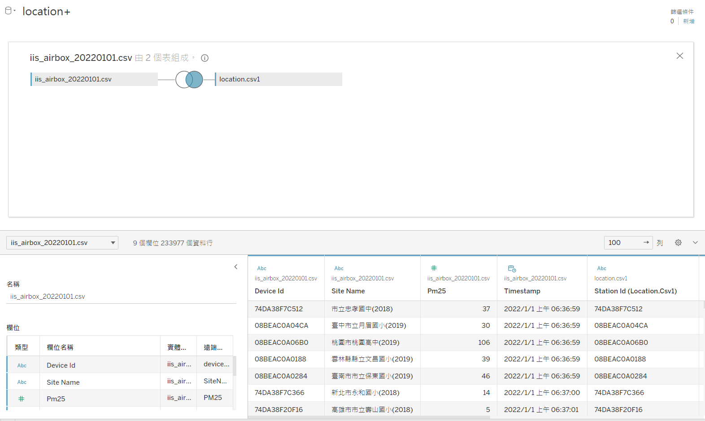
 
    3. 最後點選中間的連結圖示，設定連結形式以及運算邏輯。
        
       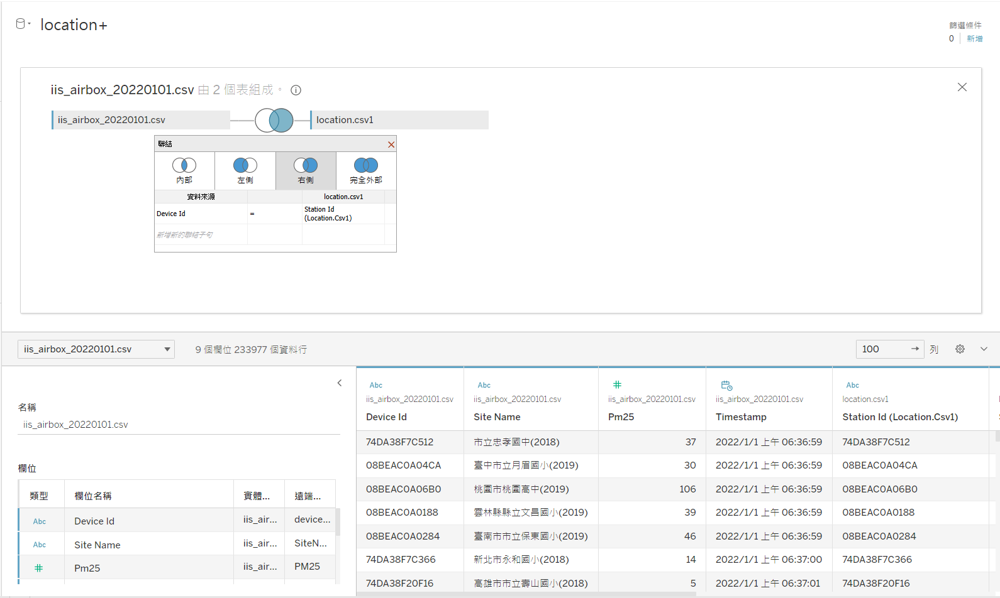
 
    4. 當設定完成後，可以看到右下角的 Station id 是從 Location 的資料表來的，這樣一來就把 PM 2.5資料與測站位置資料連結在一起了。

### 工作表 (Worksheet) 簡介

工作表是 Tableau 可以用來將資料視覺化的地方，除了可以將資料繪製成圓餅圖、長條圖、折線圖等傳統圖形外，也可以用來繪製地理資訊的地圖。接下來將來展示如何繪製不同的圖表。

在處理完資料後，點選左下的新增工作表來進行繪圖，進入工作表後可以看到下圖介面。

在工作表的右上方有一個顯示的按鈕，點擊下去後便會看到不同類型的圖表 (系統會自動判斷可以繪製的圖表，無法繪製的會以反白的方式來呈現) ，接著可以點擊想要的圖表來更改圖表類型。

## Tableau 應用範例ㄧ：空品資料時空分佈圖

### 繪製空間分布圖 (地理資訊地圖)

在開始繪製之前，我們需要先將經緯度從度量改成維度，有關度量及維度的詳細解說可見[參考資料](https://help.tableau.com/current/pro/desktop/zh-tw/datafields_typesandroles.htm)，詳細操作過程如以下動畫：

接著我們將經緯度拉到欄及列的位置，並將PM 2.5值拉到標記位置並將其標記改為色彩，即可產生全台PM 2.5的分布圖，如以下動畫。

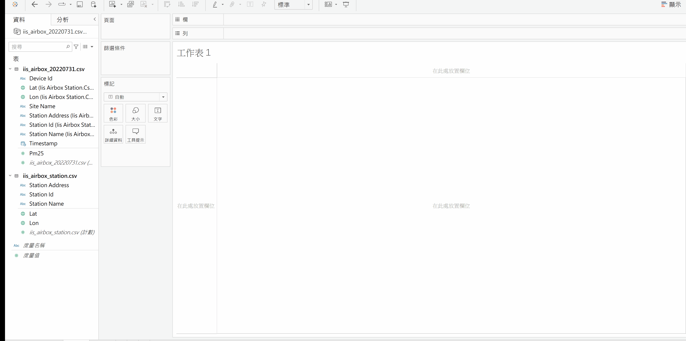

我們可以點選色彩來改變圓點的顏色，而在上方的篩選條件則可以篩選特定條件的PM 2.5值，並且點選 PM 2.5 >度量，則可以選擇 PM 2.5 的平均值、總和、中位數等。下面將示範如何顯示新北市的 PM 2.5值。

1. 將Site Name拉到篩選條件
2. 點選萬用字元，選擇包含後輸入新北市
3. 點選確定

### 繪製時間分布圖(折線圖)

我們將 Timestamp 拉到欄，並將 Site Name 及 PM 2.5 值拉到列。接著點選 Timestamp 便可以設定時間的間隔，例如下圖中我們將時間間隔設定為 1 小時。注意：跟繪製空間分布圖時一樣，這裡也可以用篩選功能對要展示的測站進行篩選。而下方的動畫中，我們示範了如何顯示位於高雄的PM2.5一整天的監測數值。

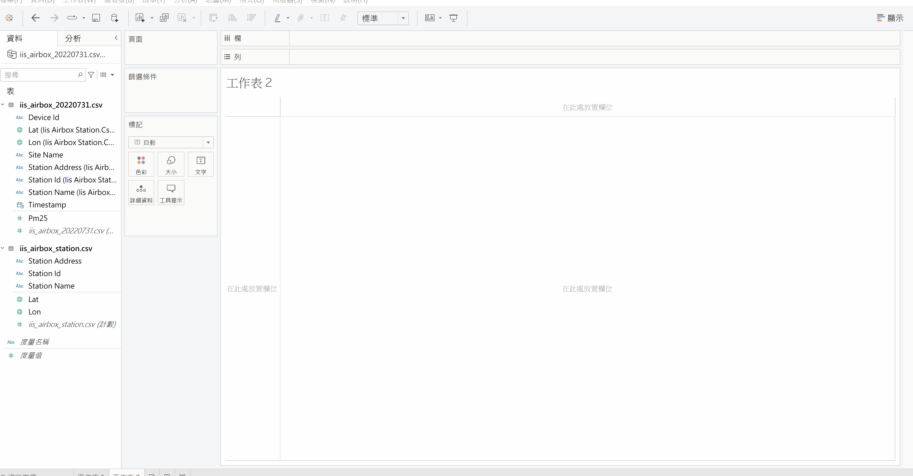

## Tableau 應用範例二：災情通報資料儀表板 (Dashboard)

儀錶板可以將不同的工作表 (圖表) 組合在一起，以此來呈現更加豐富的資訊，並讓使用者可以動態的檢視資料，在接下來的範例中，我們將介紹如何建立簡單的儀表板。由於在前面的文章中我們已經用過空品資料做為範例，因此我們在這邊將改使用暴雨災情資料來作為後續示範用途。

### 災情資料格式轉換

我們使用 2018/08/23 所發生的 823 水災為例，由於原始檔案格式為 xml 檔，我們首先使用下方網址將原始檔案轉為csv檔：[https://www.convertcsv.com/xml-to-csv.htm](https://www.convertcsv.com/xml-to-csv.htm)    (如下動畫)

### 儀錶板大小設定

在 Tableau 選單中點選儀錶板後，在左方的工具列表中可以設定儀表板的大小。

### 將工作表加入儀錶板

接著在左方的工具列表中可以看到之前創建的工作表，將其拖拉至儀表板的空白處，即可在儀表板中加入工作表。

Tableau 在接收到工作表的資料後，便會自動讀取內容的資訊，並自動產生對應的初始圖表。

由於剛拖入的工作表是固定大小且無法隨意改變的，這時在工作表的右上方有一個往下的箭頭，點下後選擇「漂浮」後，就可以改變圖形的大小。

### 加入互動式按鈕

接著我們展示如何提供互動的介面，讓使用者可以自行挑選災情資料中，想要觀察的時間點。

我們首先點選工作表右上方往下的箭頭，點下後選擇「篩選條件」，並選擇「日 (Case Time)」。

點選後便會看到工作表彈出一個可以勾選日期的選擇欄位，這時使用者只要勾選想要觀察的日期，即可看到該日的災情情形。

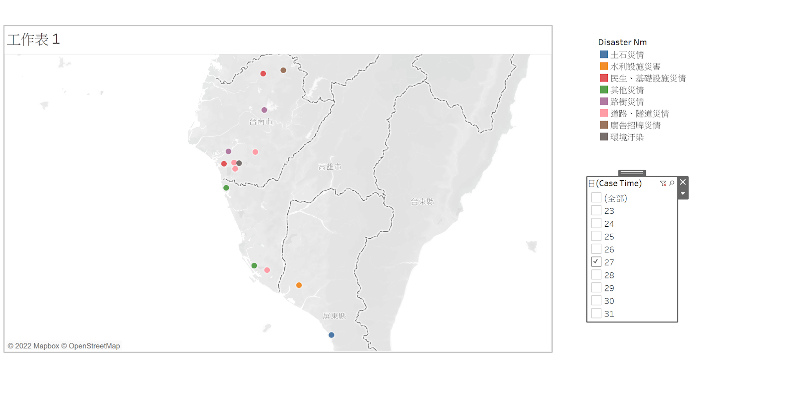

若我們想要將日期的選擇方式，也可以點選選擇欄位右上方的往下鍵號，便可以改變選擇欄位的樣式。

例如我們可以將選擇的方式，由原先的清單方式改成滑桿方式如下。

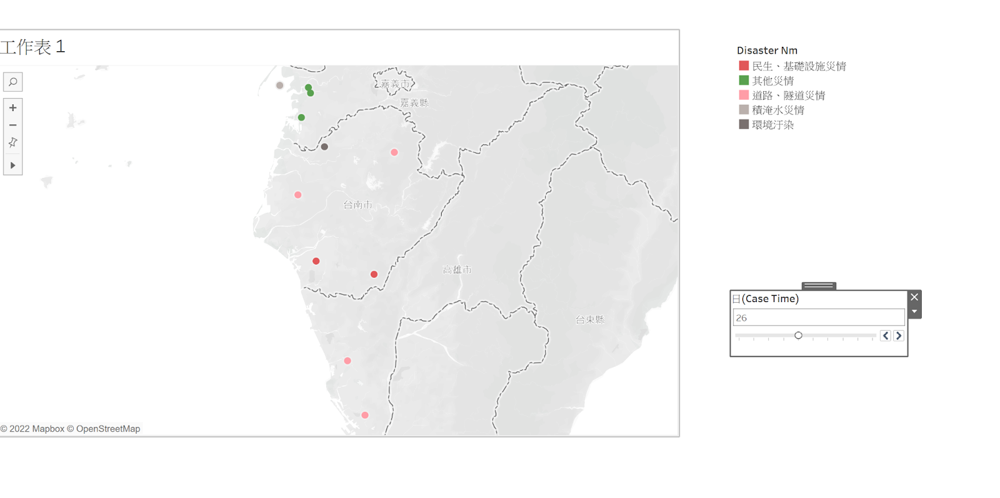

### 讓同一個互動按鈕作用於多個工作表

上述的互動按鈕只能用於一個工作表，若想讓儀錶板上的多個工作表同時共用同一個互動按鈕，可參考下列作法：

1. 照上面的方法先建立一個互動按鈕欄位；
2. 點選互動按鈕欄位右上方的往下鍵號，選擇套用於工作表並點擊選取的工作表；
    
   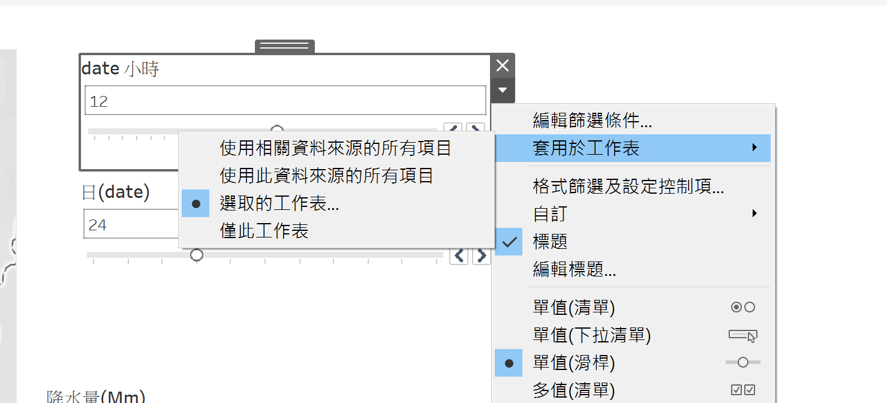
 
3. 選擇要套用的工作表，即可完成設定。
    
   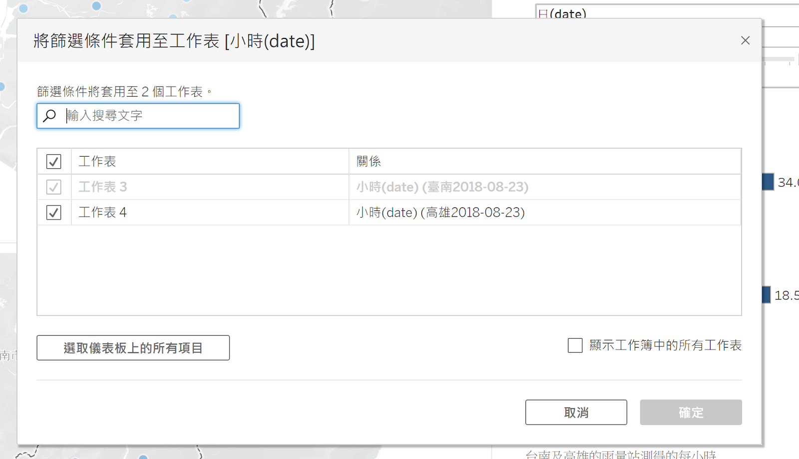
 

### 加入其他資訊

在儀表板上若需要加入其他的資訊，可以在工具列的左下方找到一個物件欄位，裡面有加入文字、圖片等物件，只要將所需的物件拖拉到儀錶板上方即可在儀表板中加入文字、圖片等物件。

## 文本 (Story)

文本是可以將多個儀表板或工作表組合，以此來做成類似投影片的顯示效果。將文本加入儀表板或工作表的方法，跟從儀錶板中加入工作表一樣，將右方已創建的工作表或儀表板拖入文本的空白處即可完成。

若有新增文本頁面的需求，可以點選上方的新增文本點，即可新增新的空白頁面，或是複製現有頁面成為新的頁面。

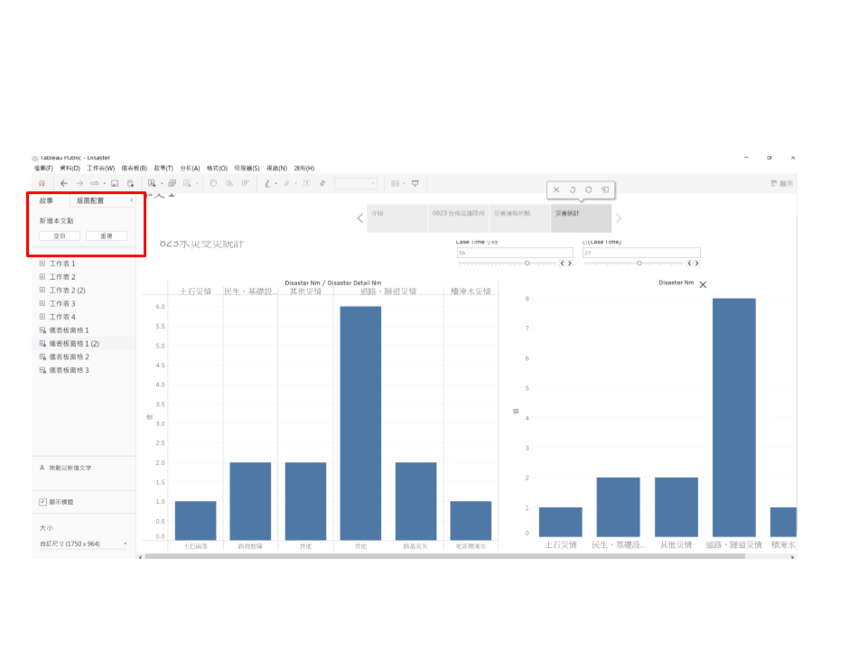

最後，為了讓文本資訊更貼切其表達的內容，我們點擊文本頁面上方的方框兩次，即可修改頁面的標題。

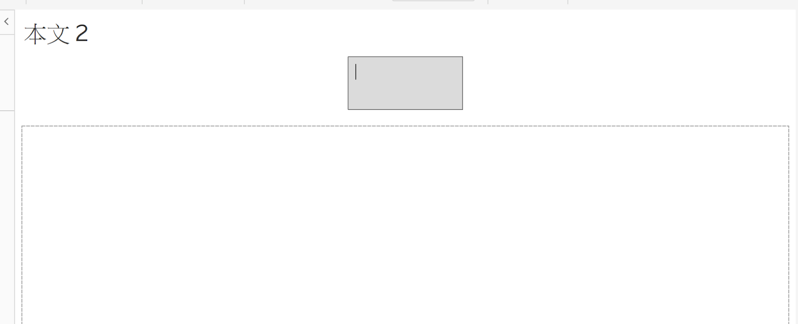

## 總結

在本章節簡單的介紹了 Tableau 的一些操作方法，以及如何利用 Tableau 來設計出與讀者互動的簡報/圖表，然而 Tableau 的功能遠遠不止這些，而網路上也有許多利用 Tableau 所創作出來的互動式簡報範例，因此鼓勵大家多多去其他網站上學習。

## 參考資料

- Tableau Public (https://public.tableau.com/)
- 使用 Tableau 設計自選式視覺化圖表—初階講義 ([https://www.beclass.com/share/202007/7145995555358rap_2.pdf](https://www.beclass.com/share/202007/7145995555358rap_2.pdf))
- 維度和度量（藍色和綠色）([https://help.tableau.com/current/pro/desktop/zh-tw/datafields_typesandroles.htm](https://help.tableau.com/current/pro/desktop/zh-tw/datafields_typesandroles.htm))
- VISUALIZING HEALTH DATA 看見健康數據 ([https://visualizinghealthdata.idv.tw/?route=article/faq&faq_id=138](https://visualizinghealthdata.idv.tw/?route=article/faq&faq_id=138))
- Get Started with Tableau ([https://help.tableau.com/current/guides/get-started-tutorial/en-us/get-started-tutorial-home.htm](https://help.tableau.com/current/guides/get-started-tutorial/en-us/get-started-tutorial-home.htm))
- Tableau Tutorial — Learn Data Visualization Using Tableau ([https://medium.com/edureka/tableau-tutorial-71ef4c122e55](https://medium.com/edureka/tableau-tutorial-71ef4c122e55))
- YouTube: Tableau教程 ([https://www.youtube.com/watch?v=1q8rlXS4gEc&list=PLAKvINjDAWNImaqKWJIErQtaNi19q84yF](https://www.youtube.com/watch?v=1q8rlXS4gEc&list=PLAKvINjDAWNImaqKWJIErQtaNi19q84yF&index=1))
- YouTube: 用 Tableau 10.3 做大數據分析初階 ([https://www.youtube.com/watch?v=oS5cM3v9ILc](https://www.youtube.com/watch?v=oS5cM3v9ILc))
- YouTube: 用Tableau 做大數據分析進階 ([https://www.youtube.com/watch?v=HuBQ-4khWm8](https://www.youtube.com/watch?v=HuBQ-4khWm8))
- YouTube: Tableau For Data Science 2022 ([https://www.youtube.com/watch?v=Wh4sCCZjOwo](https://www.youtube.com/watch?v=Wh4sCCZjOwo))
- YouTube: Tableau Online Training ([https://www.youtube.com/watch?v=ttCDqyfrcEc](https://www.youtube.com/watch?v=ttCDqyfrcEc))
