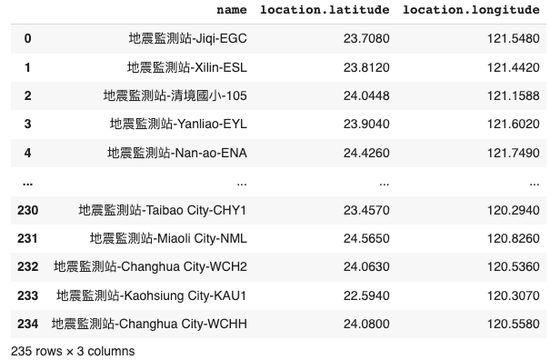
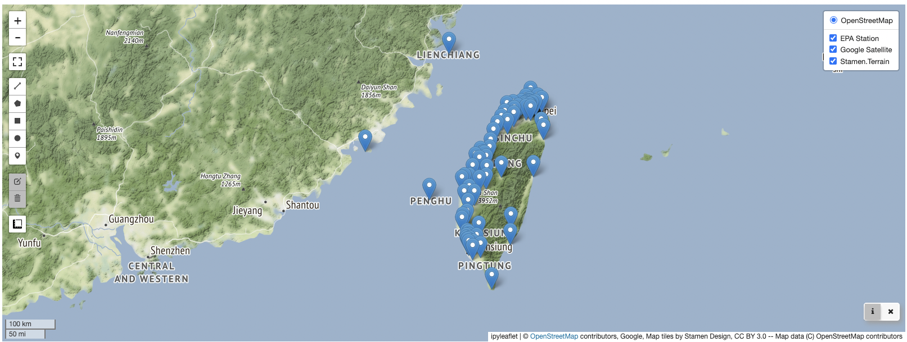
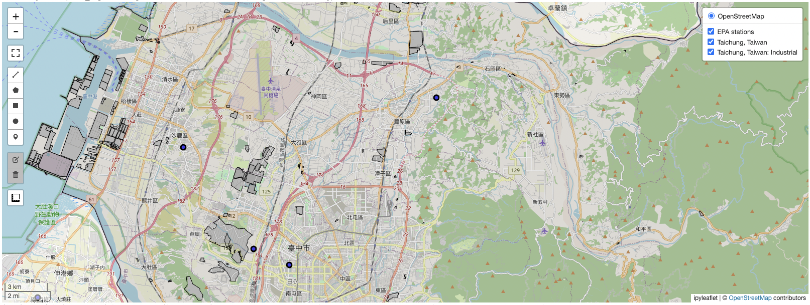
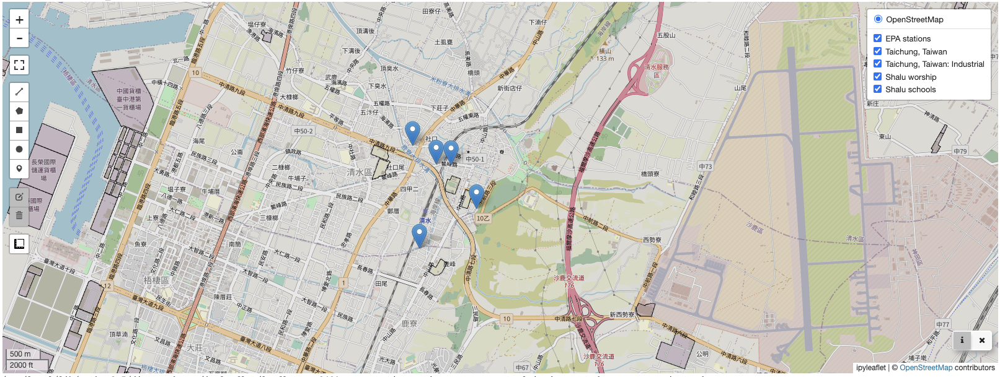
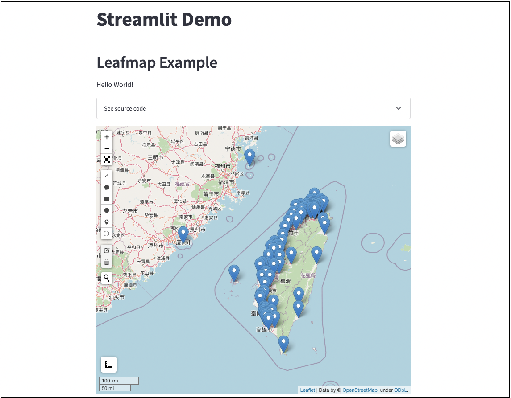

[](https://colab.research.google.com/drive/1Ra0184leoQ7nQGqCY-utlEd2a_wonZEz?usp=sharing)



In the previous chapters, we have demonstrated how to use programming languages to analyze data on geographic attributes, and we have also demonstrated how to use GIS software for simple geographic data analysis and presentation. Next, we will introduce how to use the Leafmap suite in Python language for GIS applications, and the Streamlit suite for website development. Finally, we will combine Leafmap and Streamlit to make a simple web GIS system by ourselves, and present the results of data processing and analysis through web pages.

## Package Installation and Importing

In this chapter, we will use packages such as pandas, geopandas, leafmap, ipyleaflet, osmnx, streamlit, geocoder, and pyCIOT. Apart from pandas, our development platform Google Colab does not provide these packages, so we need to install them ourselves first. Since there are many packages installed this time, in order to avoid a large amount of information output after the command is executed, we have added the '-q' parameter to each installation command, which can make the output of the screen more concise.

```python
!pip install -q geopandas
!pip install -q leafmap
!pip install -q ipyleaflet
!pip install -q osmnx
!pip install -q streamlit
!pip install -q geocoder
!pip install -q pyCIOT
```

After the installation is complete, we can use the following syntax to import the relevant packages to complete the preparations in this article.

```python
import pandas as pd
import geopandas as gpd
import leafmap
import ipyleaflet
import osmnx
import geocoder
import streamlit
from pyCIOT.data import *
```

## Data Access

In the examples in this article, we use several datasets on the Civil IoT Taiwan Data Service Platform, including air quality data from the EPA, and seismic monitoring station measurements from the National Earthquake Engineering Research Center and the Central Weather Bureau.

For the EPA air quality data, we use the pyCIOT package to obtain the latest measurement results of all EPA air quality stations, and convert the resulting JSON format data into a DataFrame through the `json_normalize()` method in the pandas package format. We only keep the station name, latitude, longitude and ozone (O3) concentration information for future use. The code for this part of data collection and processing is as follows:

```python
epa_station = Air().get_data(src="OBS:EPA")
df_air = pd.json_normalize(epa_station) 
df_air['O3'] = 0
for index, row in df_air.iterrows():
  sensors = row['data']
  for sensor in sensors:
    if sensor['name'] == 'O3':
      df_air.at[index, 'O3'] =  sensor['values'][0]['value']
df_air = df_air[['name','location.latitude','location.longitude','O3']]
df_air
```


Then we extract the seismic monitoring station data from the National Earthquake Engineering Research Center and the Central Weather Bureau in a similar way, leaving only the station name, longitude and latitude information for subsequent operations. The code for this part of data collection and processing is as follows:

```python
quake_station = Quake().get_station(src="EARTHQUAKE:CWB+NCREE")
df_quake = pd.json_normalize(quake_station) 
df_quake = df_quake[['name','location.latitude','location.longitude']]
df_quake
```



We have successfully demonstrated the reading examples of air quality data (air) and seismic data (quake). In the following discussion, we will use these data for the operation and application using the leafmap suite. The same methods can also be easily applied to other datasets on the Civil IoT Taiwan Data Service Platform. You are encouraged to try it yourself.

## Leafmap Basics

### Basic Data Presentation

Using the data `df_air` and seismic data `df_quake` that we are currently processing, we first convert the format of these two data from the DataFrame format provided by the pandas package to the GeoDataFrame format provided by the geopandas package which supports geographic information attributes. We then use Leafmap's`add_gdf()` method to create a presentation layer for each dataset and add them to the map in one go.

```python
gdf_air = gpd.GeoDataFrame(df_air, geometry=gpd.points_from_xy(df_air['location.longitude'], df_air['location.latitude']), crs='epsg:4326')
gdf_quake = gpd.GeoDataFrame(df_quake, geometry=gpd.points_from_xy(df_quake['location.longitude'], df_quake['location.latitude']), crs='epsg:4326')

m1 = leafmap.Map(center=(23.8, 121), toolbar_control=False, layers_control=True)
m1.add_gdf(gdf_air, layer_name="EPA Station")
m1.add_gdf(gdf_quake, layer_name="Quake Station")
m1
```


From the map output by the program, we can see the names of the two data in the upper right corner of the map, which have been added to the map in the form of two layers. Users can click the layer to be queried to browse according to their own needs. However, when we want to browse the data of two layers at the same time, we will find that both layers are rendering the same icon, so there will be confusion on the map.

To solve this problem, we introduce another way of data presentation. We use the GeoData layer data format provided by the ipyleaflet suite and add the GeoData layer to the map using leafmap's `add_layer()` method. For easy identification, we use the small blue circle icon to represent the data of the empty station, and the small red circle icon to represent the data of the seismic station.

```python
geo_data_air = ipyleaflet.GeoData(
    geo_dataframe=gdf_air,
    point_style={'radius': 5, 'color': 'black', 'fillOpacity': 0.8, 'fillColor': 'blue', 'weight': 3},
    name="EPA stations",
)
geo_data_quake = ipyleaflet.GeoData(
    geo_dataframe=gdf_quake,
    point_style={'radius': 5, 'color': 'black', 'fillOpacity': 0.8, 'fillColor': 'red', 'weight': 3},
    name="Quake stations",
)

m2 = leafmap.Map(center=(23.8, 121), toolbar_control=False, layers_control=True)
m2.add_layer(geo_data_air)
m2.add_layer(geo_data_quake)
m2
```


### Cluster Data Presentation

In some data applications, when there are too many data points on the map, it is not easy to observe. If this is the case, we can use clustering to present the data. i.e. when there are too many data points for a small area, we cluster the points together to show the number of points. When the user zooms in on the map, these originally clustered points are slowly pulled apart. When there is only one point left in a small area, the information of that point can be directly seen.

Let's take data from seismic stations as an example. Using leafmap's `add_points_from_xy()` method, the data of df2 can be placed on the map in a clustered manner.

```python
m3 = leafmap.Map(center=(23.8, 121), toolbar_control=False, layers_control=True)
m3.add_points_from_xy(data=df_quake, x = 'location.longitude', y = 'location.latitude', layer_name="Quake Station")
m3
```


### Change Leafmap Basemap

Leafmap uses OpenStreetMap as the default basemap and provides over 100 other basemap options. Users can change the basemap according to their own preferences and needs. You can use the following syntax to learn which basemaps currently supported by leafmap:

```python
layers = list(leafmap.basemaps.keys())
layers
```

We select SATELLITE and Stamen.Terrain from these basemaps as demonstrations, and use the `add_basemap()` method of the leafmap package to add the basemap as a new layer. After adding, the leafmap preset will open all layers and stack them in the order of addition. You can select the layer you want to use through the layer menu in the upper right corner.

```python
m4 = leafmap.Map(center=(23.8, 121), toolbar_control=False, layers_control=True)
m4.add_gdf(gdf_air, layer_name="EPA Station")

m4.add_basemap("SATELLITE")
m4.add_basemap("Stamen.Terrain")
m4
```



In addition to using the basemap provided by leafmap, you can also use Google Map's XYZ Tiles service to add layers of Google satellite imagery. The methods are as follows:

```python
m4.add_tile_layer(
    url="https://mt1.google.com/vt/lyrs=y&x={x}&y={y}&z={z}",
    name="Google Satellite",
    attribution="Google",
)
m4
```


### Integrate OSM Resources

In addition to some built-in resources, Leafmap also integrates many external geographic information resources. Among them, OSM (OpenStreetMap) is a well-known and rich open source geographic information resource. Various resources provided by OSM can be found on the OSM website, with [a complete list of properties](https://wiki.openstreetmap.org/wiki/Map_features).

In the following example, we use the `add_osm_from_geocode()` method provided by the leafmap package to demonstrate how to get the outline of a city and render it on the map. Taking Taichung City as an example, combined with the location information in the EPA air quality monitoring station data, we can clearly see which stations are in Taichung City.

```python
city_name = "Taichung, Taiwan"

m5 = leafmap.Map(center=(23.8, 121), toolbar_control=False, layers_control=True)
m5.add_layer(geo_data_air)
m5.add_osm_from_geocode(city_name, layer_name=city_name)
m5
```


Then we continue to use the `add_osm_from_place()` method provided by the leafmap package to further search for specific facilities in Taichung City and add them to the map layer. The following procedure takes factory facilities as an example and uses the land use data of OSM to find out the relevant factory locations and areas in Taichung City, which can be analyzed and explained in combination with the locations of EPA air quality monitoring stations. For more types of OSM facilities, you can refer to [the complete properties list](https://wiki.openstreetmap.org/wiki/Map_features).

```python
m5.add_osm_from_place(city_name, tags={"landuse": "industrial"}, layer_name=city_name+": Industrial")
m5
```



In addition, the leafmap package also provides a method for searching for OSM nearby facilities centered on a specific location, providing a very convenient function for analyzing and interpreting data. For example, in the following example, we use the `add_osm_from_address()` method to search for related religious facilities (attribute "amenity": "place_of_worship") within a 1,000-meter radius of Qingshui Station, Taichung; at the same time, we use the `add_osm_from_point()` method to search for relevant school facilities (attributes "amenity": "school") within 1,000 meters of the GPS coordinates (24.26365, 120.56917) of Taichung Qingshui Station. Finally, we overlay the results of these two queries on the existing map with different layers.

```python
m5.add_osm_from_address(
    address="Qingshui Station, Taichung", tags={"amenity": "place_of_worship"}, dist=1000, layer_name="Shalu worship"
)
m5.add_osm_from_point(
    center_point=(24.26365, 120.56917), tags={"amenity": "school"}, dist=1000, layer_name="Shalu schools"
)
m5
```




### Heatmap Presentation

A [heatmap](https://en.wikipedia.org/wiki/Heat_map) is a two-dimensional representation of event intensity through color changes. When matching a heatmap to a map, the state of event intensity can be expressed at different scales depending on the scale of the map used. It is a very common and powerful data representation tool. However, when drawing a heatmap, the user must confirm that the characteristics of the data are suitable for presentation by a heatmap, otherwise it is easy to be confused with the graphical data interpolation representations such as IDW and Kriging that we introduced in Chap 5. For example, we take the O3 concentration data of the EPA air quality data as an example, and draw the corresponding heat map as follows:


```python
m6 = leafmap.Map(center=(23.8, 121), toolbar_control=False, layers_control=True)
m6.add_layer(geo_data_air)
m6.add_heatmap(
    df_air,
    latitude='location.latitude',
    longitude='location.longitude',
    value="O3",
    name="O3 Heat map",
    radius=100,
)
m6
```


There is nothing obvious about this image at first glance, but if we zoom in on the Taichung city area, we can see that the appearance of the heatmap has changed a lot, showing completely different results at different scales.


The above example is actually an example of misuse of the heatmap, because the O3 concentration data reflects the local O3 concentration. Due to the change of the map scale, its values cannot be directly accumulated or distributed to adjacent areas. Therefore, the O3 concentration data used in the example is not suitable for heatmap representation and should be plotted using the geographic interpolation method described in Chapter 5.

To show the real effect of the heatmap, we use the location data of the seismic stations instead and add a field num with a default value of 10. Then we use the code below to generate a heatmap of the status of Taiwan Seismic Monitoring Stations.

```python
df_quake['num'] = 10
m7 = leafmap.Map(center=(23.8, 121), toolbar_control=False, layers_control=True)
m7.add_layer(geo_data_quake)
m7.add_heatmap(
    df_quake,
    latitude='location.latitude',
    longitude='location.longitude',
    value="num",
    name="Number of Quake stations",
    radius=200,
)
m7
```


### Split Window Presentation

In the process of data analysis and interpretation, it is often necessary to switch between different basemaps to obtain different geographic information. Therefore, the leafmap package provides the `split_map()` method, which can split the original map output into two submaps, each applying a different basemap. Its sample code is as follows:

```python
m8 = leafmap.Map(center=(23.8, 121), toolbar_control=False, layers_control=True)
m8.add_gdf(gdf_air, layer_name="EPA Station")
m8.split_map(
    left_layer="SATELLITE",
    right_layer="Stamen.Terrain"
)
m8
```


## Leafmap for Web Applications

In order to quickly share the processed map information, Leafmap suite also provides an integrated way of Streamlit suite, combining Leafmap's GIS technical expertise with Streamlit's web technical expertise to quickly build a Web GIS system. Below we demonstrate how it works through a simple example, you can extend and build your own Web GIS service according to this principle.

In the use of the Streamlit package, there are two steps to build a web system:

1. Package the Python program to be executed into a Streamlit object, and write the packaging process into the app.py file; and
2. Execute app.py on the system.

Since our operation process all use the Google Colab platform, in this platform we can directly write app.py into the temporary storage area with the special syntax `%%writefile`, and then Colab directly reads and runs the codes from the temporary storage area. Therefore, for the file writing part of step 1, we can proceed as follows:

```python
%%writefile app.py
import streamlit as st
import leafmap.foliumap as leafmap
import json
import pandas as pd
import geopandas as gpd
from pyCIOT.data import *

contnet = """
Hello World!
"""
st.title('Streamlit Demo')
st.write("## Leafmap Example")
st.markdown(contnet)

epa_station = Air().get_data(src="OBS:EPA")
from pandas import json_normalize
df_air = json_normalize(epa_station) 
geodata_air = gpd.GeoDataFrame(df_air, geometry=gpd.points_from_xy(df_air['location.longitude'], df_air['location.latitude']), crs='epsg:4326')

with st.expander("See source code"):
  with st.echo():
    m = leafmap.Map(center=(23.8, 121), toolbar_control=False, layers_control=True)
    m.add_gdf(geodata_air, layer_name="EPA Station")  
        
m.to_streamlit()
```

For the second part, we use the following instructions:

```python
!streamlit run app.py & npx localtunnel --port 8501
```

After execution, an execution result similar to the following will appear:


Then you can click on the URL after the string "your url is:", and something similar to the following will appear in the browser


Finally, we click "Click to Continue" to execute the Python code packaged in app.py. In this example, we can see the distribution map of EPA's air quality monitoring stations presented by the leafmap package.



## Conclusion

In this article, we introduced the Leafmap package to render geographic data and integrate external resources, and demonstrated the combination of the Leagmap and Streamlit packages to build a simple web-based GIS service on the Google Colab platform. It should be noted that Leafmap also has many more advanced functions, which are not introduced in this article. You can refer to the following references for more in-depth and extensive learning.

## References

- Leafmap Tutorial ([https://www.youtube.com/watch?v=-UPt7x3Gn60&list=PLAxJ4-o7ZoPeMITwB8eyynOG0-CY3CMdw](https://www.youtube.com/watch?v=-UPt7x3Gn60&list=PLAxJ4-o7ZoPeMITwB8eyynOG0-CY3CMdw))
- leafmap: A Python package for geospatial analysis and interactive mapping in a Jupyter environment ([https://leafmap.org/](https://leafmap.org/))
- Streamlit Tutorial ([https://www.youtube.com/watch?v=fTzlyayFXBM](https://www.youtube.com/watch?v=fTzlyayFXBM))
- Map features - OpenStreetMap Wiki ([https://wiki.openstreetmap.org/wiki/Map_features](https://wiki.openstreetmap.org/wiki/Map_features))
- Heat map - Wikipedia ([https://en.wikipedia.org/wiki/Heat_map](https://en.wikipedia.org/wiki/Heat_map))

